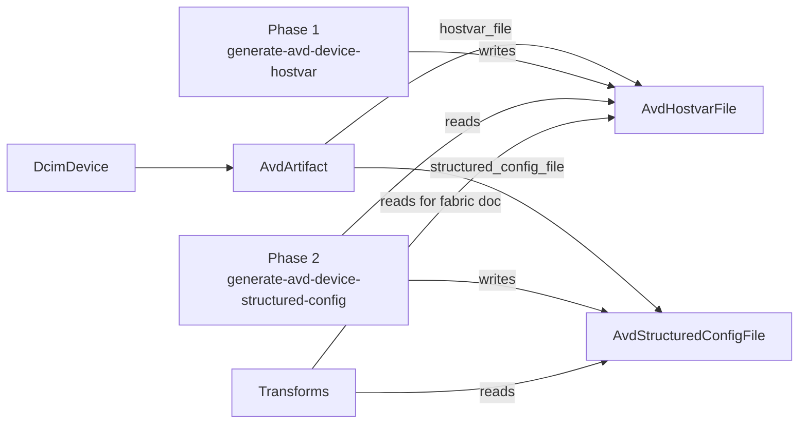

# AvdArtifact & file storage

:::info Developer Guide
Documents the graph schema that links the two pipeline phases.
:::

The AVD pipeline stores its intermediate data — hostvars and structured configs — in Infrahub as **graph nodes**, not in an external object store. Three schema kinds are involved, all defined in [`schemas/objects/objects.yml`](https://github.com/opsmill/infrahub-arista-avd/blob/main/schemas/objects/objects.yml).

## Schema: `AvdArtifact`

Per-device container that links the device to its hostvars and structured config files.

```yaml
- name: Artifact
  namespace: Avd
  human_friendly_id:
    - name__value
  uniqueness_constraints:
    - [device, name__value]
  attributes:
    - name: name
      kind: Text
      unique: true
  relationships:
    - name: device
      peer: DcimDevice
      kind: Attribute
      cardinality: one
      optional: false
    - name: hostvar_file
      peer: AvdHostvarFile
      kind: Component
      cardinality: one
      optional: true
      identifier: "avdartifact__hostvar_file"
    - name: structured_config_file
      peer: AvdStructuredConfigFile
      kind: Component
      cardinality: one
      optional: true
      identifier: "avdartifact__structured_config_file"
```

Key points:

- **One artifact per device** — the `(device, name)` uniqueness constraint enforces this.
- **Component relationships** to the two file nodes — the file nodes are owned by the artifact and deleted when it is.
- Both file relationships are **optional** — an artifact with a hostvar file but no structured config is a valid state (it means Phase 1 has run but Phase 2 hasn't, yet).

## Schema: `AvdHostvarFile`

Stores the per-device PyAVD hostvars as a JSON file. Inherits from `CoreFileObject`.

```yaml
- name: HostvarFile
  namespace: Avd
  inherit_from:
    - CoreFileObject
  human_friendly_id:
    - "artifact__name__value"
  uniqueness_constraints:
    - ["artifact"]
  relationships:
    - name: artifact
      peer: AvdArtifact
      kind: Parent
      cardinality: one
      optional: false
      identifier: "avdartifact__hostvar_file"
```

`CoreFileObject` provides:

- `content` — the raw file bytes.
- `content_type` — MIME type (typically `application/json` for hostvars).
- `checksum` — content hash (managed by Infrahub).
- `file_name` — display name.

The `Parent` kind on the `artifact` relationship ties this node's lifecycle to the artifact — the file is removed when the parent artifact is deleted.

## Schema: `AvdStructuredConfigFile`

Same shape as `AvdHostvarFile`, for the structured-config JSON:

```yaml
- name: StructuredConfigFile
  namespace: Avd
  inherit_from:
    - CoreFileObject
  human_friendly_id:
    - "artifact__name__value"
  uniqueness_constraints:
    - ["artifact"]
  relationships:
    - name: artifact
      peer: AvdArtifact
      kind: Parent
      cardinality: one
      optional: false
      identifier: "avdartifact__structured_config_file"
```

## How the two phases share data



Phase 1 is the sole writer of `hostvar_file`; Phase 2 reads hostvars and is the sole writer of `structured_config_file`; transforms are read-only consumers.

## Change detection via checksums

Generators avoid re-writing unchanged files by comparing SHA256 checksums:

1. Serialise the new content to JSON.
2. Compute SHA256.
3. Fetch the existing file node's `checksum` attribute (from `CoreFileObject`).
4. If the checksums match, skip the write.
5. If they differ, replace the file.

The checksum is computed **in-memory per run** — it is not a custom attribute on `AvdArtifact`. This keeps the schema minimal and lets Infrahub handle file-level checksumming via `CoreFileObject`.

## Artifact definitions

Four artifact definitions (in [`.infrahub.yml`](https://github.com/opsmill/infrahub-arista-avd/blob/main/.infrahub.yml)) turn the stored data into user-visible artifacts:

| Artifact | Target group | Transform | Content type |
|----------|-------------|-----------|--------------|
| `avd_eos_configuration` | `avd_devices` | `avd_eos_config` | `text/plain` |
| `avd_device_documentation` | `avd_devices` | `avd_device_doc` | `text/markdown` |
| `avd_fabric_documentation` | `fabrics` | `avd_fabric_doc` | `text/markdown` |
| `avd_anta_catalog` | `avd_devices` | `avd_anta_catalog` | `application/yaml` |

```yaml
artifact_definitions:
  - name: avd_eos_configuration
    targets: avd_devices
    transformation: avd_eos_config
  - name: avd_fabric_documentation
    targets: fabrics
    transformation: avd_fabric_doc
  - name: avd_device_documentation
    targets: avd_devices
    transformation: avd_device_doc
  - name: avd_anta_catalog
    targets: avd_devices
    transformation: avd_anta_catalog
```

The repository defines two further artifacts from the same data that are not part of the AVD
pipeline: `cabling_plan` and `containerlab_topology`, both fabric-scoped. See
[Transforms](../transforms.md).

When an operator opens one of these artifacts in the UI, Infrahub runs the transform against the target node, which fetches the relevant files from the `AvdArtifact` tree.

## Target groups

- `avd_devices` — all `DcimDevice` nodes that should participate in AVD. Populated by upstream generators (for example, `generate-rack` adds newly created leaves to the group).
- `fabrics` — all `NetworkFabric` nodes.

Group membership is set by the generators at creation time; there is no separate "add to group" step in the AVD pipeline itself.
