This tutorial walks you through Infrahub's security management capabilities. You'll explore how security policies are modeled as structured data, how they relate to firewalls, and how Infrahub transforms security policy objects into vendor-specific firewall configurations.

By the end of this tutorial, you'll understand how to manage firewall policies using Infrahub's security schema and generate deployment-ready configurations.

## What you'll accomplish

In this tutorial, you will:

1. Explore the security management schema structure
2. Review the corp-firewall device and its security policy
3. Understand how security objects relate to each other
4. Generate firewall configuration from security policy data
5. Modify security rules and regenerate configurations

## Prerequisites

Before starting this tutorial, ensure you have:

- Completed the [installation guide](./install.mdx) and have Infrahub running
- Loaded the bootstrap data and security data (`uv run invoke bootstrap`)
- Access to the Infrahub web interface at `http://localhost:8000`

:::info
The security data is loaded as part of the bootstrap process. If you haven't loaded it yet, run `uv run infrahubctl object load objects/security/` followed by `uv run python scripts/populate_security_relationships.py` to populate the many-to-many relationships.
:::

## Understanding the demo security schema

The demo security management schema in this repository provides an example data model for firewall policies, zones, services, and applications. The schema is organized into several categories of security objects that work together to define complete security policies.

:::info
As Infrahub provides the user a flexible schema, this specific security schema implementation serves as an example of what is possible, not a finished solution. The value of Infrahub is the ability to create a specific schema to the needs of your organization.
:::

### Security schema architecture

```mermaid
graph TB
    subgraph "Address Objects"
        IP[SecurityIPAddress]
        Prefix[SecurityPrefix]
        IPRange[SecurityIPRange]
        FQDN[SecurityFQDN]
        AddressGroup[SecurityAddressGroup]

        AddressGroup -.->|contains| IP
        AddressGroup -.->|contains| Prefix
        AddressGroup -.->|contains| IPRange
        AddressGroup -.->|contains| FQDN
    end

    subgraph "Service Objects"
        Service[SecurityService]
        ServiceRange[SecurityServiceRange]
        ServiceGroup[SecurityServiceGroup]

        ServiceGroup -.->|contains| Service
        ServiceGroup -.->|contains| ServiceRange
    end

    subgraph "Application Objects"
        Application[SecurityApplication]
        URLCategory[SecurityURLCategory]
    end

    subgraph "Policy Objects"
        Zone[SecurityZone]
        Policy[SecurityPolicy]
        PolicyRule[SecurityPolicyRule]
        Profile[SecurityProfile]
        Schedule[SecuritySchedule]
        Firewall[SecurityFirewall]

        Policy -->|contains| PolicyRule
        Policy -->|applied to| Firewall
        PolicyRule -->|source zone| Zone
        PolicyRule -->|destination zone| Zone
        PolicyRule -->|source addresses| AddressGroup
        PolicyRule -->|destination addresses| AddressGroup
        PolicyRule -->|services| ServiceGroup
        PolicyRule -->|applications| Application
        PolicyRule -->|URL categories| URLCategory
        PolicyRule -->|security profile| Profile
        PolicyRule -->|schedule| Schedule
    end

    style Policy fill:#e74c3c,stroke:#c0392b,stroke-width:3px,color:#fff
    style PolicyRule fill:#e67e22,stroke:#d35400,stroke-width:2px,color:#fff
    style Firewall fill:#3498db,stroke:#2980b9,stroke-width:3px,color:#fff
    style AddressGroup fill:#2ecc71,stroke:#27ae60,stroke-width:2px,color:#fff
    style ServiceGroup fill:#9b59b6,stroke:#8e44ad,stroke-width:2px,color:#fff
```



**Key relationships:**

- **SecurityPolicy** contains multiple **SecurityPolicyRule** objects
- **SecurityPolicyRule** references zones, address groups, service groups, applications, and profiles
- **SecurityPolicy** is applied to one or more **SecurityFirewall** devices
- **SecurityAddressGroup** aggregates IP addresses, prefixes, ranges, and FQDNs
- **SecurityServiceGroup** aggregates services and service ranges

This hierarchical model separates concerns (addresses, services, applications) and allows reuse of security objects across multiple policies and rules.

## Step 1: explore the corp-firewall device

Navigate to the corp-firewall device in the Infrahub web interface:

1. Go to `http://localhost:8000`
2. Navigate to **Device Management → Infrastructure → Firewalls**
3. Click on **corp-firewall**

### Device details

The corp-firewall is a Juniper SRX-1500 firewall with the following configuration:

- **Device type**: SRX-1500
- **Platform**: Juniper JunOS
- **Role**: edge_firewall
- **Location**: PAR-1 (Paris building)
- **Status**: active

### Interfaces

The firewall has several interfaces defined:

- **fxp0** - Management interface
- **ge-0/0/0** through **ge-0/0/3** - Leaf connection interfaces

These interfaces connect the firewall to the network infrastructure and provide connectivity for security policy enforcement.

## Step 2: explore security management objects

The security policy for corp-firewall is built from objects organized under the **Security Management** menu in the Infrahub UI.

### Navigate security objects

1. In the left sidebar, find **Security Management**
2. Explore the following sections:

#### Security zones

Go to **Security Management → Security Zones**

Security zones represent trust boundaries:

- **untrust** - External/untrusted networks (trust level: 0)
- **trust** - Internal/trusted networks (trust level: 100)
- **dmz** - Demilitarized zone (trust level: 50)

Zones are used in policy rules to define traffic flow direction (for example, from untrust to dmz).

#### Address objects

Go to **Security Management → Address Objects**

You'll find several types of address objects:

- **SecurityIPAddress** - Individual IP addresses (for example, web-server-01: 10.100.1.10)
- **SecurityPrefix** - Network prefixes (for example, internal-network: 10.0.0.0/8)
- **SecurityAddressGroup** - Groups of addresses (for example, web-servers, internet)

Address groups simplify policy management by allowing you to reference multiple addresses with a single object.

#### Service objects

Go to **Security Management → Service Objects**

Service objects define network protocols and ports:

- **SecurityService** - Individual services (for example, https: TCP/443, dns: UDP/53)
- **SecurityServiceGroup** - Groups of services (for example, web-services containing http and https)

Service groups make it straightforward to create rules that allow multiple related services.

#### Applications

Go to **Security Management → Applications**

Application objects enable application-aware security:

- **web-browsing** - HTTP/HTTPS web traffic
- **ssl** - SSL/TLS encrypted traffic
- **dns** - Domain name resolution

Applications can be used in policy rules for more granular control than port-based services.

#### Security policies

Go to **Security Management → Security Policies**

You'll see **corporate-firewall-policy** which contains the rules applied to corp-firewall.

Click on the policy to view its details including:

- **Name**: corporate-firewall-policy
- **Description**: Security policy for corporate edge firewall
- **Firewalls**: corp-firewall (the policy is applied to this device)
- **Rules**: One or more policy rules defining allowed/denied traffic

#### Policy rules

Within the corporate-firewall-policy, you'll find policy rules like **allow-web-traffic**:

- **Index**: 10 (lower numbers are processed first)
- **Action**: permit
- **Source zone**: untrust (internet)
- **Destination zone**: dmz
- **Source addresses**: internet (address group)
- **Destination addresses**: web-servers (address group)
- **Services**: web-services (service group containing http/https)
- **Applications**: web-browsing
- **Log**: true (log matching traffic)

This rule allows internet users to access web servers in the DMZ using HTTP/HTTPS protocols.

## Step 3: understand the policy structure

The security policy demonstrates Infrahub's composable approach to policy management:

```text
SecurityPolicy (corporate-firewall-policy)
    │
    ├─ Applied to: corp-firewall
    │
    └─ Contains Rules:
        │
        └─ PolicyRule (allow-web-traffic)
            ├─ Source Zone: untrust
            ├─ Destination Zone: dmz
            ├─ Source Addresses: internet (AddressGroup)
            │   └─ Contains: 0.0.0.0/0 (SecurityPrefix)
            ├─ Destination Addresses: web-servers (AddressGroup)
            │   ├─ web-server-01 (SecurityIPAddress: 10.100.1.10)
            │   └─ web-server-02 (SecurityIPAddress: 10.100.1.20)
            ├─ Services: web-services (ServiceGroup)
            │   ├─ http (SecurityService: TCP/80)
            │   └─ https (SecurityService: TCP/443)
            ├─ Applications: web-browsing
            ├─ Action: permit
            └─ Log: true
```

**Key benefits of this structure:**

- **Reusability** - Address groups, service groups, and applications can be reused across multiple rules
- **Maintainability** - Update an address group once, and all rules using it automatically reflect the change
- **Clarity** - Named objects make policies more readable than raw IP addresses and port numbers
- **Validation** - Infrahub validates relationships ensuring policies reference valid objects

## Step 4: view the generated firewall configuration

Infrahub transforms the security policy data into vendor-specific firewall configurations using templates and transforms.

### Access the firewall configuration artifact

1. While viewing **corp-firewall**, look for the **Artifacts** section or tab
2. You should see an artifact named **edge** or **firewall-configuration**
3. Click on the artifact to view the generated Juniper JunOS configuration

### Configuration sections

The generated configuration includes several sections:

**Security zones:**

```text
security {
    zones {
        security-zone untrust {
            interfaces {
                ge-0/0/0.0;
            }
        }
        security-zone dmz {
            interfaces {
                ge-0/0/1.0;
            }
        }
        security-zone trust {
            interfaces {
                ge-0/0/2.0;
            }
        }
    }
}
```

**Address book entries:**

```text
security {
    address-book {
        global {
            address web-server-01 10.100.1.10/32;
            address web-server-02 10.100.1.20/32;
            address-set web-servers {
                address web-server-01;
                address web-server-02;
            }
        }
    }
}
```

**Security policies:**

```text
security {
    policies {
        from-zone untrust to-zone dmz {
            policy allow-web-traffic {
                match {
                    source-address internet;
                    destination-address web-servers;
                    application [ junos-http junos-https ];
                }
                then {
                    permit;
                    log {
                        session-init;
                        session-close;
                    }
                }
            }
        }
    }
}
```

The configuration is generated from the structured security policy data using Jinja2 templates that understand Juniper JunOS syntax.

## Step 5: modify a security policy

Let's modify the security policy to add a new rule.

### Create a new policy rule

1. Navigate to **Security Management → Security Policy Rules**
2. Click **Add Security Policy Rule**
3. Fill in the form:
   - **Index**: 20 (processed after rule 10)
   - **Name**: allow-dns
   - **Policy**: corporate-firewall-policy
   - **Source Zone**: untrust
   - **Destination Zone**: dmz
   - **Source Addresses**: internet
   - **Destination Addresses**: web-servers
   - **Services**: (create or select a DNS service group)
   - **Action**: permit
   - **Log**: true
4. Click **Save**

### Regenerate the configuration

After creating the rule:

1. Create a proposed change to review the impact
2. Navigate to **Proposed Changes**
3. Create a new proposed change comparing your branch to main
4. View the **Artifacts** tab to see the updated firewall configuration
5. The configuration should now include the new DNS rule

:::tip
Always use proposed changes when modifying security policies. This allows you to review the generated configuration changes before deploying to production firewalls.
:::

## Step 6: understand the transformation process

The transformation from security policy objects to firewall configuration follows this flow:

```text
Security Policy Data (Infrahub)
    ↓
GraphQL Query (fetch policy, rules, zones, addresses, services)
    ↓
Python Transform (transforms/edge.py)
    ↓
Jinja2 Template (templates/edge.j2)
    ↓
Juniper JunOS Configuration (artifact)
```

### The transform

The transform (`transforms/edge.py`) queries Infrahub for:

- Device details
- Security zones
- Address objects and groups
- Service objects and groups
- Policy rules
- Applications

It then processes this data into a structure suitable for template rendering.

### The template

The template (`templates/edge.j2`) contains Juniper JunOS-specific syntax and logic:

- Iterates over zones to create zone configurations
- Builds address books from address groups
- Generates policy rules from SecurityPolicyRule objects
- Maps Infrahub applications to Junos applications (for example, web-browsing → junos-http/junos-https)

**Vendor flexibility:**

The same security policy data could be transformed to different vendors by creating different templates:

- Juniper JunOS (current implementation)
- Cisco ASA
- Palo Alto PAN-OS
- Fortinet FortiGate

This demonstrates Infrahub's vendor-neutral approach - the security policy is defined once and can be rendered for any supported platform.

## What you've learned

Congratulations! You've explored Infrahub's security management capabilities:

- ✅ Understood the security schema architecture
- ✅ Explored security zones, addresses, services, and applications
- ✅ Reviewed the corp-firewall device and its security policy
- ✅ Examined the relationship between policy objects
- ✅ Viewed generated Juniper JunOS firewall configurations
- ✅ Modified security policies and regenerated configurations
- ✅ Understood the transformation process from data to configuration

## Advanced usage

### Creating complex policies

Build more sophisticated security policies by:

- **Combining multiple address groups** in a single rule
- **Using application objects** for layer 7 filtering
- **Adding URL categories** for web filtering
- **Applying security profiles** for IPS/antivirus scanning
- **Creating time-based rules** with schedules

### Multi-firewall deployments

Apply the same security policy to multiple firewalls:

1. Create additional SecurityFirewall objects
2. Associate them with the same SecurityPolicy
3. Generate configurations for each firewall
4. Maintain consistency across your firewall fleet

### Policy validation

Use Infrahub's validation capabilities to ensure:

- No overlapping rules with conflicting actions
- All referenced objects exist (addresses, services, applications)
- Required fields are populated
- Trust levels between zones are logical

### Integration with CI/CD

Automate security policy management:

1. Store security objects in Git repositories
2. Use proposed changes for peer review
3. Run validation checks in CI pipelines
4. Deploy approved configurations automatically

## Troubleshooting

### Security objects not appearing

If you don't see security objects in the UI:

1. Verify security schemas are loaded: `uv run infrahubctl schema load schemas`
2. Load security data: `uv run infrahubctl object load objects/security/`
3. Populate relationships: `uv run python scripts/populate_security_relationships.py`
4. Refresh your browser

### Configuration not generating

If firewall configurations aren't being generated:

1. Check that the SecurityPolicy is associated with the SecurityFirewall
2. Verify the transform and template are registered in `.infrahub.yml`
3. Look for errors in the Infrahub task logs
4. Ensure all referenced objects (zones, addresses, services) exist

### Many-to-many relationships missing

If address groups or service groups appear empty:

1. Run the populate_security_relationships script
2. This script manually creates the many-to-many relationships that can't be loaded via YAML
3. Verify in the UI that groups now show their members

## Next steps

Now that you understand security management in Infrahub, you can:

- **Model your organization's security policies** using the security schema
- **Create vendor-neutral firewall policies** that can be rendered for any platform
- **Implement change management workflows** using branches and proposed changes
- **Integrate with automation tools** to deploy configurations automatically
- **Extend the schema** with custom security objects specific to your needs

For deeper understanding:

- **[Understanding the concepts](./concepts.mdx)** - Learn about schema-driven data modeling
- **[Developer guide](./developer-guide.mdx)** - Understand how transformations and templates work
- **[Infrahub security schema](https://github.com/opsmill/infrahub-bundle-dc/blob/main/schemas/extensions/security/security.yml)** - Review the complete schema definition
