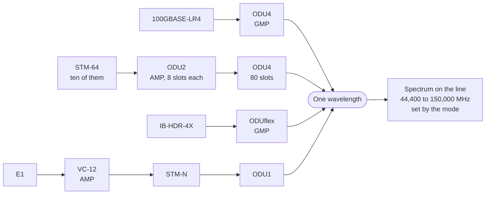

# Client mapping

A customer hands over an Ethernet port, an SDH circuit, a 2 Mbps tributary or an
InfiniBand link out of a supercomputer. None of those travels on a wavelength as
it arrives. Each is wrapped in a digital container first, and containers nest
inside larger containers until one fills a wavelength.

Two kinds cover that. `OtnClientSignal` is what arrives. `OtnContainer` is what
it becomes.

## The client-signal catalog

Eleven signals across five layers, loaded from `objects/04_client_signals.yml`.
The Mapping column names the ITU-T G.709 mapping procedure: **GMP** generic,
**BMP** bit-synchronous, **AMP** asynchronous.

| Signal | Alias | Layer | Bit rate | Renders as | First container | Mapping |
| --- | --- | --- | --- | --- | --- | --- |
| `1000BASE-T` | | Ethernet | 1 250 000 kbps | 1.25 Gbps | `ODU0` | GMP |
| `10GBASE-LR` | | Ethernet | 10 300 000 kbps | 10.3 Gbps | `ODU2e` | BMP |
| `100GBASE-LR4` | | Ethernet | 103 100 000 kbps | 103.1 Gbps | `ODU4` | GMP |
| `400GBASE-FR4` | | Ethernet | 412 500 000 kbps | 412.5 Gbps | `ODUC4` | GMP |
| `STM-16` | OC-48 | SDH | 2 500 000 kbps | 2.5 Gbps | `ODU1` | AMP |
| `STM-64` | OC-192 | SDH | 9 950 000 kbps | 9.95 Gbps | `ODU2` | AMP |
| `STM-256` | OC-768 | SDH | 39 800 000 kbps | 39.8 Gbps | `ODU3` | AMP |
| `E1` | | PDH | 2048 kbps | 2.048 Mbps | `VC-12` | AMP |
| `FC-1200` | | Fibre Channel | 10 500 000 kbps | 10.5 Gbps | `ODU2e` | BMP |
| `IB-EDR-4X` | | InfiniBand | 103 125 000 kbps | 103.125 Gbps | `ODU4` | GMP |
| `IB-HDR-4X` | | InfiniBand | 212 500 000 kbps | 212.5 Gbps | `ODUflex` | GMP |

Three details in that table are load-bearing.

**The rate is stored in kbps.** E1 is 2.048 Mbps. As an integer number of
megabits it rounds to 2, and so does T1 at 1.544 Mbps, which would make the two
signals the model exists to distinguish indistinguishable. Kilobits are the
smallest unit any signal here needs.

**One template renders both ends of the table.** The catalog spans seven orders
of magnitude, from 2048 kbps to 412 500 000. A single divisor makes one end
unreadable: gigabits give E1 as `0.002048 Gbps`, megabits give 400GBASE-FR4 as
`412500.0 Mbps`. So `bit_rate_display` switches at one gigabit:

```jinja
{{ bit_rate_kbps__value / 1000000 }} Gbps{{ bit_rate_kbps__value / 1000 }} Mbps
```

The same catalog therefore reports `2.048 Mbps` for E1 and `103.1 Gbps` for
100GBASE-LR4 without retyping either value.

**`default_container_type` is the first step, not the last.** E1 maps into
`VC-12`, not into `ODU1`. `ODU1` is where the chain ends up, two layers later.
Writing the destination in the "first container" column would skip the SDH
layer entirely and leave `OtnTributaryPort` with nothing to justify it.

## InfiniBand, and why its rates are not round numbers

Two rows in the catalog are InfiniBand: EDR and HDR, both four lanes wide. Their
bit rates are signalling rates rather than the round numbers the products are
sold under.

- EDR is four lanes at 25.78125 Gbps, so 103.125 Gbps.
- HDR is four lanes at 53.125 Gbps, so 212.5 Gbps.

That is the convention the rest of the catalog already follows. 400GBASE-FR4 is
stored at 412.5 Gbps, not at 400, for the same reason. The transport network has
to move every bit on the wire, and the line rate is what a container has to fit.
Storing 400 for a signal that runs at 412.5 would make the container too small.
The error would appear as an overbooked wavelength rather than as a wrong
number on a page.

Neither row has an alias. The `alias` attribute is described as the SONET name
where one exists, and InfiniBand has none.

HDR is the reason `ODUflex` is used by a catalog row rather than only listed in
the enum. Every other row in the table maps into a fixed container sized for a
standard client rate, and 212.5 Gbps is not one of those rates. A flexible
container is what G.709 provides for exactly that case.

**NDR is absent, and the ceiling is real.** InfiniBand NDR is four lanes at
106.25 Gbps, so 425 Gbps. The largest container the `default_container_type`
enum offers is `ODUC4`, whose G.709 payload rate is roughly 421 Gbps. This
repository does not compute that figure, and no test here derives it: it is
cited from the standard. What this repository does show is the shape of the
problem. The catalog's largest entry, 400GBASE-FR4 at 412.5 Gbps, maps into
`ODUC4`, and `default_container_type` holds nothing above `ODUC4` for a 425 Gbps
client to map into. `OtnContainer.odu_type` does hold `ODUC6` and `ODUC8`, but
only as the line containers the 600G and 800G modes ride: no client signal maps
directly into either. Adding NDR would mean extending `default_container_type`
too, and writing a story about how a client faster than any container it may map
into gets provisioned. The row is left out rather than added with an incorrect
container.

## Choosing a signal, automatically or explicitly

A service says how fast it is. Something has to decide what it hands over.

**The automatic path is a rate rule with a flag on each catalog row.** When
`OtnService.client_signal` is unset, the generator takes the smallest catalog
signal that can carry the requested rate. It considers only rows with
`OtnClientSignal.auto_selectable` set. Today that is every Ethernet, SDH, PDH and
Fibre Channel row, and neither InfiniBand row.

The rule is "smallest at or above", not "nearest at or below". A 400 Gbps
service asking for the nearest rate at or below would get `100GBASE-LR4`, which
cannot carry it.

**The flag defaults to false on purpose.** A deny-list naming InfiniBand would
fix the case in front of it and reopen the same hole the next time a specialised
signal is added. The failure is silent, because nothing fails until some service
happens to land in the new gap. A flag that starts false means a new row is
unreachable until someone writes `true` in a diff. The schema refuses the write
that omits it, which a Python allow-list could not do.

**A service can state its signal, and a stated signal wins outright.** Set
`client_signal` on the service and the generator uses that row, whatever the
rate rule would have picked. A stated signal slower than the requested rate is
refused with a named error rather than substituted. Substituting a faster row
would make the relationship advisory: the service would provision, report
success, and hand over a signal nobody asked for.

**`IB-EDR-4X` can never be selected automatically, at any rate.** Not because
of the flag, and setting the flag would not change it.
`100GBASE-LR4` runs at 103 100 000 kbps and `IB-EDR-4X` at 103 125 000 kbps.
Wherever both are candidates the Ethernet row is 25 000 kbps smaller, so the
"smallest at or above" rule takes it. Every rate that reaches EDR reaches
100 Gigabit Ethernet first. An explicit `client_signal` is the only way to
provision EDR. That is a property of the catalog worth knowing rather than a
defect. Two signals 0.02 percent apart are interchangeable to a rate rule, and
only the customer knows which one arrived on the fiber.

`IB-HDR-4X` is unreachable for the other reason. Nothing in the Ethernet range
sits between 103.1 and 412.5 Gbps, so HDR would be selectable in that gap if its
row carried the flag. It does not, so HDR is stated too.
`demo/03_infiniband_service.yml` is the worked example: Frankfurt to Prague at
212 Gbps with `client_signal: IB-HDR-4X`, which provisions into an `ODUflex`.
Remove that one line and the same service provisions `400GBASE-FR4` instead,
with no error and no warning.

The request is 212 Gbps rather than 200 because HDR signals at 212.5 Gbps, which
is 170 tributary slots, and a 200G wavelength carries an `ODUC2` offering 160.
This client does not fit a 200G wavelength at all. At 212 the 200G mode drops out
of the eligible set and the service lands on DP-16QAM 64GBd 400G, whose `ODUC4`
offers 320: the `ODUflex` takes 170 and leaves 150 free.

Run it after `demo-setup`. The task loads the file and provisions it:

```bash
uv run invoke demo-infiniband
```

The container it writes reads back as `odu_type: ODUflex` with
`client_signal: IB-HDR-4X`, on `oms-prg-fra`.

## The container hierarchy

`OtnContainer` is one kind that nests inside itself. The `odu_type` vocabulary
holds sixteen values: thirteen ODU types from G.709, plus `VC-12`, `VC-4` and
`STM-N` from G.707. SDH containers are containers too, and the E1 story cannot be
written without them.

Nesting is one relationship, declared twice:

```yaml
- name: parent_container
  peer: OtnContainer
  direction: outbound
  cardinality: one
  identifier: otn_container__children
- name: child_containers
  peer: OtnContainer
  direction: inbound
  cardinality: many
  identifier: otn_container__children
```

The two `direction` keys are mandatory, not decorative. Both sides default to
`bidirectional`, which collides on a shared identifier, and the load is rejected
with `Identifier of relationships must be unique for a given direction`. Since
`identifier` is immutable once loaded, getting this wrong means deleting the
branch rather than editing the file.

Declared this way it is one edge. Set the child's `parent_container`, read the
parent, and the child is in `child_containers` with no second write.

Each container has two slot numbers, and the distinction matters:

- **`tributary_slots`** is what this container occupies in its parent.
- **`tributary_slot_capacity`** is what it offers to its own children.

An ODU4 offers 80 slots. An ODU2 inside it occupies 8. Ten ODU2s fill it
exactly.

The four stories below are the depths the model supports, and this is their
shape:



The last box is where this page stops and another one starts. Containers decide
how much of a wavelength is used. The transponder mode decides how much spectrum
that wavelength costs, and filling every slot in an ODU4 does not change it by a
megahertz. Capacity on this network therefore has two answers, and
[the spectral model](./spectral-model.mdx) holds the second.

## A regenerated circuit has containers on both sides

A circuit that crosses an O-E-O regenerator is two wavelengths, so it is two sets
of containers. `OtnContainer.segment_sequence` says which segment a container
rides, and `OtnOpticalPath.segment_sequence` says the same thing about the
wavelength. Both default to `1`, which is the correct reading and not merely a
value that loads: a container written before regeneration existed rode the one
and only segment.

So a circuit is its containers ordered by `segment_sequence`, and its wavelengths
are its paths ordered by the same number. Two readings of one sequence from two
places, and a test asserts they agree.

`OtnService.optical_path` is cardinality **many** for the same reason. One path
per wavelength, each carrying its own budget, ordered by the sequence because an
Infrahub relationship hands back a set rather than a list.

**The schema refuses a duplicate, and a check catches the gap.** A
`uniqueness_constraints` entry of `["service", "segment_sequence__value"]` on
`OtnOpticalPath` means no service can hold two segment 2s. Infrahub refuses that
write from every direction. It cannot notice a **missing** number, because a
schema constrains what is written and says nothing about what is absent:
`1, 2, 4` satisfies the constraint and is a broken circuit. That half is asserted
in code, and it names the service and the absent number rather than naming a
constraint.

## Four client stories

### Ethernet over OTN

A customer hands over 100 Gigabit Ethernet at a client port. It maps into one
ODU4 with generic mapping, and that ODU4 fills a single 400G wavelength no more
than a quarter full, so three more clients share the carrier.

One container, one level, no nesting. This is the shortest chain the model
supports, and it is the majority of modern traffic.

### SDH over OTN, ten customers in one ODU4

Ten separate customers each hand over an STM-64 circuit. Each maps
asynchronously into its own ODU2, which occupies 8 tributary slots. The ten
ODU2s nest inside one ODU4, whose capacity is 80.

Ten customers, one wavelength, one hierarchy that has to be read as a tree
rather than a list. Reading the parent once returns all ten children with their
slot counts, which is exactly the shape a capacity check needs.

`demo/04_odu_ten_in_one.yml` is this story as a loadable scenario. It provisions
the ten, reaches 80 of 80, and gets the eleventh refused. The
[ODU map](./odu-map.mdx) page walks it.

### E1 over SDH over OTN

A 2 Mbps G.703 tributary arrives on a copper port. It maps into a VC-12, VC-12s
are multiplexed into an STM-N, and the STM-N maps into an ODU1.

Three levels of nesting, and the reason `VC-12`, `VC-4` and `STM-N` are in the
`odu_type` enum at all. Drop them and this story cannot be written, and
`OtnCopperPort` becomes a kind with no purpose. Legacy circuits are the whole
reason a transport network still carries SDH.

### InfiniBand over OTN

A supercomputer hands over an HDR link, four lanes at 53.125 Gbps. Nothing in
the fixed container ladder is sized for 212.5 Gbps, so it maps into an
`ODUflex`, which G.709 provides for that case.

One container, one level, and the only one of the four stories a rate rule
cannot pick on its own. The service states `client_signal: IB-HDR-4X` and the
generator uses that row, for the reasons in
[choosing a signal](#choosing-a-signal-automatically-or-explicitly) above.

Sized from the client rather than from the table, the `ODUflex` takes
212 500 000 kbps over the 1.25 Gbit/s slot, which is 170 slots. That is the
negative result behind the scenario's 400G wavelength. A 200G wavelength carries
an `ODUC2` offering 160 slots, and 170 does not fit in 160. No InfiniBand HDR
client fits a 200G wavelength anywhere on this network. On the 400G mode the
`ODUC4` offers 320 and 150 are left free.

## The capacity rule: not in the schema, enforced twice around it

The rule is one sentence. For any container, the sum of `tributary_slots`
across its children must not exceed its own `tributary_slot_capacity`. Every
number the rule needs is in the schema, and reading a parent returns every child
in one query.

**The schema still cannot state it.** Infrahub's uniqueness and bounds
constraints work on single attributes and single objects; a sum across a
relationship is not something a schema constraint can express. Write twenty ODU2s
under an ODU4 of capacity 80 and the write itself succeeds.

**Two things then refuse it.** Both read the one slot table in
`src/infrahub_demo_otn/containers.py`, so neither can accept what the other
rejects.

- `checks/container_capacity.py` runs in the proposed-change pipeline and walks
  every container on the branch, whatever route the data arrived by: a generator,
  a data file, or the UI. It fails and names the container with both figures.
- The provisioning generator refuses rather than overfilling. A service with
  nowhere to groom and no wavelength left to light is left rejected with reason
  `no-slots`. The refusal names the tightest container it did not fit and both of
  its slot figures, and no container is created.

The check on the twenty-ODU2 case, from a failing run:

```text
odu-line-oc-overfill-probe is overfilled: its 20 children commit 160 tributary slots
and it offers 80, so it is over by 80.
```

The message then lists the twenty children by name. The failure is logged
against the container's own id, so the proposed change links it to the object
rather than leaving a reader to find a name in a string.

The repository ships <span data-fact="checks">nine</span> checks: `channel_collision`, `osnr_margin`,
`units_import`, `container_capacity`, `diversity`, `provisionable`,
`channel_count_consistency`, `monitor_completeness` and `carrier_termination`. `container_capacity` is
the one that walks the container tree. `provisionable` is what stops the refusal
above from merging. A service left `rejected` with reason `no-slots` fails the
proposed change, naming the service, the code and the detail. The one exception
is a service somebody has set `refusal_accepted` on, which keeps the refusal on
the record.

**Unknown is reported as unknown.** Four of the sixteen container types have no
G.709 slot figure, the flex container and the three SDH virtual container types.
The check reports a container holding one of those as unknown rather than passing
it as zero or failing it as overfull. Every figure derived from it on the
[ODU map](./odu-map.mdx) reports unknown too.

## Negative result: cycles are still unguarded

Nothing stops a container being made its own ancestor. The capacity check reads
parents and children, not reachability, so a cycle is not what it looks for. This
is a real gap rather than one the feature closed quietly, and the slot numbers on
a cyclic tree mean nothing.
