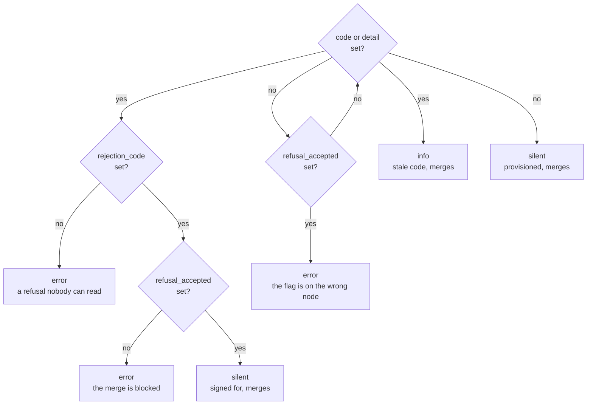
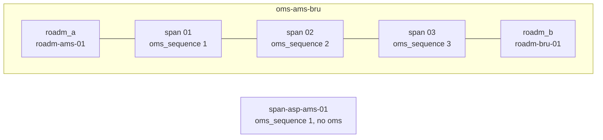
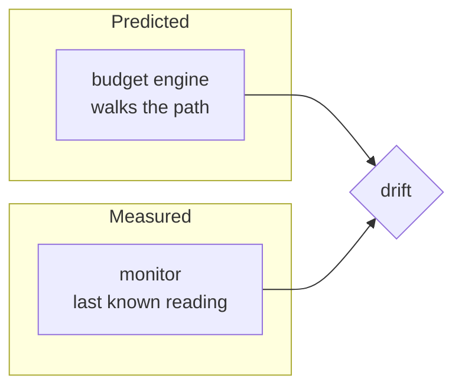

# Optical plant concepts

The plant layer is four kinds: a fiber span, an optical multiplex section, a
conduit, and a fiber type. Together they answer "what is the light travelling
through, and what does that cost it".

What follows is the part of that answer the YAML cannot state for itself.

## A fiber span is an optical element, not a device

`OtnFiberSpan` inherits `OtnOpticalElement` and nothing else. It is the only
kind in the model that does.

Every other optical element is also a device. A transponder, a ROADM, an
amplifier, a mux/demux, a patch panel and a Raman pump are all racked at a site,
all have ports, and all attenuate light. A fiber span attenuates light and does none of
the rest. It sits in a trench between two sites, it has no rack position, and
light does not enter it through a port object.

The span contributes the largest loss in the network. Over the shortest section
in the loaded dataset, 220 km from Amsterdam to Brussels, the three spans
contribute 53.001 dB and the two ROADMs contribute 14.000 dB. So the span has to
be in the answer to "what does the budget sum", and it cannot be in the answer
to "what is racked here".

That is why the two generics stay apart instead of forming one inheritance
chain:

- `OtnGenericDevice` is anything racked at a site.
- `OtnOpticalElement` is anything light passes through and loses power in.

A single chain that made every optical element a device would have forced the
span to grow a site relationship and a port list it can never fill. The split
costs one extra `inherit_from` line on seven device kinds, and in return a
lossy non-device is expressible.

Loaded, `OtnOpticalElement` reports eight kinds using it. Seven are devices. One
is the glass. The [schema reference](./schema-reference.mdx#two-generics-not-one-chain)
draws which kind inherits which.

## A span's stored insertion loss is zero, and that is not its loss

`OtnFiberSpan` inherits `insertion_loss_mdb` from `OtnOpticalElement`, and on a
span the value stays at its default of `0`. Read a span through GraphQL and
`insertion_loss_display` says `0.0 dB`.

That number is the absence of a claim rather than a claim that the span is
lossless. A span's loss is not a property anyone measures once and writes down.
It is computed from four things the span does store:

```text
loss = length_m x fiber_type.attenuation_mdb_per_km / 1000
     + splice_count x splice_loss_mdb
     + connector_count x connector_loss_mdb
     + aging_margin_mdb
```

Every term is on the span or one relationship away. There is deliberately no
`total_loss_mdb` attribute: a stored total is a second copy of a derived fact,
and nothing in the schema keeps the copy in sync with the parts. Change a span's
length and a stored total becomes wrong with no signal that it has. The optical
budget engine computes the sum at read time instead.

The same rule removes four attributes from `OtnOpticalMultiplexSection`. It has
no `total_length_m`, no `total_loss_mdb`, no `span_count` and no `hop_count`.
All four are sums over its spans.

## A conduit is what makes route diversity honest

`OtnConduit` has a name, an owner, a description, and a list of spans. No
length, no route, no geometry.

That looks thin until you ask what the kind is for. Two services provisioned on
"diverse" paths through Amsterdam and Frankfurt are only diverse if their fiber
is in different trenches. If both paths run through the same duct under the same
motorway, one backhoe cuts both, and the routing engine that declared them
diverse was wrong.

A conduit is the shared-risk link group that makes that answerable. Spans in one
conduit fail together. That is the entire fact, and it needs identity and
membership, nothing more. Adding a route geometry would turn the conduit into a
weak imitation of a GIS system while adding nothing to the diversity question.

**An absent conduit means unknown, not diverse.** `OtnFiberSpan.conduit` is
optional, because a span has to be creatable before anyone has surveyed which
duct it runs in. A span with no conduit is a span whose shared risk has not been
recorded. Treating that as proof of diversity is the single most expensive
misreading available in this model, and no schema constraint can prevent it. The
absence of data and the absence of risk look identical in the YAML.

## Declaring diversity, and what that makes enforceable

A conduit answers "do these two routes share a duct". It does not answer
"were they supposed not to". Those are different questions and only the second
one can block a merge.

`OtnDiversityGroup` is where the second one is written down. It is a small kind:
a unique name, a description, and the services in it. Two services pointing at
one group are declaring that no single cut may take both.
`checks/diversity.py` reads the group, walks each member's spans out to their
conduits and fails the proposed change when two members share one.

**It says nothing at all about services that declared nothing, and that silence
is the feature.** `transforms/srlg_exposure.py` argues in its own docstring
that shared risk should be reported and not enforced. An operator may have
accepted an exposure deliberately, and a check has no way to know. That
objection is correct against a check that flags every shared duct. This check
answers it rather than overriding it: it only ever speaks about a promise
somebody wrote down. An accepted exposure stays accepted. The question "who
shares a duct with whom, declared or not" keeps its existing answer in the
[SRLG report](./reporting-scenarios.mdx#scenario-seven-which-services-are-not-diverse),
which is the right instrument for it because a report blocks nothing.

The silence is a property of the query rather than of a condition in the Python.
`queries/diversity.gql` is rooted on `OtnDiversityGroup.services`, so a service
with no group is never fetched. A later change cannot invert an `if` that is not
there.

**A group is a node, not a text label, and the reason is worth keeping.** The
first draft made it a string on the service. Two services would then have been
in one group when their strings matched. `gold-pair` and `gold_pair` would be
two groups of one, each of which the check passes in silence, and silence is
already what this field means when it is absent. There would be no signal
separating "no promise made" from "promise made and typed wrong". As a
relationship, a mistyped group name is refused at write time with
`Unable to find the node ... in the database`.

**A member with no route yet is undetermined, not compliant.** Declaring the
group before provisioning the circuits is the normal order of work. The check
reports that case at INFO rather than passing it. A green check on an
unprovisioned pair would be the same failure as the text label, arriving later.

## A refusal is an answer, and it does not merge unless somebody signed for it

The provisioning generator either builds a service or refuses it, and a refusal
is written onto the node: `status` goes to `rejected`, `rejection_code` takes one
of <span data-fact="rejection-codes">six</span> values, and `rejection_detail` holds the prose. `checks/provisionable.py`
reads those three fields and fails the proposed change for every service that is
refused and **not accepted**, naming the service, the code and the detail.

The invariant is one sentence: **the default branch holds only services that can
be provisioned, or refusals somebody signed for.**

**The gate and the escape hatch are one mechanism.** On its own the gate reads
as "refusals are forbidden", which is false. `refusal_accepted` is a `Boolean`
that only a person ever sets.
It records that an operator read the code and the detail and decided the record
was worth keeping. Some refusals are the answer rather than a failure. Madrid to
Warsaw at 400G refused for optical budget is a demo scenario whose entire point
is the recorded refusal, and no amount of improving the network provisions it.
Set the flag and the check goes quiet about that service, and the branch merges
carrying a documented no. Refusals are not forbidden here. Unread ones are.

This is the same shape as the diversity check above, and deliberately so. That
one speaks only about promises somebody wrote down; this one speaks only about
refusals nobody has signed. Widening either would delete the capability the
silence exists to protect. The unconditional question, "which services are
refused, signed for or not", has its own answer in the service trace report,
which is the right instrument for it because a report blocks nothing.

**The generator may clear the flag and may never set it**, and only at one
boundary. While the service stays refused a rerun leaves the signature alone, or
it would silently un-accept a decision somebody made. When the service
provisions, the generator clears it, because the refusal that was accepted has
ceased to exist. Without that second half the flag survives onto a working
service, and the check then blocks the merge because the network improved.

**Which of the three fields decides is worth drawing**, because the order the
check reads them in is what the state table cannot show:



`status` is read first, so a leftover code on a service that is no longer
rejected blocks nothing. It is reported at INFO instead, because a stale code
makes every filter by reason code wrong and a reader should hear that it was
seen and deliberately not acted on.

Acceptance is read **after** readability, which is the fail-closed rule and the
one thing a straight reading of the table misses. A service marked `rejected`
with no code is an error whether or not the flag is set. Accepting a refusal
means having read it, and a refusal with no code cannot have been read.

The two error paths on the right of the drawing are states the generator cannot
produce. Reaching either means a hand edit or a write path nobody modelled,
which is exactly what a check is for.

**Why this cannot be a schema constraint.** The rule is not "this value may never
be written", it is "this value may not be **merged** unaccepted". Merge is not a
write path the schema sees. A constraint forbidding `status: rejected` would
refuse the generator's own write, midway through this same pipeline, and
recording refusals is the generator's job. The other two rules are about
absence, and a constraint governs what is written and is blind to a gap.

**Gating on a derived verdict is safe here for one reason.** A capacity verdict
does go stale, and a three-week-old refusal blocking an unrelated change would be
a real objection. It does not apply inside the pipeline. The generator is
registered with `targets: optical_services` and runs **ahead** of the checks in
the same proposed change. The verdict the check reads was written seconds
earlier against this branch's own data. This check never sees a refusal that has
been resting on the default branch.

The [schema reference](./schema-reference.mdx#the-six-reason-codes-and-the-signature-beside-them)
lists the six codes and what each colour means.

## Sections group spans, and do not own them

An optical multiplex section runs ROADM to ROADM. It groups the ordered spans
and the inline amplifiers between two degrees, which is the unit the capacity
question is asked about. A section carries 4,800,000 MHz of C-band, not a span
and not a path.



Three things about the shape matter before loading data.

**A span's position in its section is an integer on the span**, not an ordered
list on the section. `oms_sequence` counts from the A end, and a span has no
direction of its own, so one number covers it. The coarse tail has a sequence
of 1 and no section, which is what keeps it out of the budget engine.

**A section holds two amplifier chains, one per direction of travel.** Light
crosses the section both ways and an amplifier restores power in one of them. A
section with N spans holds N+1 amplifiers each way. The section holds each
chain in its own relationship, `amplifiers_a2b` and `amplifiers_b2a`, and the
two are budgeted separately.

**No amplifier stores which chain it is in.** The relationship holding it
already says so, and an attribute restating that would be a second copy that can
disagree with the first. Read from the amplifier's own page the same fact is
which of its two section relationships is set. An amplifier's `oms_sequence`
counts along the direction it amplifies rather than from the A end, which is
where it differs from a span's. See the [link budget](./link-budget.mdx) page
for what that means for the arithmetic.

**Nothing stops two spans claiming the same position.** A uniqueness constraint
spanning `oms` and `oms_sequence` was tried and rejected by the platform:

```text
uniqueness_constraints: cannot use grp relationship,
relationship must be mandatory.
```

The constraint needs a mandatory relationship. `oms` has to stay optional so a
span is creatable before the section it will join exists. Duplicate positions
are therefore a data rule with no enforcement anywhere in this repository.
Neither the schema nor any check rejects them, and `plant.py` sorts by
`oms_sequence` without asking whether the values are distinct. It is stated here
so the gap is visible rather than assumed covered.

## Two wavelength plans, and why they are two kinds

The core runs on the dense grid: ninety-six channels of 50 GHz each, between
191.35 and 196.10 THz, all inside the C band. That is ITU-T G.694.1, and
`OtnFrequencyGrid` holds it.

Those two frequencies are channel **centres**, 4,750,000 MHz apart. The band the
capacity arithmetic runs against is the edge-to-edge extent, 191.325 to 196.125
THz, which is 4,800,000 MHz. The two figures differ by one channel width and
using the wrong one silently loses a channel of capacity, so
[the spectral model](./spectral-model.mdx) page keeps them apart and `units.py`
names both.

ITU-T G.694.2 is the other plan. It is coarse: eighteen wavelengths spaced 20 nm
apart, from 1271 nm to 1611 nm. They are named by wavelength rather than by
frequency, because 20 nm is far too wide for the frequency precision the dense
grid needs.
`OtnCwdmChannel` holds it, and the two kinds stay apart.

| | G.694.1, dense | G.694.2, coarse |
| --- | --- | --- |
| Kind | `OtnFrequencyGrid` | `OtnCwdmChannel` |
| Channels | 96 | 18 |
| Spacing | 50 GHz | 20 nm |
| Range | 191.35 to 196.10 THz, centre to centre | 1271 to 1611 nm |
| Named by | Channel number and frequency | Nominal central wavelength |
| Can be amplified | Yes, all 96 | No |

One kind holding both plans would be less code and a worse model.
`OtnOpticalCarrier.channel` is mandatory and peers `OtnFrequencyGrid`, so the
server rejects a carrier pointed at a coarse wavelength before the write lands,
with `must be of type: ['OtnFrequencyGrid']`. Merge the plans and that rejection
disappears, and the rule that replaces it is a check in a pipeline instead of a
constraint at write time.

A plan entry is not an optical element. `OtnCwdmChannel` inherits nothing. Light
does not pass through a plan entry, it passes through the multiplexer that
selects one, and the multiplexer is the element that attenuates it.

## Coarse optics are metro access, not core

The demo has one coarse link: Amsterdam Science Park to Amsterdam, 18.4 km of
G.652.D, four lit wavelengths at 1471, 1491, 1511 and 1531 nm, a passive
multiplexer at each end and no amplifier anywhere on it.

That shape is the whole argument for coarse optics. Over 18.4 km a pair of
passive multiplexers costs less than a pair of coherent transponders, and 20 nm
of spacing means the lasers need no temperature stabilisation. Four wavelengths
on one fiber pair is all the campus needs.

The same shape is the argument against putting coarse optics on a core section.
Amsterdam to Brussels is 220 km, the shortest section in the network, and
Paris to Madrid is 1250 km. Every core section needs amplification, and coarse
wavelengths cannot be amplified:

- Sixteen of the eighteen sit outside the erbium window. An erbium-doped fiber
  amplifier has gain roughly between 1530 and 1565 nm. Five coarse wavelengths
  are in the O band, five in the E band, three in the S band and three in the L
  band. An amplifier fitted to a coarse link would do nothing for any of them.
- The remaining two, 1531 and 1551 nm, are inside the erbium window and are
  still not usable as dense channels. Neither lands on the 50 GHz grid, so
  neither is writable as an `OtnFrequencyGrid` channel. The overlap between the
  two plans is real and of no use.

Eighteen coarse wavelengths against ninety-six grid positions is the second half
of the argument. A core section is a capacity question, and the coarse plan
answers it with a fifth of the spectrum and no way to amplify what it does
carry.

## The coarse tail is outside the budget engine, deliberately

`OtnFiberType.attenuation_mdb_per_km` is one number per fiber family, measured
at 1550 nm. The budget engine applies it to every span it is handed. On the
dense grid that is accurate to a few thousandths of a decibel. On a coarse
wavelength it is not. Silica attenuates more outside the C band, and the further
out the wavelength sits the larger the gap.

At the stored 200 mdB/km, the four-term formula above gives the 18.4 km tail
4.530 dB of fiber, splice and connector loss with the ageing allowance left out.
The four lit wavelengths on that tail run at 1471, 1491, 1511 and 1531 nm, and
none of them is the wavelength the coefficient was measured at. This repository
holds no per-band attenuation figure, so it cannot state by how much the stored
number understates them, and no test here derives one. For scale on why the gap
matters at all, Paris to Madrid misses its OSNR target by 0.535 dB at
`DP-16QAM 64GBd 400G`. A fraction of a decibel is the size of the margin that
decides whether a section closes.

So the tail belongs to no optical multiplex section. The budget engine reaches
spans only through sections, so a span in no section is a span the engine never
sees. `OtnFiberSpan.oms` is optional and writable: set it on the tail and the
next run prices that span at the wrong coefficient and reports a margin that
looks fine.

Two tests enforce the boundary. `OtnSite.site_type` marks the campus `customer`,
and the first test refuses an `oms` on any span touching such a site. The second
asserts that the only multiplexers lighting a coarse wavelength are the two on
the tail, so a core multiplexer cannot quietly acquire one.

Modelling a coarse budget honestly needs an attenuation figure per wavelength
band, which is a schema change rather than a note.

## Negative result: the 120 km pluggables reach no section

The optical-mode catalog is data precisely so this kind of question is answered
by a query rather than by an assumption. For the coherent pluggables the answer
is discouraging.

The shortest nominal reach in the catalog is **120 km**, shared by `400ZR` and
`800ZR`. The shortest section in the loaded network is **220 km**, Amsterdam to
Brussels, and the next two are 320 km and 330 km. Both parts therefore reach
zero of the twenty-one sections, and the ordering does not change if the reach
figure moves by a few tens of kilometres.

The two `OpenZR+` modes, at 1000 km to 3000 km, are the pluggables that do
reach. `OpenZR+ 400G` covers twenty of the twenty-one sections and misses only
Paris to Madrid at 1250 km.

What matters to a planner is when the answer arrives. A network built on the
assumption "pluggables are cheaper, so use pluggables" would have discovered
this after buying them.

## Milan carries nineteen transponders and Brussels two

Each PoP gets `max(2, ceil(terminations / 2))` transponders, with two line ports
on each. That gives Milan 19, Frankfurt 13, Amsterdam 4, Berlin 3 and every
other PoP the floor of 2. Fifty-nine transponders, 118 line ports, of which 80
carry a wavelength.

The spread is not a modelling choice. It is what the carrier plan already said
and the device count used to hide. All forty wavelengths in the shipped plan
ride the Frankfurt to Milan corridor, so Milan is an endpoint of 37 of them and
Frankfurt of 25. When every site held the same two or four transponders,
nothing in the inventory showed that. Now the transponder count is the traffic
map.

**The negative result is the other half of the same sentence.** Eight of the
fourteen PoPs terminate no wavelength at all: Brussels, Copenhagen, Geneva,
Hamburg, London, Madrid, Prague and Warsaw. Each sits at the floor of two
transponders, and all four of its line ports are dark. Thirty-eight of the 118
line ports in the dataset carry nothing.

They keep two transponders rather than none because five of those eight are
endpoints of shipped demo scenarios, and the scenarios live in `demo/`, which
is loaded by hand and never by git sync. Madrid and Warsaw are the quick start's
headline refusal; London is the ten-into-one grooming runbook; Prague and
Geneva are service endpoints. The floor is a modelling argument rather than a
functional one, and the difference is worth stating. Provisioning would still
run with no transponder at those sites, because
`generators/optical_service.py` names no line port and binds none. What breaks
is the network a reader is looking at: a PoP that can never terminate a
wavelength is not a credible node, and someone who provisions a 400G service at
Madrid and then finds no transponder in Madrid's inventory is reading a network
that does not hold together. Only Brussels, Copenhagen and Hamburg are
genuinely idle.

## What the equipment reports, and what the model predicts

Every optical figure elsewhere in this demo is computed. The budget engine
predicts an OSNR cascade, and the check compares that prediction against what a
modulation format needs. None of that is a measurement.

A monitor is where the measurement goes. It is the interface an engineer looks
at on real equipment, and each device family reports a different set, because
each measures something different.

| Monitor | What it reports |
| --- | --- |
| Amplifier | Input power, output power, gain, gain tilt |
| ROADM degree | Total power, channel count present |
| Mux or demux | Total power, channel count lit |
| Raman | Pump power, gain achieved, back reflection |
| Receiver | Rx power, OSNR, pre-FEC bit error rate, Q factor, chromatic dispersion, differential group delay |



**Each row is its own kind.** Five kinds, not one kind with a field saying which
family it belongs to. The readings barely overlap: of the <span data-fact="monitor-readings">fourteen</span> in the model,
<span data-fact="monitor-readings-alone">eleven</span> appear on exactly one family. The names suggest
more sharing than there
is, because input power, total power, pump power and received power are four
different measurements that happen to have "power" in four different names.
<span data-fact="monitor-readings-shared">Three</span> readings are shared, and only in two pairs:
measured gain between an
amplifier and a Raman pump, and total power and channel count between a ROADM
degree and a multiplexer.

At that separation the schema can express the whole thing itself. Every reading
is mandatory on the kind that declares it, so a monitor missing one is refused.
And a kind has no field at all for a reading its hardware cannot produce, so
that is refused too. The two kinds that do report the same pair, a ROADM degree
and a multiplexer, share those two readings through a generic. They stay
separate kinds, because a degree and a multiplexer are different equipment.

**OSNR sits on the receiver and nowhere else.** A coherent receiver's digital
signal processor computes it as part of recovering the signal. An amplifier
measures power, not noise ratio, so OSNR on an amplifier monitor would be a
number its hardware has no way to take, and there is nowhere to put it.

**A receiver with no wavelength reports loss of signal.** Every receiver monitor
in the dataset used to carry the same block of plausible numbers, so a
transponder with nothing on its line ports still claimed a healthy 25.1 dB of
OSNR at -9.000 dBm. Sixteen of the fifty-nine monitors now say the opposite:
received power at -40.000 dBm, which is the floor of the range, no OSNR, no Q
factor, no dispersion and no differential group delay, and a pre-FEC bit error
rate of 0.5, which is what pure noise gives. The other forty-three are derived
from the route their carrier takes and no longer agree with each other, running
from 24.786 dB on the 1580 km Frankfurt to Vienna hop to 28.025 dB on the 780 km
Frankfurt to Milan one.

The monitor still exists on a dark transponder rather than being left off. The
completeness check gates on a transponder that has none, the six readings are
mandatory on the kind, and reporting darkness is more use than removing the box:
it separates dark from healthy instead of erasing the difference.

There is one thing the schema still cannot say: nothing stops a receiver monitor
being attached to an amplifier. A port's device relationship points at the
generic device kind, and a concrete kind cannot narrow the peer of a
relationship it inherits. The schema has no way to express the restriction, and
recovering it in code would be the layer these five kinds exist to leave, so the
gap is stated instead.

## A reading is a last known value, not a feed

Every monitor records the time its reading was taken, and that attribute is
mandatory. A reading nobody can age is not evidence of anything.

This is a source of truth for intended state. A live counter belongs in a time
series database, and modelling one here would be the wrong tool.
What belongs here is the most recent observation, because that is what makes
drift computable: predicted against observed, with an age attached so a stale
number cannot pass for a fresh one.

One consequence worth stating. A real channel monitor reports power for every
channel, ninety-six values on a loaded degree. That is a vector, and the
attribute kinds able to hold one are not filterable, sortable or usable in a
computed attribute. Ninety-six child objects per monitor would add forty
thousand objects to a dataset of two thousand. Total power and channel count
give the operational meaning without the vector, and the per-channel detail is
left to the system built for it.

## What this layer deliberately does not have

| Absent | Why |
| --- | --- |
| `total_loss_mdb` on a span | Computed from length, attenuation, splices and connectors. |
| `total_length_m`, `span_count` on a section | Sums over `spans`. |
| A port or device relationship on a span | A span is not racked and light does not enter it through a port. |
| An inverse for `site_a` and `site_b` on `OtnSite` | "Every span touching Amsterdam" is a native filter on the span side. Two lists on the site would present one fact twice. |
| Route geometry on a conduit | The conduit answers shared risk, not where the trench goes. |
| Channel occupancy on the frequency grid | Capacity is the C-band minus the union of the intervals in use, each interval centred on a carrier's anchor and sized by its mode. See [the spectral model](./spectral-model.mdx). |
