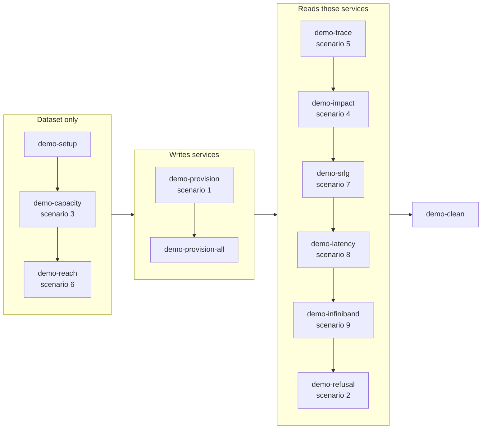

# Demo guide

Nine scenarios against the loaded GÉANT dataset. Every number on the three
pages below is produced by the engine and asserted by a unit test.

| # | Scenario | Answers |
| --- | --- | --- |
| 1 | Provision Berlin to Amsterdam at 400G | Where does the next service go, and what did it not pick? |
| 2 | A corridor out of colour, and what still fits | Why does one service on it provision and the other not? |
| 3 | What spectrum is left, and what can use it | Can another 400G fit? |
| 4 | Cut the Frankfurt to Amsterdam fiber | What goes down, and whose is it? |
| 5 | Trace a service end to end | What does this service run over? |
| 6 | Where do the cheap pluggables reach? | Nowhere, and here is why. |
| 7 | Which services are not diverse? | Who shares a duct with whom? |
| 8 | The AI services against their budgets | How much latency headroom is left? |
| 9 | The InfiniBand handover | What happens when a service states its own client signal? |

`uv run invoke demo` runs them in the order below, on one branch, and this is
also the order the runbook follows. Everything left of the provisioning step
reads a branch that holds the dataset and nothing else. Everything right of it
reads services, so it needs the provisioning step to have run first.

The scenarios live on three pages, and this page is the way in to all three.

**[Provisioning scenarios](./provisioning-scenarios.mdx)** covers what to do
before you start, then the two scenarios that write: provisioning Berlin to
Amsterdam at 400G, and a corridor that has run out of colour where one service
still fits and another does not.

**[Reporting scenarios](./reporting-scenarios.mdx)** covers the six scenarios
that read rather than write, from what spectrum is left to which services are
not diverse, and the two maps every PoP carries as artifacts.

**[Loadable scenarios and the runbook](./loadable-scenarios.mdx)** covers the
three pairs loaded by hand rather than driven by a task, including
[the ODU layer pair](./loadable-scenarios.mdx#two-loadable-scenarios-for-the-odu-layer),
which fills one wavelength to capacity and then puts every band on the
[ODU map](./odu-map.mdx) at once. The runbook and the clean-up steps are there
too.

If you are running this in front of people, skip to
[the runbook](./loadable-scenarios.mdx#the-runbook). It opens on the
[network map](./network-map.mdx) and then runs the same eight scenarios in
narrative order, with the setup done once.
