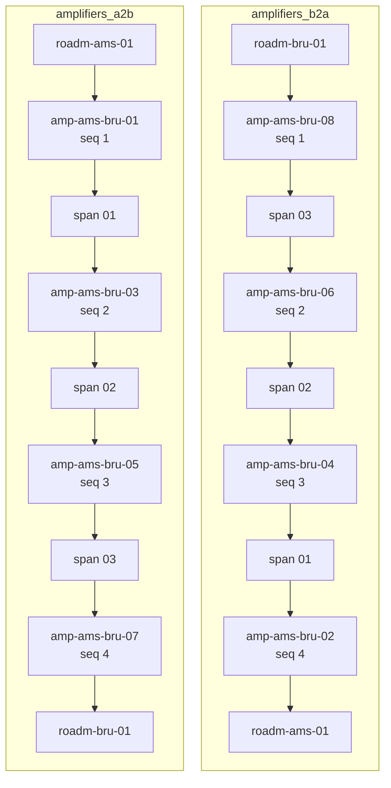

# Link budget

A wavelength either closes or it does not. The link budget is the arithmetic
that decides, and in this demo it is a computation over loaded plant rather than
a spreadsheet somebody maintains manually.

Three independent gates, all evaluated, all reported:

| Gate | Question | Passes when |
| --- | --- | --- |
| OSNR | Is there enough signal against the noise the amplifiers add? | `osnr_total - required_osnr - system_margin >= 0` |
| Chromatic dispersion | Can the receiver still recover the pulse shape? | `accumulated <= mode.cd_tolerance` |
| Gain | Can each amplifier restore the power the element ahead of it took? | `gain >= loss ahead, aging included` |

The engine is `src/infrahub_demo_otn/budget.py`. It imports no Infrahub SDK, so
its tests need no server, and every number crossing its boundary is a scaled
integer.

## Two directions, and two chains of amplifiers

An optical multiplex section runs from one ROADM to the other, and light travels
both ways over it. Amplification only works one way. An erbium-doped amplifier
has an input and an output, and it restores the power of light entering its
input. An amplifier hut therefore holds two amplifiers, one facing each way,
sharing a building and nothing else.

The section holds one relationship per chain, `amplifiers_a2b` and
`amplifiers_b2a`, and which one holds an amplifier is which way it faces.
Nothing on the amplifier repeats that. What the amplifier does have is an
`oms_sequence` counting along the direction its own chain amplifies. A section
with N spans has N+1 amplifiers each way, 2N+2 in total, and the two chains are
budgeted separately.

Here is `oms-ams-bru`, three spans between Amsterdam and Brussels:



An amplifier name is a position and nothing else. Huts count from the A end and
each holds two amplifiers. Hut 0 is the Amsterdam building with `01` and
`02`, hut 1 is the first roadside hut with `03` and `04`, and so on. Read the
two columns above side by side and `03` and `04` are the two amplifiers in one
building, facing opposite ways. Their sequence numbers differ because the two
chains reach that building from opposite ends.

Sort either chain on its sequence and it is already in the order the light meets
it. Nothing has to parse a name to get there. The chain comes from the
relationship and the order comes from the sequence. Whether an amplifier is a
booster, an inline or a pre-amplifier is the `role` on its own input and output
ports.

**Walking a section the other way swaps the chains. It does not reverse one.**
Reversing a chain models the same amplifiers running backwards, which is not
what is installed. The distinction is invisible on this dataset, where all 306
amplifiers have the same noise figure and the same gain. It stops being
invisible the first time a section is built from mixed equipment.

Two chains produce two margins for one section. Where a report shows a single
margin, it shows the worse of the two, because that is the direction a service
over the section is limited by. Both figures are listed underneath, so the
choice is visible rather than assumed.

## A worked example over the shortest section

The shortest section in the network, 220 km over three spans, carrying a 400G
wavelength on `DP-16QAM 64GBd 400G` from Amsterdam towards Brussels. Every
number below comes out of `objects/`.

**The inputs.** Three G.652.D spans of 73,334, 73,333 and 73,333 metres. Each
has 18 fusion splices at 0.05 dB, two mated connector pairs at 0.3 dB, and
a 1.5 dB aging allowance. A ROADM at each end at 7.0 dB. Four amplifiers in the
Amsterdam-to-Brussels chain, each 4.0 dB noise figure and 22.0 dB gain, and four
more facing the other way.

**Per-span loss.** The four-term span formula, on the first span:

```text
(73334 / 1000) * 200  = 14667 mdB    attenuation
18 * 50               =   900 mdB    splices
 2 * 300              =   600 mdB    connectors
                        1500 mdB    aging allowance
                       ------------
                       17667 mdB    = 17.667 dB
```

**Per-stage OSNR.** Launch power is +3.0 dBm per channel. The loss ahead of
an amplifier is the loss of whatever sits immediately before it. The aging
allowance is not charged here. It is a reserve against loss that has not
happened yet, so it belongs to the power budget and to the gain requirement, not
to the noise. That leaves 16.167 dB of real fiber loss on each span.

```text
booster, behind the 7.0 dB ROADM:
    3000 -  7000 - 4000 + 58000 = 50000 mdB = 50.000 dB
each line amplifier, behind 16.167 dB of fiber:
    3000 - 16167 - 4000 + 58000 = 40833 mdB = 40.833 dB
```

The 58.0 dB is the reference-bandwidth constant, `-10*log10(h * nu * delta_nu)`
for 12.5 GHz, which is 0.1 nm at 1550 nm. It is a named constant in the engine,
never a literal in the formula.

**The hop table.** This is what the budget report transform renders.

| # | Hop | Kind | Loss | Stage OSNR | Cumulative loss | Cumulative OSNR | Cumulative delay |
| --- | --- | --- | --- | --- | --- | --- | --- |
| 1 | `roadm-ams-01` | node | 7.000 dB | | 7.000 dB | | 0.1 us |
| 2 | `amp-ams-bru-01` | amplifier | | 50.000 dB | 7.000 dB | 49.500 dB | 0.2 us |
| 3 | `span-ams-bru-01` | span | 17.667 dB | | 24.667 dB | 49.500 dB | 359.3 us |
| 4 | `amp-ams-bru-03` | amplifier | | 40.833 dB | 24.667 dB | 39.836 dB | 359.4 us |
| 5 | `span-ams-bru-02` | span | 17.667 dB | | 42.334 dB | 39.836 dB | 718.5 us |
| 6 | `amp-ams-bru-05` | amplifier | | 40.833 dB | 42.334 dB | 37.067 dB | 718.6 us |
| 7 | `span-ams-bru-03` | span | 17.667 dB | | 60.001 dB | 37.067 dB | 1077.7 us |
| 8 | `amp-ams-bru-07` | amplifier | | 40.833 dB | 60.001 dB | 35.390 dB | 1077.8 us |
| 9 | `roadm-bru-01` | node | 7.000 dB | | 67.001 dB | 34.890 dB | 1078.0 us |

Two numbers in that table need explanation.

The cumulative OSNR after the booster is 49.500 dB, not the 50.000 dB the stage
delivers. Each ROADM traversed costs a 0.5 dB filtering penalty on top of its
insertion loss, and the head ROADM has already been crossed.

The cumulative OSNR drops 9.664 dB at the first line amplifier and only
2.769 dB at the second. Stages cascade in the linear domain,
`1 / OSNR_total = sum(1 / OSNR_stage)`, so the first bad stage does most of the
damage and each identical one after it does less. Two equal stages land exactly
3.010 dB below either of them.

**The verdict.**

| Quantity | Value |
| --- | --- |
| Total length | 220.000 km |
| Total loss | 67.001 dB |
| OSNR delivered | 34.890 dB |
| Required by `DP-16QAM 64GBd 400G` | 24.500 dB |
| System margin | 1.000 dB |
| **OSNR margin** | **+9.390 dB** |
| Accumulated dispersion | 3740.0 ps/nm |
| Tolerated by the mode | 50000.0 ps/nm |
| **Dispersion margin** | **+46260.0 ps/nm** |
| Latency in this direction | 1082.0 us |

Both gates pass, with room. On the shortest section in the network that is the
expected answer. The interesting answers are on the long routes.

Brussels to Amsterdam produces the same numbers. The two ROADMs have the same
insertion loss, the two chains hold the same equipment, and no span here has a
Raman pump, so nothing distinguishes the directions. That is the ordinary
case. It is what makes the few sections where the two differ worth looking at.

## The model, and where it is tuned

Five constants set the whole model. Two of them are tuned towards the
favourable end of realistic, and the table marks which two.

| Constant | Value | Note |
| --- | --- | --- |
| OSNR reference bandwidth | 58.0 dB | Physics. 12.5 GHz, which is 0.1 nm at 1550 nm. |
| Per-channel launch power | +3.0 dBm | **Tuned.** Across 96 channels that is +22.8 dBm composite, a high-power booster rather than a typical one. |
| Amplifier noise figure | 4.0 dB | **Tuned.** A good low-noise erbium-doped amplifier, not an average one. |
| ROADM filtering penalty | 0.5 dB per node | Representative. |
| System margin | 1.0 dB | Implementation penalty and end-of-life degradation. |

The span lengths, the amplifier spacing, and the reach and OSNR figures in the
optical mode catalog are illustrative in exactly the same sense. None of them is
sourced from a vendor data sheet or from published plant records.

The node and amplifier latency terms, 150 and 100 nanoseconds, are illustrative too.
They sit three orders of magnitude below propagation and change no verdict; they
are modelled because zero is a stronger claim than small.

## Beginning of life, and why the aging allowance is not in the OSNR

Every span has an `aging_margin_mdb`, 1.5 dB by default. It is a reserve
against repairs and degradation that have not happened yet.

The engine keeps two loss numbers for every span:

- `span_loss_mdb` includes the allowance. It determines the power budget and the
  amplifier gain requirement, because an amplifier has to still restore the
  launch power at end of life.
- `span_fiber_loss_mdb` excludes it. It determines the OSNR, because that is the
  loss the light meets today.

Charging the allowance to the OSNR as well would compute an end-of-life figure
and then subtract a system margin on top of it, which is the same pessimism
counted twice. Over the 17 spans of the longest route the allowance alone is
25.5 dB.

So the OSNR this demo reports is a **beginning-of-life** figure, and the 1.0 dB
system margin is what covers implementation penalty and aging on top.

## Raman, and what it does to a link budget

Raman amplification puts the gain inside the fiber. A pump laser injects light
about a hundred nanometres below the signal wavelength. Stimulated Raman
scattering transfers power from the pump to the signal while the two travel
through the same glass. No gain block appears on the path. The signal reaches
the far end of the span with more power in it than the loss of the fiber
predicts.

The quantity that describes this is **on-off gain**: the received signal power
with the pump running, less the received signal power with the pump switched
off. It is stored on `OtnRamanPump.on_off_gain_mdb`, and the engine credits it
as reduced effective span loss rather than as another stage in the cascade:

```text
effective fiber loss = fiber loss - on-off gain + combiner insertion loss
```

**The gain is credited one way and the combiner is charged both ways.** A pump
amplifies one direction of travel and does nothing at all for light going the
other way. The wavelength combiner that couples the pump onto the fiber sits in
line on the glass, and light going either way passes through it and pays its
insertion loss. A pumped span is therefore asymmetric: it costs less one way, by
the gain minus the combiner, and more the other way, by the combiner alone.

### Which direction a pump amplifies

The pump does not store the answer. It stores two facts about the hardware, and
the direction follows from them:

- **`injection_end`**, which end of the span the pump is spliced in at, named
  against the span's own `site_a` and `site_b`.
- **`propagation`**, whether the laser fires with the signal or against it.

A counter-propagating pump fires back up the fiber from the far end, so one at
the B end amplifies the A to B signal. A co-propagating pump fires along with
the signal from the near end, so one at the A end amplifies A to B as well.
Those are two ways of reaching the same result, and all four cases are:

| Injected at | Laser fires | Amplifies |
| --- | --- | --- |
| B end | Against the signal | A to B |
| A end | With the signal | A to B |
| A end | Against the signal | B to A |
| B end | With the signal | B to A |

Every pump in the loaded network is **counter-propagating**, so only the first
and third rows occur here. The table shows all four because a reader who sees
only the shipped cases will assume counter-propagating is the only kind there
is. Firing against the signal means gain builds where the signal is weakest,
which is the useful place to put it.

Storing the conclusion alongside the two facts that fix it would be a third
value that can contradict them. A counter-propagating pump recorded at the A end
and marked as amplifying A to B is a self-contradictory object, and a model that
accepts one will eventually hold one.

### What that is worth on this network

Nine spans have a pump on the default branch, all of them on Vienna to Milan,
all injected at the Milan end and firing against the signal, which amplifies
Vienna towards Milan. Each pump quotes 10.0 dB of on-off gain, and each combiner
costs 0.5 dB.

| Direction | Effective span loss against the bare fiber |
| --- | --- |
| Vienna towards Milan | 9.5 dB lower |
| Milan towards Vienna | 0.5 dB higher |

Nine spans are pumped, so the section total is nine times each figure. This is
the one place in the network where the two directions of a section produce
different answers, and it is why the reports show both.

The budget report shows the arithmetic on the rows it applies to and nowhere
else. A pumped span row shows its on-off gain, its combiner loss, and what the
span would have cost unpumped, so the improvement is traceable to its source.
The other 123 spans have no Raman columns at all, because a column of zeros
across the rest of the network reads as a fault rather than as a correct answer.

### Where the treatment stops being predictive

Crediting the on-off gain as reduced loss is a first-order engineering
approximation, and it is worth being exact about what it leaves out.

A real distributed Raman amplifier contributes noise of its own: amplified
spontaneous emission from the distributed gain, double Rayleigh backscattering,
and pump relative intensity noise transferred onto the signal. **This model
charges none of it.** It credits the gain, takes the combiner loss, and stops.

So every OSNR figure on this page that involves a pumped span is **slightly
optimistic** against a full distributed model. The direction of the error is
known and its size is not modelled here. A decision that depends on a few
tenths of a decibel over a pumped span needs a Raman simulation, not this
arithmetic.

The same statement sits in the engine module beside the code that produces the
number, because someone reading the code will not have this page open.

## What the model does not include

| Absent | Why |
| --- | --- |
| Nonlinear penalties | Credible modelling needs a fiber effective-area and channel-count model this demo does not have. |
| Polarisation-mode dispersion | Same reason. |
| Regeneration and 3R placement | The network is transparent end to end by design. |
| Flexgrid media channels | Anchors are quantised onto the 50 GHz grid. A carrier's occupied **width** is modelled and checked against the band. A `128 GBd` wavelength is 150,000 MHz wide rather than one channel, but its centre may only sit on a grid position. See [the spectral model](./spectral-model.mdx). |
| Raman pump noise | The on-off gain is credited and the pump's own noise is not charged, so a pumped span reads slightly better than it would in a full distributed model. |
| Any CWDM link | `OtnFiberType.attenuation_mdb_per_km` is a 1550 nm figure, and applying it to a 1471 nm wavelength understates the loss. This repository holds no per-band attenuation figure, so it cannot say by how much. The coarse tail therefore belongs to no optical multiplex section, which is what keeps it out of the engine. See [optical plant concepts](./concepts.mdx). |

## Three findings the budget produced

The demo reports negative results. These are the three the engine found, and
each one is asserted by `tests/unit/test_budget_claims.py`, recomputed from
`objects/` on every test run.

### Route length does not order signal quality

Berlin to Amsterdam has four routes. Each is budgeted at `DP-16QAM 64GBd 400G`
from Berlin, so the amplifier count is the chain that carries the light that way.

| Route | km | Amplifiers | ROADMs | OSNR | Margin |
| --- | --- | --- | --- | --- | --- |
| Berlin - Hamburg - Amsterdam | 800 | 12 | 3 | 27.784 dB | **+2.284 dB** |
| Berlin - Frankfurt - Amsterdam | 1010 | 14 | 3 | 26.007 dB | **+0.507 dB** |
| Berlin - Prague - Frankfurt - Amsterdam | 1220 | 18 | 4 | 25.241 dB | **-0.259 dB** |
| Berlin - Copenhagen - Hamburg - Amsterdam | 1330 | 20 | 4 | 25.378 dB | **-0.122 dB** |

The last two rows are the finding. The Copenhagen route is 110 km longer than
the Prague route and has 0.137 dB more margin, because its sections are built
from shorter spans. Span loss enters the cascade exponentially; route length
enters it linearly.

A planner ranking routes by distance would pick the Prague route as the better
fallback. The budget says otherwise, and no map shows it.

All four routes carry 400G at `DP-QPSK 128GBd`, so the split above is a
modulation choice rather than a corridor nobody can use.

### The dispersion gate fires once, on one site pair, at 400G only

Madrid to Warsaw, routed through Paris, Frankfurt and Prague, is 2970 km. At
17 ps/nm/km that accumulates **50,490 ps/nm** against the 50,000 ps/nm both 400G
modes tolerate. It fails by one percent.

At `DP-QPSK 128GBd 400G` that pair fails the OSNR gate as well, by 0.021 dB. Two
independent constraints landing within a quarter of a decibel of each other on
the same site pair is a coincidence, and it is worth naming as one. At 100G the
pair passes both gates comfortably.

A second constraint that never fires proves only that the engine has two
branches. One that fires once, marginally, at the highest modulation and nowhere
else gives a planner a real answer. Madrid to Warsaw at 400G needs dispersion
compensation or a lower modulation, and no other pair does.

### The spectrally efficient 400G mode misses exactly one section

`DP-16QAM 64GBd 400G` closes on 40 of the 42 section evaluations, which is 21
sections taken singly in both directions. The two it misses are the two
directions of Paris to Madrid, 1250 km over 14 spans, each short by 0.535 dB.
That is the longest single section in the network, and it is the only place the
higher-order modulation does not fit.

The coherent pluggables, whose 120 km reach clears nothing on a network whose
shortest section is 220 km, complete the reach picture. Pluggables are out,
16QAM 400G covers every section except the longest one, and QPSK 400G covers
every route except the longest one.

## Paris to Madrid does not close, and the check says so

Run the OSNR check against the default branch and it fails. That is the state
the network is in, not a fault in the demo, and the route it names is Paris to
Madrid in both directions.

1250 km of fiber over 14 spans, with 15 amplifiers in each direction, is a
demanding section, and `DP-16QAM 64GBd 400G` misses it by 0.535 dB. Madrid sits
at the end of the longest single section here, and half a decibel is what a
section that long costs at that modulation. The number is a property of the
route, not of the dataset.

An engineer looking at half a decibel reaches for three answers. Only two of
them are available on this route.

| Answer | What it costs |
| --- | --- |
| Drop to `DP-QPSK 128GBd 400G` | The section closes at +4.965 dB, at twice the spectrum for every wavelength on it. |
| Regenerate part way along | Not available here. See below. |
| Put Raman on the section | The loss comes back without spending spectrum or a building. |

**The middle answer is not available on this route, and that was measured
rather than assumed.** Cutting a route in half at a regenerator needs a site in
the middle to put one at. `oms-par-mad` is a **single** multiplex section
carrying all 14 spans, and Madrid appears in no other section, so it hangs off
Paris as a leaf. The boundaries between those 14 spans are amplifier huts, and
this model gives every span its section's own endpoints as `site_a` and
`site_b` rather than the huts it runs between. There is no object between Paris
and Madrid to attach a device to.

That sharpens the negative result instead of softening it. Regeneration is not
the fix for Paris to Madrid, so the two answers that remain are the modulation
and the Raman pumps, and the pumps are the cheaper one.

Raman is the standard answer to a section that is a fraction of a decibel
short, and this network already models the equipment for it. The fix is a
branch:

```bash
uv run invoke demo-raman
```

That puts two pumps on each of the first three spans out of Paris, one at each
end, and runs the same check. It passes, in both directions: `oms-par-mad` moves
from -0.535 dB to +0.361 dB each way.

Two pumped spans would also pass, at +0.041 dB, which is a pass on paper and
nothing in the field. The pumps go in at both ends because a pump credits its
on-off gain to the one direction it amplifies and its combiner charges both.
Pumping one end only would fix one direction and make the other worse.

The proposed change then holds six pump objects, three fiber spans whose only
change is the pump list now pointing back at them, and no edited margin figure
anywhere. That is the point. The margin moved because the plant changed.

The default branch keeps the red check on purpose. A network whose every gate is
green teaches nothing about what a gate is for. A shortfall hidden until
someone tries to provision over it is a worse demonstration than one the
pipeline reports on every run.

## A regenerated circuit, and the two things it costs

A route with intermediate sites has an answer Paris to Madrid does not. Put an
O-E-O regenerator at one of them, and the circuit becomes two wavelengths joined
electrically: the light is received, the payload is reframed, and a fresh
transmitter starts the second half. Each half carries its own OSNR budget, so a
route too long for any single wavelength can still be built.

`OtnOduSwitch` is the kind. Its `carriers` relationship names the wavelengths
patched to the shelf, and `src/infrahub_demo_otn/chains.py` reads that to decide
whether a junction is real. The two wavelengths must meet at a site, that site
must host the device, and the device must be patched to both.

**What terminates each half is a line port, on the regenerator itself.** The
shelf carries two, one facing each segment, and each names its wavelength. So the
Madrid to Paris half ends on a Madrid transponder at one end and on the
regenerator at the other, and the Paris to Warsaw half starts on the same shelf
and ends on a Warsaw transponder. Ask either wavelength what terminates it and it
answers with hardware at both ends, the same way a direct circuit does.

That is also what makes the split affordable. The inner ends need no transponder
at the junction site, which matters because Paris and Frankfurt each hold one
spare line port and a split needs two.

### Madrid to Warsaw, where one regenerator is not enough

2970 km over four sections, `oms-par-mad`, `oms-par-fra`, `oms-prg-fra` and
`oms-prg-waw`. No single wavelength closes it on any of the ten modes in the
catalog; the best is -0.021 dB at DP-QPSK 128GBd 400G. Three sites on that route
can hold a regenerator, and `demo/06_mad_waw_16qam.yml` places one at each with
the wavelength pair its split needs. Every figure below came back from a
provisioning run.

| Attempt | Segment 1 | Segment 2 | Verdict |
| --- | --- | --- | --- |
| 400G DP-16QAM, regenerated at Paris | -0.535 dB | -2.439 dB | Refused |
| 400G DP-16QAM, regenerated at Frankfurt | -2.755 dB | +0.240 dB | Refused |
| 400G DP-16QAM, regenerated at Prague | -4.004 dB | +2.782 dB | Refused |
| 400G DP-QPSK 128GBd, regenerated at Frankfurt | +2.745 dB | +5.740 dB | **Closes** |

**Three of the four attempts fail, and that is the finding.** Cutting a route in
half does not on its own make it close. The fix is a regenerator **and** a
different modulation, and `demo/07_mad_waw_qpsk.yml` is the second half of that
pair. Prague is worth reading as the runner-up. It closes its second half at
16QAM with 2.782 dB to spare and fails its first by 4 dB, which shows the split
point matters independently of the mode.

**A route's verdict is a conjunction over its segments, not an average.** One
half short of OSNR refuses the whole circuit however much margin the other half
has. The Paris split is refused on -0.535 dB while its second segment is worse
still. `RouteBudget` offers no single margin figure for a regenerated route,
deliberately. A scalar would have to be a minimum or a mean, and both read as a
statement about a circuit that has no such property.

### Why a direct wavelength is always preferred

Two costs, and the model states both rather than leaving them implied.

**A regeneration.** The circuit needs a device at the junction, and that device
is a transponder pair plus the framing hardware between them. It is a thing to
buy, rack, power and maintain, at a site that has to be there already.

**Latency.** The delay is the sum of both segments plus what the junction
charges for reframing, which `framing_latency_ns` holds on the device. The
Madrid to Warsaw circuit takes **14558.963 us** end to end at 3000 ns of framing
delay, against 9163.620 us for the Madrid to Frankfurt half on its own. For the
[AI and HPC payloads](./ai-payloads.mdx) that treat round-trip time as the
budget, that is the term that matters.

So the routing engine ranks a direct wavelength above a chain wherever both
serve the route. Madrid to Warsaw takes the chain because it has no direct
wavelength that closes on any mode, which is the only condition under which a
chain wins.

## Re-validation on a proposed change

The arithmetic above runs once. The check runs it again on every change.

`checks/osnr_margin.py` runs on every proposed change. It reads the whole plant
once and then runs two loops over it.

**The carrier loop** budgets all 40 pre-provisioned wavelengths against their
own modes and logs an error for each one that fails any of the three gates.
Lengthen a span on a branch and every wavelength crossing it is re-evaluated
before the change can merge.

**The section sweep** budgets every section on its own, in both directions,
against one reference mode, `DP-16QAM 64GBd 400G`. That is 42 evaluations over
21 sections, and it exists because the carrier loop cannot reach most of the
network. Only five sections carry a wavelength, so sixteen of the twenty-one
were never evaluated by anything. Paris to Madrid was one of the sixteen. The
sweep is also the only place the N+1-amplifiers-per-direction rule becomes a
gate rather than a unit test, because nothing in the graph enforces how many
amplifiers a section holds.

A failure from either loop names the direction, not only the section.

```bash
uv run invoke check --name osnr_margin
```

On the default branch the sweep fails and the carrier loop passes:

```text
ERROR    osnr_margin::OsnrMarginCheck: FAILED
ERROR      Re-validated 40 carriers over 21 sections. Worst OSNR margin
           is +1.894 dB, on oc-ch047-fra-mil
ERROR      oms-par-mad a_to_b is short of OSNR by 0.535 dB on DP-16QAM
           64GBd 400G: the section delivers 24.965 dB over 1250 km and
           15 amplifiers, and the mode needs 24.500 dB plus 1.000 dB of
           system margin
ERROR      oms-par-mad b_to_a is short of OSNR by 0.535 dB on DP-16QAM
           64GBd 400G: the section delivers 24.965 dB over 1250 km and
           15 amplifiers, and the mode needs 24.500 dB plus 1.000 dB of
           system margin
ERROR      Swept 42 section evaluations over 21 sections in two
           directions against DP-16QAM 64GBd 400G. Worst standalone OSNR
           margin is -0.535 dB, on oms-par-mad a_to_b. Short of OSNR:
           oms-par-mad
```

That worst carrier is one of the 40 wavelengths on the congested Frankfurt to
Milan corridor. It runs 780 km at 16QAM. It is the tightest margin of any
wavelength on the network, and it is unaffected by Raman: the pumps are on
Vienna to Milan and this carrier does not cross that section.

Stretch one span of the Frankfurt to Milan corridor from 87 km to 200 km on a
branch. The carrier loop says so, per wavelength and per gate:

```text
oc-ch047-fra-mil on DP-16QAM 64GBd 400G is short of OSNR by 11.385 dB:
the path delivers 14.115 dB over 893 km and 10 amplifiers, and the mode
needs 24.500 dB plus 1.000 dB of system margin

oc-ch047-fra-mil crosses amp-fra-mil-03, whose gain cannot recover
the loss ahead of its input at end of life
```

A wavelength the check cannot evaluate is an error, never a skip. A check that
passes silently over an object it could not read reports success for a network
it never read. The sweep is the same principle applied to the plant: a section
nobody has provisioned over is still a section that has to close.

## Reading the budget as a table

`transforms/budget_report.py` renders the same computation as structured output:
one row per hop with running totals, plus a verdict block, for every wavelength
on the branch. Every scaled integer is accompanied by its rendered unit, so no
row asks the reader to divide by a thousand.

```bash
uv run invoke demo-budget
```

Each wavelength is budgeted in both directions. The headline margin is the worse
of the two, and both are listed with the ROADM each walk started from, so a
reader can tell an asymmetric section from a symmetric one. Any pumped span on
the path is listed separately with what it costs each way. For a span pumped one
way only, the worse direction is the unpumped one. A report that showed the
reported walk alone would show a Raman span with no Raman on it.

The wavelengths come back sorted by OSNR margin, worst first, because the worst
one is the answer to "how much room is left".
