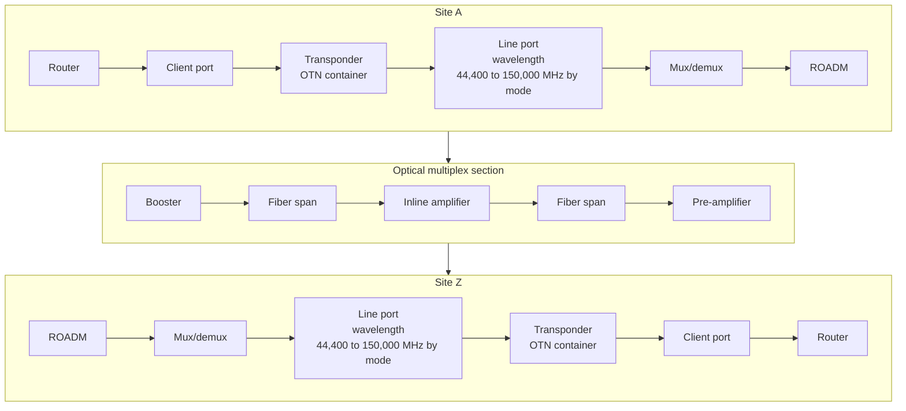

# Infrahub OTN demo

This demo models a European research-network optical core in Infrahub, down to
the fiber span and the wavelength that crosses it. Plant, spectrum and services
sit in one schema, so the answers come from the data rather than from four
reconciled systems. A transport engineer asks three things: what runs over a
given piece of glass, what a cut takes down, and where the next 400G wavelength
fits.

The network it models is shaped like GÉANT. GÉANT runs a EuroHPC
HyperConnectivity programme that interconnects European supercomputing sites, so
**AI and HPC transport** is one of the payloads the model treats as primary.

If you are here to evaluate Infrahub rather than optical transport, start with
[what this demo shows of Infrahub](./what-this-shows.mdx). It maps each
capability to the scenario that exercises it, and names the capabilities this
demo leaves alone.
[Quick start](./quickstart.mdx) is the shortest path to a blocked merge.

<figure className="doc-figure">

  <figcaption>

  Every PoP carries this map as an artifact, rendered from the graph. Colour is
  the OSNR margin a 400G DP-16QAM carrier has on each section. Paris to Madrid
  is the one it cannot cross. This copy is Berlin's, so Berlin and the routes
  terminating on it are drawn heavier. See [the network map](./network-map.mdx).

  </figcaption>
</figure>

A second map hangs off the same sites. `odu-map` draws the same fourteen PoPs and
the same 21 sections, coloured by whether another circuit **fits** on a route
rather than whether a wavelength **closes** on it. Where the network map shows
OSNR margin against a reference mode, this one shows free tributary slots inside
the wavelengths already lit. The first map is about the optical layer, the second
about the digital layer carried inside it. See [the ODU map](./odu-map.mdx) for
the five bands and why 16 of the 21 sections are grey on the default branch.

<figure className="doc-figure">

  <figcaption>

  The same network, one layer down. This is Frankfurt's copy of `odu-map`, taken
  off a branch carrying `demo/05_odu_mixed_fill.yml` so that all five bands appear
  at once. Compare it with the map above. A route can have decibels of margin and
  still have nowhere to put a 10G circuit, which is the question no other artifact
  in this demo answers.

  </figcaption>
</figure>

## The problem it models

The intended state of an optical core is spread across a span inventory, an
amplifier list, a channel plan and a service database, and none of them
recomputes anything when another one changes. Two questions get asked against
that, both under time pressure.

**Does this path close?** A wavelength's margin is a sum over every span,
splice, connector, ROADM and amplifier on the route, in each direction
separately. Working that out manually for one candidate route takes an
afternoon. Doing it for six, before choosing one, is why route selection often
defaults to whatever worked last time.

**What else does this change affect?** Retuning a span, adding a ROADM degree or
moving traffic onto new glass changes the margin on every wavelength crossing
it. It also changes which services share a duct with which. The affected set is a
traversal of the graph, and a spreadsheet cannot traverse a graph.

This demo holds both halves in one model. The intended state is objects in
Infrahub. The arithmetic is a library that the reports and the pipeline checks
both call, so a number on a page and a number in a check come from the same
code. Every change lands on a branch, and the checks run against the proposed
change. A section pushed below its OSNR target, or a channel booked twice, fails
before the merge rather than after the cutover.

## Capacity planning

Capacity is what a section can still anchor, not how much spectrum is free. A
carrier's centre may only sit on one of the 96 grid positions, and its whole
width has to fit inside a single free block. That leaves megahertz spread across
a section that no anchor can reach. Every plan that
divides free spectrum by carrier width overstates what fits, and the
overstatement grows as the plan fragments.

Frankfurt to Milan is where that shows. 665,600 MHz free, 26 blocks, and one
anchor that will take another 400G. Twenty-five of the 26 blocks are narrower
than the narrowest mode in the catalog, so they fit nothing at all. That is a
fragmentation finding rather than a spectrum finding, and the two have different
fixes: one is a rewrite of the anchor plan, the other is more glass. A report
that collapses them into "no capacity" sends an operator looking in the wrong
place.

So the capacity report answers in anchors and modes rather than in megahertz. It
gives the occupied and free spectrum per section and per route, the free blocks
with their edges, the anchors that can actually take another carrier, and the
modes that fit nowhere. Naming the modes that fit nowhere is the part a feature
list would drop, and it is the part a planner needs.

On the shipped dataset all ten catalog modes still fit on that corridor, and
eight of the ten can only anchor on channel 95. Load
`demo/04_odu_ten_in_one.yml`, which spends the one wide block, and the widest
block left is 38,000 MHz. All ten modes then fit nowhere.

[The spectral model](./spectral-model.mdx) has the widths, the guard band and
the arithmetic behind every figure in this section.

## Why AI and HPC traffic sharpens all of this

Distributed training is latency-bound, not only bandwidth-bound. An all-reduce
collective waits for its slowest peer, so round-trip time sets the pace of the
whole job. Fiber propagation sets a lower bound on round-trip time of
4897 ns per kilometre in G.652 at 1550 nm. A route 300 km longer is a slower training
run, and no amount of spare capacity on it changes that.

Three consequences for planning, all of them visible in this demo.

**The shortest route and the route with capacity are often not the same route.**
Scenario two asks for a service the network refuses on latency. Free
channels sit on the path it would have to take. A planner who ranks candidate
routes on capacity alone books that service and misses its budget.

**Latency has to be a gate, not a report.** A service states a `max_latency_ns`
budget, and the routing engine takes it as a constraint on route selection. A
service whose only reachable route is too slow is refused with the figure it
missed by. The model decides that before anything is provisioned.

**IP over DWDM moves the optical budget into the router.** 400ZR, OpenZR+ and
800ZR put coherent optics in the router's own pluggable. That removes the
transponder and makes reach a property of the pluggable you buy. This
demo shows the cost of that: the 120 km parts reach zero of the twenty-one
sections in the network. That answer comes from a query against the mode
catalog rather than from an assumption. The
[AI and HPC payloads](./ai-payloads.mdx) page has the full working.

## What it answers

| Question | How |
| --- | --- |
| What runs over this piece of glass? | Graph traversal from the fiber span out to customers |
| What breaks if it is cut? | The same traversal, reported as impact |
| Where can the next 400G go? | Loss and OSNR budget over every candidate route |
| How many more actually fit on this section? | Free blocks and the grid anchors inside them, not free megahertz |
| Provision Berlin to Amsterdam at 400G | One service object, a generator, a proposed change |
| What changes if I add a ROADM? | Branch diff before merge |
| Can this AI training service meet its latency SLA? | Accumulated propagation against the service budget |
| Which route is the weak one, and which is full? | A [rendered map](./network-map.mdx) on every PoP, coloured by OSNR margin |
| Which routes can still take another 100G circuit? | A [second map](./odu-map.mdx) on every PoP, coloured by free tributary slots |
| Does ten customers in one wavelength hold up? | Grooming packs them into one ODU4, and refuses the eleventh |
| The route is too long for any wavelength. Now what? | Split it at an O-E-O regenerator, and budget each half on its own |
| These two circuits were promised diverse. Are they? | A check on the declared group, silent about everything nobody promised |
| Somebody asked for a service the network cannot build. Does it merge? | Not unless a person signed for the refusal. A check reads the `status` the generator wrote and fails the proposed change. |

## The modelled chain

Fourteen core sites, twenty-one optical multiplex sections, and 4,800,000 MHz of
C-band per section with ninety-six 50 GHz grid positions a carrier may be
anchored on.

A fifteenth site is outside that chain. Amsterdam Science Park is a customer
campus rather than a PoP, reached over an 18.4 km unamplified CWDM tail on the
coarse eighteen-wavelength plan. It is there because a transport network has an
edge, and the edge does not look like the core.

## Four properties of the model

**Every optical value is a scaled integer.** Infrahub has no floating-point
attribute kind, so loss, gain and OSNR are stored in millidecibels, lengths in
metres, frequencies in megahertz, and latency in nanoseconds. The unit is part
of the attribute name.

**Ports and optical elements are separate abstractions.** Path traversal walks
ports. The link budget sums elements. A fiber span is an element and not a
device, so a single inheritance chain cannot express both.

**Amplification is per direction.** Light crosses a section both ways and an
amplifier restores power in one of them, so every section has two amplifier
chains and produces two margins. The section holds one relationship per chain,
so which way an amplifier faces is where it sits in the graph rather than a
field on the amplifier that could disagree. A span with a Raman pump on it costs
less one way and more the other, and the reports show both.

**The reports return negative answers.** Reach and latency are modelled as data
rather than assumed. The demo reports that 400ZR reaches nothing on this
topology. The only route with usable spectrum left is too slow for the service
asking for it. Eight of the ten catalog modes can anchor in exactly one place on
the busiest corridor. Three regenerator sites in a row fail to make Madrid to
Warsaw close at DP-16QAM. One section does not close at 400G on the most
spectrally efficient mode. That last one leaves a failing check on the default
branch, which is deliberate. The [link budget](./link-budget.mdx) page says
which route and what the fix costs.

The ODU map is the same discipline drawn rather than printed. Most of it is grey
on the default branch, because 16 of the 21 sections carry no wavelength at all,
and grey there means "not known" rather than "empty and available". A section
where nothing fits and a section nobody measured are two different cells in its
panel, and the map refuses to average them together.
