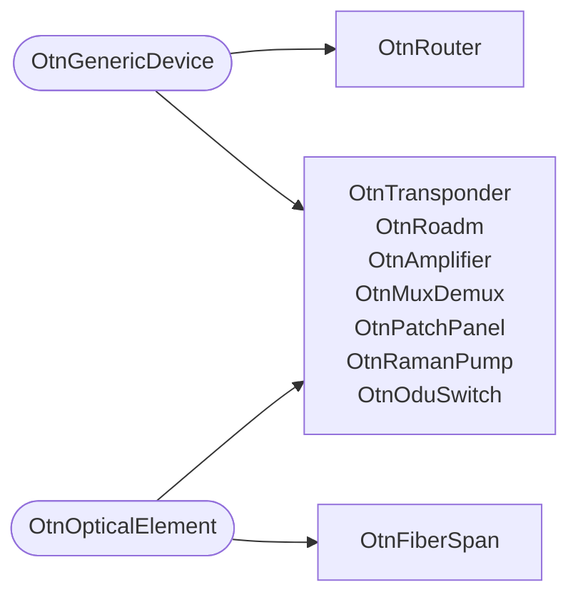

# Schema reference

The OTN schema is forty-four kinds across eight files in `schemas/`. Eight of
them are generics and thirty-six are concrete nodes.

Four of those files define the equipment layer: the generics, the port kinds,
the device kinds, and the site. They are the subject here. The plant, container,
carrier and service layers have their own pages:
[optical plant concepts](./concepts.mdx), [client mapping](./client-mapping.mdx)
and [link budget](./link-budget.mdx).

What follows is what the YAML cannot state for itself: why the generic layer is
shaped the way it is, and why every physical quantity is an integer.

## The files

| File | Holds |
| --- | --- |
| `schemas/otn_base.yml` | The five OTN generics |
| `schemas/otn_ports.yml` | The port kinds, two generics and twelve nodes |
| `schemas/otn_devices.yml` | The eight device kinds |
| `schemas/location.yml` | `LocationGeneric`, vendored, `OtnSite` and `OtnFacility` |

Infrahub loads every file in the directory into one schema, so the split has no
runtime meaning. It is how the source reads and diffs.

## Two generics, not one chain

A device and an optical element are different things, and the schema keeps them
apart on purpose.

- **`OtnGenericDevice`** is anything racked at a site. It has a name, a status,
  a role, a site, and ports.
- **`OtnOpticalElement`** is anything light passes through and loses power in.
  It has an insertion loss, a vendor, a model, and an element class.

Eight device kinds inherit `OtnGenericDevice`. Seven of those eight also inherit
`OtnOpticalElement`, and one kind inherits `OtnOpticalElement` alone. There is
no edge between the two generics:



A single inheritance chain, "optical element is a kind of device", would look
tidier and would be wrong in both directions.

**It would be wrong about the router.** Light terminates at a router. A router
has no insertion loss, so a query for everything that attenuates light must
return seven kinds, not eight. Put the router under a combined chain and the
optical budget starts counting a loss that does not exist.

**It would be wrong about the fiber span.** `OtnFiberSpan` contributes the
largest loss in the network and is not a device. It is not racked, it has no ports, and
it has no site, so it inherits `OtnOpticalElement` alone. A chain that made
every optical element a device would force the span to grow a rack position and
a port list it can never have.

So the two questions get one query each:

- "everything racked here" is a query against `OtnGenericDevice`.
- "everything the budget must sum" is a query against `OtnOpticalElement`.

`OtnOpticalElement` has no relationships and no identity keys, for the same
reason. The span inherits it on its own.

## The generic layer

None of the five OTN generics inherits from another. Infrahub's generic schema
has no `inherit_from` key, so a generic taxonomy cannot be stacked. It is
composed instead: a concrete node lists the generics it needs.

| Generic | Contributes |
| --- | --- |
| `OtnGenericPort` | `name`, `role`, `enabled`, `admin_state`, `oper_state`, the parent `device`, and `connected_to` |
| `OtnGenericDevice` | `name`, `status`, `role`, the `site`, and the `ports` list |
| `OtnOpticalElement` | `insertion_loss_mdb`, `vendor`, `model`, `element_class` |
| `OtnOpticalPort` | `center_frequency_mhz`, `tx_power_mdbm`, `rx_sensitivity_mdbm`, `connector_type` |
| `OtnCopperPort` | `speed_kbps`, `impedance_ohm`, `connector_type` |

Composition is the whole design. `OtnLinePort` is `OtnGenericPort` plus
`OtnOpticalPort`. `OtnTributaryPort` is `OtnGenericPort` plus `OtnCopperPort`.
`OtnRouter` is `OtnGenericDevice` and nothing else.

One inherited attribute is restated, and only to default it. `element_class` is
determined by the kind: an amplifier is an `amplifier`, a span is a
`fiber_span`. Each of the seven concrete kinds that inherit `OtnOpticalElement`
declares it with the matching `default_value`, so no object file writes it.

That restatement has to repeat the ten choices, because overriding an
inherited Dropdown requires the full list, and the server only half enforces
that. Omitting the `choices` key is rejected at load with
`The property 'choices' is required for kind=Dropdown`. A `choices` key holding
nine of the ten loads in silence, and the divergence appears only when an
object tries to write the value the override left out.
`tests/unit/test_schema_contract.py` asserts every override matches the
generic's list, and it is the only thing that does. The tenth choice,
`odu_switch`, cost nine blocks, and the test is what tells you one was missed.

Nothing else is restated. Restating an attribute would let it drift from the
generic, and the drift would break the guarantee that one query against
`OtnGenericPort` returns every port with the same shape.

## Ports

Seven kinds, six optical and one copper.

| Kind | Composes | What it is |
| --- | --- | --- |
| `OtnRouterPort` | generic + optical | Grey optics on an IP router |
| `OtnClientPort` | generic + optical | Transponder client side |
| `OtnLinePort` | generic + optical | Transponder DWDM line side |
| `OtnRoadmAddDropPort` | generic + optical | Local add and drop on a ROADM |
| `OtnRoadmDegreePort` | generic + optical | Line-facing degree, one per direction |
| `OtnAmplifierPort` | generic + optical | Amplifier input or output |
| `OtnTributaryPort` | generic + copper | E1 or T1 G.703 electrical tributary |

There is no management or console port kind. This model covers the transmission
path, and a management port is not on it.

Two behaviours matter before you load data.

**`connected_to` is one edge, not two.** It is declared once on
`OtnGenericPort`, peers `OtnGenericPort`, and pins
`identifier: otn_port__connected_to`. Set it from A to B and B reports A with no
second write. The explicit identifier is what stops Infrahub deriving a
different string per side and splitting the link into two one-way halves. The
identifier is immutable once loaded.

**Port names are unique per device across all seven kinds.** The constraint
`["device", "name__value"]` is declared on the generic, and Infrahub enforces it
over every kind that inherits it. Creating `OtnRouterPort` `dup/1` and then
`OtnTributaryPort` `dup/1` on the same device fails on the second write.

### A line port names the wavelength it terminates

`OtnLinePort.carrier` peers `OtnOpticalCarrier`, cardinality one and optional.
`OtnOpticalCarrier.line_ports` peers back, cardinality many and optional. Both
sides pin `identifier: otn_carrier__line_ports` by hand, for the same reason
`connected_to` pins its own: the string is frozen the moment a load succeeds,
and changing it afterwards costs a remove-and-re-add on both peers. Many on the
carrier side, because a wavelength is terminated at each of its two ends by two
ports on two devices at two sites. Optional on the port side, because a line
port with no colour on it is a legal state: 38 of the 118 in the dataset are
exactly that.

Before this edge existed, the only thing tying a transponder to a wavelength was
that both names carried the same site code. That is a naming convention
doing a relationship's job, and it cannot say which of a site's transponders
carries which of its wavelengths.

Both sides are `kind: Attribute` with `on_delete: no-action`, written out rather
than left to the default.

**Deleting a transponder does not delete the wavelengths it carried.** It does
delete its ports: `OtnGenericDevice.ports` is `kind: Component` with
`on_delete: cascade`, because a port has no meaning apart from the device it
sits in. The deletion stops at the port. A wavelength has two ends, so no single
port owns it, and cascading from Milan would delete the wavelength out from
under the Frankfurt transponder that is still installed and still patched to its
ROADM. A carrier also legally exists with no line ports at all, which is what a
freshly provisioned one is, and a peer whose existence does not depend on the
relationship cannot be cascaded by it. The other direction is plainer still:
cascading from the carrier would mean retiring a service deletes hardware from
the inventory.

What that leaves behind is the point. A lit wavelength nothing terminates is a
real fault, and `no-action` leaves it sitting there, visible and open to a
query, rather than making it vanish along with the transponder whose deletion caused
it.

**The objection, because it gets asked every time: light has direction, so
should the edge?** No, and each half of the answer is separate. A line port is a
transceiver, carrying the transmit and the receive side of the same wavelength,
so one edge already covers both. A cardinality-one cascade would fire from
either end, which gives a wavelength two owners rather than one. And
`OtnOpticalCarrier` holds no direction at all: direction lives on the plant, in
the per-direction amplifier lists on a section, and in the path traversal that
walks them. The model already has a way to say the light stopped, which is
`oper_state` on the port and `status` on the carrier, not deletion.

## Amplification is per direction

Light crosses an optical multiplex section both ways, and an amplifier restores
power in one of them. The section says which, by holding two lists:

| Relationship | Kind | What it holds |
| --- | --- | --- |
| `amplifiers_a2b` | Many, optional | The chain running towards the section's own `roadm_b` |
| `amplifiers_b2a` | Many, optional | The chain running towards its `roadm_a` |

An amplifier has no direction attribute. Which chain it is in is the
relationship holding it, and an attribute restating that would be a second copy
that can disagree with the first. Read from the amplifier's own page, the same
fact is `oms_a2b` or `oms_b2a`: exactly one of the two is set, and which one it
is answers the question.

That costs a relationship. One relationship cannot be the inverse of
two identifiers, so the amplifier needs both. The alternative was giving the
amplifier no section relationship at all and reaching the section by a
server-side filter. That was rejected: an amplifier page is a page an operator
lands on, and "which section and which way" is what it is for.

Both lists stay optional. A section is creatable before its amplifiers exist,
and that reason has not changed.

| Attribute | Kind | What it holds |
| --- | --- | --- |
| `oms_sequence` | Number, mandatory, 1 to 51 | Position in this amplifier's own chain, counting along the direction it amplifies |

A section with N spans holds N+1 amplifiers per chain. `oms_sequence` does two
jobs and both are its own. It orders a chain the relationship has already
identified, so a chain sorted on it is in traversal order and nothing ever
reverses one. And it fixes which member of that chain is which: position 1 is
the booster, position N+1 is the pre-amplifier, and amplifier k feeds span k of
its own walk. A span's `oms_sequence` does the other thing: a span has no
direction, so it is numbered from the A end and stays there.

**`oms_sequence` deliberately has no default.** A default of 1 would let a new
amplifier take a silent position at the head of its chain. It would collide with
the real first amplifier and sort stably into a plausible wrong answer instead
of raising.

It is not unique and cannot be. A uniqueness constraint cannot reference an
optional relationship, and both section relationships have to stay optional.
Rejecting duplicate positions is a test's job.

Nothing on the server enforces how many amplifiers a section holds in either
direction. A query that selects one list and forgets the other gets an empty
chain rather than an error. The budget engine is what refuses it: its rule that
a section of N spans has N+1 amplifiers each way fails for that direction
and names the section. Without that rule the split would have traded a crash for
a plausible wrong number.

## Amplifier names encode nothing a query needs

An amplifier is `amp-<a>-<b>-<NN>`, where the two slugs are the section's own
sites and `NN` is a position. A section of N spans has N+1 amplifier huts
counting from the A end, each holding two amplifiers, and hut k takes ordinals
2k+1 and 2k+2. Frankfurt to Milan is nine spans, so `amp-fra-mil-01` is the
booster at Frankfurt and `amp-fra-mil-20` is the booster at Milan.

The name is an identifier: unique, stable, and encoding nothing a query needs.
Everything it used to say is readable from the schema. Which chain an amplifier
is in is the relationship holding it. Where it sits in that chain is
`oms_sequence`. Whether it is a booster, an inline or a pre-amplifier is the
`role` on its own IN and OUT ports, which reads `booster`, `line` and `preamp`.

Any deterministic naming rule over an ordered set can be inverted. A reader
who learns that ordinals run two per hut can work out which of `amp-fra-mil-01`
and `amp-fra-mil-02` serves which chain. That is unavoidable and it is not the
point. The point is that nothing reads it, so nobody has to know the rule to ask
a question.

## Raman pumps

`OtnRamanPump` is a pump laser that injects Raman gain into one fiber span. It
inherits `OtnGenericDevice` and `OtnOpticalElement`, like every other optical
device kind, and adds four attributes of its own:

| Attribute | Kind | What it holds |
| --- | --- | --- |
| `on_off_gain_mdb` | Number, 0 to 15000 | Received signal power with the pump on, less the same with it off |
| `on_off_gain_display` | Text, read-only | The same figure in dB |
| `injection_end` | Dropdown, mandatory | `site_a` or `site_b`, which end of its span the pump is spliced in at |
| `propagation` | Dropdown, mandatory | `counter` if the laser fires against the signal, `co` if it fires with it |

`span` points at the `OtnFiberSpan` the pump serves and is mandatory. Its
inverse, `raman_pumps`, is declared on the span under the same identifier, and
it is load-bearing twice. A budget walks a section, reaches its spans, and reads
what is on them. Without that side of the edge nothing on the walk can see a
pump. Every pumped span would sum to zero gain, and the check would pass while
reporting a loss the network does not have. The inverse is also what makes the
kind reachable in the interface, since the sidebar names no device kind and a
kind nothing points at cannot be opened at all.

The ceiling on `on_off_gain_mdb` is 15.0 dB rather than 20.0 dB. The smallest
fiber loss on any shipped span is 16.167 dB, so one pump can never reduce a span
to zero loss. It takes two on one span to reach the floor.

### The direction a pump amplifies is worked out, not stored

A pump holds two facts about the hardware: which end of the span it is spliced
in at, and whether its laser fires with the signal or against it. There is no
third attribute naming the direction of travel it amplifies. That is the
answer, and the two facts above compute it:

```text
amplifies A to B  when  (injection_end == site_a) == (propagation == co)
```

Read physically, a counter-propagating pump fires back up the fibre from the far
end. One at the B end therefore amplifies the A to B signal. A co-propagating
pump fires along with the signal from the near end, so one at the A end
amplifies A to B too. Those are two ways of reaching the same answer. There are
four cases in all.

| `injection_end` | `propagation` | Amplifies |
| --- | --- | --- |
| `site_b` | `counter` | A to B |
| `site_a` | `co` | A to B |
| `site_a` | `counter` | B to A |
| `site_b` | `co` | B to A |

Every pump in this network is counter-propagating, so only the first and third
rows occur here. The table shows all four anyway, because a reader who sees only
the shipped cases will assume counter-propagating is the only kind there is.

Storing the conclusion beside its two premises would be a third value that can
contradict them. A counter-propagating pump recorded at the A end and marked
`a_to_b` is a self-contradictory object, and a schema that accepts one will
eventually hold one.

`injection_end` is mandatory and has a default of `site_b`. The default is a
loading device, because a mandatory attribute needs one for the schema to load
at all, and it is not a statement about this network. Every pump in the dataset
writes the value explicitly, and a test says so.

What the pump does to a budget, and where that treatment stops being predictive,
is on the [link budget](./link-budget.mdx) page.

## Regenerators and ODU cross-connects

`OtnOduSwitch` is the eighth device kind. It receives one wavelength, reframes
the payload and originates the next, which is what lets a circuit cross a route
too long for any single wavelength. Two flat generics composed on the concrete
node, the same shape `OtnMuxDemux` uses.

| Attribute | What it says |
| --- | --- |
| `switching_mode` | `regenerator` carries the whole payload across without looking inside it. `cross_connect` demultiplexes to containers and regroups them, which is what lets the two segments carry different clients. |
| `framing_latency_ns` | What the junction charges for reframing. Nanoseconds as an integer, the unit `fec_latency_ns` and `latency_ns` already use. |
| `carriers` | The wavelengths this device terminates. Many, optional. |

It inherits `OtnOpticalElement` because `OtnPathHop.element` peers that generic,
and a segment's route has to be able to name the device it terminates on.

**Its insertion loss belongs to one side only.** `insertion_loss_mdb` arrives
with the generic and applies to the **incoming** segment. The device terminates
the light rather than passing it through, so the outgoing segment starts at a
transmitter and not at an attenuated signal. That asymmetry is why the loss
cannot be added into one total spanning both segments. It is the schema-level
reason a regenerated circuit has a margin per segment rather than one figure.

**`carriers` is not what finds the chain, and that was measured.** The
relationship says which wavelengths a device terminates, and
`src/infrahub_demo_otn/chains.py` reads it to evaluate a junction. The two
wavelengths must meet at a site, that site must host the device, and the device
must terminate both. A device-to-device traversal over this edge alone returns
zero paths, because a ROADM has no edge to a carrier. Widening the filter until
one is reachable brings the intended chain back among 65 paths. Of those, 48 are
two carriers meeting on a shared section with no device between them at all, and
removing this edge from the filter changes none of that. The graph does not
constrain the junction, so the predicate is explicit in Python and the cover is
unit tested against a pinned expectation.

**A device with an empty `carriers` contributes no junction.** That is the
correct reading of a racked but unpatched device, and it needs no special case.

### The three the dataset ships

| Device | Site | Mode | Framing delay |
| --- | --- | --- | --- |
| `oeo-fra-01` | Frankfurt | `regenerator` | 3000 ns |
| `oxc-fra-01` | Frankfurt | `cross_connect` | 5000 ns |
| `oxc-mil-01` | Milan | `cross_connect` | 5000 ns |

The two sites were measured rather than chosen. Every one of the 40 shipped
wavelengths crosses `oms-fra-mil`, so 37 of them terminate at Milan and 25 at
Frankfurt, and no third site reaches double figures. The regenerator is at
Frankfurt because that is the only split of Madrid to Warsaw that closes, which
the [link budget](./link-budget.mdx#madrid-to-warsaw-where-one-regenerator-is-not-enough)
page has in full.

Each of the three names at least one wavelength. An inert device would load
cleanly, never be a junction, and read as a capability the demo does not have.

`element_class` gained a tenth choice, `odu_switch`, when the first object forced
the decision. None of the original nine names an O-E-O device. The alternative
was defaulting to `transponder` or `roadm`, which puts a false value on the one
attribute that says what a device is. Nothing in the repository reads
`element_class`, so a wrong label costs nothing mechanically and is only untrue
in the data, which is the whole argument for paying for the tenth choice. The
choice cost nine blocks: the generic, the seven overrides, and the pinned list in
`tests/unit/test_schema_contract.py`. A block missed is a dropdown that offers
different options depending on the kind you look at, and the server accepts that
in silence.

## Devices and sites

`OtnGenericDevice.site` points at `OtnSite` and is optional. It is an
`Attribute` relationship rather than a `Parent` one, because a `Parent`
relationship is mandatory and a device has to be creatable before its site
record exists.

`OtnSite` inherits `LocationGeneric`, vendored from the published
`opsmill/schema-library` location file. Only the generic is taken. The upstream
file also defines a hosting node that peers a competing device hierarchy, which
this repository does not use. `OtnSite` adds `latitude_microdeg` and
`longitude_microdeg`.

The inverse `devices` relationship is declared directly on the `Site` node in
`schemas/location.yml`, peering `OtnGenericDevice` under the identifier
`otn_site__devices`. The location layer therefore names the OTN device layer,
and the two files load as one payload for that reason.

### `OtnFacility` is an edge, and used to be a prefix on a tag name

`OtnFacility` records a supercomputing facility hosted at a PoP. Six of the
fourteen PoPs host one; the other eight host none, which is why both sides of
`otn_site__facility` are optional. Cardinality is one on both sides, because no
site in the modelled network hosts two. Widening that later is a migration a
reader can see coming; narrowing it is not.

Until it existed, the only record that a site hosted a facility was the text
after `eurohpc-` in a `BuiltinTag` name, sliced back out by a helper duplicated
in `transforms/network_map.py` and `transforms/odu_map.py`. That defence for it
was half right: it read a tag, not a device, and nothing in this repository
recovers an amplifier, a ROADM or a router from a name.

The half that was wrong is what moved it. **The failure was silent in both
directions**, and both were measured on a throwaway branch rather than argued.
Renaming `eurohpc-vega` to `hpc-vega` dropped Vega from both maps and raised
nothing anywhere. Attaching a mistyped `eurohpc_deucalion` to Geneva created a
facility that no map draws and no check reports.

`name` is the tag suffix and has to stay it: `mapchrome.py` upper-cases the
value for the caption on the node disc, and the committed reference render
holds the upper-cased suffix. So `marenostrum-5`, not `MareNostrum 5`. The
readable form lives in `description`, which is the thing a tag could never
carry.

The six `eurohpc-` tags are still on their sites. They are data an operator
wrote, and nothing reads them back.

### `site_type` keeps "the PoPs" a filter

`OtnSite.site_type` is a mandatory dropdown with two values, `pop` and
`customer`, defaulting to `pop`. The loaded network has fifteen sites: fourteen
PoPs and one customer campus, Amsterdam Science Park, reached over an 18.4 km
coarse tail.

The attribute exists so that "the PoPs" is a query rather than a number in a
paragraph. Before it, every statement about the core said fourteen, and the
first site that was not a PoP made all of them wrong at once. A report that
means the core now filters on `site_type: pop` and stays correct through the
next customer endpoint.

It also does one job nothing else can. The guard in
`tests/unit/test_geant_dataset.py` reads `customer` as its discriminator and
refuses an `oms` on any span touching such a site. That refusal is what keeps a
coarse tail out of the optical budget engine, which would price it at a 1550 nm
attenuation coefficient. See [optical plant concepts](./concepts.mdx) for the
size of the error.

### `OtnCwdmChannel` and `cwdm_channels`

`OtnCwdmChannel` is the ITU-T G.694.2 coarse wavelength plan: eighteen entries
at 20 nm spacing from 1271 to 1611 nm, with two attributes and no more. The
standard defines a coarse channel by its nominal central wavelength and gives it
nothing else, so there is no name, no channel number and no frequency to store.
Its `human_friendly_id` is the wavelength, and the display label renders
`1471 nm`.

`band` is stored rather than computed, for the same reason a port's centre
frequency is stored. "Which coarse wavelengths could an erbium amplifier reach"
is then a GraphQL filter instead of a Python loop over eighteen rows. The
redundancy is covered by a guard test that recomputes all eighteen wavelengths
and all eighteen bands from `units.py`, so the file cannot drift from the code.

`OtnCwdmChannel` inherits nothing. Light does not pass through a plan entry, it
passes through the multiplexer that selects one, so the multiplexer is the
optical element and the plan entry is reference data.

`OtnMuxDemux.cwdm_channels` is the edge between them, optional and many. It says
which coarse wavelengths a multiplexer lights, which is a property of the device
rather than of the plan. The network loads sixteen multiplexers and only the two
on the coarse tail have a non-empty list. The relationship is also what makes
`OtnCwdmChannel` reachable from another kind, which the sidebar reachability
test in `tests/unit/test_menu.py` requires.

### One rule for the one-sided relationships

Several relationships in the model point one way. One rule decides whether each
gets an inverse, written once in the header of `schemas/otn_plant.yml`:

> Declare the inverse when the peer is a page an operator lands on and the
> reverse list is what that page is for. Otherwise the reverse direction is a
> server-side filter on the forward side, which costs nothing and does not
> duplicate the fact.

Six qualify and have one, each declared on the node it belongs to. A site reads
the fiber spans terminating on it; a ROADM reads the sections it terminates; a
channel reads the carriers holding it and a mode reads the carriers using it.
`OtnService.endpoint_a` and `endpoint_z` do not, and the reason is structural.
Their peer is a generic, so the inverse would have to sit on `OtnGenericDevice`
in the base file and make the base layer depend on the service layer.

Every inverse reuses the identifier its forward side already declares. That is
what makes it read the edges already in the graph instead of an empty list, with
no migration. An inverse under a new identifier reads nothing and looks broken.

## Every quantity is a scaled integer

Infrahub has no `Float` attribute kind. `Number` is an integer, and `JSON` is
not filterable, not sortable, and not usable in a computed attribute. So every
physical quantity is stored as an integer scaled by a fixed factor, with the
unit in the attribute name.

| Suffix | Unit stored | Scale | Example value | Means |
| --- | --- | --- | --- | --- |
| `_mdb` | millidecibel | 1 dB = 1000 | `250` | 0.25 dB |
| `_mdbm` | milli-dBm | 1 dBm = 1000 | `-28000` | -28.0 dBm |
| `_mhz` | megahertz | 1 THz = 1000000 | `193700000` | 193.7 THz |
| `_kbps` | kilobit per second | 1 Mbps = 1000 | `2048` | E1, 2.048 Mbps |
| `_ohm` | ohm | none, already whole | `120` | 120 ohms |
| `_microdeg` | millionth of a degree | 1 degree = 1000000 | `52379189` | 52.379189 degrees |

The rate suffix is `_kbps` and not `_mbps` for a reason. E1 is 2.048 Mbps and T1
is 1.544 Mbps. Rounded to whole megabits both become 2, and the two signals the
copper generic exists to carry stop being distinguishable.

Every scaled attribute declares both a minimum and a maximum. A value outside
the range is rejected at write time with an HTTP 422, so a bad number never
reaches the budget engine:

```text
99000 is higher than the maximum allowed value 30000 at tx_power_mdbm
185000000 is lower than the minimum allowed value 191350000 at center_frequency_mhz
```

`src/infrahub_demo_otn/units.py` holds every scale factor and every conversion.
No scale factor may be written inline anywhere else.

### Display attributes

A scaled attribute that appears in the user interface has a paired read-only
`_display` attribute that renders engineering units. Four of them are on the
generics, so every kind composing those generics gets them.

| Attribute | Display attribute | Renders |
| --- | --- | --- |
| `insertion_loss_mdb` | `insertion_loss_display` | `0.25 dB` |
| `center_frequency_mhz` | `center_frequency_display` | `193.7 THz` |
| `tx_power_mdbm` | `tx_power_display` | `1.0 dBm` |
| `rx_sensitivity_mdbm` | `rx_sensitivity_display` | `-28.0 dBm` |

Three more sit on the device kinds that need them: `noise_figure_display` and
`gain_display` on `OtnAmplifier`, and `on_off_gain_display` on `OtnRamanPump`.

Read-only here is stronger than greyed out. A `_display` attribute is absent
from the generated `...UpdateInput` type. Writing to one is a GraphQL schema
error rather than a permission error:

```text
Field 'tx_power_display' is not defined by type 'OtnLinePortUpdateInput'
```

Scaled attributes that do not appear in the interface get no display attribute.

### The one inline divisor

Each display attribute is a Jinja2 template, and the template engine cannot
import Python. A template therefore has to include its own divisor:

```jinja
{{ tx_power_mdbm__value / 1000 }} dBm
```

That is the single exception to the "no inline scale factors" rule, and it is
machine-checked. `tests/unit/test_schema_contract.py` extracts the divisor from
every display template and asserts it equals the matching constant in
`units.py`. A template that drifts from the module fails the unit suite, which
is what bounds the exception.

## Monitors

A monitor is the interface a device reports its own last-known readings on.
There are five kinds, one per family of equipment, and each declares the
readings its hardware can take:

| Kind | Readings |
| --- | --- |
| `OtnAmplifierMonitor` | `input_power_mdbm`, `output_power_mdbm`, `measured_gain_mdb`, `tilt_mdb` |
| `OtnRoadmDegreeMonitor` | `total_power_mdbm`, `channel_count` |
| `OtnMuxDemuxMonitor` | `total_power_mdbm`, `channel_count` |
| `OtnRamanMonitor` | `pump_power_mdbm`, `measured_gain_mdb`, `back_reflection_mdb` |
| `OtnReceiverMonitor` | `rx_power_mdbm`, `measured_osnr_mdb`, `pre_fec_ber_ppb`, `q_factor_mdb`, `cd_fs_per_nm`, `dgd_fs` |

Five kinds rather than one, because the readings barely overlap. Of the
fourteen readings in the model, eleven appear on exactly one family. The names
suggest more sharing than there is: `input_power_mdbm`, `total_power_mdbm`,
`pump_power_mdbm` and `rx_power_mdbm` are four different measurements that
happen to have "power" in four different names. Three readings are shared, and
only in two pairs: `measured_gain_mdb` between an amplifier and a Raman pump,
and `total_power_mdbm` and `channel_count` between a ROADM degree and a
multiplexer.

At that separation the schema can say the whole thing itself. Every reading is
mandatory, so the server refuses a monitor that is missing one. And a kind has
no field at all for a reading its hardware cannot produce. The server refuses
that too:

```text
measured_osnr_mdb is not a valid attribute or relationship for OtnAmplifierMonitor
tilt_mdb is mandatory
```

Both halves, on every write path, rather than inside a proposed change. A
coherent receiver's signal processor computes OSNR; an amplifier measures power.
An amplifier monitor reporting OSNR would be a number the device cannot take,
and now there is nowhere to put it.

### Two shared generics

`OtnMonitor` declares `measured_at` and nothing else. It is the one fact every
monitor shares, and it is mandatory, because a reading nobody can age is not
evidence. This is a last known value, not a telemetry feed.

`OtnChannelMonitor` declares `total_power_mdbm` and `channel_count`. A ROADM
degree and a multiplexer report exactly those two, so they are declared once
rather than twice. The kinds stay separate, because a degree and a multiplexer
are different equipment and "show me the multiplexer monitors" should stay a
question about a kind. It also leaves room for the two to diverge later, which
is what a real degree monitor and a real multiplexer monitor eventually do,
without a migration on loaded data.

Neither generic inherits the other. Generics do not inherit generics in
Infrahub, so both are flat and each concrete kind composes them alongside
`OtnGenericPort`, which is where identity, state and the parent device come
from. `OtnAmplifierPort` already uses that shape for two generics; the channel
monitors use it for three.

A bit error rate is held in parts per billion so it stays an integer: 2.1e-3 is
2100000. That follows the same rule as every other quantity here.

### What the schema still cannot say

Nothing stops a receiver monitor from being attached to an amplifier.
`OtnGenericPort.device` peers `OtnGenericDevice`, and a concrete kind cannot
narrow the peer of a relationship it inherits. Infrahub 1.11.0 rejects the
attempt from either end, before any data is loaded:

```text
ProbeAmpPort's relationship device inherited from ProbeGenericPort
must have the same peer (ProbeGenericDevice != ProbeAmp)
```

The remaining option would be a Python check, which is the layer these five
kinds exist to leave. So the gap is accepted and stated rather than hidden.
Nothing in the shipped network creates a mismatched pair, and the
generator that writes the monitors is the only thing that ever creates one.

## The six reason codes and the signature beside them

A refused service carries its verdict in three attributes on `OtnService`, and
none of them is a parsed string. `rejection_code` is a `Dropdown`,
`rejection_detail` is `Text` capped at 512 characters, and `refusal_accepted` is
a `Boolean`. Together they replace one free-text field that held
`"{code}: {detail}"` and that two transforms had to split apart,
`transforms/service_trace.py` and `transforms/ai_latency.py`.

| Code | Label | Colour | What it means |
| --- | --- | --- | --- |
| `no-route` | No route | grey `#9e9e9e` | No path exists between the two endpoints. |
| `no-mode` | No mode | grey `#757575` | No transponder mode meets the requested rate. |
| `budget` | Optical budget | red `#f44336` | A route exists and the OSNR margin is negative on all of them. |
| `latency` | Latency budget | red `#b71c1c` | A route exists and every one of them is slower than the service allows. |
| `capacity` | No spectrum | amber `#ff9800` | A route exists and no channel on it is free. |
| `no-slots` | No tributary slots | amber `#ffb74d` | A wavelength was found and its containers have no room for the client. |

**The colour grouping is information, not decoration.** The two greys mean the
request was unanswerable, the two reds mean the physics refused a route that
exists, and the two amber codes mean the network is full. An operator reading a list
of refusals learns from the colour alone whether to re-plan the request, to
regenerate the circuit, or to build more network. A string field carried none of
that.

**Negative result: only two of the six appear in practice today.** Every refusal
the demo produces is `no-slots` or `budget`. The other four are reachable in
principle, and no shipped scenario reaches them. `capacity` needs a route whose
spectrum is full while its containers are not, and the saturated corridor closes
both layers at once. `no-route` and `no-mode` need a request the topology and
the mode catalog cannot answer at all, and both are answerable for every pair of
sites in the dataset. They are in the schema because the generator writes them,
not because a demo scenario shows them.

**The choices are the Python constants, and a test says so.** All six live in
`routing.py`, including `no-slots`, whose only writer is
`generators/optical_service.py`.
`tests/unit/test_schema_contract.py` asserts the six schema names equal the six
constants, because a code added to one and not the other fails at write time on a
live branch and nowhere earlier. Two neighbouring constants in `routing.py`,
`CHANNEL_NO_SPECTRUM` and `CHANNEL_NO_BLOCK`, look like reason codes and are
detail text. They are deliberately not choices.

**`refusal_accepted` is `optional: false` with `default_value: false`**, and that
pairing is what made it safe to add to a kind that already had rows. Mandatory
with no default fails validation against every existing service and blocks the
whole schema update. The default lands `false` on all of them, which is the
correct reading of every service written before the flag existed.

Only a person ever sets it to `true`. The generator may clear it, and only on the
path where it provisions the service. See
[the gate and the escape hatch](./concepts.mdx#a-refusal-is-an-answer-and-it-does-not-merge-unless-somebody-signed-for-it)
for why both halves of that rule are load-bearing.

The free-text `rejection_reason` these three replaced was deleted from the YAML
outright rather than retired with `state: absent`. The dataset here is generated
and reloads in one command, so the graph catches up on `uv run invoke init` and a
retired declaration would be pure reading cost. `state: absent` is the right
answer for a graph that has to survive the change, and this one does not.

**So an instance loaded before this change needs `uv run invoke init` re-run, and
that is not optional.** A deleted declaration is not a migration. The attribute
stays on every service already in the graph until the schema is loaded again, and
until then the three attributes above do not exist there at all. A check reading
`status` and a transform reading `rejection_code` are both querying fields the
running instance has never heard of. Reloading is the whole migration, and it is
one command because the dataset is generated.

## Two deliberate absences

Both are load-bearing.

**A router contributes no insertion loss.** `OtnRouter` inherits
`OtnGenericDevice` only. It has no `insertion_loss_mdb`, and it is not returned
by a query against `OtnOpticalElement`. Light terminates at the router, so there
is nothing to attenuate. Adding the generic to make the device list look uniform
would break the query the optical budget depends on.

**A grey router port has no centre frequency.** `center_frequency_mhz` is
optional because a grey port is not on the C-band grid at all. When it is unset,
`center_frequency_display` renders an empty string. It does not raise inside the
template engine, and it does not block the save. An empty frequency on a router
port is the correct reading, not missing data.

## Menu and navigation

`menus/otn.yml` defines the sidebar. Five top-level entries and thirteen leaves:

| Entry | What is under it |
| --- | --- |
| OTN Sites | The fourteen PoPs and the customer campus. A leaf, because it is where you start |
| OTN Services | Services, optical carriers |
| OTN Plant | Devices, fiber spans, optical multiplex sections, conduits |
| OTN Catalog | Frequency grid, CWDM plan, optical modes, fiber types, client signals |
| OTN Reports | Service traces |

**Both wavelength plans are in the catalog.** The dense grid and the coarse plan
are two entries side by side, so an engineer opening the catalog finds both. The
alternative is reaching a wavelength plan by first opening a multiplexer, which
is a route nobody guesses.

Devices opens on the generic kind, so one click gives all eight device kinds.

The sidebar names no port kind and no individual device kind, because the object
pages already reach them. A site page lists the devices at the site; a device
page lists its ports; an optical path lists its hops; a carrier lists its
containers. An entry for "Patch panels" is a second route to a place you were
already going to arrive at.

**A site page lists the fiber terminating on it in two lists,** one for each
end: "Fiber spans (A end)" and "Fiber spans (B end)". Frankfurt reads 16 and 24,
and the 40 spans that touch it are the union. `site_a` and `site_b` are two
relationships under two identifiers, so their inverses are two lists; merging
them would lose the end each span terminates on.

Every generic and node in this schema sets `include_in_menu: false`. Custom
menus and the auto-generated per-kind sidebar are additive and do not
deduplicate, so without it each kind would appear twice.

A menu load is additive in the same way. `uv run invoke load-menu` deletes the
existing OTN menu items before loading, so the file is the sidebar rather than
an addition to it. Loading with `infrahubctl` directly gives a server the union
of the file and whatever it had, which makes a shorter file produce a longer
sidebar.

## Loading and checking the schema

```bash
uv run invoke schema-check
```

The offline gate. It checks schema formatting and needs no running Infrahub.
There is no schema-validate subcommand.

```bash
uv run invoke load-schema --branch otn-schema
```

Loads `schemas/` onto a branch. Into a deployment that already holds objects,
load onto a branch rather than onto `main`, so the change arrives through a
proposed change with a diff to read.

```bash
uv run invoke test-unit
```

Runs the contract tests that guard the rules a formatter cannot see: no `Float`,
no `JSON`, and both bounds on every scaled number. It also guards a unit suffix
on every quantity, the four display attributes present and read-only, and no
generic inheriting from another generic.
