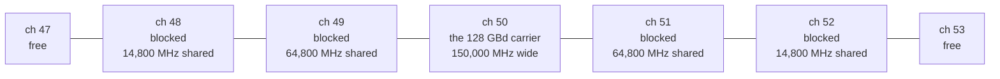
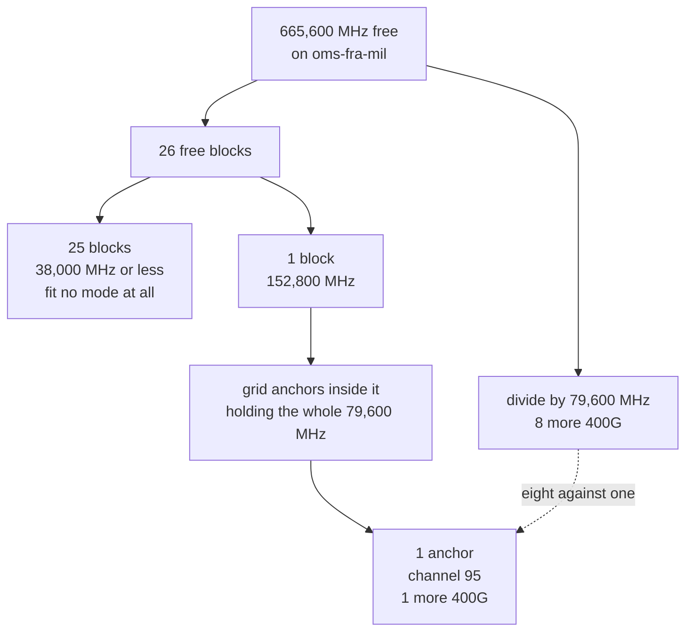

# Spectral model

A wavelength occupies a width of spectrum, not a channel number. It is centred on
the frequency its anchor names, and it holds that width for the whole
length of every section it crosses. Everything on this page follows from that one
sentence, including the parts of it that are uncomfortable.

The demo used to count anchors. Under that model the Frankfurt to Milan corridor
read "96 channels, 71 occupied, 25 free", and all three numbers were wrong. At
their real widths those 71 carriers need 7,306,000 MHz on a section that has
4,800,000 MHz, 52 percent oversubscribed. The collision check reports 91
overlapping pairs against that plan. The shipped dataset now holds 40 carriers
and fits.

## The width a carrier occupies

```text
occupied_width_mhz = round(baud_mbaud x (1 + 0.1)) + 9,200
```

Integer arithmetic, in megahertz, in `src/infrahub_demo_otn/units.py`, which is
the only file in the repository allowed to hold a scale factor. Every consumer
calls `occupied_width_mhz` and none of them recomputes it.

| Mode | Symbol rate | Occupied width |
| --- | --- | --- |
| `DP-QPSK 32GBd 100G`, `DP-16QAM 32GBd 200G` | `32 GBd` | 44,400 MHz |
| `400ZR` | `59.84 GBd` | 75,024 MHz |
| `OpenZR+ 200G`, `OpenZR+ 300G`, `OpenZR+ 400G` | `60.14 GBd` | 75,354 MHz |
| `DP-16QAM 64GBd 400G`, `DP-64QAM 64GBd 600G` | `64 GBd` | 79,600 MHz |
| `800ZR` | `118 GBd` | 139,000 MHz |
| `DP-QPSK 128GBd 400G` | `128 GBd` | 150,000 MHz |

**Roll-off 0.1** is the root-raised-cosine shaping factor coherent DWDM
transponders use, and it is the figure OpenROADM and vendor literature quote for
modern flexible-rate line cards.

### What one carrier takes out of the grid

A carrier is named by one channel number and occupies several channels' worth of
spectrum. `DP-QPSK 128GBd 400G` anchored on channel 50 runs from 193,725,000 to
193,875,000 MHz, which is exactly the slots of channels 49, 50 and 51.

Ask where a `DP-16QAM 64GBd 400G` carrier may anchor beside it, and the answer is
not "anywhere except 50".



Channels 48 and 52 are two grid positions clear of the anchor and still overlap
it. One carrier removes five anchors, and a check comparing channel numbers would
see none of that. `checks/channel_collision.py` compares intervals for this
reason.

### The guard band is fitted to one anchor, and it misses the second

**9.2 GHz has no clean citation and this page is not going to pretend otherwise.**
It was chosen because it lands `128 GBd` on exactly 150.0 GHz, which is a published
flexgrid media-channel width. That is one anchor.

Checked against a second published width, the model comes off worse. A real
deployment allocates 87.5 GHz to a `64 GBd` carrier. This model gives it 79.6 GHz,
**7.9 GHz under**. So the model is slightly optimistic at `64 GBd`, and since 22 of
the 40 shipped carriers ride a `64 GBd` mode, the optimism is not a corner case. A
deployment planner reading a section as 86.1 percent full here would find it
fuller in the field.

### What moves if the guard band moves

| Guard band | `128 GBd` width | Consequence |
| --- | --- | --- |
| 9.2 GHz | 150.0 GHz | Lands exactly on the published media-channel width |
| 10 GHz | 150.8 GHz | Over it, so a 150 GHz media channel no longer holds one |

**`128 GBd` sits precisely on a boundary.** At 9.2 GHz it is 150.000 GHz, not
149.9 and not 150.1, so any change to the guard in either direction changes what
fits on a section. The guard band is the most sensitive constant in this feature
and the least defensible, which is why it is written out here rather than left in
a docstring.

## The band, edge to edge

| Figure | Value | What it measures |
| --- | --- | --- |
| Centre to centre | 4,750,000 MHz | Channel 1's centre to channel 96's centre, 191.35 to 196.10 THz |
| Edge to edge | 4,800,000 MHz | 191.325 to 196.125 THz, which is 96 slots of 50 GHz |

Width semantics need the second figure. Using 4,750,000 where 4,800,000 belongs
silently loses one channel of capacity, and the loss looks like a rounding error
rather than a bug. `units.py` names both and says which is which.

The `OtnOpticalPort.center_frequency_mhz` bounds of 191,350,000 to 196,100,000
are centre-based and stay correct for a port's centre frequency. No schema change
was needed.

## Anchors are quantised, and that is the whole finding

A carrier's centre may only sit on one of the 96 grid positions. A carrier is
therefore usable only when its **whole width** fits inside a **single** free
block with a grid position at that block's centre. Free megahertz divided by
carrier width counts fragments no anchor can reach into.

On the shipped dataset, `oms-fra-mil` measures:

| Figure | Value |
| --- | --- |
| Occupied | 4,134,400 MHz of 4,800,000, 86.1 percent |
| Free | 665,600 MHz |
| Free blocks | 26 |
| Anchors that can take another 400G | **1**, channel 95 |
| Free spectrum divided by carrier width | 8 |

**Eight against one.** That gap is the single most important number this model
produces. Counting free spectrum overstates capacity whenever anchors are
quantised onto a grid, and the overstatement grows as the plan fragments.



The left branch is the answer a spreadsheet gives. The right branch is the answer
the model gives. Two steps decide it, and the spreadsheet skips both. A free
block has to be wide enough for the whole carrier, and it has to have
a grid position far enough from its own edges to centre that carrier on.

### What does not fit, and why

The 665,600 MHz free on that corridor breaks down like this:

| Block width | How many | Fits |
| --- | --- | --- |
| 152,800 MHz | 1 | Every mode in the catalog |
| 38,000 MHz | 1 | Nothing |
| 35,200 MHz | 1 | Nothing |
| 20,400 MHz | 21 | Nothing |
| 5,600 MHz | 2 | Nothing |

**Twenty-five of the twenty-six blocks fit no mode at all.** The narrowest mode
in the catalog is `DP-QPSK 32GBd 100G` at 44,400 MHz, and the widest block below
the top one is 38,000. Naming that is the point of the table: a free-megahertz
total hides fragmentation, and fragmentation is a capacity finding in its own
right. The answer to it is a rewrite of the anchor plan, which is different
work from buying more spectrum.

The report says which of the two problems it hit. A block too narrow for any
mode is a spectrum problem. A block wide enough with no grid position inside it
is a fragmentation problem. Collapsing them into one "no" sends an operator
looking in the wrong place.

### The anchor range narrows as the mode widens

Channels 1 and 96 cannot anchor a 400G carrier. Centring 79,600 MHz on channel 1
puts the lower edge 14,800 MHz below the bottom of the band, and 150,000 MHz is
worse.

| Mode | Width | Usable anchors on an empty section |
| --- | --- | --- |
| `DP-QPSK 32GBd 100G` | 44,400 MHz | 96, channels 1 to 96 |
| `DP-16QAM 64GBd 400G` | 79,600 MHz | 94, channels 2 to 95 |
| `DP-QPSK 128GBd 400G` | 150,000 MHz | 94, channels 2 to 95 |

Both 400G modes fit flush on channel 2 and channel 95: at `128 GBd`, channel 2's
lower edge is 191,325,000 MHz, exactly the bottom of the band.

This shows up on the emptiest route in the demo. Provision Berlin to Amsterdam
over Hamburg, where no wavelength exists at all, and the carrier lands on
**channel 2, not channel 1**. There is nothing wrong with the route and nothing
in the way. The grid is not the capacity.

## Reading it off a branch

```bash
uv run invoke demo-capacity --branch probe
```

The capacity report gives, per section, the occupied and free megahertz, the free
blocks with their edges, the anchors that can take another 400G, and a sentence
saying which of the three answers applies. It also includes two standing notes. A
route's free spectrum is the band minus the union of its sections' occupancy, and
is never wider than the narrowest section. Free spectrum overstates capacity
because anchors are quantised.

`checks/channel_collision.py` is the gate. Two carriers no longer have to share
an anchor to collide: a `128 GBd` carrier reaches three grid positions either side
of its own centre, so the check compares intervals. It also refuses a carrier
whose width crosses a band edge, which is the rule that makes channels 1 and 96
unusable for a 400G mode rather than merely unattractive.

## Where the numbers live

| File | What it holds |
| --- | --- |
| `src/infrahub_demo_otn/units.py` | The roll-off, the guard band, the two band edges, `occupied_width_mhz`, `carrier_interval_mhz` and `free_blocks` |
| `src/infrahub_demo_otn/plant.py` | The occupancy map, built from a carrier's anchor and its mode's symbol rate |
| `src/infrahub_demo_otn/routing.py` | `fitting_channels`, which is what turns free blocks into usable anchors |
| `transforms/capacity_view.py` | The report the capacity scenario prints |
| `checks/channel_collision.py` | Overlap and band-edge refusal |
| `tests/unit/test_units.py` | One assertion per mode, so a change to either constant cannot pass silently |

No file under `src/` imports `infrahub_sdk`, so every figure on this page is
reproducible with no server running.
