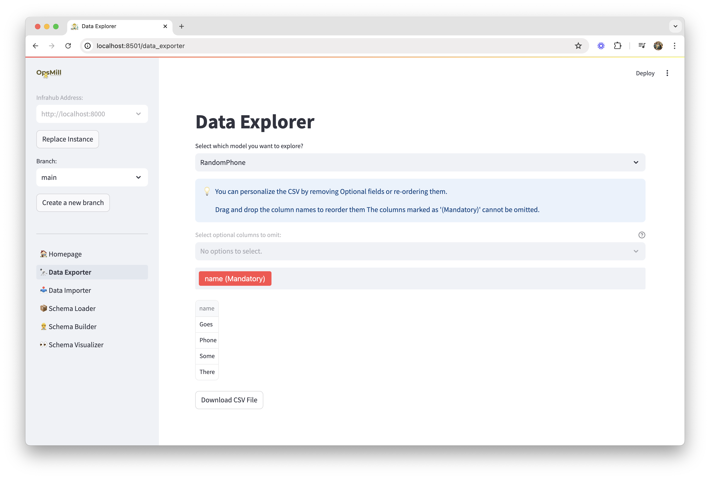

import Tabs from '@theme/Tabs';
import TabItem from '@theme/TabItem';

Emma provides powerful tools for importing data into Infrahub from CSV files and exporting Infrahub data back to CSV format. This enables efficient migration from existing systems and data sharing between tools.



## Data import

The Data Importer allows you to upload CSV files and map their columns to Infrahub schema attributes, enabling you to bulk-load infrastructure data.

### Supported file formats

- **CSV files** with headers
- **UTF-8 encoding** (recommended)
- **Common delimiters**: comma, semicolon, tab
- **File size**: Up to 100MB per upload

### Import process

#### Step 1: Prepare your data

Ensure your CSV file:

- **Has column headers** that roughly match your schema attributes
- **Contains clean data** with consistent formatting
- **Includes required fields** as defined by your schema
- **Uses consistent values** for relationships and enums

**Example CSV structure:**

```csv
name,model,serial_number,location,ip_address,status
switch-01,Cisco 3850,FCW2140L0EF,datacenter-1,192.168.1.10,active
switch-02,Cisco 3850,FCW2140L0EG,datacenter-1,192.168.1.11,active
```

#### Step 2: Upload and map

1. **Select your CSV file** using the file upload interface
2. **Choose the target schema** from your Infrahub instance
3. **Map CSV columns** to schema attributes using the dropdown selectors
4. **Configure relationship handling** for foreign key references
5. **Set data validation options** like duplicate handling

#### Step 3: Preview and validate

Emma provides a preview showing:

- **Mapped data** - How your CSV data will appear in Infrahub
- **Validation results** - Any data quality issues or constraint violations
- **Relationship resolution** - How foreign keys will be resolved
- **Import statistics** - Number of records to be created/updated

#### Step 4: execute import

After reviewing the preview:

1. **Confirm the import** if everything looks correct
2. **Monitor progress** through the real-time status updates
3. **Review results** including success/failure counts and any error details

### Advanced import features

<Tabs>
<TabItem value="relationships" label="Relationship Handling" default>

Emma intelligently handles relationships between objects:

**By Name/ID Lookup:**

- Reference existing objects by name or ID
- Automatic resolution of relationship targets
- Error reporting for unresolved references

**Nested Object Creation:**

- Create related objects inline during import
- Support for hierarchical data structures
- Maintains referential integrity

**Example:**

```csv
device_name,interface_name,ip_address,vlan_name
switch-01,GigabitEthernet1/0/1,192.168.1.10,production
switch-01,GigabitEthernet1/0/2,192.168.1.11,management
```

</TabItem>
<TabItem value="validation" label="Data Validation">

Emma validates data during import:

**Schema Validation:**

- Required field checking
- Data type validation
- Format validation (IP addresses, emails, etc.)
- Enum value verification

**Business Rules:**

- Uniqueness constraints
- Custom validation rules
- Cross-field dependencies

**Error Handling:**

- Detailed error reporting
- Skip invalid records option
- Partial import support

</TabItem>
<TabItem value="performance" label="Performance Options">

For large datasets:

**Batch Processing:**

- Configurable batch sizes
- Memory-efficient processing
- Progress tracking

**Incremental Updates:**

- Update existing records
- Insert new records only
- Upsert functionality

**Parallel Processing:**

- Multiple worker threads
- Optimized for large files
- Automatic resource management

</TabItem>
</Tabs>

## Data export

The Data Exporter extracts data from Infrahub and formats it as CSV files for use in other tools or for backup purposes.

### Export options

#### Schema-based export

Export all objects of a specific schema type:

1. **Select schema** from your Infrahub instance
2. **Choose attributes** to include in the export
3. **Configure relationship handling** (include related object details)
4. **Set filtering criteria** to limit exported records

#### Query-based export

Export data using custom filters:

- **Field filters** - Filter by specific attribute values
- **Date ranges** - Export data from specific time periods
- **Relationship filters** - Filter based on related object properties
- **Complex queries** - Combine multiple filter criteria

#### Bulk export

Export multiple schema types in a single operation:

- **Related schemas** - Export parent and child objects together
- **Dependency order** - Automatic ordering for reimport compatibility
- **Consistent snapshots** - Ensure data consistency across exports

### Export formats

Emma supports multiple CSV format options:

**Standard CSV:**

- Comma-separated values
- Header row with attribute names
- UTF-8 encoding

**Customizable Format:**

- Custom delimiters
- Quote character options
- Line ending preferences
- Character encoding selection

**Relationship Handling:**

- Flatten relationships into columns
- Include relationship IDs
- Export related object details

### Advanced export features

#### Incremental export

Export only changes since last export:

- **Timestamp-based** - Export records modified after a specific date
- **Change tracking** - Export based on Infrahub's change tracking
- **Delta exports** - Include only modified fields

#### Scheduled exports

Configure automated exports:

- **Recurring schedules** - Daily, weekly, monthly exports
- **Event-triggered** - Export on data changes
- **Multiple formats** - Generate different exports for different consumers

## Data quality and validation

### Import validation

Emma validates imported data against:

- **Schema definitions** - Ensure data matches expected structure
- **Data types** - Validate numeric, date, and other typed fields
- **Constraints** - Check uniqueness, required fields, and custom rules
- **Relationships** - Verify referenced objects exist

### Export verification

Exported data includes:

- **Metadata** - Export timestamp, schema versions, record counts
- **Integrity checks** - Checksums for data verification
- **Audit trail** - Information about data source and transformation

## Best practices

### Import best practices

1. **Validate data quality** before import using external tools
2. **Start with small batches** to test mappings and validations
3. **Use consistent naming** for relationship references
4. **Clean up data** to remove duplicates and inconsistencies
5. **Backup Infrahub** before large imports

### Export best practices

1. **Document export purposes** to choose appropriate options
2. **Test import compatibility** if exporting for reimport
3. **Use incremental exports** for regular synchronization
4. **Include metadata** for audit and tracking purposes
5. **Validate exported data** before using in downstream systems

### Performance optimization

1. **Use appropriate batch sizes** (typically 100-1000 records)
2. **Limit concurrent operations** to avoid overwhelming Infrahub
3. **Monitor system resources** during large operations
4. **Use filtering** to export only necessary data
5. **Schedule large operations** during low-usage periods

## Integration scenarios

### Common use cases

**Migration from Legacy Systems:**

- Export data from existing tools to CSV
- Transform and clean data as needed
- Import into Infrahub schemas

**Data Synchronization:**

- Regular exports to external systems
- Incremental updates based on changes
- Bidirectional synchronization workflows

**Backup and Recovery:**

- Full data exports for backup purposes
- Schema-consistent exports for disaster recovery
- Point-in-time data snapshots

**Reporting and Analytics:**

- Export data for business intelligence tools
- Create regular data extracts for reporting
- Integration with data lakes and warehouses

### Integration with other Emma features

- **Schema Library** - Use library schemas as import targets
- **Schema Builder** - Create schemas for imported data
- **Schema Visualizer** - Understand data relationships before import/export

## Troubleshooting

### Common import issues

**File Upload Problems:**

- Check file size limits (100MB maximum)
- Verify file format and encoding
- Ensure proper CSV structure with headers

**Mapping Errors:**

- Verify schema attribute names
- Check data type compatibility
- Review required field mappings

**Validation Failures:**

- Check data quality and formatting
- Verify relationship references exist
- Review constraint violations

**Performance Issues:**

- Reduce batch sizes
- Check network connectivity
- Monitor Infrahub resource usage

### Common export issues

**Missing Data:**

- Verify user permissions for accessed schemas
- Check filtering criteria
- Review relationship configurations

**Format Problems:**

- Verify encoding settings
- Check delimiter configuration
- Review quote character handling

**Performance Issues:**

- Use filtering to reduce data volume
- Increase timeout settings
- Monitor export progress

For detailed troubleshooting, see the [Troubleshooting Guide](../reference/troubleshooting).
