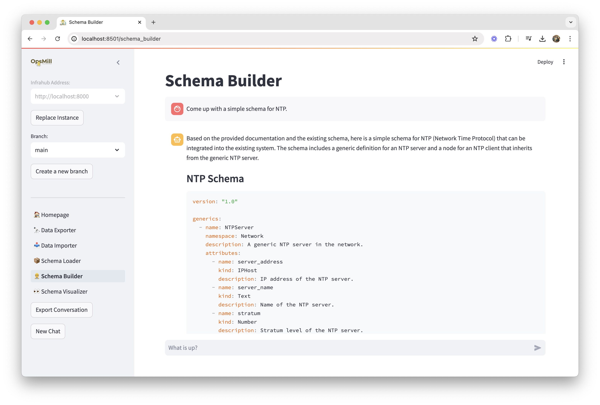

Emma's Schema Builder is an AI-powered tool that helps you create Infrahub schemas using natural language descriptions. Instead of manually writing YAML schema definitions, you can describe what you need and let Emma's AI assistant generate the appropriate schema structure.



## How it works

The Schema Builder leverages OpenAI's language models to understand infrastructure concepts and translate natural language requirements into properly structured Infrahub schemas. It understands:

- Common infrastructure components (devices, interfaces, IP addresses, etc.)
- Relationships between infrastructure objects
- Industry-standard naming conventions and best practices
- Infrahub schema syntax and requirements

## Getting started

### Prerequisites

To use the AI Schema Builder, you need:

- Basic understanding of your infrastructure requirements
- Knowledge of how your schema fits into your overall infrastructure model

### Basic workflow

1. **Describe your schema** in natural language
2. **Review the AI-generated schema** for accuracy and completeness
3. **Refine your description** if needed to get better results
4. **Generate the final schema** and optionally load it into Infrahub

## Creating your first schema

### Step 1: Describe your requirements

In the Schema Builder interface, describe what you want to model. Be specific about:

- **Object type**: What kind of infrastructure component
- **Attributes**: What properties it should have
- **Relationships**: How it connects to other objects
- **Constraints**: Any validation rules or requirements

**Example descriptions:**

```text
Create a schema for network switches that includes:
- Basic device information (name, model, serial number)
- Management IP address
- Physical location reference
- Multiple network interfaces
- VLAN configuration capabilities
```

```text
Model a cloud instance with:
- Instance type and size
- Operating system details
- Network interfaces with public/private IPs
- Associated security groups
- Tags for metadata
```

### Step 2: Review generated schema

The AI will generate a complete Infrahub schema in YAML format. Review:

- **Schema name and namespace** - Ensure they follow your naming conventions
- **Attributes** - Check data types and validation rules
- **Relationships** - Verify connections to other schemas make sense
- **Inheritance** - Confirm the schema inherits from appropriate base schemas

### Step 3: Refine and iterate

If the generated schema isn't quite right:

- **Add more details** to your description
- **Specify constraints** more clearly
- **Mention missing attributes** or relationships
- **Reference existing schemas** that should be related

The AI learns from your feedback and will generate improved schemas.

## Advanced features

### Schema inheritance

Emma understands Infrahub's inheritance model. You can specify base schemas:

```text
Create a server schema that inherits from the base Device schema
and adds CPU, memory, and storage specifications
```

### Complex relationships

Define sophisticated relationships between schemas:

```text
Create a cluster schema that:
- Has multiple nodes (many-to-one relationship with servers)
- Belongs to a single environment
- Can span multiple availability zones
- Has a load balancer that references multiple backend servers
```

### Validation rules

Specify validation requirements:

```text
Create an IP address schema with:
- IPv4 and IPv6 address validation
- Subnet mask validation
- Ensure addresses are within allowed ranges
- Prevent duplicate address assignment
```

## Best practices

### Writing effective descriptions

1. **Be specific**: Vague descriptions lead to generic schemas
2. **Use industry terms**: The AI understands networking, cloud, and infrastructure terminology
3. **Mention relationships**: Always describe how your schema connects to others
4. **Consider the data lifecycle**: Think about how data will be created, updated, and deleted

### Schema design principles

1. **Start with basics**: Begin with basic attributes and add complexity iteratively
2. **Follow conventions**: Use consistent naming and follow Infrahub best practices
3. **Consider inheritance**: Leverage base schemas to avoid duplication
4. **Plan relationships**: Think about how schemas connect before creating them

### Integration with existing schemas

- **Reference the Schema Library**: Mention existing schemas in your descriptions
- **Check dependencies**: Ensure required base schemas are loaded first
- **Validate relationships**: Verify that referenced schemas exist in your Infrahub instance
- **Test thoroughly**: Always test generated schemas before using in production

## Limitations and considerations

### AI limitations

- **Context awareness**: The AI doesn't know your specific environment setup
- **Validation**: Always review generated schemas for accuracy
- **Best practices**: The AI follows general practices but may not match your specific standards
- **Complex logic**: Very complex business rules may need manual refinement

### Schema complexity

- **Start with core attributes**: Complex schemas with many relationships can be challenging
- **Iterate**: Build complex schemas in stages
- **Test**: Validate each iteration before adding more complexity

### Performance considerations

- **API calls**: Each generation requires an OpenAI API call
- **Response time**: Complex descriptions may take longer to process
- **Rate limits**: Be aware of OpenAI API rate limitations

## Integration with other Emma features

The Schema Builder integrates seamlessly with other Emma features:

- **Schema Loader**: Generated schemas can be loaded directly into Infrahub
- **Schema Visualizer**: View the structure and relationships of generated schemas
- **Data Importer**: Use generated schemas as targets for data import
- **Schema Library**: Save generated schemas to your local library

## Troubleshooting

### Common issues

**AI generates incorrect schemas:**

- Provide more specific descriptions
- Include examples of desired attributes
- Reference existing schemas for context

**Missing relationships:**

- Explicitly mention all required relationships
- Verify referenced schemas exist
- Check relationship cardinality requirements

**Validation errors:**

- Review Infrahub schema requirements
- Check attribute data types
- Verify namespace and naming conventions

**Performance issues:**

- Simplify complex descriptions
- Break large schemas into smaller components
- Check network connectivity to OpenAI API

For more troubleshooting help, see the [Troubleshooting Guide](../reference/troubleshooting).

## Next steps

- Try the [Building Your First Schema](../guides/building-your-first-schema) guide
- Explore the [Schema Library](https://docs.infrahub.app/schema-library) for examples and templates
- Learn about [Schema Management](./schema-management) best practices
