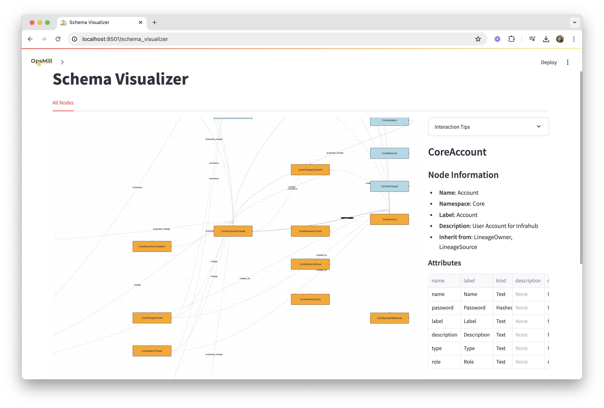

import Tabs from '@theme/Tabs';
import TabItem from '@theme/TabItem';

Emma provides comprehensive tools for managing Infrahub schemas throughout their lifecycle. From loading and visualizing schemas to organizing them in libraries, Emma makes schema management accessible and efficient.

## Overview

Schema management in Emma encompasses:

- **Schema Loading** - Installing schemas into your Infrahub instance
- **Schema Visualization** - Understanding schema relationships and structure
- **Schema Library** - Organizing and browsing available schemas
- **Version Control** - Managing schema changes over time

## Schema loader

The Schema Loader allows you to install schemas into your Infrahub instance from various sources.

### Loading sources

<Tabs>
<TabItem value="library" label="Schema Library" default>

Load schemas from Emma's built-in library:

1. **Browse available schemas** in categories (Base, Extensions, Experimental)
2. **Select schemas** to load (multiple selection supported)
3. **Review dependencies** - Emma shows required base schemas
4. **Load in dependency order** - Emma automatically orders schema loading

**Benefits:**

- Pre-tested, community-validated schemas
- Proper dependency management
- Documentation and examples included
- Regular updates and improvements

</TabItem>
<TabItem value="yaml" label="YAML Editor">

Load schemas from YAML definitions:

1. **Paste or type YAML** directly into the editor
2. **Validate syntax** - Emma checks YAML formatting
3. **Preview schema structure** before loading
4. **Load individual or multiple schemas** from a single YAML file

**Use cases:**

- Loading custom schemas
- Testing schema modifications
- Importing schemas from other sources
- Quick schema prototyping

</TabItem>
<TabItem value="file" label="File Upload">

Upload schema files from your local system:

1. **Select YAML files** (single or multiple)
2. **Review file contents** before loading
3. **Validate and load** with dependency checking
4. **Track loading progress** for multiple files

**Supported formats:**

- Individual .yaml or .yml files
- Multiple files in zip archives
- Schema collections from exports

</TabItem>
</Tabs>

### Dependency management

Emma automatically handles schema dependencies:

**Dependency Detection:**

- Analyzes `inherit_from` relationships
- Identifies referenced schemas in relationships
- Detects circular dependencies

**Load Ordering:**

- Loads base schemas before dependent schemas
- Provides clear dependency visualization
- Prevents load failures due to missing dependencies

**Conflict Resolution:**

- Warns about schema name conflicts
- Handles version differences
- Provides override options for updates

### Validation and error handling

The Schema Loader validates schemas before installation:

**Syntax Validation:**

- YAML formatting and structure
- Required field presence
- Data type correctness

**Semantic Validation:**

- Schema naming conventions
- Relationship target validity
- Attribute definition consistency

**Infrahub Validation:**

- Compatibility with Infrahub version
- Permission checks
- Namespace conflicts

## Schema visualizer

The Schema Visualizer provides graphical representations of your schema structure and relationships.

### Visualization types

**Graph View:**

- Interactive network diagram of schemas
- Shows inheritance and relationship connections
- Allows zooming and panning for large schema sets
- Color-coded by schema type or namespace

**Tree View:**

- Hierarchical display of schema inheritance
- Expandable/collapsible nodes
- Shows parent-child relationships clearly
- Useful for understanding schema hierarchies

**List View:**

- Tabular display of all schemas
- Sortable and filterable columns
- Shows key schema metadata
- Quick access to schema details

### Interactive features

**Schema Exploration:**

- Click schemas to view detailed information
- Hover for quick attribute and relationship previews
- Expand/collapse related schema groups
- Navigate between connected schemas

**Filtering and Search:**

- Filter by schema type, namespace, or category
- Search by schema name or description
- Hide/show specific relationship types
- Focus on schema subsets

**Export Options:**

- Export visualizations as images (PNG, SVG)
- Generate schema documentation
- Create relationship reports
- Export schema lists as CSV

### Analysis tools

**Impact Analysis:**

- Show what schemas depend on a selected schema
- Identify unused schemas
- Find circular dependencies
- Analyze schema complexity metrics

**Relationship Analysis:**

- Count incoming and outgoing relationships
- Identify highly connected schemas
- Find isolated schema groups
- Analyze relationship patterns

## Schema library integration

Emma's Schema Library provides curated, ready-to-use schemas for common infrastructure components.

### Library organization

**Base Schemas:**

- Fundamental infrastructure components
- Required by most other schemas
- Examples: Device, Location, Organization, Person

**Extensions:**

- Specialized schemas for specific domains
- Build on base schemas
- Examples: Routing protocols, Security policies, Cloud resources

**Experimental:**

- Cutting-edge schemas for new technologies
- Community contributions
- May change significantly

### Using library schemas

**Browse and Discover:**

- Search by category, technology, or use case
- View schema descriptions and examples
- Check compatibility with your environment
- Review community ratings and feedback

**Customize and Extend:**

- Copy library schemas as starting points
- Modify attributes and relationships
- Add organization-specific extensions
- Maintain local variations

**Contribute Back:**

- Share useful schemas with the community
- Submit improvements to existing schemas
- Participate in schema standardization efforts

## Best practices

### Schema design

**Start with Standards:**

- Use library schemas as foundations
- Follow established naming conventions
- Design for reusability and extension
- Document schema purposes and constraints

**Plan Dependencies:**

- Load base schemas first
- Minimize circular dependencies
- Use inheritance appropriately
- Design clear relationship hierarchies

**Version Management:**

- Use Infrahub branches for schema changes
- Test schema modifications thoroughly
- Plan migration strategies for breaking changes
- Maintain schema documentation

### Performance considerations

**Large Schema Sets:**

- Load schemas in batches
- Use dependency ordering
- Monitor Infrahub performance during loads
- Consider schema consolidation

**Complex Relationships:**

- Avoid overly complex relationship networks
- Use visualization tools to understand complexity
- Simplify where possible
- Document complex relationships clearly

### Team collaboration

**Schema Governance:**

- Establish schema review processes
- Define naming and design standards
- Use version control for schema files
- Document schema decisions and rationale

**Knowledge Sharing:**

- Use schema visualization for training
- Maintain schema documentation
- Share library schemas across teams
- Regular schema review meetings

## Advanced features

### Schema diff and comparison

Compare schemas across branches or versions:

- Side-by-side schema comparisons
- Highlight attribute and relationship changes
- Impact analysis for modifications
- Migration planning assistance

### Bulk operations

Manage multiple schemas efficiently:

- Bulk schema loading and updates
- Batch validation and testing
- Mass schema exports
- Automated dependency resolution

### Integration APIs

Programmatic schema management:

- REST APIs for schema operations
- GraphQL queries for schema metadata
- Webhook notifications for schema changes
- CI/CD integration capabilities

## Troubleshooting

### Common issues

**Schema Load Failures:**

- Check dependency requirements
- Verify YAML syntax
- Ensure proper permissions
- Review Infrahub compatibility

**Visualization Problems:**

- Clear browser cache
- Check for large schema sets
- Verify network connectivity
- Update browser if needed

**Performance Issues:**

- Reduce loaded schema count
- Use filtering in visualizations
- Load schemas in smaller batches
- Monitor system resources

For detailed troubleshooting, see the [Troubleshooting Guide](../reference/troubleshooting).

## Next steps

- Explore the [Schema Library](./schema-library) for available schemas
- Try [Building Your First Schema](../guides/building-your-first-schema)
- Learn about [Data Import & Export](./data-import-export) for populating your schemas
- Check out the [Schema Builder](./schema-builder) for creating custom schemas