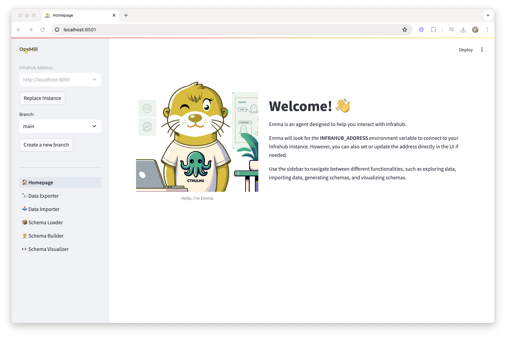

Emma is the experimental little sister of Otto, and she is to help you interact with Infrahub.

Currently, Emma can help you to:

- Import CSV Data into Infrahub
- Export Data from Infrahub in CSV format
- Build, Load, and Visualize the Infrahub schema

:::warning
Emma is experimental by design, and may not work as expected. She tests out new ideas before her big brother Otto gets involved and implements them in Infrahub.
:::



## Getting Started

### curl quickstart

This command will use the [Infrahub Quickstart](https://docs.infrahub.app/guides/installation#quick-start-via-curl) method to download a Docker Compose file and start Infrahub and Emma.

:::note
The Infrahub version number in the URL should be updated to the [latest version](https://github.com/opsmill/infrahub/tags).
:::

```console
curl https://infrahub.opsmill.io/1.1.6-emma | docker compose -f - up -d
```

Then connect to the WebUI of [Infrahub](http://localhost:8000) and [Emma](http://localhost:8501)

### Running Locally with Poetry

To run Emma locally using Poetry, follow these steps:

1. **Clone the Emma repository**

```console
git clone https://github.com/opsmill/emma.git
```

2. **Install Dependencies:**

 ```console
 cd emma
 poetry install
 ```

3. **Run the Application:**

 ```console
 poetry run streamlit run main.py
 ```

4. **Set Environment Variables:**

 Emma uses Infrahub standard environment variables to connect to Infrahub:

 ```console
 export INFRAHUB_ADDRESS="http://localhost:8000"
 export INFRAHUB_API_TOKEN="06438eb2-8019-4776-878c-0941b1f1d1ec"
 ```

### Running with Docker Compose

To run Emma using Docker Compose, follow these steps:

1. **Clone the Emma repository**

```console
git clone https://github.com/opsmill/emma.git
```

2. **Build and Run the Application:**

 ```console
 cd emma
 docker compose up --build &
 ```

3. **Connecting to Infrahub Network:**

If you run Infrahub as another container in the local network, you need to connect Emma to it. After starting both containers, run the following command:

```console
docker network connect <infrahub-network> emma-emma-1
```
