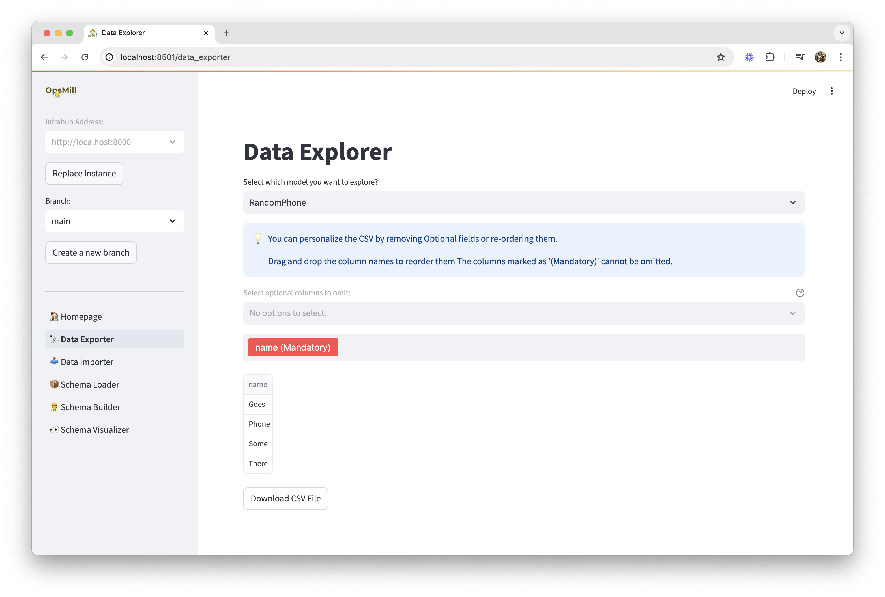

Emma is an agent designed to help you interact with Infrahub.

Currently, Emma can help you to:

- Import CSV Data into Infrahub
- Export Data from Infrahub in CSV format
- Build, Load, and Visualize the Infrahub schema


## Getting Started

### curl quickstart

```bash
curl https://infrahub.opsmill.io/0.16.0-emma | docker compose -f - up -d
```

Then connect to the WebUI of [Infrahub](http://localhost:8000) and [Emma](http://localhost:8501)

### Running Locally with Poetry

To run Emma locally using Poetry, follow these steps:

1. **Install Dependencies:**

 ```console
 poetry install
 ```

2. **Run the Application:**

 ```console
 poetry run streamlit run main.py
 ```

3. **Set Environment Variables:**

 Emma uses Infrahub standard environment variables to connect to Infrahub:

 ```console
 export INFRAHUB_ADDRESS="http://localhost:8000"
 export INFRAHUB_API_TOKEN="06438eb2-8019-4776-878c-0941b1f1d1ec"
 ```

### Running with Docker Compose

To run Emma using Docker Compose, follow these steps:

1. **Build and Run the Application:**

 ```console
 docker compose up --build &
 ```

2. **Connecting to Infrahub Network:**

If you run Infrahub as another container in the local network, you need to connect Emma to it. After starting both containers, run the following command:

```console
docker network connect <infrahub-network> emma-emma-1
```

## Screenshots





## Experimental Features

To turn on experimental features in Emma, set the following environmental variable with options provided by the OpsMill CS team:

```console
export EMMA_FEATURE_FLAGS="feature1,feature2"
```
