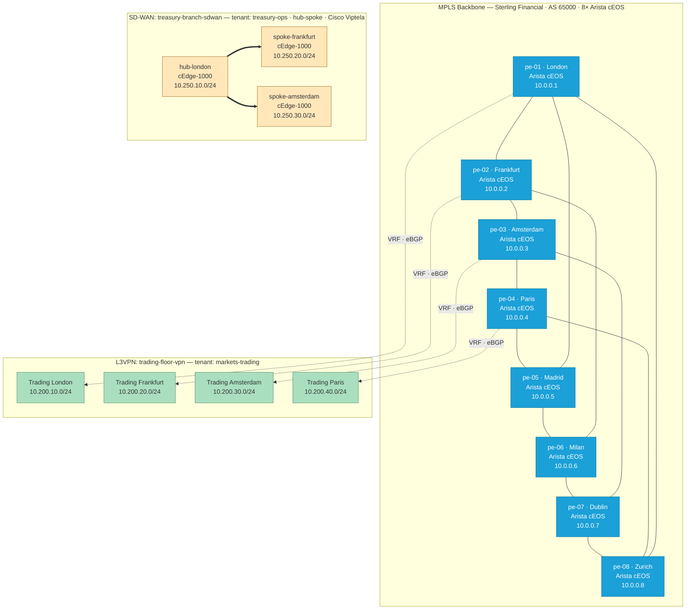

Welcome to the **Infrahub demo-sp** example — a service-provider bundle that
shows how Infrahub manages a multi-vendor MPLS backbone and provisions
customer-facing services end to end. It demonstrates Infrahub's core
capabilities through a realistic SP workload:

- Schema-driven data modeling for backbone and customer services
- Generator-driven provisioning (VRF, RT, PE-CE interfaces, IP allocation, BGP)
- Per-vendor configuration artifacts from a shared schema
- Version-controlled changes with proposed-change diff review
- A Streamlit Service Catalog for self-service L3VPN and SD-WAN provisioning

Whether you're a network engineer evaluating automation, a developer building
on Infrahub, or an architect comparing infrastructure-data platforms, this demo
gives you a hands-on view of how an SP team would model and operate a real
backbone.

## Documentation guide

This documentation follows the [Diataxis framework](https://diataxis.fr/) so
you can find the right kind of page for what you need to do.

### Getting started

| Page | Purpose |
| ---- | ------- |
| **[Quick start](./quickstart.mdx)** | Step-by-step instructions to clone the repository, configure `.env`, start Infrahub, and load the bootstrap data. Start here on your first run. |

### Tutorials

| Page | Purpose |
| ---- | ------- |
| **[L3VPN service walkthrough](./services/l3vpn.mdx)** | End-to-end tour of the L3VPN service: how the catalog form drives `ServiceL3Vpn` creation, what the generator materialises (VRF, RTs, PE-CE links, eBGP), what each per-vendor template emits, and how the validation checks fit together. |
| **[SD-WAN service walkthrough](./services/sdwan.mdx)** | Companion tour of the SD-WAN service: vendor choice (Cisco Viptela vs Versa Networks), hub-spoke vs full-mesh topology, generator-created edge devices, and per-vendor edge configurations. |
| **[Deploy with containerlab](./lab/containerlab.mdx)** | Take the rendered MPLS backbone artifacts and bring them up in a virtual lab with containerlab. Cover Arista cEOS, Nokia SR Linux substitution, and how to reach the lab CLIs. |

### Topics

| Page | Purpose |
| ---- | ------- |
| **[Architecture](./architecture.mdx)** | The "why" behind the demo — backbone design choices, service modelling, generator vs catalog responsibilities, and the lifecycle of a customer service. |
| **[Schema reference](./schema-reference.mdx)** | Field-level documentation of every node (`ServiceL3Vpn`, `ServiceSdwan`, `TopologyMplsBackbone`, …), the resource pools, and the user-vs-generator split for each attribute. |

### Operations

| Page | Purpose |
| ---- | ------- |
| **[Troubleshooting](./troubleshooting.mdx)** | Symptoms and fixes for common issues — stuck repository sync, generator races, broken artifacts, and how to inspect live state when something looks off. |

## Quick start

If you're ready to dive in:

1. Follow the **[quick start](./quickstart.mdx)** to clone the repository, configure
   `.env`, and run `uv run invoke init`.
2. Open the **Infrahub UI** at `http://localhost:8000` and explore the seeded
   data — Devices, MPLS Backbones, Service Catalog → L3 VPNs and SD-WAN.
3. Provision a new service from the **[Streamlit Service Catalog](./services/l3vpn.mdx)**
   at `http://localhost:8501`.
4. (Optional) Bring up the MPLS backbone in **[containerlab](./lab/containerlab.mdx)**.
5. Read the **[architecture](./architecture.mdx)** and **[schema reference](./schema-reference.mdx)**
   to understand the moving parts before you extend the demo.

## What you'll learn

Through this demo, you'll gain practical experience with:

- **Modelling SP services in Infrahub** — `ServiceL3Vpn` / `ServiceSdwan` with
  uniqueness constraints, parent/child relationships, and lifecycle status.
- **Resource pools** — `vpn_id_pool`, `sdwan_id_pool`, `pe_loopback_pool`,
  `backbone_p2p_pool`, `pe_ce_pool` for deterministic allocation.
- **Generators** — Materialising VRFs, route targets, PE-CE /30 allocations,
  eBGP sessions, and SD-WAN edge devices from a single user-facing object.
- **Per-vendor transforms** — Rendering the same intent into Arista EOS,
  Cisco IOS-XR, Juniper Junos, Nokia SR OS, Cisco Viptela, and Versa VOS configurations.
- **Validation checks** — Catching duplicate RDs, overlapping customer prefixes,
  exhausted interface pools, and missing iBGP sessions before merge.
- **Branch-based workflows** — Catalog form → feature branch → generator
  → artifact regeneration → proposed change → review → merge.
- **Containerlab** — Booting the rendered backbone in a virtual lab for hands-on
  testing.

## Architecture at a glance

Out of the box the **financial** dataset gives you the Sterling Financial MPLS
backbone — eight Arista cEOS PEs (`pe-01`…`pe-08`) in a partial mesh — with two
seeded customer services — one L3VPN, one SD-WAN — wired up end to end:

**Backbone** — Eight PE routers, all Arista cEOS (`pe-01`…`pe-08`), in eight
EMEA sites. The topology is a partial mesh — an eight-node ring plus four
cross-chords, giving 12 backbone p2p links with every PE at degree 3 — over a
full iBGP/VPNv4 mesh, ISIS for underlay reachability, and LDP for label
distribution. (The **isp** dataset instead ships a four-PE, one-per-vendor
backbone — see below.)

**L3VPN service (`trading-floor-vpn`)** — Tenant `markets-trading`, four sites
on `pe-01` (London), `pe-02` (Frankfurt), `pe-03` (Amsterdam) and `pe-04`
(Paris) with eBGP PE-CE sessions and one /24 customer subnet per site in
the `10.200.0.0/16` supernet.

**SD-WAN service (`treasury-branch-sdwan`)** — Tenant `treasury-ops`, hub-spoke
on Cisco Viptela cEdge-1000 edges at London (hub), Frankfurt and Amsterdam
(spokes); LAN subnets in the `10.250.0.0/16` supernet.

An alternate **isp** dataset (Lumina Networks pan-European ISP) ships its own
backbone — four PEs, one per vendor (`pe-lon-arista`, `pe-fra-cisco`,
`pe-ams-juniper`, `pe-par-nokia`), full-mesh iBGP over six p2p links — plus
eight customer tenants and a different default L3VPN and SD-WAN. Select it via
the `INFRAHUB_DATASET` env var.

## Key features demonstrated

### Schema-driven service modelling

`ServiceL3Vpn`, `ServiceL3VpnSite`, `ServiceSdwan`, `ServiceSdwanSite` define
not just object shape but uniqueness constraints, parent/child relationships,
dropdown enums for vendor and topology, and lifecycle status. See the
**[schema reference](./schema-reference.mdx)** for the full field tables.

### Generator-driven provisioning

When a catalog form creates a `ServiceL3Vpn` or `ServiceSdwan` and the row
joins the `l3vpns` or `sdwans` group, Infrahub auto-fires the matching
generator. The L3VPN generator allocates a VRF, route targets, a /30 from
`pe_ce_pool`, sets up the PE interface, and writes the eBGP session for each
site. The SD-WAN generator materialises one CPE per site, allocates the LAN
address from the customer subnet, and adds the edge to the vendor-specific
group so the artifact pipeline targets it.

### Per-vendor configuration artifacts

A single schema drives six Jinja2 templates: Arista EOS, Cisco IOS-XR, Juniper
Junos, Nokia SR OS / SR Linux, Cisco Viptela cEdge (IOS-XE SD-WAN), and Versa
VOS (FlexVNF). Each PE or edge ends up with a `text/plain` configuration artifact
keyed by `name__value`, ready to feed into a CI/CD push. The default **financial**
backbone is all-Arista, so it exercises only the Arista EOS template; the **isp**
dataset, with one PE per vendor, exercises the full per-vendor set.

### Branch-based workflows

Every catalog submission opens a feature branch (`l3vpn/<hex>` or `sdwan/<hex>`),
creates objects on the branch, polls the generator to completion, regenerates
artifacts so the diff is meaningful, and opens a `CoreProposedChange` against
`main`. Validation checks run on the PC before merge.

### Containerlab integration

The `clab-mpls-topology` artifact emits a containerlab YAML wiring the
lab-deployable PEs and their backbone links, derived from the shared /31
addressing. For the default **financial** backbone that's all eight Arista
cEOS PEs and all 12 backbone links; for the **isp** dataset it's the Arista
and Nokia PEs (Nokia SR OS substituted to SR Linux for the lab image). See the
**[containerlab guide](./lab/containerlab.mdx)**.

## Community and support

- **Source code**: [GitHub repository](https://github.com/opsmill/infrahub-demo-sp)
- **Infrahub documentation**: [docs.infrahub.app](https://docs.infrahub.app)
- **Discord community**: [Discord](https://discord.gg/opsmill)
- **OpsMill website**: [opsmill.com](https://opsmill.com)

## Next steps

Ready to get started? Head to the **[quick start](./quickstart.mdx)** to set
up your environment.

{/* docs sync trigger: validate Sync Folders workflow after docs-infrahub-demo-sp rename */}
