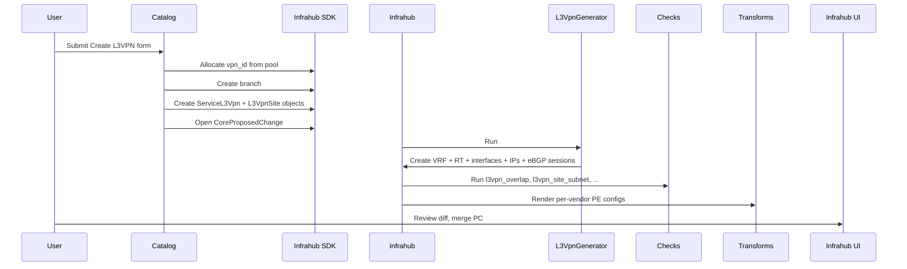

# L3VPN service

This page documents the L3VPN service end-to-end: how an operator creates
one through the Streamlit catalog, what Infrahub does automatically, and how
each vendor's configuration differs.

For field-level schema details see [schema-reference](../schema-reference.mdx).

---

## User flow



### Step-by-step

1. **Catalog form** — The operator fills in the VPN name, selects a tenant,
   picks a PE and a customer subnet for each site, and chooses a routing
   protocol (eBGP / static / connected).

2. **Branch + objects** — The catalog allocates a `vpn_id` from
   `vpn_id_pool`, opens a feature branch, and writes `ServiceL3Vpn` +
   `ServiceL3VpnSite` objects to Infrahub. All objects start with
   `status = draft / provisioning`.

3. **Proposed Change** — The catalog opens a `CoreProposedChange` from the
   feature branch into `main`. This triggers the generator and checks
   automatically.

4. **Generator run** — `L3VpnGenerator` does all heavy lifting:
   - Creates an `IpamVRF` with `vrf_rd = <provider-asn>:<vpn_id>`.
   - Creates matching import and export route targets.
   - Selects the lowest-numbered free interface on the PE.
   - Allocates a /30 from `pe_ce_pool` and creates the PE and CE IP addresses.
   - Places the customer subnet prefix into the VRF.
   - Creates a `RoutingBGPSession` (eBGP, `session_type = EXTERNAL`) when
     `routing_protocol = ebgp`.
   - Promotes `ServiceL3Vpn.status` to `active` and `ServiceL3VpnSite.status`
     to `active`.

5. **Checks** — Four checks must pass before merge is allowed
   (see [Checks](#checks) below).

6. **Transforms** — Configuration artifacts are rendered for each PE that has
   at least one L3VPN site.

7. **Merge** — The operator reviews the diff in the Infrahub UI and merges.
   On the target platform the artifact is pushed via the relevant `invoke`
   task (for example, `invoke lab.push-arista`).

---

## Checks

| Check | File | What it enforces |
|---|---|---|
| `l3vpn_overlap` | `checks/l3vpn_overlap.py` | No two active `ServiceL3Vpn` objects share the same `vpn_id` |
| `l3vpn_site_subnet` | `checks/l3vpn_site_subnet.py` | The customer subnet is not already claimed by another site in the same VRF |
| `pe_interface_alloc` | `checks/pe_interface_alloc.py` | The nominated PE interface exists and has `status = free` |
| `backbone_session_count` | `checks/backbone_session_count.py` | Every PE in the backbone has at least 3 iBGP sessions (full-mesh invariant) |
| `batfish_backbone` | `checks/batfish_backbone.py` | Static validation of the rendered backbone configs via Batfish — see [Batfish validation](../validation/batfish.mdx) for the full query battery |

A failing check blocks merge of the proposed change. The operator can see
the check result in the Infrahub UI under the proposed change's **Checks** tab.

---

## Generator: what it creates

| Object | Created by | Notes |
|---|---|---|
| `IpamVRF` | `_ensure_vrf` | Name = VPN name; `vrf_rd` = `<asn>:<vpn_id>` |
| `IpamRouteTarget` | `find_or_create_route_target` | Same value used for import and export RT |
| `InterfacePhysical` (updated) | `next_free_physical_interface` | Lowest free-status interface on the PE; role set to `cust` |
| `IpamPrefix` (/30) | `allocate_prefix_from_pool` | Allocated from `pe_ce_pool`; placed in VRF |
| `IpamIPAddress` × 2 | direct create | `.1` = PE, `.2` = CE within the /30 |
| `RoutingBGPSession` | `_ensure_ebgp_session` | Only when `routing_protocol = ebgp`; `session_type = EXTERNAL` |

The generator is idempotent: re-running it on an L3VPN that already has a VRF
and allocated addresses will skip re-creation and only update missing fields.

---

## Per-vendor configuration

The transform layer renders a full configuration fragment for each PE
when that PE has at least one active L3VPN site. Configuration sections
differ by vendor:

### Arista EOS

```text
vrf instance <name>
   rd <asn>:<vpn_id>
!
router bgp <asn>
   vrf <name>
      rd <asn>:<vpn_id>
      route-target import <rt>
      route-target export <rt>
      neighbor <ce-ip> remote-as <ce-asn>
      network <customer-subnet>
```

### Cisco IOS-XR

```text
vrf <name>
 address-family ipv4 unicast
  import route-target
   <rt>
  export route-target
   <rt>
!
router bgp <asn>
 vrf <name>
  rd <asn>:<vpn_id>
  address-family ipv4 unicast
   neighbor <ce-ip>
    remote-as <ce-asn>
```

### Juniper Junos

```text
routing-instances {
    <name> {
        instance-type vrf;
        interface <pe-iface>;
        vrf-target target:<rt>;
        protocols {
            bgp {
                group PE-CE {
                    neighbor <ce-ip> {
                        peer-as <ce-asn>;
                    }
                }
            }
        }
    }
}
```

### Nokia SR OS

```text
service {
    vprn "<name>" customer "1" create
        route-distinguisher <rd>
        vrf-target target:<rt>
        interface "<pe-iface>" create
            address <pe-ip>/<mask>
            sap <port>:0 create
            exit
        exit
        bgp-vpn-backup
        no shutdown
    exit
}
```
