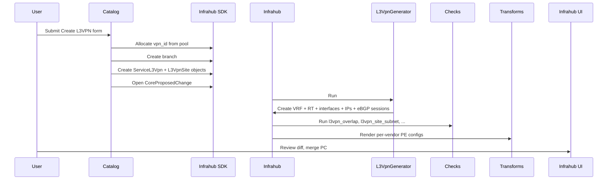

# L3VPN service

This page documents the L3VPN service end-to-end: how an operator creates
one through the Streamlit catalog, what Infrahub does automatically, and how
each vendor's configuration differs.

For field-level schema details see [schema-reference](../schema-reference.mdx).

---

## User flow


```mermaid
sequenceDiagram
    User->>Catalog: Submit Create L3VPN form
    Catalog->>Infrahub SDK: Allocate vpn_id from pool
    Catalog->>Infrahub SDK: Create branch
    Catalog->>Infrahub SDK: Create ServiceL3Vpn + L3VpnSite objects
    Catalog->>Infrahub SDK: Open CoreProposedChange
    Infrahub->>L3VpnGenerator: Run
    L3VpnGenerator->>Infrahub: Create VRF + RT + interfaces + IPs + eBGP sessions
    Infrahub->>Checks: Run l3vpn_overlap, l3vpn_site_subnet, ...
    Infrahub->>Transforms: Render per-vendor PE configs
    User->>Infrahub UI: Review diff, merge PC
```

### Step-by-step

1. **Catalog form** — The operator fills in the VPN name, selects a tenant,
   picks a PE and a customer subnet for each site, and chooses a routing
   protocol (eBGP / static / connected).

2. **Branch + objects** — The catalog allocates a `vpn_id` from
   `vpn_id_pool`, opens a feature branch, and writes `ServiceL3Vpn` +
   `ServiceL3VpnSite` objects to Infrahub. All objects start with
   `status = draft / provisioning`.

3. **Generator run (event-driven)** — Once the sites exist, the catalog adds
   the `ServiceL3Vpn` to the `l3vpns` group. That membership change fires the
   `trigger-l3vpn-generator` group trigger (a `CoreGroupTriggerRule` +
   `CoreGeneratorAction`, see `objects/events/00_triggers.yml`), which runs
   `L3VpnGenerator` **on the branch**. The generator is deliberately **not**
   run inside the proposed-change pipeline (`execute_in_proposed_change: false`
   in `.infrahub.yml`): in the pipeline it races artifact rendering, which
   render before the VRF/IPs exist and produce an empty configuration diff. Running it
   on the branch-change event guarantees the data lands before artifacts render.
   `L3VpnGenerator` does all heavy lifting:
   - Creates an `IpamVRF` with `vrf_rd = <provider-asn>:<vpn_id>`, bound to the
     namespace the customer prefixes were created in, so two customers may use
     the same private prefix.
   - Creates matching import and export route targets.
   - Selects the lowest-numbered free interface on the PE.
   - Allocates a /30 from `pe_ce_pool` and creates the PE and CE IP addresses.
   - Places the customer subnet prefix into the VRF.
   - Hangs a dot1q sub-interface off the private port on the CE, carrying a VLAN
     from the `vlan_pool` named by the VPN, and the customer LAN gateway address.
   - Creates a `RoutingBGPSession` (eBGP, `session_type = EXTERNAL`) when
     `routing_protocol = ebgp`.
   - Promotes `ServiceL3Vpn.status` to `active` and `ServiceL3VpnSite.status`
     to `active`.

   **Editing a service that is already in the group** does not change
   membership, so the group rule cannot fire. A second rule,
   `trigger-l3vpn-generator-sites-changed` (a `CoreNodeTriggerRule` on
   `ServiceL3Vpn`), covers adding a site to — or removing one from — an existing
   service; removal matters because the re-run is what lets the generator reap
   the PE port, /30 and session the deleted site left behind. Editing an
   existing site's own fields — `customer_subnet`, `bgp_peer_asn`, `ce_device` —
   fires nothing: an attribute change on the child produces no event for the
   parent, and a rule scoped to the site cannot dispatch a generator whose
   target group holds VPNs. To force a run on the branch, remove the VPN from
   the `l3vpns` group and add it back; on `main`, run
   `uv run python scripts/run_generator.py generate_l3vpn`.

4. **Proposed Change** — Once the generator has finished (service `active`)
   and the per-PE artifacts are rendered, the catalog opens a
   `CoreProposedChange` from the feature branch into `main` for review.

5. **Checks** — Six checks must pass before merge is allowed
   (see [Checks](#checks) below).

6. **Transforms** — Configuration artifacts are rendered for each PE that has
   at least one L3VPN site.

7. **Merge** — The operator reviews the diff in the Infrahub UI and merges.
   On the target platform the artifact is pushed via the relevant `invoke`
   task (for example, `invoke lab.push-arista`).

   If the merge is refused because a `Schema Integrity` validator failed while
   every check listed below passed, see
   [Troubleshooting](../troubleshooting.mdx#proposed-change-schema-integrity-failure-blocks-the-merge)
   — it is an intermittent false positive, and recreating the service on a fresh
   branch clears it.

---

## Checks

| Check | File | What it enforces |
|---|---|---|
| `l3vpn_overlap` | `checks/l3vpn_overlap.py` | No two `ServiceL3Vpn` objects share an RD (derived from `vpn_id`) |
| `l3vpn_site_subnet` | `checks/l3vpn_site_subnet.py` | The customer subnet is not already claimed by another site in the same VRF |
| `l3vpn_peer_asn_range` | `checks/l3vpn_peer_asn_range.py` | No site's `bgp_peer_asn` override falls inside `customer_asn_pool`'s range, where the pool could later issue the same number to another customer |
| `pe_interface_alloc` | `checks/pe_interface_alloc.py` | No PE interface is claimed by more than one L3VPN site |
| `backbone_session_count` | `checks/backbone_session_count.py` | Every PE in the backbone has its full-mesh complement of N−1 iBGP sessions (N = PE count — 7 each on the 8-PE financial backbone, 3 each on the 4-PE isp backbone) |
| `batfish_backbone` | `checks/batfish_backbone.py` | Static validation of the rendered backbone configs via Batfish — see [Batfish validation](../validation/batfish.mdx) for the full query battery |

A failing check blocks merge of the proposed change. The operator can see
the check result in the Infrahub UI under the proposed change's **Checks** tab.

---

## Customer address space

Each L3VPN's customer prefixes live in an `IpamNamespace` of their own, named
`vrf-<vpn name>`. `IpamPrefix` and `IpamIPAddress` are unique on
`[value, ip_namespace]`, so without one, two customers using the same private
prefix would resolve to a single row and their services would compete for its
VRF — and both shipped datasets do hand `10.200.10.0/24` to a different
customer.

The namespace is created by whoever creates the prefix: the datasets declare it,
and the Service Catalog creates it before the prefix. The generator only reads
it, off the site's own `customer_subnet`, and puts the LAN gateway in the same
namespace. It deliberately never writes the namespace node — generators run with
`delete_unused_nodes=True`, so a node the generator saves joins its tracking
group, and any later run that does not save it makes the reaper try to delete it.
For a namespace still holding customer prefixes that delete fails and takes the
whole generator run down with an unreadable error.

A prefix created by hand, without a namespace, lands in `default` and still
works — it just gets no isolation. Provider-owned space stays in `default`
throughout: the PE-CE /30s come from `pe_ce_pool`, and pool allocations take the
namespace of the pool.

---

## Generator: what it creates

| Object | Created by | Notes |
|---|---|---|
| `IpamVRF` | `_ensure_vrf` | Name = VPN name; `vrf_rd` = `<asn>:<vpn_id>`; bound to the namespace read off the customer prefix |
| `IpamRouteTarget` | `find_or_create_route_target` | Same value used for import and export RT |
| `RoutingAutonomousSystem` (customer) | `_ensure_customer_as` | One per VPN; ASN allocated from `customer_asn_pool`. Skipped when every eBGP site sets `bgp_peer_asn` |
| `InterfacePhysical` (updated) | `_ensure_pe_interface` | Reuses a PE port already described `L3VPN <vpn name>` (pre-wired CE links); otherwise the lowest free-status interface. Role set to `cust`, status to `active` |
| `IpamPrefix` (/30) | `allocate_prefix_from_pool` | Allocated from `pe_ce_pool`; placed in VRF |
| `IpamIPAddress` × 2 | `_ensure_ip_address` | `.1` = PE, `.2` = CE within the /30. The CE address is attached to `ce_interface` when the site names one |
| `RoutingBGPSession` (PE side) | `_ensure_ebgp_session` | Only when `routing_protocol = ebgp`; `session_type = EXTERNAL`, bound to the VRF |
| `RoutingBGPSession` (CE side) | `_bind_ce_side` | Only when the site names a `ce_device`; the mirror of the PE session, with no VRF (a CE is not VPN-aware) |
| `InterfaceVirtual` (dot1q) | `_ensure_private_vlan` | Only when the site names a `ce_private_interface` and the VPN a `vlan_pool`. One sub-interface per site, so a CE port shared by two services carries one VLAN each |
| `IpamIPAddress` (LAN gateway) | `_ensure_private_vlan` | First usable address of the `customer_subnet` for that site, on the dot1q sub-interface, in the per-VPN namespace |

The generator is idempotent: re-running it on an L3VPN that already has a VRF
and allocated addresses will skip re-creation and only update missing fields.

---

## Per-vendor configuration

The transform layer renders a full configuration fragment for each PE
when that PE has at least one active L3VPN site. Configuration sections
differ by vendor. On the default **financial** backbone every PE is Arista, so
`trading-floor-vpn` and `ib-advisory-vpn` render the Arista EOS form at all
their sites; the **isp** dataset, with one PE per vendor, exercises all four
forms below:

### Arista EOS

```text
vrf instance <name>
   rd <asn>:<vpn_id>
!
router bgp <asn>
   vrf <name>
      rd <asn>:<vpn_id>
      route-target import <rt>
      route-target export <rt>
      neighbor <ce-ip> remote-as <ce-asn>
      network <customer-subnet>
```

### Cisco IOS-XR

```text
vrf <name>
 address-family ipv4 unicast
  import route-target
   <rt>
  export route-target
   <rt>
!
router bgp <asn>
 vrf <name>
  rd <asn>:<vpn_id>
  address-family ipv4 unicast
   neighbor <ce-ip>
    remote-as <ce-asn>
```

### Juniper Junos

```text
routing-instances {
    <name> {
        instance-type vrf;
        interface <pe-iface>;
        vrf-target target:<rt>;
        protocols {
            bgp {
                group PE-CE {
                    neighbor <ce-ip> {
                        peer-as <ce-asn>;
                    }
                }
            }
        }
    }
}
```

### Nokia SR OS

```text
service {
    vprn "<name>" customer "1" create
        route-distinguisher <rd>
        vrf-target target:<rt>
        interface "<pe-iface>" create
            address <pe-ip>/<mask>
            sap <port>:0 create
            exit
        exit
        bgp-vpn-backup
        no shutdown
    exit
}
```
