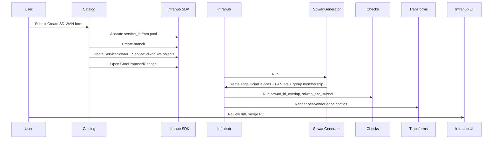

The SD-WAN service models a customer's SD-WAN overlay across one or more
sites. Each site has a dedicated edge device (a per-site `DcimDevice`
created automatically by the generator). The default vendor is Cisco
Viptela (cEdge / IOS-XE SD-WAN); Versa Networks VOS is available as an
alternate.

For field-level schema details see [schema-reference](../schema-reference.mdx).

---

## User flow

### Step-by-step

1. **Catalog form** — Operator picks vendor (Viptela / Versa), topology
   (hub-spoke / full-mesh), and lists one site per location with a LAN
   subnet.

2. **Branch + objects** — Catalog allocates a `service_id` from
   `sdwan_id_pool`, opens a feature branch, writes `ServiceSdwan` and
   `ServiceSdwanSite` rows, and adds the service to the `sdwans` group.

3. **Generator** — `SdwanGenerator` fires automatically on group
   membership. For each site it creates one edge `DcimDevice`
   (`<service>-<site>-edge`) with the vendor's platform / device type /
   manufacturer, adds the device to the vendor-specific edge group
   (`sdwan_viptela_edges` or `sdwan_versa_edges`), allocates a LAN
   address from the site's subnet, and flips both site and service
   status to `active`.

4. **Artifacts** — Infrahub renders one configuration per edge via the matching
   transform (`sdwan_viptela` or `sdwan_versa`).

5. **Proposed Change** — Reviewable diff in the UI; merging promotes the
   service to `main`.

---

## Schema shape

The shape parallels `ServiceL3Vpn`:

- `ServiceSdwan` — name, `service_id`, `vendor`, `topology`, tenant, sites.
- `ServiceSdwanSite` — name, `role` (hub / spoke / branch), `location`,
  `lan_subnet`, `lan_address`, `sdwan_edge`.

---

## Vendor differences

| Aspect              | Viptela (cEdge)            | Versa (FlexVNF)            |
|---------------------|----------------------------|-----------------------------|
| Platform            | `cisco_viptela`            | `versa_flexvnf`             |
| Device type         | `cEdge-1000`               | `FlexVNF-200`               |
| Edge group          | `sdwan_viptela_edges`      | `sdwan_versa_edges`         |
| Artifact definition | `sdwan-viptela-config`     | `sdwan-versa-config`        |
| Configuration flavor | IOS-XE SD-WAN CLI (`system` / `sdwan` / `vpn N`) | Versa VOS CLI (`set orgs org-services …`) |

---

## Checks

- `sdwan_id_overlap` — no two services share `service_id`. Safety net
  behind the pool.
- `sdwan_site_subnet` — no two sites within the same service have
  overlapping LAN subnets.

---

## Known gaps

- **No SD-WAN controllers** modelled — vManage / vSmart / vBond and Versa
  Director / Analytics are out of scope for v1.
- **No transport circuits** — edges have only a LAN-side address; no
  MPLS-vs-Internet-vs-LTE distinction.
- **No overlay tunnels or BGP** in rendered configs — templates emit the
  intent (system identity, `vpn 1` LAN block, organization name) but
  peer-site lists are comments only.
- **No containerlab support** — the `clab-mpls-topology` artifact stays
  MPLS-only. SD-WAN edges would require a `data.ServiceSdwanSite.edges`
  loop in the clab template and a new `linux` CE per SD-WAN site.
