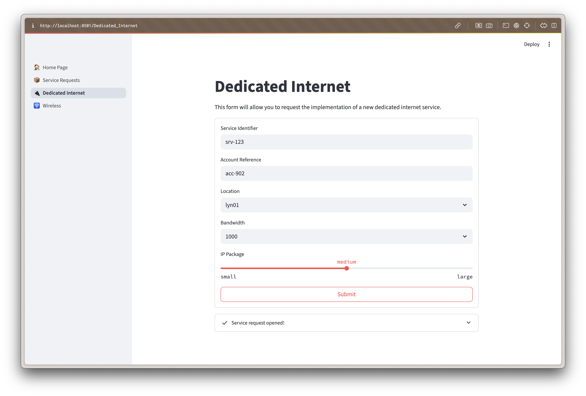
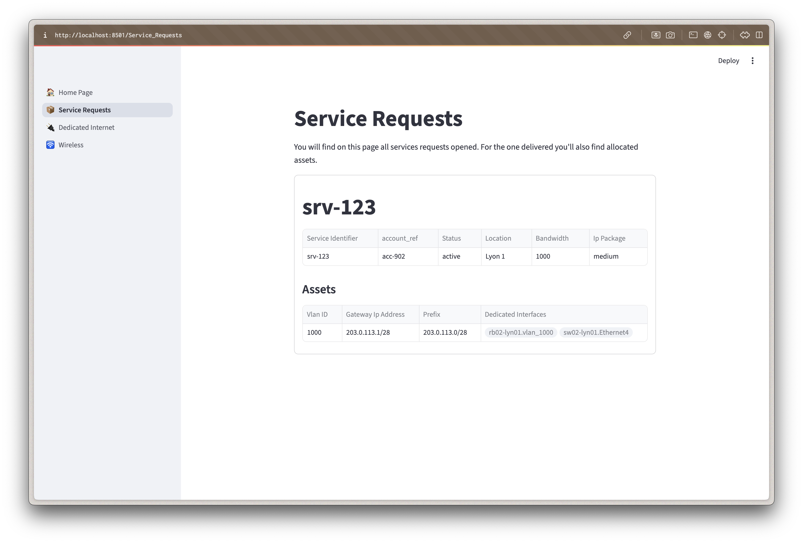
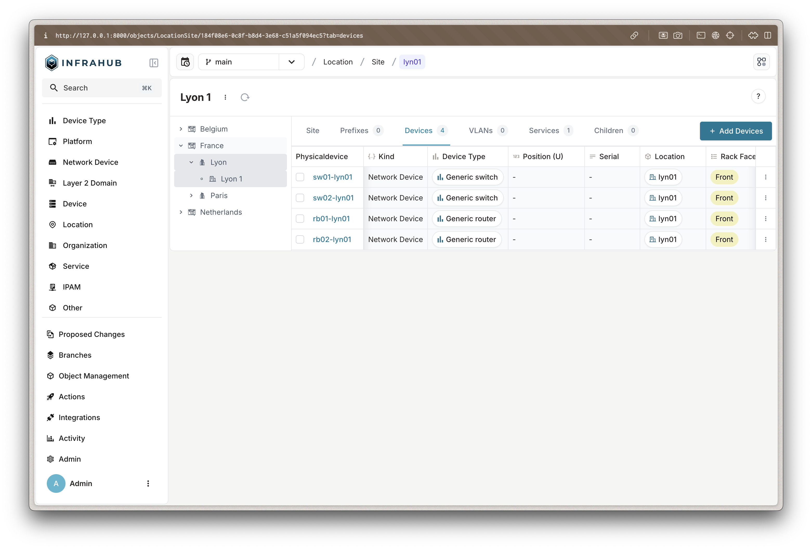
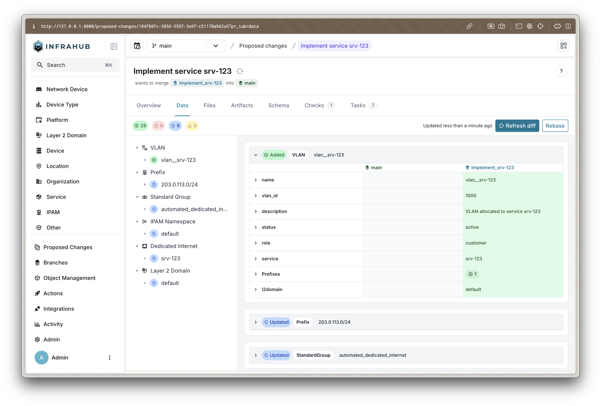

import ReferenceLink from "../../src/components/Card";

This guide demonstrates the complete service delivery workflow through two user perspectives: requesting services through the catalog and managing them through Infrahub. You'll see how automated provisioning transforms service requests into fully configured network services.

<ReferenceLink title="Need help or have questions? Join our Discord community for support!" url="https://discord.gg/opsmill" openInNewTab/>

## Prerequisites

Before starting, ensure you have:

- Completed the [installation guide](installation)
- Both services running:
    - Service Catalog at `http://localhost:8501`
    - Infrahub at `http://localhost:8000`

## Understanding the workflow

The demo simulates a typical enterprise service delivery process:

1. **Service Request**: Customer/engineer requests a service through self-service portal
2. **Automatic Processing**: Infrahub generates proposed changes with allocated resources
3. **Review & Approval**: Network architect reviews and approves the implementation
4. **Resource Allocation**: System automatically provisions VLANs, IPs, and configurations
5. **Service Delivery**: Customer receives access details for their new service

<ReferenceLink title="Blog post" url="https://opsmill.com/blog/how-to-turn-your-source-of-truth-into-a-service-factory/" openInNewTab/>

## Step 1: Request a new service (service engineer role)

### Understanding the service catalog interface

The Service Catalog provides a simplified, user-friendly interface for requesting network services without requiring deep technical knowledge.

### Create a dedicated internet service request

1. **Access the Service Catalog**
   - Open your browser to `http://localhost:8501`
   - You'll see the main dashboard with available service types

2. **Navigate to Service Creation**
   - Click on the "🔌 Dedicated Internet" card from the home page
   - Or use the sidebar navigation to go to "Dedicated Internet"

3. **Fill Out the Service Request Form**

   The form presents user-friendly options that hide technical complexity:

   - **Service Identifier**: Choose a unique name (for example: "DI-DEMO-001")
   - **Account Reference**: Customer or project identifier
   - **Location**: Select from available sites (Atlanta, Dallas, Denver, Seattle)
   - **Bandwidth**: Choose from human-readable options:
     - "Hundred Megabits" (100 Mbps)
     - "One Gigabit" (1 Gbps)
     - "Ten Gigabits" (10 Gbps)
   - **IP Package**: Select based on customer needs:
     - "Small" (6 usable IPs)
       - "Medium" (14 usable IPs)
     - "Large" (30 usable IPs)

4. **Submit the Request**
   - Click "Submit" to create the service request
   - The system creates a new branch in Infrahub for this change



:::tip What Happens Behind the Scenes
When you submit the request:

1. A new git branch is created in Infrahub
2. The service object is created with "draft" status
3. A generator is triggered to allocate resources
4. A "Proposed Change" is created for review
:::

### Track your service requests

1. **View All Requests**
   - Navigate to "📦 Service Requests" in the sidebar
   - You'll see a table of all service requests with their current status

2. **Monitor Request Progress**

   The table shows key information:
   - **Service ID**: Your unique identifier
   - **Status**: Current state (Draft, In Delivery, Active)
   - **Location**: Where the service will be deployed
   - **Bandwidth & IP Package**: Technical specifications
   - **Account**: Customer reference

3. **Understanding Status Progression**
   - **Draft**: Initial request submitted, awaiting processing
   - **In Delivery**: Resources allocated, implementation in progress
   - **Active**: Service fully provisioned and operational



:::note Why Two Interfaces?
The Service Catalog provides a simplified view for business users, while Infrahub offers detailed technical views for network engineers. This separation allows each role to work with appropriate tools.
:::

## Step 2: Review infrastructure state (network architect role)

### Understanding Infrahub's role

Infrahub serves as the "source of truth" for your network infrastructure, maintaining detailed models of:

- Physical locations and equipment
- Network configurations and relationships
- Service allocations and dependencies
- Change history and version control

### Access the Infrahub interface

1. **Log into Infrahub**
   - Navigate to `http://localhost:8000`
   - Username: `admin`
   - Password: `infrahub`

2. **Explore the Infrastructure Model**

   The left sidebar organizes infrastructure data by category:

   **Locations**
   - Countries, metros, and sites
   - Geographic hierarchy for service placement

   **DCIM (Data Center Infrastructure Management)**
   - Devices (switches, routers, servers)
   - Interfaces and connections
   - Hardware specifications

   **IPAM (IP Address Management)**
   - IP prefixes and addresses
   - VLANs and L2 domains
   - Resource pools for allocation

   **Services**
   - Service definitions and instances
   - Resource assignments
   - Customer relationships

3. **Examine Site Details**
   - Click `Location` > `Site` to see all sites
   - Select a site (for example: "Atlanta")
   - Review the site's components:
     - Associated devices and their roles
     - Current VLAN assignments
     - Available resource pools
     - Existing services



:::info Infrastructure as Code Benefits
By modeling infrastructure in Infrahub:

- All changes are version-controlled
- Relationships between components are maintained
- Resource conflicts are automatically prevented
- Changes can be tested before implementation
:::

### Review and approve service implementation

1. **Access Proposed Changes**
   - Navigate to `Proposed Changes` in the left sidebar
   - You'll see the service request you created earlier
   - Each request creates a separate branch for safe testing

2. **Examine the Automated Provisioning**

   Click on your service request to see detailed tabs:

   **Overview Tab**
   - Summary of the proposed change
   - Author and timestamp information
   - Current status and available actions

   **Checks Tab**
   - Automated validation results
   - Generator execution status (should show success)
   - Any constraint violations or conflicts

   **Data Tab**
   - Original service request data
   - Your form inputs (location, bandwidth, etc.)
   - Service metadata and relationships

3. **Review Resource Allocation**
   - Click "Refresh Diff" to see what the generator created
   - Examine the provisioned resources:

   **VLAN Assignment**

   ```text
   New VLAN: vlan__DI-DEMO-001
   ID: 142 (allocated from pool)
   Role: customer
   Status: active
   ```

   **IP Prefix Allocation**

   ```text
   New Prefix: 10.0.42.0/28
   Gateway: 10.0.42.1
   Usable IPs: 10.0.42.2 - 10.0.42.14
   ```

   **Interface Configuration**

   ```text
   Switch Port: ge-0/0/5 on core-switch-1
   Speed: 1000 Mbps
   VLAN: 142 (untagged)
   Status: active
   ```

   **Router Interface**

   ```text
   Interface: vlan_142 on edge-router-1
   IP Address: 10.0.42.1/28
   Status: active
   ```

4. **Approve the Implementation**
   - Return to the "Overview" tab
   - Review the summary of changes
   - Click "Merge" to approve and implement
   - The branch merges into main, making changes live



:::tip Approval Workflow Benefits
This review process provides:

- **Safety**: Changes tested in isolation before going live
- **Visibility**: Full resource allocation visible before approval
- **Audit Trail**: Complete history of who approved what and when
- **Rollback**: Ability to revert changes if issues arise
:::

## Step 3: Verify service delivery

### Confirm active service

1. **Check Service Status**
   - Return to the Service Catalog (`http://localhost:8501`)
   - Navigate to "Service Requests"
   - Your service should now show "Active" status

2. **Review Allocated Resources**
   - In Infrahub, navigate to the service under `Service` > `Dedicated Internet`
   - Click on your service to see all allocated components
   - Verify relationships to VLANs, interfaces, and IP addresses

3. **Understand the Customer Experience**

   At this point, a real customer would receive:

   - **Connection Details**: Switch port and patch panel location
   - **IP Configuration**: Gateway IP, subnet mask, and usable IP range
   - **VLAN Information**: VLAN ID for their traffic
   - **Support Contacts**: Who to contact for service issues

:::success Workflow Complete!
You've successfully:

1. ✅ Requested a service through the self-service portal
2. ✅ Reviewed the automated resource allocation
3. ✅ Approved the implementation as a network architect
4. ✅ Delivered a fully configured network service

All in minutes, with zero manual configuration errors!
:::

## Key takeaways

### Business benefits

- **Speed**: Service delivery in minutes instead of days/weeks
- **Consistency**: Standardized configurations eliminate human error
- **Self-Service**: Reduces bottlenecks and improves customer satisfaction
- **Visibility**: Complete audit trail and resource tracking

### Technical benefits

- **Resource Management**: Automatic allocation prevents conflicts
- **Version Control**: All changes tracked and reversible
- **Validation**: Automated checks prevent invalid configurations
- **Integration**: API-driven architecture enables broader automation

### Next steps

Now that you understand the user experience:

- Explore the [developer walkthrough](developer-walkthrough) to understand the technical implementation
- Try creating additional service types or modifying existing ones
- Consider how similar patterns could apply to your organization's services
