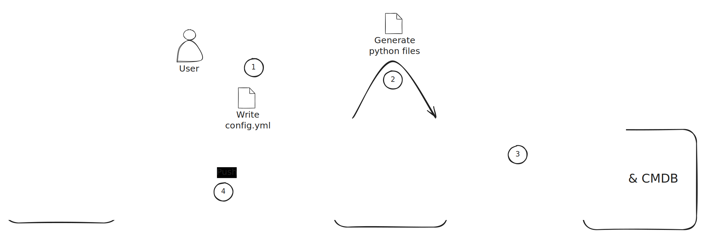

Learn how to use Infrahub Sync's commands to calculate differences, synchronize data, and apply previously cached plans against your destination.



:::info

Before generating the necessary Python code for your sync adapters and models and synchronizing, you need to create a configuration.
To create a new configuration, please refer to [Create a sync project](./creating-a-sync-project.mdx).

:::

## Listing available sync projects

```bash
infrahub-sync list --directory <your_configuration_directory>
```

Prints every sync project found under the given directory along with its source, destination, and on-disk location. Useful as a quick sanity check.

## Calculating differences

The `diff` command compares the source and destination without writing anything to the destination. It also writes a Parquet **plan** to the local cache so you can review the change set and replay it later with `apply`.

### Command

```bash
infrahub-sync diff --name <sync_project_name> --directory <your_configuration_directory>
```

### Parameters

- `--name` — name of the sync project to diff.
- `--directory` — directory holding your sync configuration.
- `--branch` — Infrahub branch to diff against (default `main`).
- `--show-progress / --no-show-progress` — toggle the per-resource progress bar.
- `--run-id` — re-use a specific cache run id; useful when you want to overwrite a previous run's plan in place.
- `--concurrent-load / --no-concurrent-load` — load source and destination concurrently (default on). Disable if a custom adapter isn't thread-safe; see [Concurrent loads](#concurrent-loads) below.
- `--full-extract / --no-full-extract` — default on; re-extract everything every run. Pass `--no-full-extract` to enable the cursor-driven incremental warm path. See [Incremental extraction](../reference/incremental-extraction).

Each invocation logs a `Cached run <run_id> at <run_dir>` line on success. Note that id — you can hand it to `apply` to dispatch the plan without re-extracting the source.

## Synchronizing data

The `sync` command runs `diff` and immediately applies the changes to the destination.

### Command

```bash
infrahub-sync sync --name <sync_project_name> --directory <your_configuration_directory>
```

### Parameters

- `--name` — name of the sync project to run.
- `--directory` — directory holding your sync configuration.
- `--branch` — Infrahub branch to sync against (default `main`).
- `--diff / --no-diff` — print the diff before syncing (default on).
- `--show-progress / --no-show-progress` — progress bar during sync.
- `--parallel / --no-parallel` — run tier-by-tier using the auto-computed dep graph (default on). Requires `order:` to be omitted from `config.yml` (see [Auto-tiered execution](../reference/config#auto-tiered-execution)). Falls back to serial when `order:` is set; a warning is logged so the no-op is visible.
- `--allow-rowcount-drop / --no-allow-rowcount-drop` — bypass the rowcount guardrail. Use only when you know the source intentionally shrank — otherwise sync refuses to proceed when any resource's row count has dropped by more than 50% since the last successful run.
- `--continue-on-error / --no-continue-on-error` — log and skip peer relationships whose identifier values are missing, instead of aborting the run. Useful when source data is partial; review the warnings before relying on the result.
- `--concurrent-load / --no-concurrent-load` — load source and destination concurrently (default on). See [Concurrent loads](#concurrent-loads) below.
- `--full-extract / --no-full-extract` — default on. Pass `--no-full-extract` for the cursor-driven incremental warm path; see [Incremental extraction](../reference/incremental-extraction).

Example:

```bash
infrahub-sync sync --name my_project --directory configs --diff --show-progress
```

### Concurrent loads

Source and destination loads run on a 2-thread pool by default. They hit independent services, write to independent in-memory stores, and write to disjoint cache subdirectories (`A/` vs `B/`), so the two loads are safe to run in parallel — and roughly halve the wall-clock time spent in the load phase on real APIs.

Disable with `--no-concurrent-load` if a custom adapter you've plugged in isn't thread-safe (most aren't an issue — the built-in NetBox, Nautobot, and Infrahub adapters are all fine).

### Tier-by-tier execution

When `--parallel` is set and `order:` is omitted, Infrahub Sync derives a write-order graph from the `reference:` entries in your `schema_mapping` and groups kinds into tiers. The engine narrows the destination's working set to one tier at a time, so no tier starts until every kind in the previous tier has finished writing. See [Auto-tiered execution](../reference/config#auto-tiered-execution) for the full rationale.

### Rowcount guardrail

After a successful sync, Infrahub Sync writes a per-resource baseline to `.infrahub-sync-cache/<sync>/last-successful-rowcounts.json`. The next run reads it; if any resource has shrunk by more than 50% the sync refuses to proceed unless you pass `--allow-rowcount-drop`. The threshold catches accidents like a partially-restored source or a credential that lost permissions, where syncing would otherwise wipe legitimate data on the destination.

## Reviewing and applying a cached plan

The cache pattern lets you split a run into two steps: produce a plan (`diff`), then apply it (`apply`). This is useful when you want a human approval gate, when the destination is briefly unreachable, or when you want to re-apply the same plan without re-fetching the source.

```bash
# 1. Dry-run — extracts source + destination, writes plan.parquet
infrahub-sync diff --name from-netbox --directory examples/

# Look at the logged line:
#   INFO | infrahub_sync.cli | Cached run 20260518T1430-abc12345 at .infrahub-sync-cache/from-netbox/20260518T1430-abc12345
#
# Inspect the diff or query the parquet directly with DuckDB:
#   duckdb -c "SELECT * FROM read_parquet('.infrahub-sync-cache/from-netbox/20260518T1430-abc12345/plan.parquet')"

# 2. Apply the cached plan — no source extraction
infrahub-sync apply --name from-netbox --run-id 20260518T1430-abc12345 --directory examples/
```

`apply` refuses to proceed if the destination's schema shape has drifted since the plan was built — the cached `schema-sub-hash.txt` must match the freshly-computed hash. When it doesn't, re-run `diff` to rebuild the plan.

For the full on-disk layout (per-resource Parquet snapshots, sidecar JSON files, the per-pipeline filelock), see the [Cache layout reference](../reference/cache-layout).

## Generating sync adapters and models

`infrahub-sync generate` reads your configuration file and emits Python code for the sync adapters and models used at runtime.

```bash
infrahub-sync generate --name <sync_project_name> --directory <your_configuration_directory>
```

You typically only run this once per configuration (and after editing `config.yml`).
