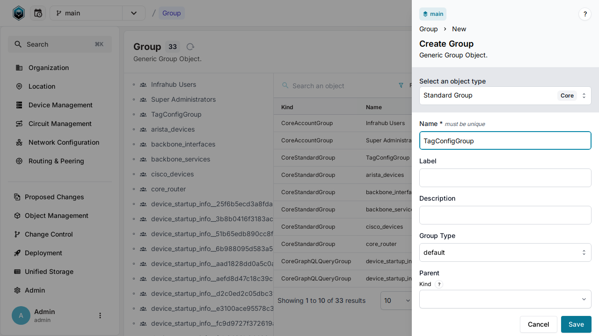
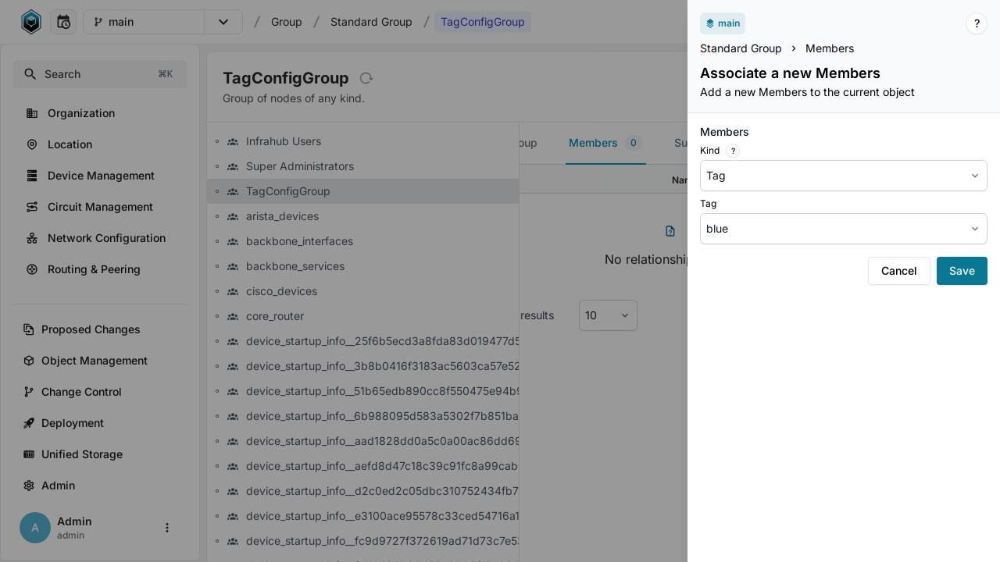
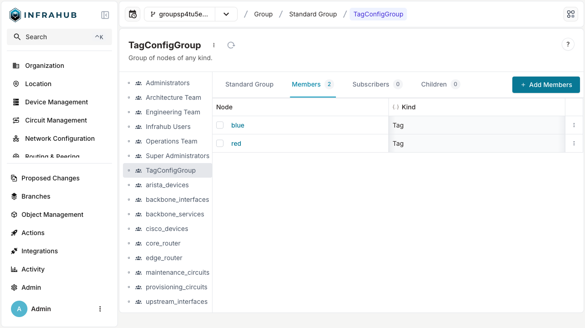

import Tabs from '@theme/Tabs';
import TabItem from '@theme/TabItem';

# Organize objects with groups

By the end of this tutorial you will have created a group, added two objects to it, and queried the result end-to-end. You'll leave with a concrete mental model of how groups work and where to go next.

This tutorial uses `BuiltinTag` objects so you can follow along without any special schema. The same steps apply to any object type.

## What you will need

- A running Infrahub instance (local or remote).
- Permission to create and modify groups.
- Two tags to add as members. If you don't have tags yet, create two called `red` and `blue` before starting.

## Step 1 — Create a new group

You'll create a Standard group named `TagConfigGroup`. A Standard group is the general-purpose type you create and manage yourself.

<Tabs groupId="method" queryString>
  <TabItem value="web" label="Web Interface" default>

Navigate to **Object Management** → **Groups** in the left menu. Click **New Group** and provide:

- Name: `TagConfigGroup`
- An optional description.
- Group type: `CoreStandardGroup`.



</TabItem>

  <TabItem value="graphql" label="GraphQL">

Open the GraphQL interface at `http://localhost:8000/graphql` and run:

```graphql
mutation CreateGroup {
  CoreStandardGroupCreate(data: {name: {value: "TagConfigGroup"}}) {
    ok
    object { hfid }
  }
}
```

Save the `hfid` returned — you'll use it in the next step.

</TabItem>

  <TabItem value="sdk" label="Python SDK">

```python
from infrahub_sdk import InfrahubClientSync

client = InfrahubClientSync(address="http://localhost:8000")

group = client.create(kind="CoreStandardGroup", name="TagConfigGroup")
group.save()
```

</TabItem>
</Tabs>

## Step 2 — Add two tags as members

Attach your `red` and `blue` tags to the group.

<Tabs groupId="method" queryString>
  <TabItem value="web" label="Web Interface" default>

1. Open `TagConfigGroup` from the Groups list.
2. Go to the **Members** tab.
3. Click **Add Members** and select `red` and `blue`.
4. Click **Save**.



</TabItem>

  <TabItem value="graphql" label="GraphQL">

First, look up the tag IDs:

```graphql
query {
  BuiltinTag(name__values: ["red", "blue"]) {
    edges {
      node { id display_label }
    }
  }
}
```

Then update the group with those IDs as members:

```graphql
mutation UpdateGroupMembers {
  CoreStandardGroupUpdate(
    data: {
      hfid: ["TagConfigGroup"],
      members: [
        {id: "<id of red tag>"},
        {id: "<id of blue tag>"}
      ]
    }
  ) {
    ok
  }
}
```

</TabItem>

  <TabItem value="sdk" label="Python SDK">

```python
group = client.get(kind="CoreStandardGroup", name__value="TagConfigGroup")

red_tag = client.get(kind="BuiltinTag", name__value="red")
blue_tag = client.get(kind="BuiltinTag", name__value="blue")

group.members.add(red_tag)
group.members.add(blue_tag)
group.save()
```

</TabItem>
</Tabs>

## Step 3 — Verify

Confirm both tags are now in the group.

<Tabs groupId="method" queryString>
  <TabItem value="web" label="Web Interface" default>

Open `TagConfigGroup` and check the **Members** tab. Both `red` and `blue` should appear.



</TabItem>

  <TabItem value="graphql" label="GraphQL">

```graphql
query {
  CoreStandardGroup(name__value: "TagConfigGroup") {
    edges {
      node {
        name { value }
        members {
          edges {
            node { display_label }
          }
        }
      }
    }
  }
}
```

</TabItem>

  <TabItem value="sdk" label="Python SDK">

```python
group = client.get(kind="CoreStandardGroup", name__value="TagConfigGroup")
for member in group.members.fetch():
    print(f"Member: {member.display_label}")
```

</TabItem>
</Tabs>

## What you learned

- Groups are first-class objects in the graph with their own attributes and relationships.
- A Standard group is manually managed — you decide what goes in it.
- Membership is a relationship, so changes flow through the graph and can be queried from either side.

## Where to next

- [Groups overview](../../groups/overview.mdx) — concepts, architecture, and when to choose each group type.
- [Add more members to a group](../../groups/add-members.mdx) — how-to reference.
- [Use groups in automation](../../groups/use-in-automation.mdx) — target groups from Artifacts, Transformations, and Checks.
