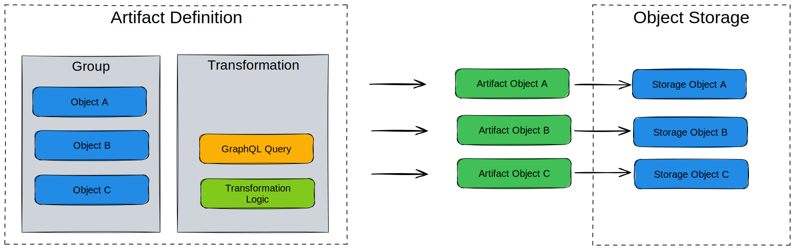
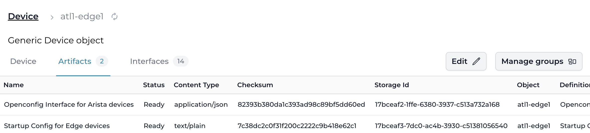

import VideoPlayer from '../../src/components/VideoPlayer';

# Artifacts

An artifact is the result of a [Transformation](../transformations/overview) for a specific context and/or object.

The following MIME types or formats are supported and will be rendered properly in Infrahub's web interface:

- application/json
- application/yaml
- application/xml
- application/hcl
- text/plain
- text/markdown
- text/csv
- image/svg+xml

:::success Examples

- For a network device, you can use an artifact to track the configuration generated from a Jinja template (Transformation).
- For a Security Device, an artifact can be the list of rules in JSON in the format of your choice generated by a Python Transformation.
- An artifact can also represent the configuration of a DNS server or the configuration of a specific Virtual IP on a load balancer.

:::

While it's always possible to generate [Transformations](../transformations/overview) on demand via the API, having an artifact provides additional benefits:

- **Caching**: Generated artifacts are stored in the internal [object storage](../artifact-file-storage/overview.mdx). For resource-intensive Transformations, it will significantly reduce the load of the system if an artifact can be served from the cache instead of regenerating each time.
- **Traceability**: Past values of an artifact remain available. In a future release, it will be possible to compare the value of an artifact over time.
- **Peer Review**: artifacts are automatically part of the [Proposed Change](../proposed-changes/overview) review process.
- **Database**: artifact nodes are stored in the database and other nodes can optionally have a relationship with them, which makes it possible to perform certain artifact related queries.

While the content of an artifact can change, its identifier will remain the same over time.

<center>
  <VideoPlayer url='https://www.youtube.com/watch?v=ASGMKZVLCbY' light />
</center>

## High level design

Artifacts are defined by grouping a [Transformation](../transformations/overview) with a [group](../groups/overview) of targets in an *artifact definition*.

An **artifact definition** centralizes all the information required to generate an artifact.

- [Group](../groups/overview) of targets - Specifies which objects will generate artifacts
- Transformation - Defines how to process the data
- Format of the output - MIME type for the generated content
- Information to extract from each target that must be passed to the Transformation

Groups provide flexible targeting that decouples artifact generation from specific object lists. You can add or remove objects from groups without modifying artifact definitions. See [Groups](../groups/overview) for details on creating target groups.

From an **artifact definition** artifact nodes are created, for each target which is part of the group. The result of the Transformation is stored in the [object storage](../artifact-file-storage/overview.mdx). The generation of the artifacts is performed by the Task worker(s).



## CoreArtifactTarget

A node for which you want to generate an artifact must inherit from the `CoreArtifactTarget` generic.

As a result of this, an artifacts tab will show up in the node's detailed view in the UI, which allows you to access all of the artifacts that have been generated for this node.



```yaml
nodes:
  - name: "Device"
    namespace: "Infra"
    inherit_from: ["CoreArtifactTarget"]
```

:::warning Deletion behavior
When a `CoreArtifactTarget` node is deleted, all artifacts associated with it are automatically deleted as well.
:::

## Composing content across artifacts

A Transformation can reference and include the rendered content of other artifacts or file objects using built-in Jinja2 filters or the Python SDK object store API. This enables modular configuration pipelines where each artifact generates one section, and a composite artifact assembles the final result.

For step-by-step instructions, see [Composing artifact content](./content-composition.mdx).

## When artifacts regenerate

An artifact is the cached output of a Transformation, so Infrahub regenerates it when its inputs change. Three kinds of change trigger regeneration:

- **The target's data changes** — a node read by the artifact's GraphQL query is modified, so that target's artifact is regenerated.
- **A new target joins the group** — an artifact is generated for the new member; existing artifacts are left untouched.
- **The definition's code or configuration changes** — when a proposed change commits to a linked repository, Infrahub regenerates an artifact only if the change touches that definition's GraphQL query, its Transformation's [dependency closure](../transformations/overview#dependency-tracking-and-regeneration), or the artifact definition itself. An unrelated commit — a README edit, or a helper no Transformation uses — regenerates nothing.

Every regeneration decision during a proposed change is recorded in the pipeline's task log, naming the file, query, or field that triggered it. See [Understanding artifact regeneration](../proposed-changes/overview#understanding-artifact-regeneration).

## How artifacts relate to other features

- **[Transformations](../transformations/overview)** define the logic that produces an artifact's content; an artifact is the cached output of a Transformation for a specific target.
- **Generators** create or update graph data; some Generators consume artifacts as part of their input pipeline.
- **[Object storage](../artifact-file-storage/overview.mdx)** is where artifact content lives on disk. See the storage topic for backend configuration and sizing.
- **[Proposed Changes](../proposed-changes/overview)** automatically include artifact diffs in their review surface, so changes to generated artifacts are visible alongside data changes.
