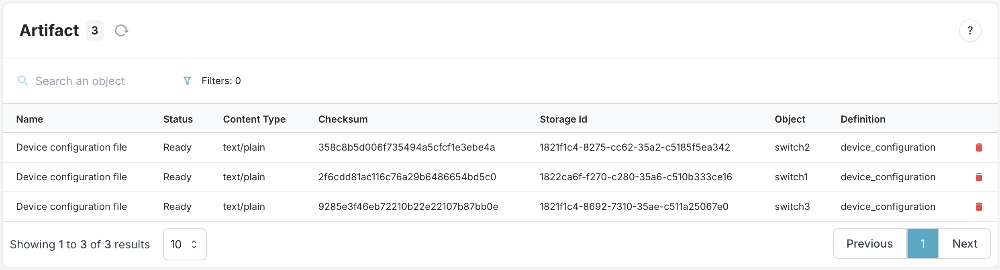
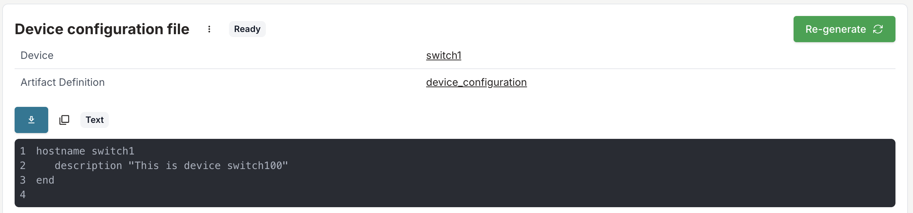
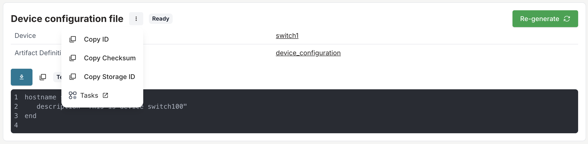

import VideoPlayer from '../../src/components/VideoPlayer';

# Use artifacts

Generate configuration files and other artifacts by combining Infrahub data with templates. This guide shows you how to create artifacts that automatically update when your infrastructure data changes.

For conceptual information about artifacts and their architecture, see [Artifacts](./overview).

> Assumes a working Infrahub instance, an existing Transformation ([Jinja2](../academy/tutorials/transformations/build-a-jinja2-transformation) or [Python](../academy/tutorials/transformations/build-a-python-transformation)), permission to create and modify schemas, and a Git repository connected to Infrahub.

## Enable artifact generation on your schema

To generate artifacts for specific nodes, modify your schema to inherit from `CoreArtifactTarget`.

```yaml
---
version: "1.0"
nodes:
  - name: Device
    namespace: Network
    display_label: "{{ name__value }}"
    inherit_from:
      - CoreArtifactTarget
    attributes:
      - name: name
        kind: Text
        label: Name
        optional: false
        unique: true
      - name: description
        kind: Text
        label: Description
        optional: true
```

Load the modified schema into Infrahub:

```bash
infrahubctl schema load /tmp/schema.yml
```

## Create a target group

Create a Standard Group to define which objects will generate artifacts.

1. Navigate to the Groups section in the web interface
2. Create a new Standard Group named `DeviceGroup`
3. Add your target devices (`switch1`, `switch2`, `switch3`) as members

For detailed group creation steps, see [Create a group](../groups/create).

<center>
  <VideoPlayer url='https://www.youtube.com/watch?v=ASGMKZVLCbY' light />
</center>

## Define the artifact generation

Add an artifact definition to your repository's `.infrahub.yml` file:

```yaml
artifact_definitions:
  - name: "Device configuration file"
    artifact_name: "device_configuration"
    parameters:
      name: "name__value"
    content_type: "text/plain"
    targets: "DeviceGroup"
    transformation: "device_config_transform"
```

This configuration specifies:

- **name**: Machine identifier (no spaces)
- **artifact_name**: Human-readable label
- **parameters**: Values passed to the Transformation query
- **content_type**: MIME type of the generated artifact
- **targets**: Group containing target objects
- **transformation**: Name of the Jinja2 or Python Transformation

For complete `.infrahub.yml` syntax, see [infrahub.yml configuration](../git-integration/infrahub-yml).

## Deploy the artifact definition

Commit and push your changes to activate the artifact generation:

```shell
git add .
git commit -m "add device_configuration artifact definition"
git push origin main
```

The task workers will detect the repository change and create the artifact definition in the database.

## Verify artifact generation

Check that your artifacts are being generated correctly.

### Through the web interface

1. Navigate to **Object Management** → **Artifacts**
2. Locate your generated artifacts in the list



3. Click on an artifact to view its content



### Through object details

1. Navigate to a specific device (for example, `switch1`)
<!-- vale off -->
2. Select the **Artifacts** tab
<!-- vale on -->
3. View all artifacts generated for this object

## Access generated artifacts

Download or retrieve your artifacts using these methods:

### Web interface download

Click the download button on any artifact detail page.

### REST API access

Download artifacts using the storage object endpoint (authentication required):

```bash
curl -H "X-INFRAHUB-KEY: <your-api-token>" \
  http://<INFRAHUB_HOST:INFRAHUB_PORT>/api/storage/object/<storage_identifier>
```

Copy the artifact ID from the artifact menu:



### Programmatic access

Query artifacts through the GraphQL API for automation workflows.

## Validation

Confirm your artifact generation is working:

- ✓ artifact definitions appear in the web interface
- ✓ artifacts are generated for all group members
- ✓ Generated content matches your template expectations
- ✓ artifacts update when source data changes

## Troubleshooting

If artifacts aren't generating:

1. Check task worker logs for processing errors
2. Verify the Transformation name matches exactly
3. Ensure group members inherit from `CoreArtifactTarget`
4. Confirm the Git repository sync is working

## Related

- [Artifacts](./overview) — concept and architecture
- [Composing artifact content](./content-composition) — assemble a composite artifact from other artifacts or file objects
- [Write a Python Transformation](../academy/tutorials/transformations/build-a-python-transformation) — for non-template logic
- [Transformations](../transformations/overview) — reshape graph data into another format
- [Connect a repository](../git-integration/connect-repository) — automate artifact deployment
