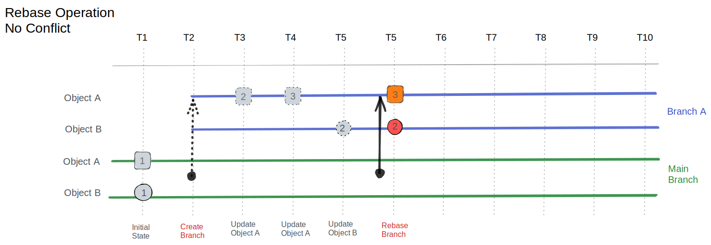

Rebasing is a powerful operation that updates a branch with the latest changes from its parent branch. This is essential for maintaining branch health and ensuring smooth integration of changes.

## Why rebase

Rebasing serves several important purposes:

- **Resolving conflicts before merge**: Identify and address conflicts in the development branch before creating a Proposed Change, reducing complexity during the review process.
- **Incorporating upstream changes**: Ensure your branch includes the latest updates from the main branch, preventing drift and maintaining compatibility with recent changes.
- **Maintaining a clean merge history**: Produce a cleaner, more linear history that's easier to understand and navigate.

## How rebase works

During the rebase process, Infrahub performs the following steps:

1. The branch's base point (`branched_from`) updates to the current time, establishing a new foundation for the branch.
2. Changes in the branch are analyzed and replayed on top of the new base, incorporating the latest state from the parent branch.
3. Conflicts that arise during this process require manual resolution, allowing developers to make informed decisions about how to integrate conflicting changes. See [Resolve conflicts](./resolve-conflicts.mdx).
4. The branch history resets, preserving only the final state. This simplification makes the branch easier to understand and work with.

## How to rebase

Rebasing can be initiated through the Infrahub user interface or API.

## Related

- [Branches](./overview.mdx) — branch lifecycle and concepts
- [Resolve conflicts](./resolve-conflicts.mdx) — when rebase surfaces conflicting changes
- [Merge a branch](./merge.mdx) — once rebase is complete and the branch is up-to-date
