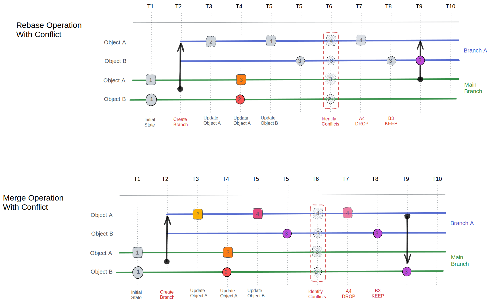

Conflicts occur when the same data changes in both a feature branch and the main branch. Infrahub's conflict management system is designed to identify these conflicts with precision and provide tools for effective resolution.

## Types of conflicts Infrahub detects

The system automatically detects several types of conflicts:

- **Attribute conflicts**: The same field of an object has been modified in both branches with different values. For example, the hostname of a device is changed to `router-1` in one branch and `router-primary` in another.
- **Relationship conflicts**: Conflicting changes to object relationships occur when the connections between objects are modified differently in separate branches. For instance, a device might be assigned to datacenter A in one branch and datacenter B in another.
- **Schema conflicts**: Incompatible schema modifications between branches can cause structural conflicts. This might happen when a field is removed in one branch but modified in another.
- **Uniqueness conflicts**: Changes that would violate uniqueness constraints upon merge are flagged to prevent data integrity issues. This occurs when both branches create different objects with the same unique identifier.

## How to resolve conflicts

The [Proposed Change](../proposed-changes/overview.mdx) feature in Infrahub provides comprehensive tools for managing these conflicts with intuitive side-by-side diffs that clearly highlight differences between branches. For step-by-step resolution mechanics during review, see [Resolve a proposed-change conflict](../proposed-changes/resolve-conflict.mdx).

Conflicts can also surface during a [rebase](./rebase.mdx), in which case they require manual resolution before the rebase completes.

## Related

- [Branches](./overview.mdx) — branch lifecycle and concepts
- [Rebase a branch](./rebase.mdx) — surfaces conflicts early before merge
- [Resolve a proposed-change conflict](../proposed-changes/resolve-conflict.mdx) — review-time conflict resolution
