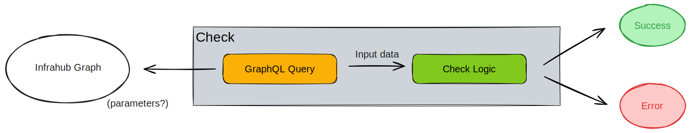

Checks are user-defined logic, stored in an [external repository linked to Infrahub](../git-integration/overview.mdx), that run as part of a [proposed change](../proposed-changes/overview.mdx). They let users perform any kind of data validation logic during a proposed change. If a check does not complete successfully, the proposed change cannot be merged.

Some examples:

- Name validation against a naming convention for all infrastructure components in the database
- Validate that we always have a redundant WAN circuit in operational state for every site
- Validate that all internet-facing interfaces have an inbound access-list associated

## High level design

A check is composed of two main components:

- A GraphQL query that defines the input data
- Check logic in the Python language that validates the data

## Targeted checks

Targeted checks are exactly the same as a check; the main difference is that they target a specific [group](../groups/overview) of nodes in Infrahub. The check will then only be executed against the nodes in that group.

This approach leverages groups to enable scalable validation — instead of running checks against all objects of a type, you can focus validation on logically related objects. Groups provide flexible targeting that can be updated independently of the check definitions.

An example: you want to validate that all devices for which we generate an OpenConfig artifact have the NETCONF service enabled. By targeting the group used for artifact generation, the check automatically stays synchronized with the artifact scope.

See [Groups](../groups/overview.mdx) for details on creating target groups for your checks.

## Learn by doing

Walk through [Build a check](../academy/tutorials/build-a-check.mdx) in Academy to set up the GraphQL query, implement the check logic, configure `.infrahub.yml`, and validate the check against a proposed change end-to-end.

## Related

- [Proposed Changes](../proposed-changes/overview.mdx) — where checks run
- [Repository Management](../git-integration/overview.mdx) — where check code lives
- [Groups](../groups/overview.mdx) — used to target checks at specific subsets of objects
