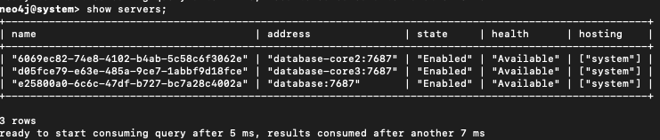
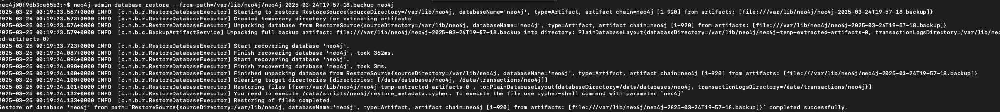
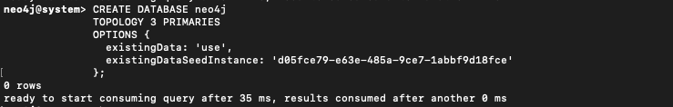
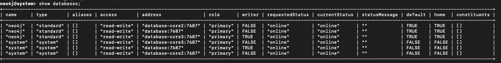
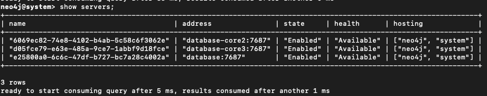
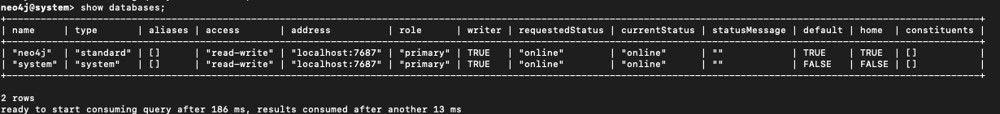
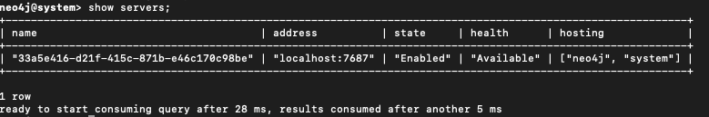

import EnterpriseBadge from '@site/src/components/EnterpriseBadge';

# Cluster backup and restore <EnterpriseBadge />

If you're running Infrahub with a Neo4j cluster, follow these steps to backup from one node and restore to another while maintaining cluster integrity.

For standalone deployments, see [Backup and restore](./backup-and-restore.mdx).

## Prerequisites for cluster operations

- Neo4j cluster with at least 3 nodes
- Administrative access to all cluster nodes
- Understanding of your cluster topology (leader and follower nodes)

:::caution
Always run backup and restore commands as the `neo4j` user inside containers to avoid permission issues with data files.
:::

Example cluster topology

| Node             | Role     |
|------------------|----------|
| `database`       | Leader   |
| `database-core2` | Follower |
| `database-core3` | Follower |

## Backup and restore within a cluster

### Step 1: Create backup from a follower node

```bash
docker exec -it -u neo4j infrahub-database-core2-1 bash
mkdir -p backups
neo4j-admin database backup --to-path=backups/ neo4j
ls backups
# Output should include:
# neo4j-2025-03-24T19-57-18.backup
```

### Step 2: Transfer backup to target node

```bash
# Copy from source container to local
docker cp infrahub-database-core2-1:/var/lib/neo4j/backups/neo4j-2025-03-24T19-57-18.backup .

# Copy from local to target container
docker cp neo4j-2025-03-24T19-57-18.backup \
  infrahub-database-core3-1:/var/lib/neo4j/
```

### Step 3: Drop database cluster-wide

Connect to any cluster node:

```bash
cypher-shell -d system -u neo4j
DROP DATABASE neo4j;
SHOW SERVERS;
```

<center>

</center>

### Step 4: Clean target node data

Connect to the target container:

```bash
docker exec -it -u neo4j infrahub-database-core3-1 bash
```

Remove any existing data to avoid corruption:

```bash
rm -rf /data/databases/neo4j
rm -rf /data/transactions/neo4j
```

Then restart the container to ensure a clean state:

```bash
docker restart infrahub-database-core3-1
```

### Step 5: Restore backup on target node

Reconnect to the container:

```bash
docker exec -it -u neo4j infrahub-database-core3-1 bash
```

Run the restore command:

```bash
neo4j-admin database restore \
  --from-path=/var/lib/neo4j/neo4j-2025-03-24T19-57-18.backup neo4j
```

<center>

</center>

### Step 6: Identify seed instance id

Connect via Cypher shell (on the system database):

```bash
cypher-shell -d system -u neo4j
```

Run:

```bash
SHOW SERVERS;
```

Note the `serverId` for your target node (example: `d05fce79-e63e-485a-9ce7-1abbf9d18fce`).

<center>

</center>

### Step 7: Recreate database from seed

Run the following Cypher command:

```bash
CREATE DATABASE neo4j
TOPOLOGY 3 PRIMARIES
OPTIONS {
  existingData: 'use',
  existingDataSeedInstance: 'd05fce79-e63e-485a-9ce7-1abbf9d18fce'
};
```

<center>

</center>

### Step 8: Verify cluster sync

Check that the database is coming online:

```bash
SHOW DATABASES;
```

<center>

</center>

Then validate cluster sync status:

```bash
SHOW SERVERS;
```

<center>

</center>

All nodes should eventually show the Neo4j database as online.

:::tip Troubleshooting

- If nodes show as **dirty** or **offline**, check logs and verify `/data/databases/neo4j/neostore` exists
- The `CREATE DATABASE ... OPTIONS { existingData: 'use' }` command is required to register restored data with the cluster

:::

## Restore cluster backup to standalone instance

If you need to analyze data from a production cluster in an isolated environment, follow these steps to restore a cluster backup to a standalone Neo4j instance.

### Step 1: Create cluster backup

Create a backup from any cluster node:

```bash
neo4j-admin database backup --to-path=backups/ neo4j
# Resulting file: neo4j-2025-03-24T19-57-18.backup
```

### Step 2: Transfer backup to standalone instance

```bash
docker cp neo4j-2025-03-24T19-57-18.backup \
  infrahub-database-1:/var/lib/neo4j/
```

### Step 3: Prepare standalone instance

Connect to the container:

```bash
docker exec -it -u neo4j infrahub-database-1 bash
```

Clean any existing Neo4j database (optional but recommended):

```bash
rm -rf /data/databases/neo4j
rm -rf /data/transactions/neo4j
```

Drop the Neo4j Database

```bash
cypher-shell -d system -u neo4j
DROP DATABASE neo4j;
SHOW SERVERS;
```

<center>

</center>

### Step 4: Restore the backup

Restore the backup file:

```bash
neo4j-admin database restore \
  --from-path=/var/lib/neo4j/neo4j-2025-03-24T19-57-18.backup neo4j
```

### Step 5: Create the database

Run the following Cypher command:

```bash
CREATE DATABASE neo4j
```

### Step 6: Verify the status

Check that the database is coming online:

```bash
SHOW DATABASES;
```

<center>

</center>

Then validate database status:

```bash
SHOW SERVERS;
```

<center>

</center>

:::info
This process restores only data, not cluster roles, replication, or configuration settings.
:::

## Related resources

- [Database backup overview](./overview.mdx) - Architecture and backup strategy concepts
- [Backup and restore](./backup-and-restore.mdx) - Step-by-step instructions for standalone deployments
