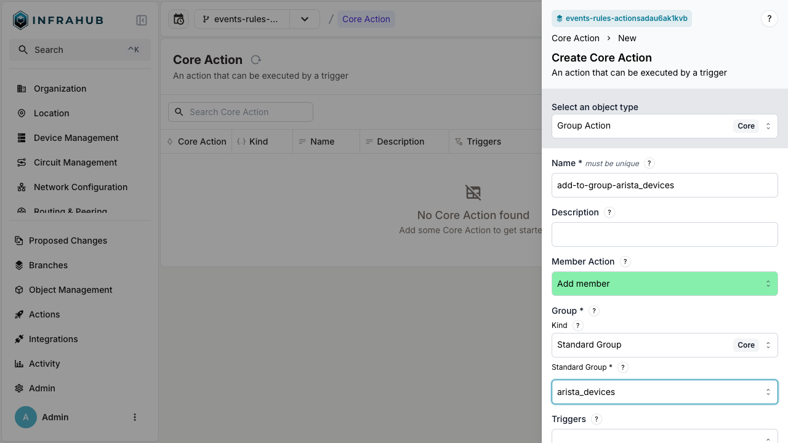
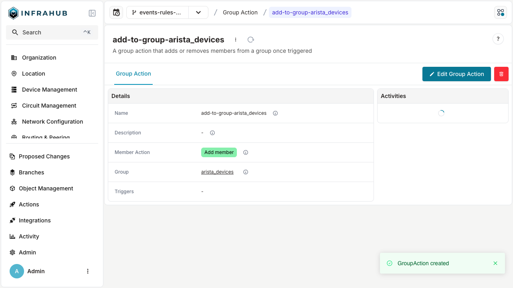
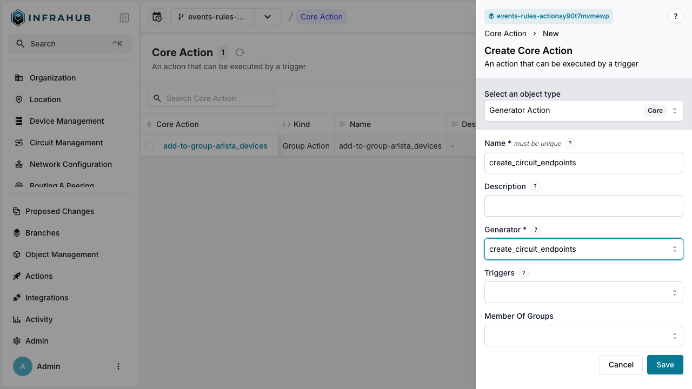

# Event actions

An event action is a node you create in Infrahub that defines an outcome: add a device to a group, run a Generator definition. Actions on their own do nothing — they fire only when an [event rule](./event-rules) matches and points at them.

Actions inherit from the `CoreAction` generic. Two action kinds exist because the most common automated outcomes fall into two categories: modifying group membership, or running a Generator against the impacted object.

| Action kind | Effect | Example |
|---|---|---|
| `CoreGroupAction` | Adds or removes members from a group | Add a device to `arista_devices` when a node trigger rule fires |
| `CoreGeneratorAction` | Runs a Generator definition against the impacted object | Run `create_circuit_endpoints` when a group trigger rule fires on `provisioning_circuits` |

[Webhooks](../webhooks/overview) are a related concept — they also fire in response to events — but they live outside the rule/action loop because their setup is more involved. Use a Generator action when the outcome stays inside Infrahub; use a webhook when you need to send a payload to an external HTTP endpoint.

## Configure a group action

A group action adds or removes nodes from a group when triggered.

1. Navigate to the **Actions** page.
2. Click **Create** and select **Group Action**.
3. Configure the action:
   - Enter a name (example: `add-to-group-arista_devices`)
   - Select the associated kind of group (example: `Standard Group Core`)
   - Choose the target group (example: `arista_devices`)
   - Click **Save**.

After saving, the details page shows the action's configuration:

The action appears in the actions list and can be referenced by any trigger rule.

## Configure a Generator action

A Generator action runs a Generator definition when triggered. The Generator receives the impacted object as its target.

1. Navigate to the **Actions** page.
2. Click **Create** and select **Generator Action**.
3. Configure the action:
   - Enter a name (example: `create_circuit_endpoints`)
   - Select the Generator (example: `create_circuit_endpoints`)
   - Click **Save**.

The action appears in the actions list and can be referenced by any trigger rule.

## Related

- [Event rules](./event-rules) — the conditions that fire actions
- [Event system](./event-system) — what events are and where they come from
- [Webhooks](../webhooks/overview) — a related event-driven outcome that lives outside the rule/action loop
