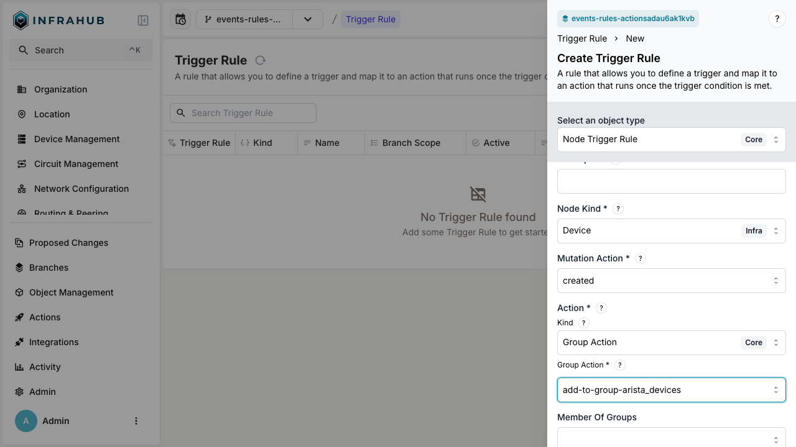
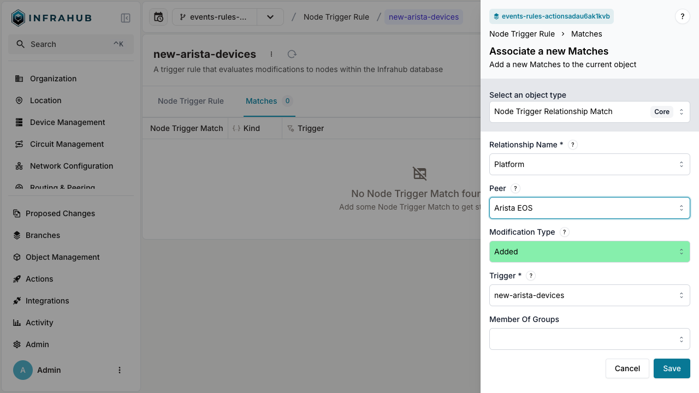
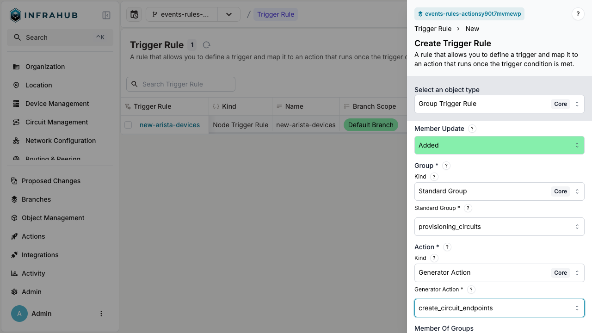

# Event rules

An event rule is a node you create in Infrahub that names a set of conditions and ties one or more actions to fire when those conditions match. Rules turn raw events into useful automation: instead of reacting to every `infrahub.node.updated` event, you describe the precise update you care about — "an `InfraDevice` whose status changed to `active`" — and Infrahub runs your action only when that pattern shows up.

Rules inherit from the `CoreTriggerRule` generic. Two rule kinds exist because matchable events come from two sources: mutations on specific nodes, and changes to group membership.

| Rule kind | Use it to match | Example |
|---|---|---|
| `CoreNodeTriggerRule` | mutations on specific nodes | An attribute change on `InfraDevice`, a relationship update on `InfraInterface` |
| `CoreGroupTriggerRule` | changes to group membership | A member added to `provisioning_circuits`, a member removed from `arista_devices` |

## Match filters

By default, a rule fires for any event of the configured type. To narrow it down, add match filters. All conditions must be satisfied — match filters use logical AND, not OR.

**Attribute matches** filter on the new value, the previous value, or both:

- New value — match the attribute's value after the change
- Previous value — match the attribute's value before the change
- Both — match a transition (for example, previous = `inactive` AND new = `active`)

**Relationship matches** filter on the modification type and the peer:

- Modification type — added, removed, or modified
- Peer — the node type or specific node instance on the other side of the relationship

> Example: to trigger only when a device's status transitions from `inactive` to `active`, create an attribute match with previous value = `inactive` and new value = `active`.

## Configure a node trigger rule

A node trigger rule fires when a node is created, updated, or deleted.

1. Navigate to the **Trigger Rules** page.
2. Click **Create** and select **Node Trigger**.
3. Configure the rule:
   - Enter a name (example: `new-arista-devices`)
   - Select the node kind (example: `Device Infra`)
   - Choose the mutation action (example: `created`)
   - Select the action kind (example: `Group Action Core`)
   - Choose the action that the rule will fire (example: `add-to-group-arista_devices`)
   - Click **Save**.

4. Add match conditions to refine when the rule fires:
   - Open the **Matches** tab.
   - Click **Add Match**.
   - Select **Node Trigger Relationship**.
   - Choose the relationship name (example: `Platform`).
   - Select the peer (example: `Arista EOS`).
   - Click **Save**.

After saving, the rule appears in the trigger rules list as inactive. Activate it when you're ready to start matching events.

:::success Best practice
Keep the rule inactive until you've configured all match conditions, then activate it. An active rule starts evaluating events immediately.
:::

## Configure a group trigger rule

A group trigger rule fires when a group's membership changes (member added or removed).

1. Navigate to the **Trigger Rules** page.
2. Click **Create** and select **Group Trigger**.
3. Configure the rule:
   - Enter a name (example: `added-to-provisioning-circuits-group`)
   - Select the kind (example: `Standard Group Core`)
   - Choose the standard group (example: `provisioning_circuits`)
   - Select the action kind (example: `Generator Action Core`)
   - Choose the Generator action that the rule will fire (example: `create_circuit_endpoints`)
   - Click **Save**.

After saving, the rule appears in the trigger rules list as inactive. Activate it when you're ready to start matching events.

## Related

- [Event actions](./event-actions) — the outcomes that rules fire
- [Event system](./event-system) — what events are and where they come from
