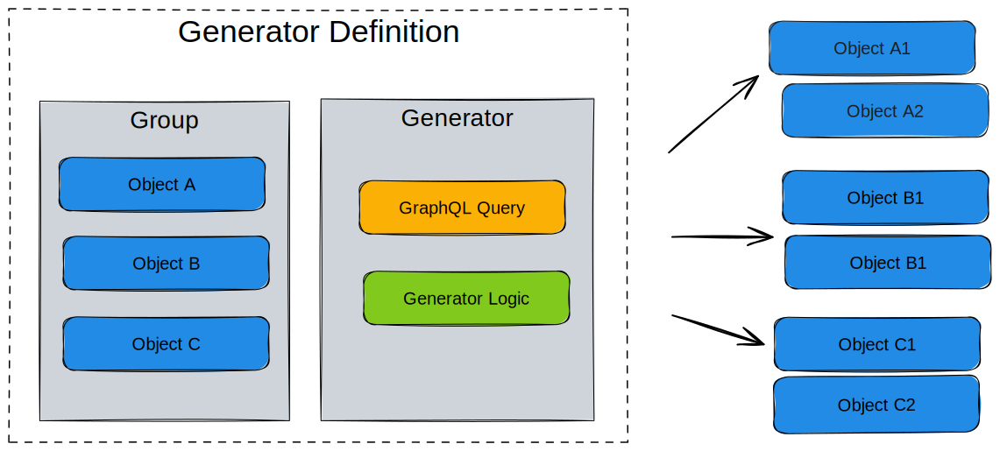

import VideoPlayer from '../../src/components/VideoPlayer';

A `Generator` is a generic plugin that queries data and creates new nodes and relationships based on the result.

:::success Examples

- Within your [schema](../schema/overview) you could create an abstract service object that through a Generator creates other nodes.
- Want to read how Generators can be used to create a service catalog? See our blog post on [How to Turn Your Source of Truth into a Service Factory](https://www.opsmill.com/how-to-turn-your-source-of-truth-into-a-service-factory/).
:::

## High level design

Generators are defined as a **Generator definition** within an [.infrahub.yml](../git-integration/infrahub-yml) file. A Generator definition consists of a number of related objects.

- [Group](../groups/overview) of targets - Objects that the Generator will act upon
- Generator class - Python code that defines the generation logic
- GraphQL Query - Data collection specification



Running a Generator definition will create new nodes as defined by the Generator, or remove old ones that are no longer required. The removal of obsolete objects is handled using the [SDK tracking feature]($(base_url)python-sdk/topics/tracking)

The targets point to a [group](../groups/overview) that will consist of objects that are impacted by the Generator. The members of this group can be any type of object within your schema, service objects, devices, contracts or anything you want the Generator to act upon. Generator groups (`CoreGeneratorGroup`) serve as target collections that define which objects trigger Generator execution, while the actual tracking of generated objects is handled by individual Generator instances.

The [GraphQL query](../development-resources/graphql/overview) defines the data that will be collected when running the Generator. Any object identified in this step is added as a member to a GraphQL query [group](../groups/overview) (`CoreGraphQLQueryGroup`). The membership in these groups are then used to determine which Generators need to be executed as part of a proposed change during the pipeline run.

The Generator itself is a Python class that is based on the `InfrahubGenerator` class from the SDK. Just like [Transformations](../transformations/overview) and [checks](../checks/overview), the Generators are user defined.

Generators can be executed in several ways, depending on your workflow and where you are in the lifecycle (local development vs. in Infrahub):

1. During development with infrahubctl

   Use the `infrahubctl generator` command to iterate locally while building and testing your Generator.
2. Manually from the UI

   From the Infrahub UI, open the Generator Definition detail page (Actions > Generator Definitions) and click Run to trigger the Generator on demand.
3. Automatically via Proposed Changes

   When you open a Proposed Change that affects the Generator's targets, the Generator runs as part of Infrahub's CI checks. Review the results in the Checks and Data tabs of the Proposed Change. This behavior can also be disabled per Generator in the repository configuration file.
4. Automatically via Events and Actions

   You can configure Infrahub Event rules and Actions to trigger Generators automatically based on changes in your data. This enables fully automated execution aligned with your workflows.

## Per-target execution model

Infrahub does **not** run a Generator once for the entire target group. Instead, it creates one independent run per member of the target group.

When you trigger a Generator definition, Infrahub:

1. Fetches the target group and enumerates its members.
2. For each member, extracts scoped variables from the target object using the `parameters` mapping.
3. Creates an independent Generator run for that member, passing the scoped variables to the GraphQL query.

A Generator definition targeting a group with 10 members produces 10 separate runs. Each run sees only the data relevant to its specific target object.

```text
Generator Definition
  │
  ▼
Target Group
  ├── Member A  →  Run A (variables from A)
  ├── Member B  →  Run B (variables from B)
  └── Member C  →  Run C (variables from C)
```

Each run is fully independent — it has its own query variables, its own query results, and its own Generator instance. Runs do not share state.

## Query parameter mapping

The `parameters` field in `.infrahub.yml` controls how Infrahub extracts variables from each target object and passes them to the GraphQL query. This is the mechanism that scopes each run to its target.

### How it works

Given this Generator definition:

```yaml
generator_definitions:
  - name: widget_generator
    file_path: "generators/widget_generator.py"
    targets: widgets
    query: widget_query
    class_name: WidgetGenerator
    parameters:
      name: "name__value"
```

And this GraphQL query:

```graphql
query Widgets($name: String!) {
  TestWidget(name__value: $name) {
    edges {
      node {
        name { value }
        count { value }
      }
    }
  }
}
```

For each member of the `widgets` group, Infrahub:

1. Reads the parameter mapping: `name` → `"name__value"`
2. Extracts the value from the target object using the defined path
3. Passes it as a query variable

For example:

| Target object | Extraction path        | Extracted value | Query variable          |
|---------------|------------------------|-----------------|-------------------------|
| `widget1`     | `widget1.name.value`   | `"widget1"`     | `$name = "widget1"`     |
| `widget2`     | `widget2.name.value`   | `"widget2"`     | `$name = "widget2"`     |

Each run's GraphQL query only returns data for its specific target, keeping runs independent.

### Double-underscore notation

The double-underscore (`__`) in parameter values traverses the object hierarchy:

- `name__value`: attribute `name`, property `value`
- `location__name__value`: relationship `location` (cardinality-one), then attribute `name`, property `value`

The first segment is checked against the object's schema. If it matches an attribute, the remaining segments traverse the attribute's properties. If it matches a cardinality-one relationship, Infrahub fetches the related node and continues the traversal recursively.

:::info
Only cardinality-one relationships are supported in parameter paths. Cardinality-many relationships cannot be traversed this way.
:::

## Parallel execution

Because each run is independent — scoped to one target object with no shared state — Infrahub dispatches all runs for a Generator definition concurrently.

This means:

- **All members of a target group are processed in parallel**, not sequentially.
- **Performance scales with available workers**, not with target count. A group with 100 members doesn't take 100x longer than a group with 1 member.
- **Different Generator definitions** can also run concurrently when triggered independently.

### What this means for Generator design

Because runs are concurrent:

- Your Generator code should not depend on side effects from other runs of the same Generator.
- Each run should be self-contained — it reads its scoped data, creates its objects, and finishes.
- If you need ordering (layer A must complete before layer B starts), use separate Generator definitions with a trigger mechanism rather than relying on execution order within a single definition. See [modular Generators](./modular.mdx) for this pattern.

## Generator instances

Each per-target run creates or updates a `CoreGeneratorInstance` — a tracking object that links three things together:

1. The **Generator definition** that was run
2. The **target object** (the specific group member)
3. The **status** of that run (`pending`, `ready`, or `error`)

Generator instances enable:

- **Per-target status tracking**: you can see which targets succeeded and which failed, without needing to inspect logs.
- **Selective re-runs**: you can re-run the Generator for a single target object without affecting others. Only the instance for that target gets updated.
- **Object lifecycle management**: the instance links the Generator to the objects it created, enabling cleanup when a target is removed.

You can view Generator instances in the Infrahub UI under the Generator Definition detail page.

## Designing groups for parallelism

Since group structure determines execution structure, how you organize your target groups directly affects parallelism and operational flexibility.

### The principle

**Group at the level where you want independent execution.** If racks should generate independently, make racks the target — not pods. If entire sites should generate as a unit, make sites the target.

More members in the target group means more parallel runs and better utilization of available workers.

### Example: modular parallelism

In a modular Generator setup (see [modular Generators](./modular.mdx)), parallelism increases at each layer:

| Layer  | Target group | Members      | Parallel runs |
|--------|--------------|--------------|---------------|
| Fabric | `dc_fabrics` | 1 fabric     | 1             |
| Pod    | `dc_pods`    | 4-8 pods     | 4-8           |
| Rack   | `dc_racks`   | 32+ racks    | 32+           |

The fabric Generator runs once (1 target). It creates pod objects. The pod Generator runs 4-8 times concurrently. Each pod Generator creates rack objects. The rack Generator runs 32+ times concurrently. Total parallelism is multiplicative across layers.

### Guideline: prefer more, smaller targets

A single Generator targeting a group with one member that creates 100 objects runs as one sequential operation. The same work split across 10 targets with 10 objects each runs as 10 concurrent operations — significantly faster on a system with available capacity.

## The relationship between `member_of_groups` and Generator targeting

Objects become Generator targets by being members of the group specified in the Generator definition's `targets` field.

### How objects become targets

You add objects to a target group through the `member_of_groups` relationship, which can be set:

- **In the UI**: when creating or editing an object (see [organizing objects with groups](../groups/overview))
- **In object files**: define group membership in your YAML object definitions
- **Programmatically**: via the SDK or GraphQL mutations

### Dynamic targeting

Adding or removing group members changes what gets targeted on the next Generator run:

- **Add an object to the group**: it becomes a target and gets its own Generator run next time the definition executes
- **Remove an object from the group**: it is no longer targeted (existing generated objects are not automatically cleaned up — see [known limitation #3289](https://github.com/opsmill/infrahub/issues/3289))

### Standard groups vs. Generator groups

These two group types serve different purposes and are often confused:

| Group type            | Purpose                                                                                            | You manage it |
|-----------------------|----------------------------------------------------------------------------------------------------|---------------|
| `CoreStandardGroup`   | Defines which objects are **targeted by** a Generator. Listed in the `targets` field of the Generator definition. | Yes — you create it and control membership |
| `CoreGeneratorGroup`  | Tracks which objects were **created by** a Generator instance. Managed automatically by the SDK tracking feature. | No — Infrahub manages this automatically |

The target group (`CoreStandardGroup`) is an input to the Generator — "run against these objects." The Generator group (`CoreGeneratorGroup`) is an output — "these objects were created by this Generator."

## Query response modes

The `convert_query_response` flag in `.infrahub.yml` controls how the GraphQL query results are delivered to your `generate()` method. This affects how you access data and what SDK features are available.

### Raw dict mode (default)

When `convert_query_response` is `false` (the default), the `data` parameter passed to `generate()` is the raw GraphQL response dictionary:

```python
class DeviceGenerator(InfrahubGenerator):
    async def generate(self, data: dict) -> None:
        for edge in data["TestDevice"]["edges"]:
            device_name = edge["node"]["name"]["value"]
            device_role = edge["node"]["role"]["value"]
            # ... create objects using self.client
```

This is the more lightweight mode — no conversion overhead, and you work with plain Python dictionaries. You can also use [Pydantic models](https://docs.pydantic.dev/) to parse the response into typed objects for better IDE support and validation.

### SDK object mode

When `convert_query_response` is `true`, Infrahub converts the GraphQL response into `InfrahubNode` SDK objects. These are available via `self.nodes` and `self.store`. You do **not** use the `data` parameter in this mode:

```python
class DeviceGenerator(InfrahubGenerator):
    async def generate(self, data: dict) -> None:
        for device in self.nodes:
            device_name = device.name.value
            device_role = device.role.value
            # SDK features available: relationships, .save(), .delete()
```

### When to use each

| Use raw dict mode (`false`) when                      | Use SDK object mode (`true`) when                                                                   |
|-------------------------------------------------------|-----------------------------------------------------------------------------------------------------|
| Dict access is sufficient for your use case           | You need SDK features like `.save()`, `.delete()`, or relationship traversal on the queried objects |
| You want minimal overhead                             | You prefer cleaner attribute access (`node.name.value` vs `node["name"]["value"]`)                  |
| The query returns a flat structure                    | You want to use `self.store` to look up nodes by ID                                                 |
| You want to use Pydantic models for type-safe parsing | You want the SDK to handle response parsing automatically                                           |

## Execution lifecycle

The `execute_in_proposed_change` and `execute_after_merge` flags in `.infrahub.yml` control **when** a Generator runs in relation to the branch lifecycle.

### `execute_in_proposed_change` (default: `true`)

When `true`, the Generator runs during proposed change CI.

When `false`, the Generator is skipped entirely in proposed changes. Use this for Generators that are triggered by events (checksum triggers) or when you want to manually run the generator.

### `execute_after_merge` (default: `true`)

When `true`, the Generator runs again after the branch has been merged.

When `false`, the Generator will not run after the branch has been merged.

## Video guides

The video series below dives into the concept of Generators and services, exploring their significance, structure, and how they can streamline processes for teams. Whether you're a developer or just curious about automation in IT, the series provides a comprehensive understanding of Generators and their applications.

The first video will highlight what Generators are and how they can be used to deliver services.

<center>
  <VideoPlayer url='https://www.youtube.com/watch?v=TSqY0caGb0A' light />
    <br />
</center>

In the second video we will look at how to plan a Generator from coming up with a use case and then finally what the workflow may look like in pseudocode.

<center>
  <VideoPlayer url='https://www.youtube.com/watch?v=7oM2W8Kn2-U' light />
  <br />
</center>

In the third video we will look at how a Generator can be created and run in Infrahub. Looking at the `.infrahub.yml` file the GraphQL query the Generator will run against and finally the logic that will be run against Infrahub to create objects and bring the service to life.

<center>
  <VideoPlayer url='https://www.youtube.com/watch?v=HSUVWm3Se28' light />
</center>

## Known limitations

- [3289](https://github.com/opsmill/infrahub/issues/3289) deleting a Generator target object should delete the created objects of that target

## Learn by doing

For a step-by-step walkthrough that builds a Generator from scratch, see [Build your first Generator](../academy/tutorials/generators/build-your-first-generator) in the Academy tutorials.
