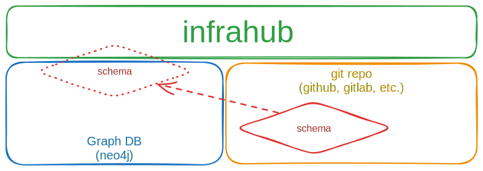
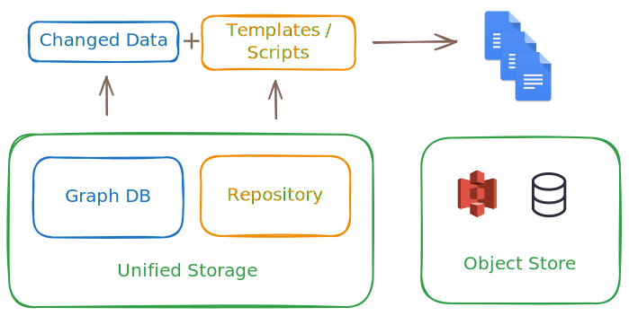

import ReferenceLink from "../../src/components/Card";

## Flexible schema

A core feature of Infrahub is the ability to define a relational model to describe the infrastructure, design and business logic in a way that's specific to each organization's needs, while allowing for the model to be changed via version control over time.

The schema provides an abstraction layer to the graph database, and as such no knowledge of database administration is needed for daily Infrahub usage.

The schema is described in YAML format, and consists of nodes, attributes, relationships, and other descriptors. For more detail, see the [guide to creating a schema](../guides/create-schema).

A new deployment of Infrahub will have no schema by default. It is up to the administrator of the system to define and load the initial schema. See the [commands to load a schema](../topics/schema#load-a-schema-into-infrahub) for more information.

Example schemas can be found:

- In the [Schema Library](https://github.com/opsmill/schema-library), this is the most comprehensive collection of schemas currently maintained by the community and OpsMill.
- In the `models` directory of the [Infrahub repository](https://github.com/opsmill/infrahub/tree/develop/models)
- In other OpsMill-provided [demo repositories](https://github.com/opsmill?q=demo&type=all&language=&sort=)
- Via the Infrahub community

The schema can be loaded into Infrahub using one of these two methods:

- Using [`infrahubctl schema load`]($(base_url)infrahubctl/infrahubctl-load) command - This is the recommended way for development or quick testing purposes.
- Using Infrahub Git integration - This is the recommended way for production deployments as it offers better version control and collaboration features.

Once the schema is loaded, it's stored and version controlled in the graph database, and distributed to all containers acting as Infrahub API Servers.

Changes to the schema can be made at any time, and it's best practice to make schema changes in a branch to allow for testing before implementation.

<ReferenceLink title="Learn more about schema" url="../topics/schema" />

## Data transformations

Transformations in Infrahub are operations that allow users to extract and export their infrastructure data in a structured and repeatable way. It involves converting data retrieved via GraphQL queries into a desired format, using either Jinja2 templates or Python code.

These transformations allow for flexible and powerful data manipulation, making it easier to integrate and utilize data in various applications and workflows.

<ReferenceLink title="Learn more about transformation" url="../topics/transformation" />

## Generators

Generators in Infrahub are tools that automatically create infrastructure objects based on predefined templates and user inputs. They serve as a way to streamline the process of setting up complex infrastructure stacks while allowing for customization.

Key aspects of generators include:

1. Template-based: Generators use templates as a starting point for creating infrastructure configurations.

2. User input: They prompt users for specific information needed to customize the generated objects.

3. Automation: Generators automate repetitive tasks in infrastructure setup, reducing manual effort and potential errors.

4. Consistency: By using generators, teams can ensure consistent infrastructure setups across different projects or environments.

5. Customization: While based on templates, generators allow for significant customization to meet specific project requirements.

6. Versioning: Infrahub supports versioning of generator outputs, enabling users to track changes over time.

7. Integration: Generators can be integrated into workflows and CI/CD pipelines for automated infrastructure provisioning.

8. Extensibility: Advanced users can create custom generators to suit their organization's specific needs.

<ReferenceLink title="Learn more about generator" url="../topics/generator" />

## Version control

Infrahub integrates version control directly into its graph database, providing robust capabilities for managing changes to infrastructure data. These features collectively enhance the ability to manage and control changes to infrastructure data, making Infrahub a powerful tool for infrastructure management and automation.

### Branching and merging

Infrahub allows you to create branches from the main data state. Each branch can contain modifications and is isolated from the main branch until changes are reviewed and merged. Branches can be created through the UI, CLI (`infrahubctl`), or GraphQL mutations.

Changes from branches can be merged back into the main branch after review. Infrahub provides tools for viewing differences (diffs) between branches, running tests, and resolving conflicts before merging.

### Proposed changes

A proposed change is similar to a pull request in Git. It allows users to review and discuss changes between branches. Reviewers can leave comments, request changes, and approve the proposed change before merging. This process ensures that changes are thoroughly vetted before integration into the main branch.

### Immutable graph and historical data

Infrahub’s storage engine is immutable, meaning past states of the data graph are preserved. Users can query historical data to view the state of the infrastructure at any point in time. This feature is crucial for auditing and understanding the evolution of infrastructure over time.

### Integration with Git

Infrahub combines its graph database with Git for version control. This integration allows for synchronization between Infrahub branches and Git repositories. Users can perform typical Git operations such as commit, push, and pull within Infrahub, ensuring that data and code are versioned together.

### Continuous integration (CI)

Infrahub supports CI processes by running checks on proposed changes during the review process. These checks ensure data integrity and help identify potential issues before merging. Custom checks can be implemented to enforce specific business logic or operational requirements.

<ReferenceLink title="Learn more about version control" url="../topics/version-control" />

## Conclusion

These concepts are tightly integrated and work together to address a wide range of use cases in infrastructure management.

### Design-driven automation and service catalog

Having a flexible schema opens up new possibilities not previously available. Infrahub allows a business workflow or service to be implemented in the [schema](../topics/schema.mdx) and instantiated by a generator.

Downstream objects are linked to the generator. If a business service needs updating or expansion, all needed changes can be generated to keep the infrastructure consistent and validated.

For example, when deploying a new service:
    - A branch is created to stage the changes
    - A generator runs and creates the needed objects according to the business logic
    - A transformation runs to create the needed configuration files
    - The changes are reviewed and eventually merged in a proposed change

:::success

- This sets up a robust data structure that will allow lifecycle management of the service, including updates, decommissioning, and more.
- Capturing business logic in the generator enables consistent and repeatable deployments, reducing the risk of human error.

:::

<ReferenceLink title="Want to read how Infrahub can be used to create a service catalog?" url="https://www.opsmill.com/how-to-turn-your-source-of-truth-into-a-service-factory/" />

### Agility in infrastructure management

Some changes in the infrastructure can be complex and require careful planning and testing. Infrahub's version control capabilities allow for these changes to be staged and tested in isolation before being applied to the production environment.

For example, during a large network software upgrade:
    - A branch is created to stage the changes
    - Any changes to the schema can be made in the branch, such as adding a new attribute
    - Transformations and templates are updated to use the new attribute
    - Data is populated in the branch
    - Artifacts are generated to reflect the new state of the infrastructure
    - Tests are run to ensure the changes work as expected
    - The changes are collaboratively reviewed in a proposed change
    - During the maintenance window, the branch is merged and the changes are applied to the production environment

:::success

- Branching allows for complex changes to be prepared in advance without holding back your production, reducing the risk of downtime or errors.
- The proposed change process enables collaboration and review, while the integrated CI pipeline ensures that changes are tested and artifacts are generated.

:::
