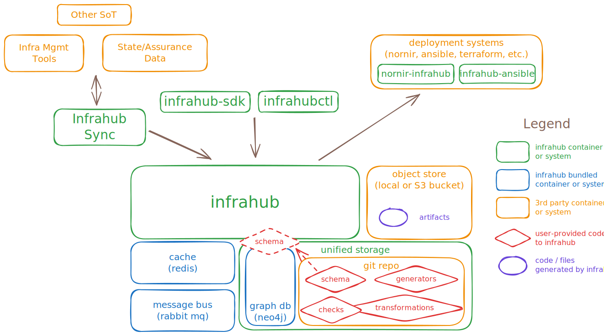

Infrahub from [OpsMill](https://opsmill.com) takes a new approach to Infrastructure Management by providing a modern datastore to organize and control all the data that defines how infrastructure should run. Infrahub offers a central hub to manage the data and code that powers your infrastructure. It combines the version control and branch management capabilities similar to Git with the flexible data model and UI of a graph database.

With Infrahub, you can:

- **Unify All Your Data**: Model services, synchronize infrastructure data, and manage intent in a fully customizable schema with no constraints.
- **Version and Validate**: Version and validate everything from design through deploy with native continuous integration tools.
- **Deploy Flexibly**: Use whatever configuration automation and deployment validation tools you want via Infrahub integrations.

At its heart, Infrahub is built on 3 fundamental pillars:

- **A Flexible Schema**: A model of the infrastructure and the relation between the objects in the model, that is easily extensible.
- **Version Control**: Natively integrated into the graph database, enabling new capabilities such as branching, diffing, and merging data directly in the database.
- **Unified Storage**: By combining a graph database and git, Infrahub stores data and code needed to manage the infrastructure.

## Interfaces

Managing infrastructure at scale often means many people, teams, workflows and other systems must interact with the Infrahub infrastructure management platform. Infrahub provides multiple methods to interact:

### WebUI

- By default, exposed on TCP port `8000`
- Built-in documentation
- Global search, including searching data and documentation
- A GraphQL sandbox
- Swagger documentation for the REST API

### GraphQL API

GraphQL is the primary API to interact with data, and allows access to everything defined by the schema. The [Python SDK]($(base_url)python-sdk/introduction) is built on top of the GraphQL API.

- By default, exposed on TCP port `8000` at the endpoint: `http://<API_SERVER_IP>:8000/graphql`
- The Frontend utilizes the GraphQL API for most tasks
- More information can be found in the [GraphQL topic](../topics/graphql.mdx)

### REST API

GraphQL only accepts queries in string format and returns JSON, so certain workflows are available exclusively via the REST API.

- Loading the schema
- Retrieving artifacts
- Accessing the object store
- Executing a saved GraphQL query

The REST API has the following properties:

- By default, exposed on TCP port `8000` at the endpoint: `http://<API_SERVER_IP>:8000/api`
- Swagger docs can be found at: `http://<API_SERVER_IP>:8000/api/docs`

### infrahubctl

`infrahubctl` is a command line utility designed to help with the day to day management of an Infrahub installation. It's meant to run on any laptop or server and it communicates with a remote Infrahub server over the network.

More information can be found in the [infrahubctl]($(base_url)infrahubctl/infrahubctl) documentation section.

### Python SDK

The Infrahub Python SDK greatly simplifies how you can interact with Infrahub programmatically.

More information can be found in the [Python SDK]($(base_url)python-sdk/introduction) documentation section.

### Git

One of the three pillars Infrahub is built on is the idea of having unified storage for data and code. The data is stored in the graph database and the code is stored in Git.

When integrating a Git repository with Infrahub, the Task worker will ensure that both systems stay in sync at any time. Changes to branches or files in a Git repository will be synced to Infrahub automatically.

More information can be found in the [external repositories guide](../guides/repository.mdx)

## Data input and sync

When a schema has been loaded into Infrahub, data can be populated or synced through multiple methods:

- Via the WebUI: users can add, modify, and delete objects
- Via [infrahub-sync]($(base_url)sync)
- Via the [Infrahub SDK]($(base_url)python-sdk/introduction), which simplifies working with the GraphQL API:
  - One-time imports can be done similar to this [Python example](https://github.com/opsmill/infrahub-demo-dc-fabric/blob/main/generators/create_basic.py)
  - Integration with other systems
- Via the GraphQL or REST API directly

Infrahub provides [data lineage and metadata](../topics/metadata.mdx) for tracking the origin and ownership of the data, and how the data changes and moves over time. When data comes from other systems and creates objects in the Infrahub database, those objects will have attributes such as its source and whether it is read-only, allowing for unidirectional sync from other sources of truth.

## Deployment

While Infrahub stores data and uses transformations to generate configuration artifacts, it does not directly deploy configurations to devices. Instead, it integrates with tools like Nornir and Ansible, or triggers external orchestration platforms via webhooks for event-driven workflows.

These integrations transform Infrahub into a centralized source of truth for infrastructure data, leveraging the automation capabilities of Ansible and Nornir to streamline management and ensure efficiency and precision.

### Ansible integration

This integration is provided through the [`opsmill.infrahub` Ansible Collection]($(base_url)ansible/). It allows Infrahub to be used as a dynamic inventory source for Ansible, enabling management of infrastructure based on data stored in Infrahub.

### Nornir integration

Nornir is a Python-based automation framework primarily used for network automation. The [Infrahub plugin for Nornir]($(base_url)nornir/) enables Infrahub to serve as an inventory source, providing a streamlined solution for managing network devices and configurations.

### Webhooks

Infrahub can trigger outbound [webhooks](../topics/webhooks.mdx) as part of its event-driven automation workflows. These webhooks can be configured to notify or trigger actions in external orchestration platforms whenever changes occur to relevant data or artifacts within Infrahub. This allows seamless integration into larger automation pipelines.

### Key features

- **Inventory Management**: Infrahub can dynamically generate and update inventories for Ansible and Nornir, ensuring that the latest state of infrastructure is always used.
- **Automation**: By leveraging each framework's automation capabilities, users can execute complex infrastructure management tasks directly using Infrahub data.
- **Configuration Deployment**: These integrations ensure that configurations managed by Infrahub are consistent across the infrastructure by applying them through Ansible, Nornir or webhooks.
