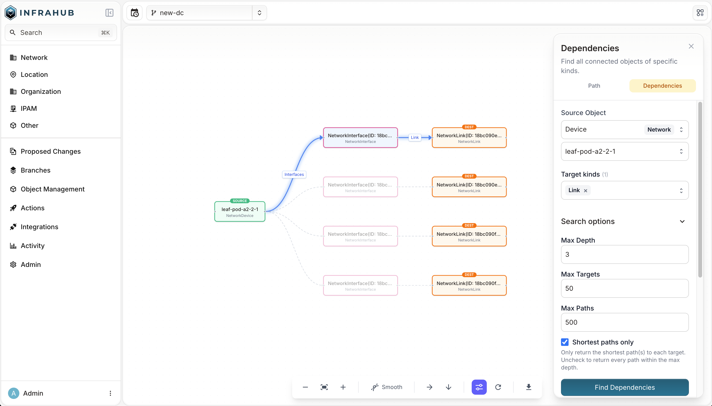

Use Dependency mode to find every object of a given kind that is reachable from a source object.
Use it to discover what depends on a resource, assess blast radius, or map impact before a change
or outage.

## Prerequisites

- You need view permission on the object kinds you want to find. Kinds you cannot view are excluded
  from results automatically.

## Find dependencies

1. From the left navigation, open **Object Management** and select **Path Traversal**.
2. Select the **Dependencies** tab.
3. In **Source Object**, search for and select the starting object.
4. In **Target kinds**, select one or more kinds of object to find — for example, `InfraService`
   or `InfraDevice`.
5. Optionally, expand **Search options** to adjust:
   - **Max Depth** — maximum hops to traverse (default: 5, max: 30).
   - **Max Targets** — maximum distinct target objects to return (default: 50, max: 200).
   - **Max Paths** — maximum total paths across all targets (default: 500, max: 5000).
   - **Shortest paths only** — when selected (default), returns only the shortest path to each
     target. Clear it to return every path within the max depth.
6. Select **Find Dependencies**.

## Read the results

The results list every reachable object of the chosen kinds, each with its depth and the path
connecting it back to the source. Objects closer to the source appear first.

Select any result to highlight its path in the graph. Right-click a node in the graph to open its
detail page, set it as the new source, copy its ID, or exclude its kind from the current view.

Use the toolbar at the bottom to zoom, change the layout or edge style, reload, or export the
graph.

## Troubleshooting

**No results** — the source object may have no connections to the chosen kinds within the current
max depth. Try increasing Max Depth, or verify the target kinds are connected to the source in
your schema.

**Query timed out** — reduce Max Depth or Max Targets, or narrow to fewer target kinds.

**Select at least one target kind** — Dependency mode requires at least one target kind.

## Next steps

- [Trace a path](./trace-a-path.mdx)
- [Query traversal with GraphQL](./query-with-graphql.mdx)
- [Graph Traversal reference](../reference/graph-traversal.mdx)
