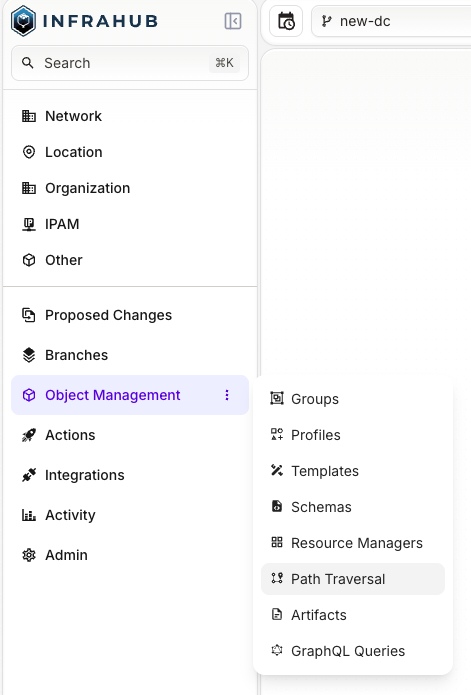
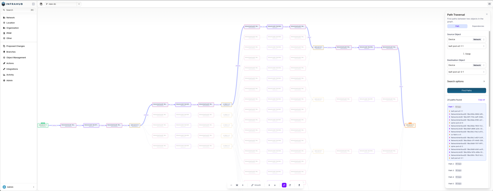
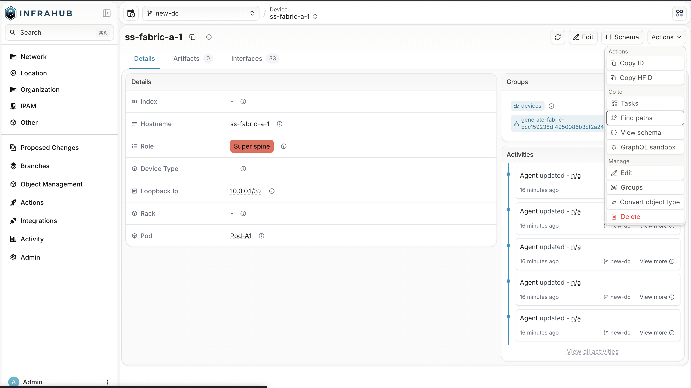

Use Path mode to find every path between two objects in your infrastructure graph.
Results are ordered shortest first, with the hop count for each route.

## Prerequisites

- You need view permission on the object kinds along the path. Kinds you cannot view are excluded
  from results automatically.

## Find paths between two objects

From the left navigation, open **Object Management** and select **Path Traversal**.

1. Select the **Path** tab if it is not already active.
2. In **Source Object**, search for and select the starting object.
3. In **Destination Object**, search for and select the ending object.
   - To swap source and destination, select **⇅ Swap**.
4. Optionally, expand **Search options** to adjust:
   - **Max Depth** — maximum hops to traverse (default: 5, max: 30).
   - **Max Paths** — maximum paths to return (default: 10, max: 100).
   - **Kinds to include** — limit traversal to objects of these kinds only.
   - **Kinds to exclude** — skip objects of these kinds during traversal.
5. Select **Find Paths**.

## Read the results

The sidebar shows the number of paths found. Each path includes its hop count and the sequence of
objects from source to destination.

Select a path to highlight it in the graph. To explore from the graph:

- **Right-click any node** to access:
  - **Open details** — open the object's detail page.
  - **Set as source** — use this node as the new source.
  - **Set as destination** — use this node as the new destination.
  - **Copy ID** — copy the node's UUID to the clipboard.
  - **Exclude `<kind>`** — remove all objects of this kind from the current results.

Use the toolbar at the bottom to zoom, change the layout or edge style, reload, or export the
graph.

## Start from an object's detail page

On any object's detail page, select **Find paths** from the **Actions** menu. Path Traversal
opens with that object pre-selected as the source.

## Troubleshooting

**No paths found** — the two objects may not be connected within the current max depth. Try
increasing Max Depth, or check that neither object kind is excluded.

**Query timed out** — reduce Max Depth or Max Paths, or use **Kinds to exclude** to narrow the
search space.

**Source and destination must be different** — select two distinct objects.

## Next steps

- [Analyze dependencies](./analyze-dependencies.mdx)
- [Query traversal with GraphQL](./query-with-graphql.mdx)
- [Graph Traversal reference](../reference/graph-traversal.mdx)
