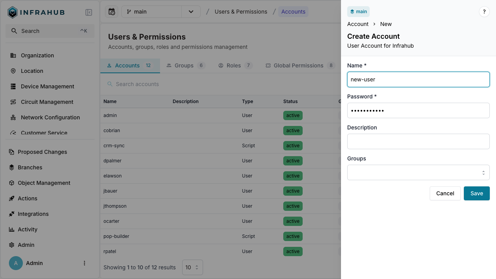
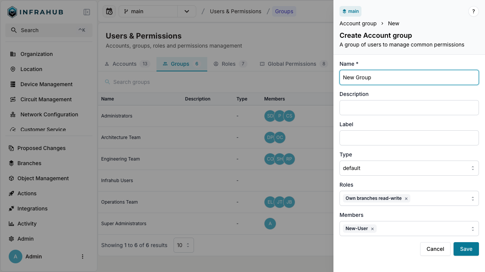
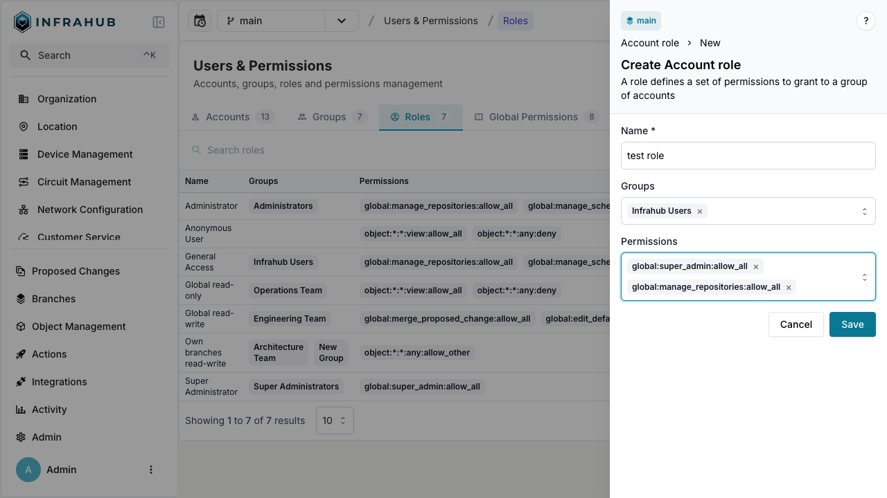

import Tabs from '@theme/Tabs';
import TabItem from '@theme/TabItem';

# Creating accounts, groups, roles, and permissions

In Infrahub, managing access and control starts with creating accounts, assigning them to groups, and managing their roles and permissions.
This guide outlines how to create new accounts, accounts groups, and assign roles and permissions.

For more information on roles and permissions, see the [Roles and Permissions](../topics/permissions-roles.mdx) topic.

## Creating a new account

<Tabs>
  <TabItem value="web" label="Via the Web Interface" default>
  ### Via the Web Interface

  1. Log in to the Infrahub UI as an administrator.
  2. Go to **Admin > Role Management** in the left side menu.
  3. In the **Accounts** tab, click on **Create Account**.
  4. Fill in the account's details (name, email, and password).
  5. Optionally, assign the account to a group.
  6. Click **Create** to create the account.

  
  </TabItem>

  <TabItem value="graphql" label="Via the GraphQL Interface">
  ### Via the GraphQL Interface

  In the GraphQL sandbox, execute the following mutation to create a new account, replacing the appropriate values as needed:

  ```graphql
  mutation AddAccount {
    CoreAccountCreate(
      data: {
        name: {value: "<ACCOUNT-NAME>"},
        password: {value: "<ACCOUNT-PASSWORD>"}
        # Optional - Assign the account to an existing group
        member_of_groups: [{hfid: "Infrahub Users"}]
      }
    ) {
      ok
      object {
        hfid
      }
    }
  }
  ```

  </TabItem>
</Tabs>

## Creating a new account group

<Tabs>
  <TabItem value="web" label="Via the Web Interface" default>
  ### Via the Web Interface

  1. Log in to the Infrahub UI as an administrator.
  2. Go to **Admin > Role Management** in the left side menu.
  3. In the **Groups** tab, click on **Create Account Group**.
  4. Enter a name for the group.
  5. Optionally, assign roles to the group.
  6. Click **Create** to create the group.

  
  </TabItem>

  <TabItem value="graphql" label="Via the GraphQL Interface">
  ### Via the GraphQL Interface

  In the GraphQL sandbox, execute the following mutation to create a new group:

  ```graphql
  mutation AddGroup {
    CoreAccountGroupCreate(
      data: {
        name: {value: "<GROUP-NAME>"},
        # Optional - Assign existing roles
        roles: [{hfid: "General Access"}]
      }
    ) {
      ok
      object {
        hfid
      }
    }
  }
  ```

  </TabItem>
</Tabs>

## Creating and assigning roles

<Tabs>
  <TabItem value="web" label="Via the Web Interface" default>
  ### Via the Web Interface

  1. Log in to the Infrahub UI as an administrator.
  2. Go to **Admin > Role Management** in the left side menu.
  3. In the **Roles** tab, click on **Create Account Role**.
  4. Provide a name for the role.
  5. Select the permissions you wish to assign to the role.
  6. Optionally, assign the role to an existing group.
  7. Click **Create** to create the role.

  
  </TabItem>

  <TabItem value="graphql" label="Via the GraphQL Interface">
  ### Via the GraphQL Interface

  In the GraphQL sandbox, execute the following mutation to create a new role:

  ```graphql
  mutation AddRole {
    CoreAccountRoleCreate(
      data: {
        name: {value: "test role"},
        # Optional - Assign the role to an existing group
        groups: [{hfid: "Infrahub Users"}]
      }
    ) {
      ok
      object {
        hfid
      }
    }
  }
  ```

  </TabItem>
</Tabs>

## Managing permissions

Permissions can be managed through roles assigned to users or groups.
Infrahub supports **Global** and **Object-specific** permissions, allowing fine-grained control over what users can do within the system.
For a complete list of available global and object permissions, see the [Roles and Permissions documentation](../reference/permissions.mdx).

### Creating and global permissions

<Tabs>
  <TabItem value="web" label="Via the Web Interface" default>
  ### Via the Web Interface

  1. Log in to the Infrahub UI as an administrator.
  2. Go to **Admin > Role Management** in the left side menu.
  3. In the **Global Permissions** tab, click on **Create Global Permission**.
  4. Select the action you which to use.
  5. Select the decision for this action.
  6. Optionally, assign the permission to an existing role.
  7. Click **Create** to create the permission.

  {/*TODO: Generate this screen*/}
  </TabItem>

  <TabItem value="graphql" label="Via the GraphQL Interface">
  ### Via the GraphQL Interface

  In the GraphQL sandbox, execute the following mutation to create a new global permission:

  ```graphql
  mutation AddGlobalPermissions {
    CoreGlobalPermissionCreate(
      data: {
        action: {value: "manage_accounts"},
        # 6 is the enum value for "allow"
        decision: {value: 6}
      }
    ) {
      ok
      object {
        identifier {
          value
        }
      }
    }
  }
  ```

  </TabItem>
</Tabs>

### Creating and objects permissions

<Tabs>
  <TabItem value="web" label="Via the Web Interface" default>
  ### Via the Web Interface

  1. Log in to the Infrahub UI as an administrator.
  2. Go to **Admin > Role Management** in the left side menu.
  3. In the **Objects Permissions** tab, click on **Create Object Permission**..
  4. Provide the namespace and name of the object(s) you want to interact with.
  5. Select the action and decision you wish to use for this permission.
  6. Optionally, assign the permission to an existing role.
  7. Click **Create** to create the permission.

  {/*TODO: Generate this screen*/}
  </TabItem>

  <TabItem value="graphql" label="Via the GraphQL Interface">
  ### Via the GraphQL Interface

  In the GraphQL sandbox, execute the following mutation to create a new global permission:

  ```graphql
  mutation AddObjectPermissions {
    CoreObjectPermissionCreate(
      data: {
        namespace: {value: "Builtin"},
        name: {value: "Tag"},
        action: {value: "view"},
        # 4 is the enum value for "allow_other"
        decision: {value: 4 }
      }
    ) {
      ok
      object {
        identifier {
          value
        }
      }
    }
  }
  ```

  </TabItem>
</Tabs>
