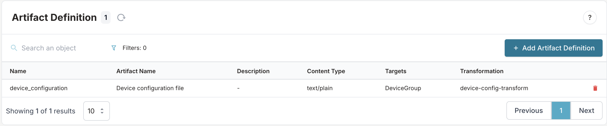

import VideoPlayer from '../../src/components/VideoPlayer';

# Creating an artifact in Infrahub

:::note

This guide has the assumption that you followed the [Creating a Jinja Rendered File (Transform)](./jinja2-transform.mdx) or [Creating a Python transform](./python-transform.mdx) guide. This is a prerequisite.

:::

The goal of this guide is to define an artifact for a Jinja rendered Transform or Python Transform in Infrahub. We will be using the following steps.

1. Modifying the schema
2. Creating a group and adding member nodes
2. Creating an artifact definition
3. Accessing the artifacts

## Modifying the node schema

Before we can generate an artifact for a node, we need to modify the schema. The node will need to inherit from the `CoreArtifactTarget` generic.

```yaml
---
version: "1.0"
nodes:
  - name: Device
    namespace: Network
    display_labels:
      - name__value
    inherit_from:
      - CoreArtifactTarget
    attributes:
      - name: name
        kind: Text
        label: Name
        optional: false
        unique: true
      - name: description
        kind: Text
        label: Description
        optional: true
```

We then have to load the modified schema definition into Infrahub.

```bash
infrahubctl schema load /tmp/schema.yml
```

## Creating a group and adding members

We need to create a group for every Artifact Definition that we will define. An artifact will be generated for every member that is part of that group.

Create a Standard Group with the name `DeviceGroup` and add `NetworkDevice` `switch1`, `switch2` and `switch3` as a member.

More information can be found in the [Creating a group guide](./groups.mdx).

<center>
  <VideoPlayer url='https://www.youtube.com/watch?v=ASGMKZVLCbY' light />
</center>

## Creating an artifact definition

In the last step we need to define an Artifact definition, which groups together a [transformation](../topics/transformation.mdx) with a target group and forms the definition of the artifact. Artifact definitions can be created via the Web Interface, via GraphQL or via a [Git repository](../topics/repository.mdx). In this guide we will be using the Git repository.

Add the following contents to the end of the `.infrahub.yml` file at the root of the `device_config_render` repository.

```yaml
artifact_definitions:
  - name: "Device configuration file"
    artifact_name: "device_configuration"
    parameters:
      name: "name__value"
    content_type: "text/plain"
    targets: "DeviceGroup"
    transformation: "device_config_transform"
```

This defines an artifact with the following properties:

- **name**: a descriptive name for the artifact definition
- **artifact_name**: a unique name for the artifact (no spaces)
- **parameters**: the parameter to pass to the transformation GraphQL query, in this case this we will pass the name of the object (device) as the name parameter
- **content type**: the content type for the resulting artifact
- **targets**: the name of a group of which the members will be a target for this artifact
- **transformation**: the Jinja2 or Python transformation that should be used

More details on the `.infrahub.yml` file format can be found in [.infrahub.yml topic](../topics/infrahub-yml.mdx).

Commit the changes to the repository and push them to the Git server

```shell
git add .
git commit -m "add device_configuration artifact definition"
git push origin main
```

The artifact definition will be created in the database, when the Task worker(s) notice the change in the Git repository. The `device_configuration` should now be visible in the Artifact Definition view in the web interface.


## Accessing the artifacts

The artifacts are generated by the task-workers. You can find the resulting artifacts in the Artifact view under the **Object Management** menu in the web interface.


Open an artifact to get the result.


You can download the artifact by clicking on the download button, or by using the REST API endpoint `http://<INFRAHUB_HOST:INFRAHUB_PORT>/api/storage/object/<storage_id>`. The `Storage Id` can be copied from the menu next to the artifact name.


Alternatively we can access the artifact of an object, by navigating to the object detail view. Navigate to device `switch1`'s detail page, from the *Artifacts* tab you can access all the artifacts that were generated for this object.
