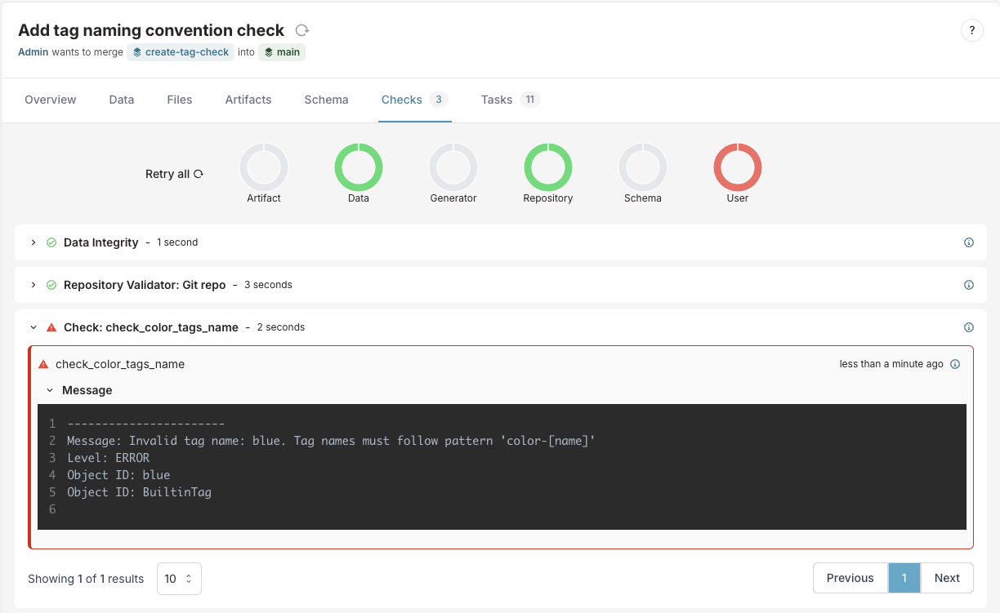

import Tabs from '@theme/Tabs';
import TabItem from '@theme/TabItem';

# How to create a check in Infrahub

Checks in Infrahub allow you to validate data based on custom business logic. They are defined in [external repositories](../topics/repository) and can be developed and tested locally using [infrahubctl check]($(base_url)infrahubctl/infrahubctl-check).

:::info Global vs. Targeted Checks

If you want to know more about the differences between these two types, refer to the topic on [Global vs. Targeted Checks](../topics/check).

**TL;DR:**

- **Global Checks**: Apply to all instances of a specific object type in the database
- **Targeted Checks**: Apply only to specific instances that you select (by adding them to a group)

:::

## What you'll build

In this guide, you'll build a check that:

1. Reads information about tag objects from the database
2. Validates that the tags follow specific naming conventions using regex patterns
3. Automatically runs when changes to tags are proposed

## Steps overview

1. Prepare sample data in your Infrahub instance
2. Create a GraphQL query to fetch data from Infrahub
3. Implement a Python check that validates the data
4. Configure the check in an `.infrahub.yml` file
5. Test the check locally with infrahubctl
6. Deploy the check to Infrahub
7. Validate that the check works in Infrahub's CI pipeline

## Prerequisites

Before you begin, you'll need:

- Basic knowledge of Infrahub, Python, GraphQL, YAML, and Git
- Familiarity with Checks and how they work in Infrahub (see [Checks topic](../topics/check))
- An Infrahub instance running locally or remotely
- A Git repository connected to Infrahub (see [Adding an External Repository guide](./repository))
- [infrahubctl]($(base_url)infrahubctl/infrahubctl) installed and configured locally
- The repository cloned where you'll develop the check

## Setting up your workspace

:::warning Version Control & Branching

We recommend creating a new branch in your Git repository for your check development to avoid affecting the main branch. In this guide, we'll use a branch named `create-tag-check`.

```shell
git checkout -b create-tag-check
git push --set-upstream origin create-tag-check
```

:::

## Step 1: Preparing sample data

First, let's create some sample tag data to test our check against.

:::warning

This step is only necessary if you don't already have the objects affected by the check in your instance.

:::

:::important

For targeted checks you will need to create a group that the check will target.

:::

Create three tags with different naming patterns:

- `color-red` - Follows the "color-[name]" pattern (will pass validation)
- `color-green` - Follows the "color-[name]" pattern (will pass validation)
- `blue` - Doesn't follow the pattern (will fail our validation check)

You can create these tags using the Infrahub UI or in batch using object file:

<Tabs groupId="check-type">
<TabItem value="Targeted Check">

For targeted checks, you will also need to create a group that includes the tags you want to validate.

<Tabs>
<TabItem value="Using Object File" >

  1. Create a file named `groups.yml` in the `objects` directory of your repository:

  ```yaml title="objects/groups.yml"
  ---
  apiVersion: infrahub.app/v1
  kind: Object
  spec:
    kind: CoreStandardGroup
    data:
      - name: colored_tags
        description: Group for colored tags
  ```

  2. Create a file named `tags.yml` in the `objects` directory of your repository:

  ```yaml title="objects/tags.yml"
  ---
  apiVersion: infrahub.app/v1
  kind: Object
  spec:
    kind: BuiltinTag
    data:
      - name: "color-red"
        description: "The red tag"
        member_of_groups:
          - ["colored_tags"]
      - name: "color-green"
        description: "The green tag"
        member_of_groups:
          - ["colored_tags"]
      - name: "blue"
        description: "The blue tag"
        member_of_groups:
          - ["colored_tags"]
  ```

  2. Use infrahubctl to load the objects:

  ```shell
  infrahubctl object load objects/groups.yml --branch=create-tag-check
  infrahubctl object load objects/tags.yml --branch=create-tag-check
  ```

  </TabItem>
  <TabItem value="Using the UI">
  1. Open the **Infrahub UI** in your browser
  2. Select the branch `create-tag-check`
  3. Navigate to the **Groups** view (Object Management > Groups)
  4. Create a group
      - **Name**: `colored_tags`, **Description**: `Group for colored tags`
  5. Navigate to the **Tags** view (Other > Tags)
  6. Create the tags
      - **Name**: `color-red`, **Description**: `The red tag`, **Member of Group**: `colored_tags`
      - **Name**: `color-green`, **Description**: `The green tag`, **Member of Group**: `colored_tags`
      - **Name**: `blue`, **Description**: `The blue tag`, **Member of Group**: `colored_tags`

  </TabItem>
</Tabs>
</TabItem>
<TabItem value="Global Check">
<Tabs>
<TabItem value="Using Object File" >
  1. Create a file named `tags.yml` in the `objects` directory of your repository:

  ```yaml title="objects/tags.yml"
  ---
  apiVersion: infrahub.app/v1
  kind: Object
  spec:
    kind: BuiltinTag
    data:
      - name: "color-red"
        description: "The red tag"
      - name: "color-green"
        description: "The green tag"
      - name: "blue"
        description: "The blue tag"
  ```

  2. Use infrahubctl to load the objects:

  ```shell
  infrahubctl object load objects/tags.yml --branch=create-tag-check
  ```

  </TabItem>
  <TabItem value="Using the UI">
  1. Open the **Infrahub UI** in your browser
  2. Select the branch `create-tag-check`
  3. Navigate to the **Tags** view (Other > Tags)
  4. Create the tags
      - **Name**: `color-red`, **Description**: `The red tag`
      - **Name**: `color-green`, **Description**: `The green tag`
      - **Name**: `blue`, **Description**: `The blue tag`
  </TabItem>
</Tabs>
</TabItem>
</Tabs>

:::success

To verify the tags were created successfully, navigate to the Tags view in the Infrahub UI (Other > Tags), select the `create-tag-check` branch, and check that the tags appear in the list.

:::

## Step 2: Create the GraphQL query

Next, create a GraphQL query that fetches the data your check needs to process.

### Create a query to fetch the tag data

Create a `tags_query.gql` file in the `queries` directory of your repository:

<Tabs groupId="check-type">
<TabItem value="Targeted Check">
```graphql title="queries/tags_query.gql"
query TagsQuery($name: String!) {
  BuiltinTag(name__value: $name) {
    edges {
      node {
        name {
          value
        }
        description {
          value
        }
      }
    }
  }
}
```
</TabItem>
<TabItem value="Global Check">
```graphql title="queries/tags_query.gql"
query TagsQuery {
  BuiltinTag {
    edges {
      node {
        name {
          value
        }
        description {
          value
        }
      }
    }
  }
}
```
</TabItem>
</Tabs>

### Test the query

To test the query you can use **Infrahub's GraphQL Sandbox**.

:::note GraphQL Sandbox

Access the sandbox by clicking your user icon in the bottom left corner and selecting **GraphQL Sandbox**. This tool allows you to run GraphQL queries and provides an interactive way to explore the schema.

:::

<Tabs groupId="check-type">
<TabItem value="Targeted Check">

1. Copy the above GraphQL query in the main section
2. In the **variables** section, add:

```json
{
  "name": "blue"
}
```

3. Click the **Execute** button, this should return a response like:

```json
{
  "data": {
    "BuiltinTag": {
      "edges": [
        {
          "node": {
            "name": {
              "value": "blue"
            },
            "description": {
              "value": "The blue tag"
            }
          }
        }
      ]
    }
  }
}
```

</TabItem>
<TabItem value="Global Check">
1. Copy the above GraphQL query in the main section
2. Click the **Execute** button, this should return a response like:

```json
{
  "data": {
    "BuiltinTag": {
      "edges": [
        {
          "node": {
            "name": {
              "value": "blue"
            },
            "description": {
              "value": "The blue tag"
            }
          }
        },
        {
          "node": {
            "name": {
              "value": "color-green"
            },
            "description": {
              "value": "The green tag"
            }
          }
        },
        {
          "node": {
            "name": {
              "value": "color-red"
            },
            "description": {
              "value": "The red tag"
            }
          }
        }
      ]
    }
  }
}
```

</TabItem>
</Tabs>

:::success

You now have a working GraphQL query that retrieves the necessary data from Infrahub. You might want to keep the result of the query for later reference, as it will be useful when implementing the check.

:::

## Step 3: Implement the check logic

Now create a Python class that implements your check logic. The check makes sure that every tag's name follows the pattern `color-[name]`.

The class must:

- Inherit from `InfrahubCheck` from the [Python SDK]($(base_url)python-sdk/introduction)
- Define a `query` class attribute that references your GraphQL query by name
- Implement a `validate()` method that processes data from your GraphQL query
- Log errors using `log_error()` when validation fails

1. Create a file called `tags_check.py` in your `checks` directory:

```python title="checks/tags_check.py"
import re

from infrahub_sdk.checks import InfrahubCheck

RE_TAG = re.compile(r"^color-[a-z]+")


class ColorTagsCheck(InfrahubCheck):
    query = "tags_query"  # This references the query name in .infrahub.yml

    def validate(self, data):
        for tag in data["BuiltinTag"]["edges"]:
            if not RE_TAG.match(tag["node"]["name"]["value"]):
                self.log_error(
                    message=f"Invalid tag name: {tag['node']['name']['value']}. Tag names must follow pattern 'color-[name]'",
                    object_id=tag["node"]["name"]["value"],
                    object_type="BuiltinTag"
                )
```

## Step 4: Configure the check in the .infrahub.yml file

Now that you have your GraphQL query and Python check, edit your [.infrahub.yml](../topics/infrahub-yml) file to tie everything together.

1. Add the following configuration to the file `.infrahub.yml`:

<Tabs groupId="check-type">
<TabItem value="Targeted Check">

```yaml title=".infrahub.yml"
---
queries:
  - name: tags_query
    file_path: queries/tags_query.gql

check_definitions:
  - name: check_color_tags_name
    class_name: ColorTagsCheck
    file_path: checks/tags_check.py
    targets: colored_tags  # This specifies the group to target
    parameters:
      name: "name__value"
```

</TabItem>
<TabItem value="Global Check">

```yaml title=".infrahub.yml"
---
queries:
  - name: tags_query
    file_path: queries/tags_query.gql

check_definitions:
  - name: check_color_tags_name
    class_name: ColorTagsCheck
    file_path: checks/tags_check.py
```

</TabItem>
</Tabs>

For a complete explanation of the `.infrahub.yml` file format, see the [infrahub.yml topic](../topics/infrahub-yml).

2. Verify the configuration

Check that your `.infrahub.yml` file is correctly formatted by listing available checks:

```shell
infrahubctl check --list
```

:::success

If successful, you'll see output like:

<Tabs groupId="check-type">
<TabItem value="Targeted Check">
```shell
Python checks defined in repository: 1
check_color_tags_name (checks/tags_check.py::ColorTagsCheck) Target: colored_tags
```
</TabItem>
<TabItem value="Global Check">
```shell
Python checks defined in repository: 1
check_color_tags_name (checks/tags_check.py::ColorTagsCheck) Target: -global-
```
</TabItem>
</Tabs>

:::

## Step 5: Test the check locally

Before deploying your check to Infrahub, test it locally using the `infrahubctl` command-line tool.

1. First, verify that your check is correctly configured:

```shell
infrahubctl check --list
```

2. Run the check against your branch by specifying its name:

```shell
infrahubctl check check_color_tags_name --branch=create-tag-check
```

:::success

If successful, you'll see output like:

<Tabs groupId="check-type">
<TabItem value="Targeted Check">
```shell
INFO     HTTP Request: GET http://localhost:8000/api/schema?branch=create-tag-check2 "HTTP/1.1 200 OK"
INFO     HTTP Request: POST http://localhost:8000/graphql/create-tag-check2 "HTTP/1.1 200 OK"
INFO     HTTP Request: POST http://localhost:8000/graphql/create-tag-check2 "HTTP/1.1 200 OK"
INFO     HTTP Request: POST http://localhost:8000/graphql/create-tag-check2 "HTTP/1.1 200 OK"
INFO     HTTP Request: POST http://localhost:8000/graphql/create-tag-check2 "HTTP/1.1 200 OK"
INFO     tags_check::ColorTagsCheck: PASSED - {'name': 'color-red'}
INFO     HTTP Request: POST http://localhost:8000/graphql/create-tag-check2 "HTTP/1.1 200 OK"
INFO     tags_check::ColorTagsCheck: PASSED - {'name': 'color-green'}
INFO     HTTP Request: POST http://localhost:8000/graphql/create-tag-check2 "HTTP/1.1 200 OK"
ERROR    tags_check::ColorTagsCheck: FAILED - {'name': 'blue'}
ERROR      Invalid tag name: blue. Tag names must follow pattern 'color-[name]'
```
</TabItem>
<TabItem value="Global Check">
```shell
INFO     HTTP Request: POST http://localhost:8000/graphql/create-tag-check "HTTP/1.1 200 OK"
ERROR    tags_check::ColorTagsCheck: FAILED
ERROR      Invalid tag name: blue. Tag names must follow pattern 'color-[name]'
```
</TabItem>
</Tabs>

The error message shows that our check correctly identified the tag named "blue" as invalid because it doesn't match our required naming pattern.

:::

## Step 6: Deploy the check to Infrahub

Now that you've tested your check and confirmed it works locally, deploy it to Infrahub by pushing your code to the repository.

### Verify repository structure

Ensure your repository has the following structure before committing:

```shell
your-repository/
├── .infrahub.yml
├── checks/
│   └── tags_check.py
└── queries/
    └── tags_query.gql
```

:::note

Depending on your organization, you might also have `schemas` and `objects` directories in your repository.

:::

### Commit and push your code

Upload your check code to the repository:

```shell
git add .
git commit -m "Add tags naming convention check"
git push
```

### Confirm the check is imported

After pushing your changes, confirm that the check is imported correctly by checking the Infrahub UI:

1. Open the **Infrahub UI** in your browser
2. Select the `create-tag-check` branch
3. Navigate to the **Check Definition view** (Actions > Check Definitions)
4. You should see your `check_color_tags_name` check listed there

:::warning

If you don't see your check, verify the repository status in the **Repository view** (Integrations > Git Repositories) and ensure the sync status is `synced`.

:::

:::success

Your check is now successfully deployed to Infrahub.

:::

## Step 7: Validate that the check works

Let's verify that your check correctly validates data by creating a proposed change from your development branch `create-tag-check` to `main`.

### Create a proposed change

1. In the Infrahub UI, navigate to the **Proposed Changes** view
2. Click **New proposed change**
3. Create the **Proposed Change** with the following parameters:
   - Source branch: `create-tag-check`
   - Destination branch: `main`
   - Name: `Add tag naming convention check`

### Verify check results

After the proposed change is created:

1. Navigate to the **Checks** tab of your proposed change
2. Wait for the **User** CI check to complete

:::success

You should see that the check has failed because the tag "blue" doesn't match the expected pattern.



:::

### Fix the validation issue and merge

Now let's fix the issue with the invalid tag and complete the merge:

1. Navigate to **Tags** view (Other > Tags)
2. Select the `create-tag-check` branch
3. Delete the tag `blue` (as it doesn't follow the naming convention)
   - Alternatively, you could rename it to `color-blue` to match the pattern
   - For a targeted check you could also remove the tag `blue` from the `colored_tags` group
4. Return to the **Proposed Change** view
5. Navigate to the **Data** and **Files** tabs to review the changes
6. Navigate to the **Checks**
7. Hit the **Retry** button to re-run the check
8. Verify that all checks now pass
9. On the **Overview** tab, click the **Merge** button to merge your changes to main

:::success

Your check is now deployed to Infrahub in the `main` branch and ready to be used. Any future tag creations will be validated against your naming convention rule.

:::

## Next steps

Now that you've created a basic check for data validation, you can expand your validation capabilities:

- Create more complex checks that validate relationships between objects
- Build checks that validate business logic across multiple object types
- Add detailed error messages with recommendations to help users understand and fix validation failures

:::success

Checks are a powerful way to enforce business rules in your data. By implementing validation rules that match your organization's requirements, you ensure data consistency and prevent configuration errors before they reach production environments.

:::
