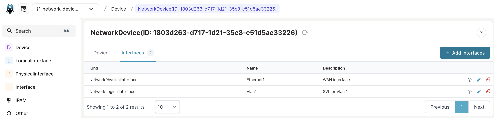

import CodeBlock from "@theme/CodeBlock";
import VideoPlayer from '../../src/components/VideoPlayer';
import Tabs from '@theme/Tabs';
import TabItem from '@theme/TabItem';

This guide shows you how to create a new schema file for Infrahub. You'll learn to define data structures and relationships using a network device example with interfaces.

By following this guide, you'll build a complete schema that includes nodes, attributes, relationships, and generic abstractions. This example focuses on network devices to demonstrate key concepts, though real-world schemas involve additional complexity.

## Prerequisites

- Infrahub running locally or in your environment
- [`infrahubctl`]($(base_url)infrahubctl/infrahubctl) command-line tool installed
- Basic understanding of YAML syntax

:::info Schema validation

Enable [schema validation](../reference/schema-validation) in your editor to catch errors while developing schema files.

:::

## Alternative learning resources

### Hands-on lab

Try the interactive [Infrahub Schema Introduction](https://opsmill.instruqt.com/pages/labs) lab for hands-on practice with schemas.

### Video tutorials

<center>
  <VideoPlayer url='https://www.youtube.com/watch?v=f3jtGm0_IxQ' light />
</center>

Learn advanced schema concepts in this livestream recording:

<center>
  <VideoPlayer url='https://www.youtube.com/live/0Z_SBoPmGws' light />
</center>

## Step 1: Create basic nodes with attributes

Create a file named `schema_guide.yml` in a location you can access easily, such as `/tmp/schema_guide.yml`.

Start by defining two basic nodes in the `Network` namespace:

- `Device`: Represents network devices with hostname and model attributes
- `Interface`: Represents network interfaces with name and description attributes

```yaml
---
version: "1.0"
nodes:
  - name: Device
    namespace: Network
    human_friendly_id: ['hostname__value']
    attributes:
      - name: hostname
        kind: Text
        unique: true
      - name: model
        kind: Text
  - name: Interface
    namespace: Network
    attributes:
      - name: name
        kind: Text
      - name: description
        kind: Text
        optional: true
```

:::info Human-friendly IDs

The `human_friendly_id` on the `hostname` attribute lets you use the hostname value instead of the system-generated ID in queries and mutations.

:::

### Load the schema into Infrahub

Create a new branch for your schema changes:

```shell
infrahubctl branch create network-device-schema
```

Load the schema into the branch:

```shell
infrahubctl schema load --branch network-device-schema /tmp/schema_guide.yml
```

View your schema in the [Web UI](http://localhost:8000/schema?branch=network-device-schema) under Object Management > Schemas.


### Create test data

Test your schema by creating a device and interface:

<Tabs>
<TabItem value="graphql" label="GraphQL" default>

Open the GraphQL sandbox (bottom left of the web interface) and execute:

```graphql
mutation {
  NetworkDeviceCreate(data: {hostname: {value: "atl1-edge1"}, model: {value: "Cisco ASR1002-HX"}}) {
    ok
    object {
      id
    }
  }
  NetworkInterfaceCreate(data: {name: {value: "Ethernet1"}, description: {value: "WAN interface"}}) {
    ok
    object {
      id
    }
  }
}
```

</TabItem>

<TabItem value="web" label="Web interface">

1. Navigate to **Objects > Device** in the left menu
2. Click **Add Device**
3. Enter `atl1-edge1` as Hostname and `Cisco ASR1002-HX` as Model
4. Click **Save**
5. Navigate to **Objects > Interface**
6. Create an interface with `Ethernet1` as Name and `WAN interface` as Description

</TabItem>

<TabItem value="shell" label="cURL">

Replace the IP address and API key with your actual values:

```shell
curl -X POST http://localhost:8000/graphql/network-device-schema \
  -H "Content-Type: application/json" \
  -H "X-INFRAHUB-KEY: 1802eed5-eeb7-cc45-2e4d-c51de9d66cba" \
  -d '{"query": "mutation { NetworkDeviceCreate(data: {hostname: {value: \"atl1-edge1\"}, model: {value: \"Cisco ASR1002-HX\"}}) { ok object { id } } NetworkInterfaceCreate(data: {name: {value: \"Ethernet1\"}, description: {value: \"WAN interface\"}}) { ok object { id } } }"}'
```

</TabItem>
</Tabs>

Verify your objects were created by navigating to **Objects** and selecting **Device** or **Interface**.

## Step 2: Add relationships between nodes

Connect your device and interface nodes with relationships. This creates meaningful associations between your data.

Add these relationships to your schema:

1. **Device to interfaces**: One device can have many interfaces (component relationship)
2. **Interface to device**: Each interface belongs to one device (parent relationship)

Replace your `schema_guide.yml` content with:

```yaml
---
version: "1.0"
nodes:
  - name: Device
    namespace: Network
    human_friendly_id: ['hostname__value']
    attributes:
      - name: hostname
        kind: Text
        unique: true
      - name: model
        kind: Text
    relationships:
      - name: interfaces
        cardinality: many
        peer: NetworkInterface
        kind: Component
  - name: Interface
    namespace: Network
    attributes:
      - name: name
        kind: Text
      - name: description
        kind: Text
        optional: true
    relationships:
      - name: device
        cardinality: one
        peer: NetworkDevice
        optional: false
        kind: Parent
```

### Load the updated schema

Create a new branch for the relationship changes:

```shell
infrahubctl branch create network-device-relations
```

Load the updated schema:

```shell
infrahubctl schema load --branch network-device-relations /tmp/schema_guide.yml
```

### Test the relationships

Create connected objects using this GraphQL mutation:

```graphql
mutation {
  NetworkDeviceCreate(data: {hostname: {value: "atl1-edge1"}, model: {value: "Cisco ASR1002-HX"}}) {
    ok
    object {
      id
    }
  }
  NetworkInterfaceCreate(data: {name: {value: "Ethernet1"}, description: {value: "WAN interface"}, device: {hfid: "atl1-edge1"}}) {
    ok
    object {
      id
    }
  }
}
```

In the Web UI, view the device details to see the relationship to the Ethernet1 interface.


## Step 3: Create generic nodes for abstraction

Real network devices have different interface types with shared and unique characteristics. Use generic nodes to model this abstraction.

Physical interfaces (like Ethernet1) have properties like speed and cable connections. Logical interfaces (like Vlan1) don't have these physical properties but share common attributes like name and description.

### Create a generic interface

Replace your schema with this structure using generics:

```yaml
---
version: "1.0"
generics:
  - name: Interface
    namespace: Network
    attributes:
      - name: name
        kind: Text
      - name: description
        kind: Text
        optional: true
    relationships:
      - name: device
        cardinality: one
        peer: NetworkDevice
        kind: Parent
        optional: false
nodes:
  - name: Device
    namespace: Network
    human_friendly_id: ['hostname__value']
    attributes:
      - name: hostname
        kind: Text
        unique: true
      - name: model
        kind: Text
    relationships:
      - name: interfaces
        cardinality: many
        peer: NetworkInterface
        kind: Component
  - name: PhysicalInterface
    namespace: Network
    inherit_from:
      - NetworkInterface
    attributes:
      - name: speed
        kind: Number
  - name: LogicalInterface
    namespace: Network
    inherit_from:
      - NetworkInterface
```

### Load the generic schema

Create a new branch for generic changes:

```shell
infrahubctl branch create network-device-generics
```

Load the schema:

```shell
infrahubctl schema load --branch network-device-generics /tmp/schema_guide.yml
```

### Test different interface types

Create both physical and logical interfaces:

```graphql
mutation {
  NetworkDeviceCreate(data: {hostname: {value: "atl1-edge1"}, model: {value: "Cisco ASR1002-HX"}}) {
    ok
    object {
      id
    }
  }
  NetworkPhysicalInterfaceCreate(data: {name: {value: "Ethernet1"}, description: {value: "WAN interface"}, speed: {value: 1000000000}, device: {hfid: "atl1-edge1"}}) {
    ok
    object {
      id
    }
  }
  NetworkLogicalInterfaceCreate(data: {name: {value: "Vlan1"}, description: {value: "SVI for VLAN 1"}, device: {hfid: "atl1-edge1"}}) {
    ok
    object {
      id
    }
  }
}
```

View the device in the Web UI to see both interface types connected to the same device.



## Step 4: Improve the schema with migrations

Refine your schema using Infrahub's schema migration features. These changes demonstrate how to evolve schemas while preserving existing data.

Make these improvements:

1. Add `mtu` and `enabled` attributes to the generic `NetworkInterface`
2. Remove the `description` attribute from the generic `NetworkInterface`
3. Set a default value for the `speed` attribute of `NetworkPhysicalInterface`
4. Rename the `model` attribute to `device_type`
5. Add labels for better user experience
6. Define uniqueness constraints

### Get the attribute ID for migration

:::warning Attribute ID required

To rename an attribute, you need its current ID. Find the `model` attribute ID on the [NetworkDevice schema page](http://localhost:8000/schema?branch=network-device-generics&kind=NetworkDevice) in the Web UI.

:::

Replace your schema content (update the `id` value with the actual model attribute ID):

```yaml
---
version: "1.0"
generics:
  - name: Interface
    namespace: Network
    attributes:
      - name: name
        kind: Text
        label: Name
      - name: description
        state: absent
        kind: Text
        optional: true
        label: Description
      - name: mtu
        kind: Number
        label: MTU
        optional: false
        default_value: 1500
      - name: enabled
        label: Enabled
        kind: Boolean
        optional: false
        default_value: false
    relationships:
      - name: device
        label: Device
        cardinality: one
        peer: NetworkDevice
        kind: Parent
        optional: false
nodes:
  - name: Device
    namespace: Network
    human_friendly_id: ['hostname__value']
    attributes:
      - name: hostname
        kind: Text
        label: Hostname
        unique: true
      - name: device_type
        label: Device Type
        kind: Text
        id: 17bcf8a7-9c03-4a6a-3295-c51345cb1c33
    relationships:
      - name: interfaces
        label: Interfaces
        cardinality: many
        peer: NetworkInterface
        kind: Component
  - name: PhysicalInterface
    namespace: Network
    uniqueness_constraints:
      - ["device", "name__value"]
    inherit_from:
      - NetworkInterface
    attributes:
      - name: speed
        label: Speed (bps)
        kind: Number
        default_value: 1000000000
  - name: LogicalInterface
    namespace: Network
    uniqueness_constraints:
      - ["device", "name__value"]
    inherit_from:
      - NetworkInterface
```

### Preview schema changes

Use the check command to see what changes will be applied:

```shell
infrahubctl schema check --branch network-device-generics /tmp/schema_guide.yml
```

This shows a diff of changes before applying them.

### Apply the migration

Load the improved schema:

```shell
infrahubctl schema load --branch network-device-generics /tmp/schema_guide.yml
```

:::success Migration complete

Infrahub automatically migrates existing data to match the new schema structure. View the updated schema in the [Web UI](http://localhost:8000/schema?branch=network-device-generics).

:::

## Relationship best practices

Follow these practices when creating relationships with generic nodes:

### Always set explicit identifiers

```yaml
# ❌ Avoid: Missing identifier with generics
generics:
  - name: Interface
    relationships:
      - name: device
        peer: TestDevice
        # Auto-generation may fail

# ✅ Prefer: Explicit identifier
generics:
  - name: Interface
    relationships:
      - name: device
        peer: TestDevice
        identifier: "device__interface"
```

### Use consistent naming patterns

- Follow the pattern `<parent>__<child>` or `<node_a>__<node_b>`
- Verify that both sides of bidirectional relationships use matching identifiers
- Document cascade delete behavior when using `on_delete: cascade`

## Next steps

Now that you've created a basic schema:

- Learn about [schema validation](../reference/schema-validation) for development workflows
- Explore the complete [Schema topic](../topics/schema) for advanced concepts
- Try [importing existing schemas](../guides/import-schema) from other sources
- Set up [external repositories](../guides/repository) to manage schemas with Git

## Related resources

- [Schema topic](../topics/schema) - Complete schema documentation
- [Schema validation reference](../reference/schema-validation) - Validation tools and rules
- [GraphQL topic](../topics/graphql) - Query and mutation syntax
- [Import schema guide](../guides/import-schema) - Loading existing schemas
