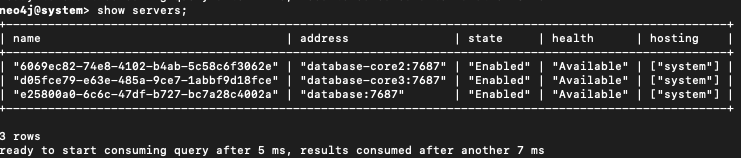
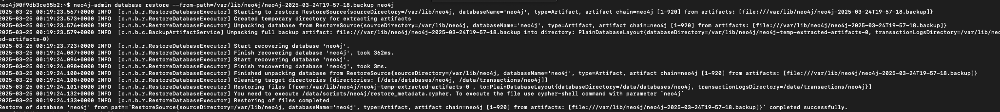
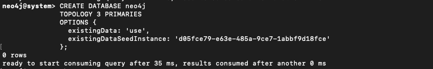
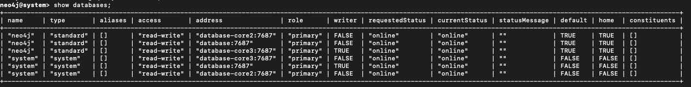
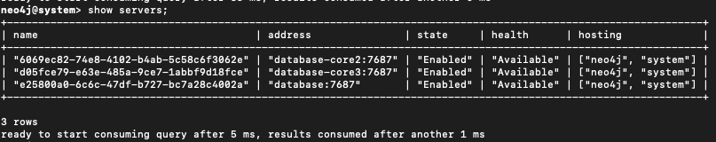
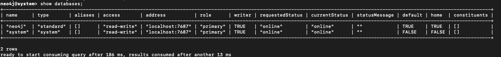
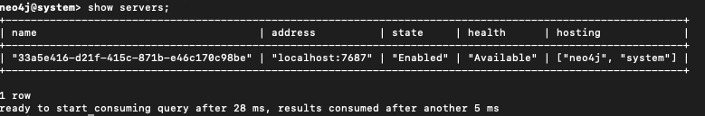

import EnterpriseBadge from '@site/src/components/EnterpriseBadge';

# Standalone database backup and restore examples

This is a guide on how to backup and restore your database using an Infrahub command line tool.
Please [see this topic](../topics/database-backup) for the requirements for using the tool and an explanation of how it works.

This guide assumes that you cloned the Infrahub repository to your machine, but you can also copy the content of [this tool's Python file](https://github.com/opsmill/infrahub/tree/stable/utilities/db_backup/__main__.py) into a local Python file and run it that way.

An alternative to avoid cloning the Infrahub repository is to directly run it through the Infrahub Docker image:

```python
docker run --rm -v /var/run/docker.sock:/var/run/docker.sock registry.opsmill.io/opsmill/infrahub python -m utilities.db_backup
```

## Backup a remote Infrahub database

```python
python -m utilities.db_backup neo4j backup --database-url=172.28.64.1 /infrahub_backups
```

In this example, the "remote" Infrahub database is accessible at `172.28.64.1` and I want to store the generated backup files in the `/infrahub_backups` directory.
Since the tool starts a helper container, the database may not be directly accessible from Docker depending on your network. You can try using the `--host-network` option:

```python
python -m utilities.db_backup neo4j backup --host-network --database-url=172.28.64.1 /infrahub_backups
```

## Backup a local Infrahub database with a non-default backup port

```python
python -m utilities.db_backup neo4j backup --database-backup-port=12345 /infrahub_backups
```

In this example, I am running the backup command on the same machine that is running the Infrahub docker containers. In this case, port `12345` must also have been set using the `NEO4J_server_backup_listen__address` environment variable in the Infrahub database container.

## Restore a backup on a non-default cypher port

```python
python -m utilities.db_backup neo4j restore /infrahub_backups --database-cypher-port=9876
```

In this example, I am restoring `.backup` files that exist in the `/infrahub_backups` directory and my Infrahub database container uses a non-standard port for cypher access: `9876` instead of `7687`.

## Cluster Database backup and restore examples <EnterpriseBadge />

### Cluster Topology

| Node             | Role     |
|------------------|----------|
| `database`       | Leader   |
| `database-core2` | Follower |
| `database-core3` | Follower |

### Context

We are going to back up the Neo4j database from `database-core2` and restore it on `database-core3`, after having dropped the Neo4j database cluster-wide.

:::caution Important
Always run backup/restore commands as the `neo4j` user inside the container to avoid permission issues with the data files.
:::

### Step 1: Create Backup from `database-core2`

```bash
docker exec -it -u neo4j infrahub-database-core2-1 bash
mkdir -p backups
neo4j-admin database backup --to-path=backups/
ls backups
# Output should include:
# neo4j-2025-03-24T19-57-18.backup
```

### Step 2: Copy the Backup to `database-core2`

```bash
docker cp infrahub-database-core2-1:/var/lib/neo4j/backups/neo4j-2025-03-24T19-57-18.backup \
  infrahub-database-core3-1:/var/lib/neo4j/neo4j-2025-03-24T19-57-18.backup
```

### Step 3: Drop the neo4j Database Across the Cluster

Connect to any node

```bash
cypher-shell -d system -u neo4j
DROP DATABASE neo4j;
SHOW SERVERS;
```

<center>

</center>

### Step 4: Clean Residual Data on database-core3

Connect to the container:

```bash
docker exec -it -u neo4j infrahub-database-core3-1 bash
```

Remove any existing data to avoid corruption:

```bash
rm -rf /data/databases/neo4j
rm -rf /data/transactions/neo4j
```

Then restart the container to ensure a clean state:

```bash
docker restart infrahub-database-core3-1
```

### Step 5: Restore the Backup on database-core3

Reconnect to the container:

```bash
docker exec -it -u neo4j infrahub-database-core3-1 bash
```

Run the restore command:

```bash
neo4j-admin database restore \
  --from-path=/var/lib/neo4j/neo4j-2025-03-24T19-57-18.backup neo4j
```

<center>

</center>

### Step 6: Identify the Seed Instance ID

Connect via Cypher shell (on the system database):

```bash
cypher-shell -d system -u neo4j
```

Run:

```bash
SHOW SERVERS;
```

⚠️ **Note** :
> Find the serverId corresponding to infrahub-database-core3-1.
>> For example: d05fce79-e63e-485a-9ce7-1abbf9d18fce.

<center>

</center>

### Step 7: Recreate the neo4j Database from the Seed

Run the following Cypher command:

```bash
CREATE DATABASE neo4j
TOPOLOGY 3 PRIMARIES
OPTIONS {
  existingData: 'use',
  existingDataSeedInstance: 'd05fce79-e63e-485a-9ce7-1abbf9d18fce'
};
```

<center>

</center>

### Step 8: Verify Cluster Sync

Check that the database is coming online:

```bash
SHOW DATABASES;
```

<center>

</center>

Then validate cluster sync status:

```bash
SHOW SERVERS;
```

<center>

</center>

All nodes should eventually show the neo4j database as online.

### 📝 Notes

- If any node shows as **dirty** or **offline**, check the logs and ensure that the file `/data/databases/neo4j/neostore` exists.
- Restoring the database on a single node does **not** automatically register it with the cluster.
  You **must** run the `CREATE DATABASE ... OPTIONS { existingData: 'use' }` command to register the restored data properly.

## Restore a Database Cluster Backup on a Standalone Instance (for Debug)

### Context

We are taking a backup from a Neo4j cluster and restoring it on a standalone local Neo4j instance (non-clustered), for the purpose of debugging and data analysis in a safe, isolated environment.

### Step 1: Backup from a Cluster Node  <EnterpriseBadge />

The backup was created from a cluster node (either follower or leader) using:

```bash
neo4j-admin database backup --to-path=backups/
# Resulting file: neo4j-2025-03-24T19-57-18.backup
```

### Step 2: Copy the Backup to database

```bash
docker cp neo4j-2025-03-24T19-57-18.backup \
  infrahub-database-1:/var/lib/neo4j/neo4j-2025-03-24T19-57-18.backup
```

### Step 3. Prepare the Local Neo4j Instance

Connect to the container:

```bash
docker exec -it -u neo4j infrahub-database-1 bash
```

Clean any existing neo4j database (optional but recommended):

```bash
rm -rf /data/databases/neo4j
rm -rf /data/transactions/neo4j
```

Drop the neo4j Database

```bash
cypher-shell -d system -u neo4j
DROP DATABASE neo4j;
SHOW SERVERS;
```

<center>

</center>

### Step 4. Restore the Backup

Run the restore command from the directory where the backup file is located:

```bash
neo4j-admin database restore \
  --from-path=/var/lib/neo4j/neo4j-2025-03-24T19-57-18.backup neo4j
```

### Step 5: Recreate the neo4j Database

Run the following Cypher command:

```bash
CREATE DATABASE neo4j
```

### Step 6: Verify Status

Check that the database is coming online:

```bash
SHOW DATABASES;
```

<center>

</center>

Then validate database status:

```bash
SHOW SERVERS;
```

<center>

</center>

### 📝 Notes

- This process *restores only data* — not cluster roles, replication, or configuration.
