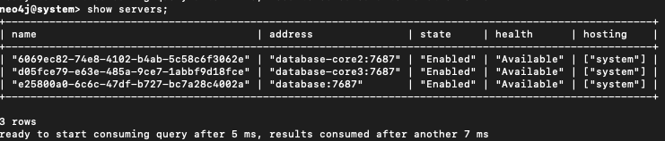
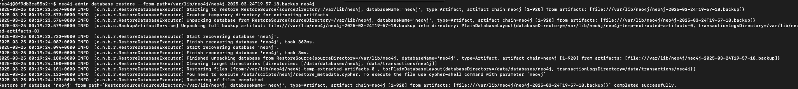
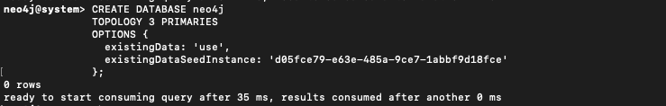
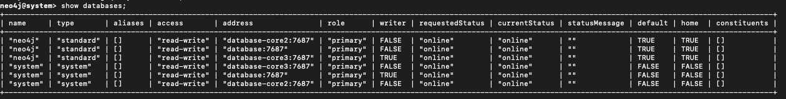
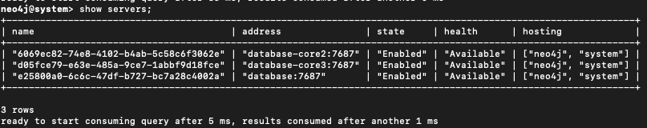
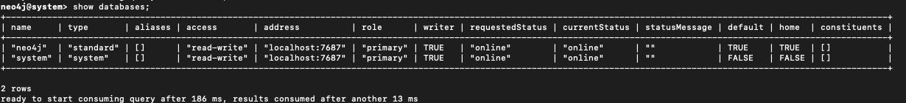
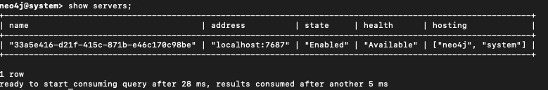

import EnterpriseBadge from '@site/src/components/EnterpriseBadge';
import Tabs from '@theme/Tabs';
import TabItem from '@theme/TabItem';

This guide shows you how to create comprehensive backups of your Infrahub deployment and restore them when needed. You'll learn to backup the Neo4j graph database, artifact storage, and task management data to ensure complete data recovery capabilities.

## Prerequisites

- Running Infrahub deployment (Docker Compose or Kubernetes)
- Administrative access to the Neo4j database
- Access to the artifact storage location (S3 or local filesystem)
- Sufficient storage space for backup files
- For cluster deployments: Understanding of your cluster topology

## Create a full backup

### Step 1: Install the backup tool

<Tabs groupId="backup-method">
<TabItem value="infrahubops" label="infrahub-backup CLI (Recommended)" default>

Install the infrahub-backup CLI tool:

```bash
curl https://infrahub.opsmill.io/ops/$(uname -s)/$(uname -m)/infrahub-backup -o infrahub-backup
chmod +x infrahub-backup
```

</TabItem>
<TabItem value="manual" label="Docker Compose">

If you prefer manual control, proceed to backup each component individually as described in the following steps.

</TabItem>
<TabItem value="remote" label="Remote Database">

Alternatively, you can use the [legacy tool](#using-the-python-based-backup-utility) to backup a remote Neo4j database.

</TabItem>
</Tabs>

### Step 2: Backup the databases

<Tabs groupId="backup-method">
<TabItem value="infrahubops" label="infrahub-backup CLI" default>

Create a backup of your running Infrahub instance:

```bash
./infrahub-backup create
```

The tool automatically:

- Checks for running tasks before starting (use `--force` to skip)
- Creates a timestamped backup archive (for example, `infrahub_backup_20250129_153045.tar.gz`)
- Backs up Neo4j database with metadata (configurable with `--neo4jmetadata`)
- Backs up Prefect/PostgreSQL task management database
- Calculates SHA256 checksums for integrity verification

:::note
Artifact storage backup is planned for future versions and must currently be handled separately.
:::

</TabItem>
<TabItem value="manual" label="Docker Compose">

Connect to your Neo4j container and create a backup:

```bash
# Connect as neo4j user to avoid permission issues
docker exec -it -u neo4j infrahub-database-1 bash

# Create backup directory and run backup
mkdir -p backups
neo4j-admin database backup --to-path=backups/

# Verify backup creation
ls backups/
# Output: neo4j-2025-03-24T19-57-18.backup
```

Backup the Prefect PostgreSQL database containing task logs and execution history:

```bash
# Export Prefect database (using default credentials)
docker compose exec -T task-manager-db \
  pg_dump -Fc -U postgres -d prefect > prefect.dump
```

</TabItem>
<TabItem value="remote" label="Remote Database">

For remote database backups using the Python utility:

```bash
# Clone the repository or use Docker image
python -m utilities.db_backup neo4j backup \
  --database-url=172.28.64.1 \
  /infrahub_backups

# If network access issues occur, use host network
python -m utilities.db_backup neo4j backup \
  --host-network \
  --database-url=172.28.64.1 \
  /infrahub_backups
```

</TabItem>
</Tabs>

### Step 3: Backup the artifact store

<Tabs groupId="storage-type">
<TabItem value="s3" label="S3 Storage" default>

If using S3 for artifact storage, use AWS CLI or your preferred S3 backup tool:

```bash
# Sync S3 bucket to local backup directory
aws s3 sync s3://your-infrahub-bucket /backup/artifacts/
```

</TabItem>
<TabItem value="local" label="Local Filesystem">

For local filesystem storage, copy the artifact directory:

```bash
# Copy artifacts directory to backup location
docker compose cp -r infrahub-server:/opt/infrahub/storage /backup/artifacts/
```

</TabItem>
</Tabs>

## Restore from backup

### Step 1: Prepare the environment

Ensure Infrahub services are running before starting the restore process. You can start from a scratch/blank deployment.

<Tabs groupId="restore-method">
<TabItem value="infrahubops" label="infrahub-backup CLI" default>

Restore from a backup archive:

```bash
./infrahub-backup restore infrahub_backup_20250129_153045.tar.gz
```

The tool automatically:

- Validates backup integrity using checksums
- Wipes cache and message queue data
- Stops application containers
- Restores PostgreSQL database first
- Restores Neo4j database with metadata
- Restarts all services in correct order

</TabItem>
<TabItem value="manual" label="Manual Process">

If restoring manually, follow the steps below for each component.

</TabItem>
</Tabs>

### Step 2: Restore the databases

<Tabs groupId="restore-method">
<TabItem value="infrahubops" label="infrahub-backup CLI" default>

This is automatically handled by infrahub-backup.

</TabItem>
<TabItem value="manual" label="Docker Compose">

```bash
# Stop app services
docker compose stop task-worker infrahub-server task-manager

# Copy backup directory to container
docker cp database-backup infrahub-database-1:/tmp/backup

# Connect to container as neo4j user
docker exec -it -u neo4j infrahub-database-1 bash

# Drop existing database
cypher-shell -d system -u neo4j
DROP DATABASE neo4j;
exit;

# Clean residual data
rm -rf /data/databases/neo4j
rm -rf /data/transactions/neo4j

# Restore from backup
neo4j-admin database restore \
  --from-path=/tmp/backup neo4j \
  --overwrite-destination=true

# Recreate database
cypher-shell -d system -u neo4j
CREATE DATABASE neo4j;
SHOW DATABASES;
```

Restore the task manager PostgreSQL database

```bash
# Restore Prefect database
docker compose exec -T task-manager-db \
  pg_restore -d postgres -U postgres --clean --create prefect.dump

# Restart task manager to apply changes
docker compose restart task-manager
```

</TabItem>
<TabItem value="remote" label="Remote Database">

```bash
# Restore using Python utility
python -m utilities.db_backup neo4j restore \
  /infrahub_backups \
  --database-cypher-port=7687
```

</TabItem>
</Tabs>

### Step 3: Restore the artifact store

<Tabs groupId="storage-type">
<TabItem value="s3" label="S3 Storage" default>

```bash
# Restore S3 bucket from backup
aws s3 sync /backup/artifacts/ s3://your-infrahub-bucket
```

</TabItem>
<TabItem value="local" label="Local Filesystem">

```bash
# Restore artifacts directory
cp -r /backup/artifacts/ /path/to/infrahub/artifacts/
```

</TabItem>
</Tabs>

### Step 4: Restart Infrahub services

<Tabs groupId="restore-restart-services">
<TabItem value="infrahubops" label="infrahub-backup CLI" default>

This is automatically handled by infrahub-backup.

</TabItem>
<TabItem value="manual" label="Docker Compose">
Restart services in the correct order to ensure proper initialization:

```bash
# Restart API servers first
docker compose restart infrahub-server

# Then restart task workers
docker compose restart task-worker
```

</TabItem>
</Tabs>

## Validation

Verify your restoration was successful:

1. **Check database status:**

   ```bash
   docker compose exec -T database cypher-shell -u neo4j \
     -c "SHOW DATABASES;"
   ```

   The Neo4j database should show as "online".

2. **Verify Infrahub API:**

   ```bash
   curl http://localhost:8000/api/schema/summary
   ```

   You should receive a valid schema response.

3. **Check task manager:**

   ```bash
   docker compose logs task-manager --tail 50
   ```

   Logs should show normal operation without errors.

4. **Test artifact retrieval:**
   Access the Infrahub UI and verify that stored artifacts (transforms, queries) are accessible.

## Backup and restore Neo4j clusters <EnterpriseBadge />

If you're running Infrahub with a Neo4j cluster, follow these steps to backup from one node and restore to another while maintaining cluster integrity.

### Prerequisites for cluster operations

- Neo4j cluster with at least 3 nodes
- Administrative access to all cluster nodes
- Understanding of your cluster topology (leader and follower nodes)

:::caution
Always run backup and restore commands as the `neo4j` user inside containers to avoid permission issues with data files.
:::

Example cluster topology

| Node             | Role     |
|------------------|----------|
| `database`       | Leader   |
| `database-core2` | Follower |
| `database-core3` | Follower |

### Step 1: Create backup from a follower node

```bash
docker exec -it -u neo4j infrahub-database-core2-1 bash
mkdir -p backups
neo4j-admin database backup --to-path=backups/ neo4j
ls backups
# Output should include:
# neo4j-2025-03-24T19-57-18.backup
```

### Step 2: Transfer backup to target node

```bash
# Copy from source container to local
docker cp infrahub-database-core2-1:/var/lib/neo4j/backups/neo4j-2025-03-24T19-57-18.backup .

# Copy from local to target container
docker cp neo4j-2025-03-24T19-57-18.backup \
  infrahub-database-core3-1:/var/lib/neo4j/
```

### Step 3: Drop database cluster-wide

Connect to any cluster node:

```bash
cypher-shell -d system -u neo4j
DROP DATABASE neo4j;
SHOW SERVERS;
```

<center>

</center>

### Step 4: Clean target node data

Connect to the target container:

```bash
docker exec -it -u neo4j infrahub-database-core3-1 bash
```

Remove any existing data to avoid corruption:

```bash
rm -rf /data/databases/neo4j
rm -rf /data/transactions/neo4j
```

Then restart the container to ensure a clean state:

```bash
docker restart infrahub-database-core3-1
```

### Step 5: Restore backup on target node

Reconnect to the container:

```bash
docker exec -it -u neo4j infrahub-database-core3-1 bash
```

Run the restore command:

```bash
neo4j-admin database restore \
  --from-path=/var/lib/neo4j/neo4j-2025-03-24T19-57-18.backup neo4j
```

<center>

</center>

### Step 6: Identify seed instance id

Connect via Cypher shell (on the system database):

```bash
cypher-shell -d system -u neo4j
```

Run:

```bash
SHOW SERVERS;
```

Note the `serverId` for your target node (example: `d05fce79-e63e-485a-9ce7-1abbf9d18fce`).

<center>

</center>

### Step 7: Recreate database from seed

Run the following Cypher command:

```bash
CREATE DATABASE neo4j
TOPOLOGY 3 PRIMARIES
OPTIONS {
  existingData: 'use',
  existingDataSeedInstance: 'd05fce79-e63e-485a-9ce7-1abbf9d18fce'
};
```

<center>

</center>

### Step 8: Verify cluster sync

Check that the database is coming online:

```bash
SHOW DATABASES;
```

<center>

</center>

Then validate cluster sync status:

```bash
SHOW SERVERS;
```

<center>

</center>

All nodes should eventually show the Neo4j database as online.

:::tip Troubleshooting

- If nodes show as **dirty** or **offline**, check logs and verify `/data/databases/neo4j/neostore` exists
- The `CREATE DATABASE ... OPTIONS { existingData: 'use' }` command is required to register restored data with the cluster

:::

## Restore cluster backup to standalone instance

If you need to analyze data from a production cluster in an isolated environment, follow these steps to restore a cluster backup to a standalone Neo4j instance.

### Step 1: Create cluster backup

Create a backup from any cluster node:

```bash
neo4j-admin database backup --to-path=backups/ neo4j
# Resulting file: neo4j-2025-03-24T19-57-18.backup
```

### Step 2: Transfer backup to standalone instance

```bash
docker cp neo4j-2025-03-24T19-57-18.backup \
  infrahub-database-1:/var/lib/neo4j/
```

### Step 3: Prepare standalone instance

Connect to the container:

```bash
docker exec -it -u neo4j infrahub-database-1 bash
```

Clean any existing Neo4j database (optional but recommended):

```bash
rm -rf /data/databases/neo4j
rm -rf /data/transactions/neo4j
```

Drop the Neo4j Database

```bash
cypher-shell -d system -u neo4j
DROP DATABASE neo4j;
SHOW SERVERS;
```

<center>

</center>

### Step 4: Restore the backup

Restore the backup file:

```bash
neo4j-admin database restore \
  --from-path=/var/lib/neo4j/neo4j-2025-03-24T19-57-18.backup neo4j
```

### Step 5: Create the database

Run the following Cypher command:

```bash
CREATE DATABASE neo4j
```

### Step 6: Verify the status

Check that the database is coming online:

```bash
SHOW DATABASES;
```

<center>

</center>

Then validate database status:

```bash
SHOW SERVERS;
```

<center>

</center>

:::info
This process restores only data, not cluster roles, replication, or configuration settings.
:::

## Advanced usage

### Using the Python-based backup utility

:::info Legacy Tool
The Python-based utility (`utilities/db_backup`) is still available in the main Infrahub repository but is being replaced by infrahub-backup. Use it only if infrahub-backup doesn't meet your specific requirements.
:::

### Use non-default ports

If your deployment uses custom ports, specify them during backup and restore operations:

```bash
# Backup with custom backup port
python -m utilities.db_backup neo4j backup \
  --database-backup-port=12345 \
  /infrahub_backups

# Restore with custom Cypher port
python -m utilities.db_backup neo4j restore \
  /infrahub_backups \
  --database-cypher-port=9876
```

### Run backup tool via Docker

If you don't have the repository cloned locally, run the backup tool directly from the Infrahub Docker image:

```bash
docker run --rm \
  -v /var/run/docker.sock:/var/run/docker.sock \
  registry.opsmill.io/opsmill/infrahub \
  python -m utilities.db_backup
```

## Related resources

- [Understanding database backup architecture](../topics/database-backup.mdx) - Learn how the backup system works internally
