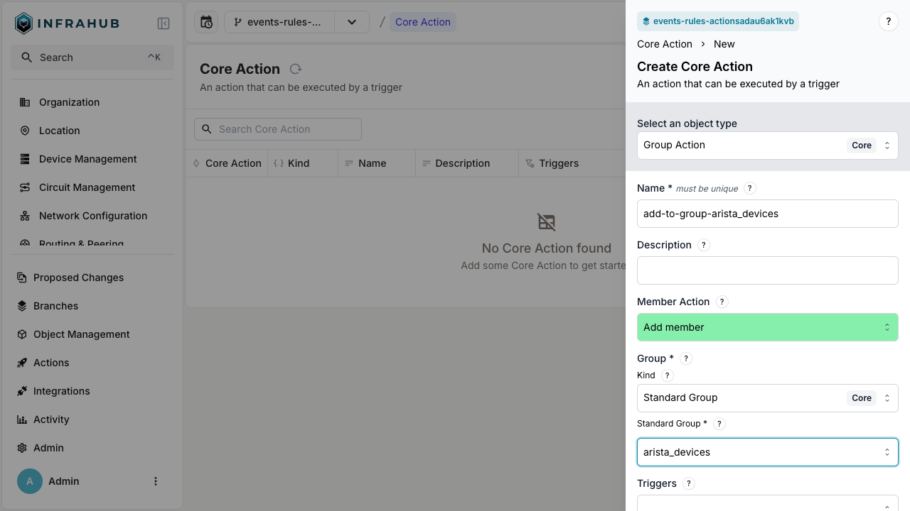
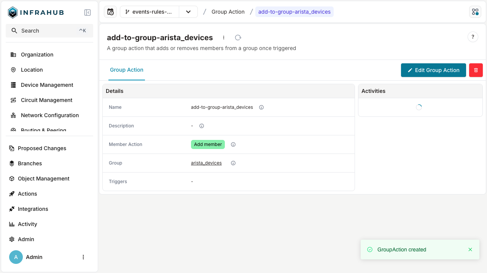
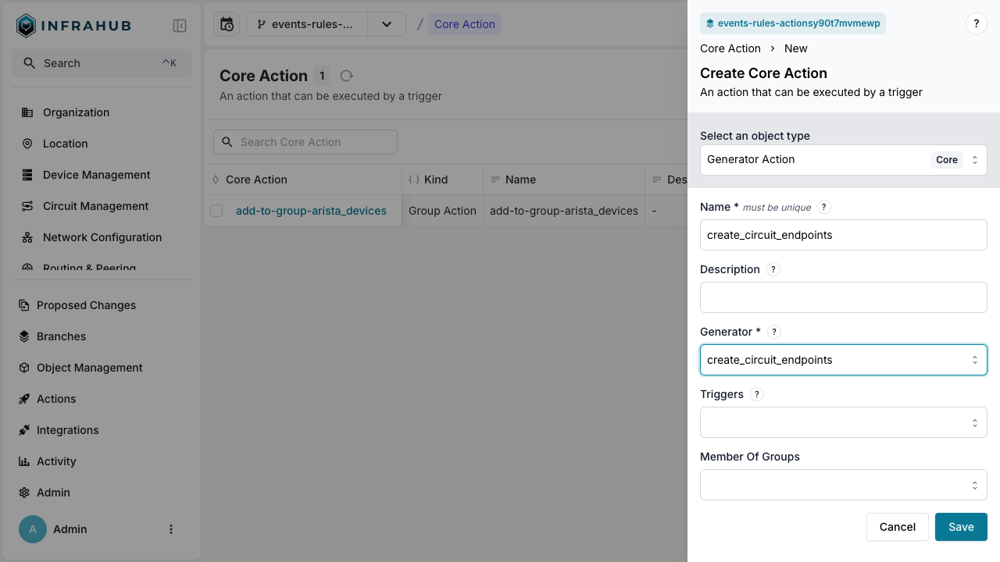
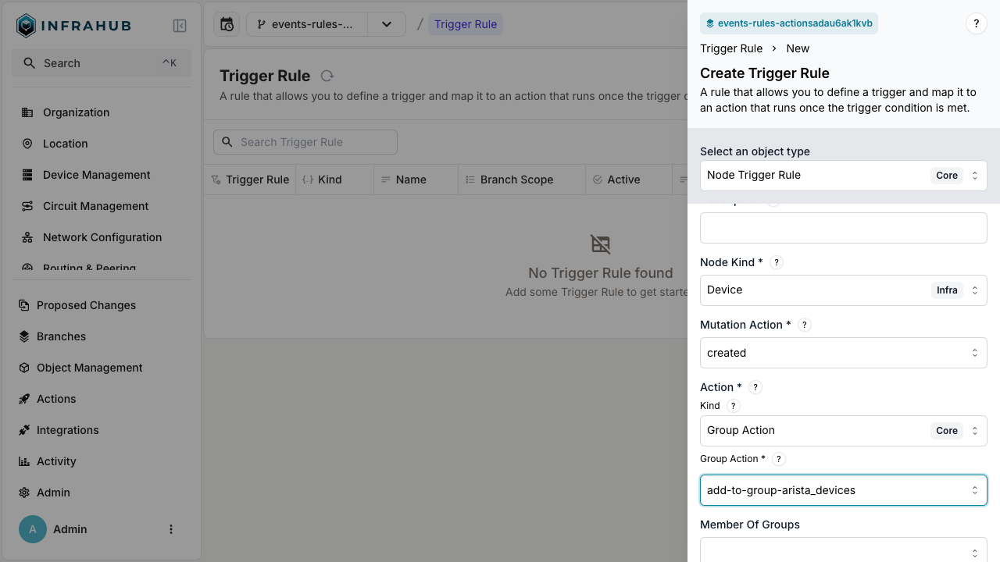
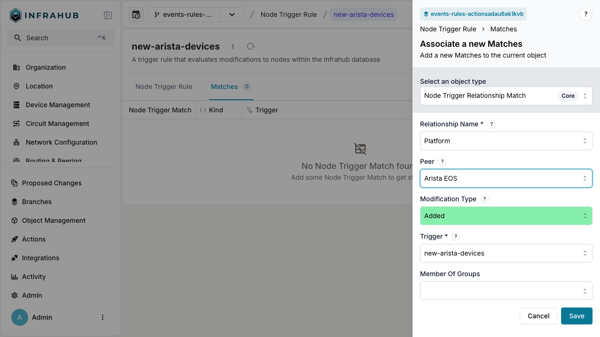
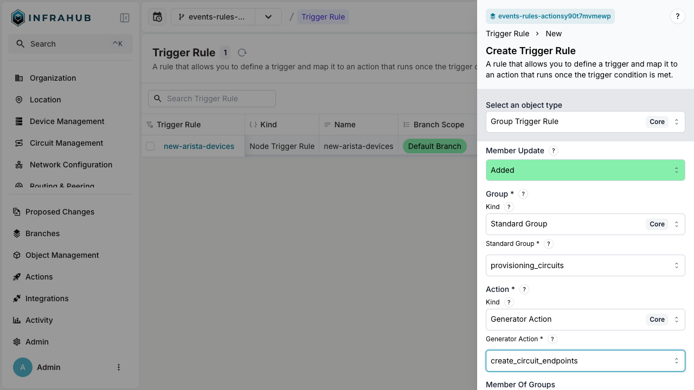

[Triggers rules and actions feature](../topics/event-actions.mdx), allows you to respond to [events](../topics/events.mdx) as they occur within Infrahub by defining filter conditions and triggering actions.

:::success
By creating multiple rules and actions, you can build automated workflows.

:::

## How it works

1. **Define actions** that will be executed when triggered
2. **Create trigger rules** that match specific events
3. **Set filter conditions** to narrow down which events should trigger actions
4. **Activate the trigger** to start the automation

## Example workflows

### Workflow 1: adding devices to group

1. Device is created → with platform `Arista EOS`
2. → Node trigger rule detects the creation
3. → Group action adds device to `arista_devices` group

### Workflow 2: Automating circuit endpoint creation

1. Circuit is added to `provisioning_circuits` group
2. → Group trigger rule detects the addition
3. → Generator action runs `create_circuit_endpoints` generator

## Step-by-step guide

### 1. Creating actions

Actions define what will happen when a trigger rule's conditions are met.

#### Creating a group action

A Group Action allows you to add or remove nodes from a group when triggered.

1. Navigate to the Actions page

2. Click the "Create" button and select "Group Action"

3. Configure the Group Action:
   - Enter a name (example: `add-to-group-arista_devices`)
   - Select the associated Kind of group, here we are using "Standard Group Core"
   - Choose the target group (example: `arista_devices`)
   - Click "Save"

4. View the created Group Action details

#### Creating a generator action

A Generator Action allows you to run a generator when triggered.

1. Navigate to the Actions page

2. Click the "Create" button and select "Generator Action"

3. Configure the Generator Action:
   - Enter a name (example: `create_circuit_endpoints`)
   - Select the generator (example: `create_circuit_endpoints`)
   - Click "Save"

### 2. Creating trigger rules

Trigger rules define **when** actions should be executed based on specific events.

#### Creating a node trigger rule

A Node Trigger Rule allows you to detect changes to specific nodes and execute actions in response.

1. Navigate to the Trigger Rules page

2. Click the "Create" button and select "Node Trigger"

3. Configure the Node Trigger Rule:
   - Enter a name (example: `new-arista-devices`)
   - Select the node kind (example: "Device Infra")
   - Choose the mutation action (example: "created")
   - Select the action kind (example: "Group Action Core")
   - Choose the group action (example: `add-to-group-arista_devices`)
   - Click "Save"

4. Add match conditions to refine when the trigger fires:
   - Navigate to the "Matches" tab
   - Click "Add Match"
   - Select "Node Trigger Relationship"
   - Choose the relationship name (example: "Platform")
   - Select the peer (example: `Arista EOS`)
   - Click "Save"

#### Creating a group trigger rule

A Group Trigger Rule allows you to detect changes to group membership and execute actions in response.

1. Navigate to the Trigger Rules page

2. Click the "Create" button and select "Group Trigger"

3. Configure the Group Trigger Rule:
   - Enter a name (example: `added-to-provisioning-circuits-group`)
   - Select the kind (example: "Standard Group Core")
   - Choose the standard group (example: `provisioning_circuits`)
   - Select the action kind (example: "Generator Action Core")
   - Choose the generator action (example: `create_circuit_endpoints`)
   - Click "Save"

