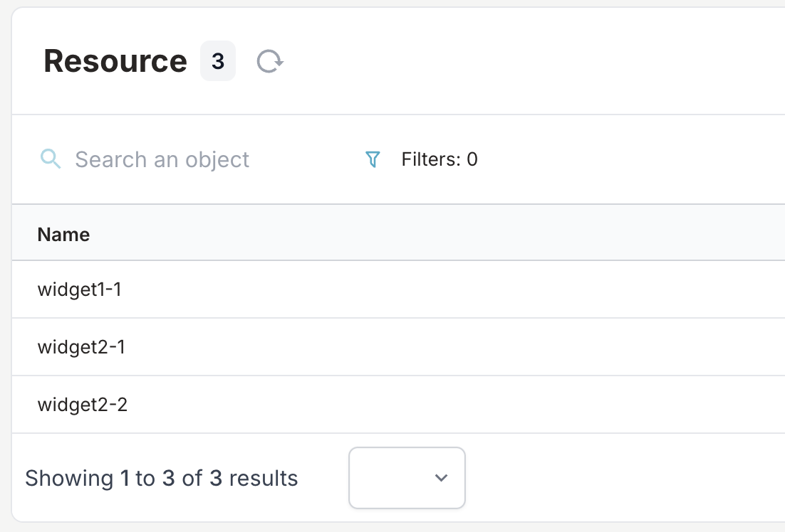
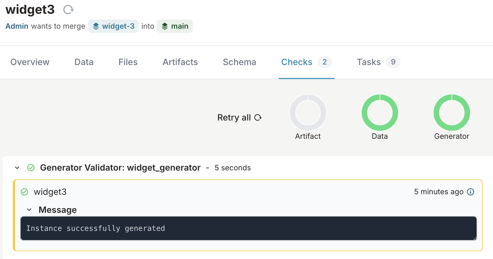
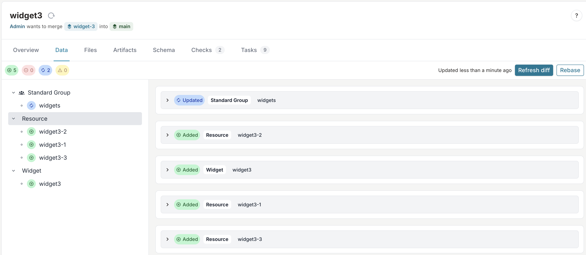

import Tabs from '@theme/Tabs';
import TabItem from '@theme/TabItem';

# Creating a generator in Infrahub

Within Infrahub a generator is defined in an [external repository](../topics/repository). However, during development and troubleshooting it is easiest to start from your local computer and run the transform using [infrahubctl generator]($(base_url)infrahubctl/infrahubctl-generator).

The goal of this guide is to develop a Generator and add it to Infrahub, we will achieve this by following these steps.

1. Create a Git repository
2. Create an entry for the generator within an .infrahub.yml file.
3. Identify the relevant data you want to extract from the database using a [GraphQL query](../topics/graphql), that can take an input parameter to filter the data
4. Write a Python script that uses the GraphQL query to read information from the system and generates new data based on the response
5. Test the generator with infrahubctl
6. Push changes to GitHub and add the repository to Infrahub as an external repository
7. Validate that the generator works by triggering it through a proposed change

## Preparations

What your generator will look like will depend on what your schema looks like and the intended outcome. The generator described here will be very generic and also not useful in a real world scenario, it is only meant to describe how the generators work.

As the default Infrahub schema doesn't have a lot of object types to use as a test, we will illustrate how this could work by adding two nodes to the schema.

### Create and load example schema

Create a **widgets.yml** file with the following:

```yaml title="widgets.yml"
# yaml-language-server: $schema=https://schema.infrahub.app/infrahub/schema/latest.json
---
version: '1.0'

nodes:
  - name: Widget
    namespace: Test
    label: "Widget"
    default_filter: name__value
    display_labels:
      - name__value
    attributes:
      - name: name
        kind: Text
        unique: true
      - name: count
        kind: Number
  - name: Resource
    namespace: Test
    label: "Resource"
    default_filter: name__value
    display_labels:
      - name__value
    attributes:
      - name: name
        kind: Text
        unique: true
```

Load the following schema using the [infrahubctl schema]($(base_url)infrahubctl/infrahubctl-schema) command.

```shell
infrahubctl schema load widgets.yml
```

```shell
schema 'widgets.yml' loaded successfully
1 schema processed in 8.453 seconds.
```

### Add two new nodes

Perform these steps in the [Infrahub UI](http://localhost:8000).

1. Create two new widget objects
    - One with the name `widget1` and count 1
    - One with the name `widget2` and count 2
2. Create a [Standard group](http://localhost:8000/objects/CoreGroup) called "**widgets**
3. Add both of the created objects to the new group

:::info
Any widget object must be added to or be part of the **widgets** group to be tied to the generator.
:::

## 1. Create GitHub repository

Follow GitHub's instructions on [creating a new repository](https://docs.github.com/en/repositories/creating-and-managing-repositories/creating-a-new-repository).

:::info Initialize with a README
For ease, it is suggested to **Initialize this repository with: Add a README file**.

This allows you to clone the repository down without any extra commands.
:::

Once the repository is created, [clone the repository](https://docs.github.com/en/repositories/creating-and-managing-repositories/cloning-a-repository) down and change directory into the cloned folder.

## 2. Create an .infrahub.yml file

The [.infrahub.yml](../topics/infrahub-yml) file allows you to tie the different [components of a generator](../topics/generator) together into a working unit.

:::info Convert query to Infrahub SDK objects
We provide `convert_query_response` option to be toggled to be able to access objects from the GraphQL query as Infrahub SDK objects rather than the raw dictionary response.

This allows you to manage the returned data with helper methods on the SDK objects such as `save`, `fetch`, etc. on the returned data rather than having to build a payload to send back to Infrahub to manage the objects.

Read more on the [Infrahub Python SDK](/python-sdk/introduction).
:::

<Tabs groupId="convertResponse">
  <TabItem value="Non-converted query response">
    <!-- markdownlint-disable MD046 -->
    <!-- vale Infrahub.swap = NO -->
    <!-- vale Infrahub.spelling = NO -->
    ```yaml title=".infrahub.yml"
    # yaml-language-server: $schema=https://schema.infrahub.app/python-sdk/repository-config/latest.json
    ---
    generator_definitions:
      - name: widget_generator
        file_path: "example_generator/widget_generator.py"
        targets: widgets
        query: widget_query
        class_name: WidgetGenerator
        parameters:
          name: "name__value"

    queries:
      - name: widget_query
        file_path: "example_generator/widget_query.gql"
    ```
  </TabItem>
  <TabItem value="Converted query response">
    <!-- markdownlint-disable MD046 -->
    <!-- vale Infrahub.swap = NO -->
    ```yaml title=".infrahub.yml"
    # yaml-language-server: $schema=https://schema.infrahub.app/python-sdk/repository-config/latest.json
    ---
    generator_definitions:
      - name: widget_generator
        file_path: "example_generator/widget_generator.py"
        targets: widgets
        query: widget_query
        convert_query_response: true
        class_name: WidgetGenerator
        parameters:
          name: "name__value"

    queries:
      - name: widget_query
        file_path: "example_generator/widget_query.gql"
    ```
  </TabItem>
</Tabs>

<Tabs>
  <TabItem value="Generator definitions" default>
    This defines a generator definition with the following properties:
      - **name**: a unique name for the generator
      - **file_path**: the relative file path to the file containing the generator as seen from within a Git repository
      - **targets**: the name of a group of which the members will be a target for this generator
      - **query**: the name of the GraphQL query used within this generator
      - **convert_query_response**: convert the result of the GraphQL query to SDK InfrahubNode objects
      - **class_name**: the name of the Python class in the generator file
      - **parameters**: the parameter to pass to the generator GraphQL query, in this case this we will pass the name of the object (widget) as the name parameter
  </TabItem>
  <TabItem value="Queries">
    Here the `name` refers to the query's name and `file_path` should point to the GraphQL file within the repository.
  </TabItem>
</Tabs>

See [this topic](../topics/infrahub-yml) for a full explanation of everything that can be defined in the `.infrahub.yml` file.

## 3. Identify the relevant data

Here we define a GraphQL query that we will use to gather the information that will be passed into the generator.

<Tabs groupId="convertResponse">
  <TabItem value="Non-converted query response">
    ```graphql title="example_generator/widget_query.gql"
    query Widgets($name: String!) {
      TestWidget(name__value: $name) {
        edges {
          node {
            name {
              value
            }
            count {
              value
            }
          }
        }
      }
    }
    ```
  </TabItem>
  <TabItem value="Converted query response">
    Here we must provide `__typename` and `id` within the query so the SDK can convert the query to the correct type and properly store within the SDK.

  ```graphql title="example_generator/widget_query.gql"
  query Widgets($name: String!) {
    TestWidget(name__value: $name) {
      edges {
        node {
          __typename
          id
          name {
            value
          }
          count {
            value
          }
        }
      }
    }
  }
  ```

  </TabItem>
</Tabs>

Create a local directory on your computer where we will store the generator files.

```shell
mkdir example_generator
```

## 4. Create a Python Generator

The Generator class needs to implement a `generate` function that receives a `data` parameter that contains the response from the GraphQL query.

The goal of this generator will be to create a number of resources that depends on the set count of the widgets.

<Tabs groupId="convertResponse">
  <TabItem value="Non-converted query response">
    <!-- markdownlint-disable MD046 -->
    ```python title="example_generator/widget_generator.py"
    from infrahub_sdk.generator import InfrahubGenerator

    class WidgetGenerator(InfrahubGenerator):
        async def generate(self, data: dict) -> None:
            # We can now access the nodes as typical SDK objects
            widget = data["TestWidget"]["edges"][0]["node"]
            widget_name: str = widget["name"]["value"]
            widget_count: str = widget["count"]["value"]
            for count in range(1, widget_count + 1):
                payload = {
                    "name": f"{widget_name.lower()}-{count}",
                }
                obj = await self.client.create(kind="TestResource", data=payload)
                await obj.save(allow_upsert=True)
    ```
  </TabItem>
  <TabItem value="Converted query response">
    <!-- markdownlint-disable MD046 -->
    ```python title="example_generator/widget_generator.py"
    from infrahub_sdk.generator import InfrahubGenerator

    class WidgetGenerator(InfrahubGenerator):
        async def generate(self, data: dict) -> None:
            # We can now access the nodes as typical SDK objects
            widget = self.nodes[0]  # or self.store.get(data["TestWidget"]["edges"][0]["node"]["id"])
            widget_name: str = widget.name.value
            widget_count: str = widget.count.value
    
            for count in range(1, widget_count + 1):

                payload = {
                    "name": f"{widget_name.lower()}-{count}",
                }
                obj = await self.client.create(kind="TestResource", data=payload)
                await obj.save(allow_upsert=True)
    ```
  </TabItem>
</Tabs>

<!-- vale Infrahub.spelling = NO -->
Store this class within a new file called **widget_generator.py** within the **example_generator** directory.

## 5. Test the generator using infrahubctl

Using infrahubctl you can first verify that the **.infrahub.yml** file is formatted correctly by listing available generators.

```shell
infrahubctl generator --list
```

```shell
Generators defined in repository: 1
widget_generator (widget_generator.py::Generator) Target: widgets
```

:::warning

When running a generator with `infrahubctl` the [SDK tracking]($(base_url)python-sdk/topics/tracking) feature isn't used. The reason for this is that internally Infrahub uses the ID of the generator_definition to control the tracking, this isn't available from the outside. For this reason it is recommended to create test branches when developing generators and validating the results.

:::

```shell
infrahubctl branch create test-branch1
```

Then we can try to run the generator within this branch.

```shell
infrahubctl generator widget_generator --branch=test-branch1 name=widget1
infrahubctl generator widget_generator --branch=test-branch1 name=widget2
```

Now you should see the tree [TestResource](http://localhost:8000/objects/TestResource?branch=test-branch1) objects within `test-branch1` one for the first widget and two for the second one.



Merge the changes into the **main** branch using [infrahubctl branch]($(base_url)infrahubctl/infrahubctl-branch) command.

```shell
infrahubctl branch merge 'test-branch1'
```

## 6. Commit and add repository to Infrahub

The root directory should include the **.infrahub.yml** file and **example_generator** folder.

- `.infrahub.yml`: Contains the definition for the generator

Within the **example_generator** folder you should now have 2 files:

- `widget_query.gql`: Contains the GraphQL query
- `widget_generator.py`: Contains the Python code for the generator

Before we can run our generator in an Proposed Change (PC) pipeline we must push the files up to the remote Git repository we created in **Step 1**.

```shell
git add .
git commit -m "Add generator"
git push
```

Now that we have the latest changes, [add your repository to Infrahub](./repository) and then the generators will be executed as part of the proposed change CI pipeline.

## 7. Generator in the CI pipeline

1. Navigate to [widgets](http://localhost:8000/objects/TestWidget) in the Infrahub UI
2. Create a new branch named **widget-3**
3. Create a new widget with the name of **widget3** and count of **3**
4. Add **widget3** to the **widgets** group
5. Create a [Proposed Change](http://localhost:8000/proposed-changes?branch=widget-3)
6. Navigate to the **Checks** tab
7. Once the **generator** CI check has completed, navigate to the **Data** tab

8. Click the **Refresh diff** button to see the **widget3** resources created by the generator


:::success Examples

- Want to read how Generators can be used to create a service catalog? See our blog post on [How to Turn Your Source of Truth into a Service Factory](https://www.opsmill.com/how-to-turn-your-source-of-truth-into-a-service-factory/).
:::
