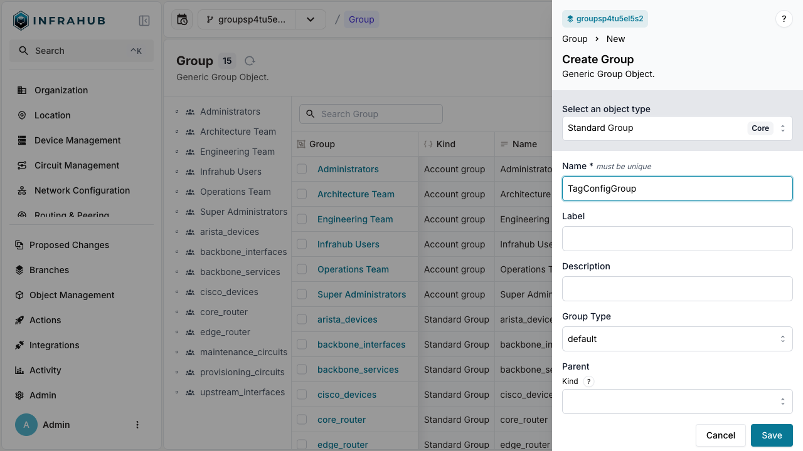

import Tabs from '@theme/Tabs';
import TabItem from '@theme/TabItem';

# How to organize objects with groups

Create groups to organize and manage collections of objects in Infrahub. Groups enable bulk operations, access control, and logical organization of your infrastructure data.

## Prerequisites

Before starting this guide, ensure you have:

- Access to an Infrahub instance
- Objects already created that you want to group (for example, tags, devices, or locations)
- Appropriate permissions to create and modify groups

## Step 1: Create a new group

Choose your preferred method to create a group:

<Tabs>
  <TabItem value="web" label="Web Interface" default>

Navigate to **Object Management** → **Groups** in the left menu.

Click **New Group** and provide:

- Group name (for example, `TagConfigGroup`)
- Optional description
- Group type (Standard or other available types)



  </TabItem>

  <TabItem value="graphql" label="GraphQL">

Open the GraphQL interface at `http://localhost:8000/graphql`.

Execute this mutation to create a Standard Group:

```graphql
mutation CreateGroup {
  CoreStandardGroupCreate (data: {name: {value: "TagConfigGroup"}}) {
    ok
    object {
      hfid
    }
  }
}
```

Save the returned `hfid` value - you'll need it for adding members.

  </TabItem>

  <TabItem value="sdk" label="Python SDK">

```python
from infrahub_sdk import InfrahubClientSync

client = InfrahubClientSync(address="http://localhost:8000")

# Create a new group
group = client.create(
    kind="CoreStandardGroup",
    name="TagConfigGroup"
)
group.save()
```

  </TabItem>
</Tabs>

## Step 2: Add members to the group

Add objects as members of your newly created group:

<Tabs>
  <TabItem value="web" label="Web Interface" default>

1. Select your group from the Groups list
2. Navigate to the **Members** tab
3. Click **Add Members**
4. Select the objects to include (for example, `red` and `blue` tags)
5. Click **Save**


  </TabItem>

  <TabItem value="graphql" label="GraphQL">

First, retrieve the IDs of objects you want to add:

```graphql
query {
  BuiltinTag (name__values: ["red","blue"]) {
    edges {
      node {
        id
        display_label
      }
    }
  }
}
```

Then add these objects to your group:

```graphql
mutation UpdateGroupMembers {
  CoreStandardGroupUpdate(
    data: {
      hfid: ["<HFID returned by CreateGroup mutation>"],
      members: [
        {id: "<id of red tag>"},
        {id: "<id of blue tag>"}
      ]
    }
  ) {
    ok
  }
}
```

  </TabItem>

  <TabItem value="sdk" label="Python SDK">

```python
# Retrieve the group
group = client.get(kind="CoreStandardGroup", name__value="TagConfigGroup")

# Get the objects to add
red_tag = client.get(kind="BuiltinTag", name__value="red")
blue_tag = client.get(kind="BuiltinTag", name__value="blue")

# Add members to the group
group.members.add(red_tag)
group.members.add(blue_tag)
group.save()
```

  </TabItem>
</Tabs>

## Step 3: Verify group membership

Confirm that your objects have been successfully added to the group:

<Tabs>
  <TabItem value="web" label="Web Interface" default>

1. Navigate to **Object Management** → **Groups**
2. Select your group (`TagConfigGroup`)
3. Click the **Members** tab
4. Verify all expected objects appear in the list


  </TabItem>

  <TabItem value="graphql" label="GraphQL">

Query the group to see its members:

```graphql
query {
  CoreStandardGroup(name__value: "TagConfigGroup") {
    edges {
      node {
        name {
          value
        }
        members {
          edges {
            node {
              display_label
            }
          }
        }
      }
    }
  }
}
```

  </TabItem>

  <TabItem value="sdk" label="Python SDK">

```python
# Retrieve and check group members
group = client.get(kind="CoreStandardGroup", name__value="TagConfigGroup")
members = group.members.get()

for member in members:
    print(f"Member: {member.display_label}")
  </TabItem>
</Tabs>

## Validation

Confirm your group is working correctly:

- ✓ Group appears in the Groups list
- ✓ All intended members are visible in the Members tab
- ✓ Group can be referenced in queries and operations
- ✓ Members inherit any group-level configurations

## Common operations with groups

### Remove members from a group

<Tabs>
  <TabItem value="web" label="Web Interface" default>

1. Navigate to your group's Members tab
2. Select the members to remove
3. Click **Remove from Group**

  </TabItem>

  <TabItem value="graphql" label="GraphQL">

Update the group with a new member list excluding the objects to remove:

```graphql
mutation RemoveGroupMembers {
  CoreStandardGroupUpdate(
    data: {
      hfid: ["TagConfigGroup"],
      members: [
        {id: "<id of remaining member>"}
      ]
    }
  ) {
    ok
  }
}
```

  </TabItem>
</Tabs>

### Delete a group

<Tabs>
  <TabItem value="web" label="Web Interface" default>

1. Select the group from the Groups list
2. Click the **Delete** button
3. Confirm the deletion

  </TabItem>

  <TabItem value="graphql" label="GraphQL">

```graphql
mutation DeleteGroup {
  CoreStandardGroupDelete(
    data: {
      hfid: ["TagConfigGroup"]
    }
  ) {
    ok
  }
}
```

  </TabItem>
</Tabs>

## Troubleshooting

If members aren't appearing in your group:

1. Verify the object IDs are correct
2. Check that objects exist and aren't deleted
3. Ensure you have permission to modify both the group and its members
4. Confirm the save/update operation completed successfully

If groups aren't visible:

1. Check your user permissions for group management
2. Verify the group was created in the correct namespace
3. Refresh the interface or clear browser cache

## Next steps

- [Use groups in artifact definitions](./artifact.mdx)
- [Apply bulk operations to group members](../topics/groups.mdx)
- [Configure permissions and roles](../topics/permissions-roles.mdx)