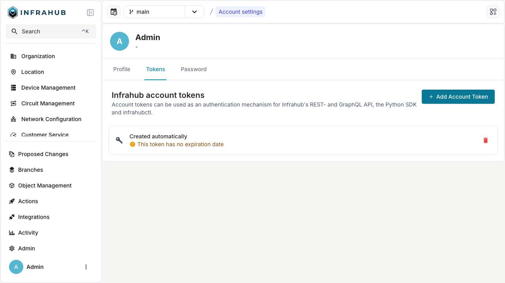
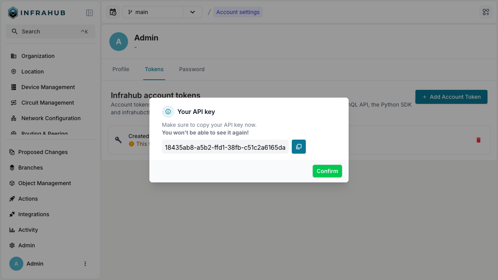

import Tabs from '@theme/Tabs';
import TabItem from '@theme/TabItem';

# Managing API tokens

API tokens can be used as an authentication mechanism for Infrahub's REST- and GraphQL API, the Python SDK and infrahubctl.

<Tabs>
  <TabItem value="web" label="Via the Web Interface" default>

1. Login to Infrahub's web interface as an administrator.
2. Click on the user in the left side menu.
3. Navigate to the **Account settings**.
4. In the user profile page, click on **Tokens** tab.

5. Click **+ Add Account Token**.

6. Fill in the details and click **Save**.
7. Copy the generated token and store in a safe location.

8. Deleting a token can be achieved by selecting the trash icon on the token table item.

  </TabItem>

  <TabItem value="graphql" label="Via the GraphQL Interface">

## Creating a new API Token

In the GraphQL sandbox, execute the following mutation, replace the name of the token in the mutation with a value that is appropriate for your use case:

```graphql
mutation {
  InfrahubAccountTokenCreate(data: {name: "token name"}) {
    object {
      token {
        value
      }
    }
  }
}
```

The result of the query will show you the value of the token that was generated for the token. Store the token in a secure location, as there will be no way to retrieve the token from Infrahub at a later stage.

## Listing existing API Tokens for a user

In the GraphQL sandbox, execute the following query:

```graphql
query {
  InfrahubAccountToken {
    edges {
      node {
        name
        expiration
        id
      }
    }
  }
}
```

## Deleting an API token for a user

In the GraphQL sandbox, execute the following mutation, replace the id of the token in the mutation with the id of the token that you want to delete:

```graphql
mutation {
  InfrahubAccountTokenDelete(data: {id: "17d8cde3-d36b-a0a3-370e-c51707234f19"}) {
    ok
  }
}
```

  </TabItem>
</Tabs>
