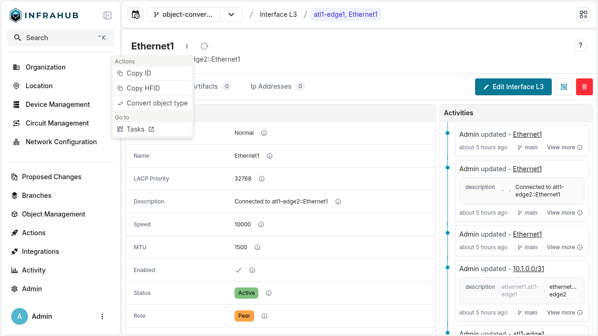
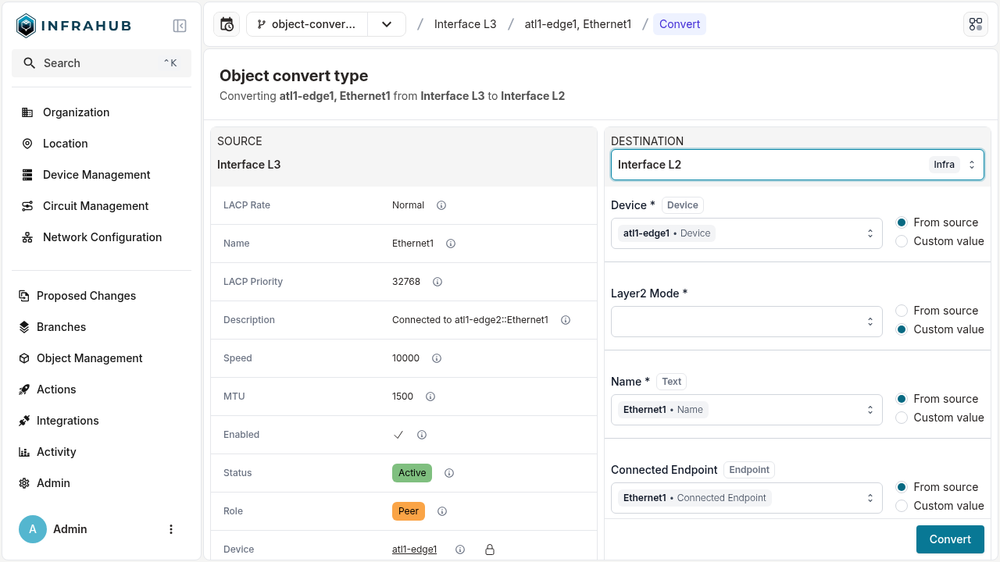

import Tabs from '@theme/Tabs';
import TabItem from '@theme/TabItem';

# How to convert object types

This guide shows how to convert an existing object from one type to another without having to manually delete and recreate it. This is useful when you need to change an object's schema type while preserving its data and relationships.

For conceptual information about object conversion, see [Object conversion](../topics/object-conversion.mdx).

## Introduction

Object type conversion allows you to transform an object from one schema type to another compatible type. For example, you might need to convert a Layer 3 interface to a Layer 2 interface, or change a read-only repository to a read-write repository.

The conversion process automatically maps equivalent fields between the source and destination types, and allows you to specify values for any mandatory fields that don't have equivalent mappings.

## Prerequisites

Before starting, ensure you have:

- An existing object that you want to convert
- Access to Infrahub through the web interface, GraphQL API, or Python SDK
- Understanding of both the source and destination schema types
- Values ready for any mandatory fields in the destination type that don't exist in the source type

## Step 1: Identify equivalent fields

Infrahub automatically identifies equivalent fields between source and destination types based on these criteria:

- **Attribute fields** are equivalent if they have the same name and value type
- **Relationship fields** are equivalent if they have the same name, peer schema type, and cardinality

Fields that match these criteria will be automatically mapped during conversion.

## Step 2: Convert the object type

<Tabs>
  <TabItem value="web" label="Web Interface" default>

Navigate to the object you want to convert and select **Convert object type** from the actions dropdown menu.



Infrahub displays a mapping interface showing how fields from the source type will map to the destination type. The interface automatically maps equivalent fields and highlights any mandatory fields that require values.



Review the field mappings and provide values for any mandatory fields that don't have automatic mappings. Click **Convert** to complete the process.

  </TabItem>

  <TabItem value="graphql" label="GraphQL">

First, query the field mapping between source and destination types to understand what values you need to provide:

```graphql
query GetMapping {
  FieldsMappingTypeConversion(
    source_kind: "InfraInterfaceL3"
    target_kind: "InfraInterfaceL2"
  ) {
    mapping
  }
}
```

The response shows the mapping between source and destination fields, indicating which fields are mandatory and which have automatic mappings:

```json
{
  "data": {
    "FieldsMappingTypeConversion": {
      "mapping": {
        "lacp_priority": {
          "is_mandatory": false,
          "source_field_name": "lacp_priority",
          "relationship_cardinality": null
        },
        "l2_mode": {
          "is_mandatory": true,
          "source_field_name": null,
          "relationship_cardinality": null
        },
        "name": {
          "is_mandatory": true,
          "source_field_name": "name",
          "relationship_cardinality": null
        },
        "device": {
          "is_mandatory": true,
          "source_field_name": "device",
          "relationship_cardinality": "one"
        }
        // Additional fields omitted for brevity
      }
    }
  }
}
```

Use this mapping information to build the conversion mutation, providing values for mandatory fields that don't have source mappings:

```graphql
mutation ConvertType {
  ConvertObjectType(
    data: {
      node_id: "18703746-7b3b-442e-3027-10657106d6f9"
      target_kind: "InfraInterfaceL2"
      fields_mapping: {
        device: {
          source_field: "device"
        },
        l2_mode: {
          data: {
            attribute_value: "Access"
          }
        },
        name: {
          source_field: "name"
        },
        connected_endpoint: {
          source_field: "connected_endpoint"
        },
        lag: {
          use_default_value: true
        },
        untagged_vlan: {
          use_default_value: true
        },
        tagged_vlan: {
          use_default_value: true
        }
        // Additional field mappings as needed
      }
    }
  ) {
    node
    __typename
  }
}
```

  </TabItem>
  <TabItem value="sdk" label="Python SDK">

Use the Python SDK to convert an object type by first retrieving the object and then calling the conversion method:

```python
from infrahub_sdk import InfrahubClientSync
from infrahub_sdk.convert_object_type import ConversionFieldInput, ConversionFieldValue

client = InfrahubClientSync(address="http://localhost:8000")

# Get the object to convert
interface = client.get(
    kind="InfraInterfaceL3", 
    name__value="Ethernet1", 
    device__name__value="ord1-edge2"
)

# Define field mappings for the conversion
fields_mapping = {
    "device": ConversionFieldInput(source_field="device"),
    "l2_mode": ConversionFieldInput(
        data=ConversionFieldValue(attribute_value="Access")
    ),
    "name": ConversionFieldInput(source_field="name"),
    "connected_endpoint": ConversionFieldInput(source_field="connected_endpoint"),
    "speed": ConversionFieldInput(source_field="speed"),
    "lag": ConversionFieldInput(use_default_value=True),
    "untagged_vlan": ConversionFieldInput(use_default_value=True),
    "tagged_vlan": ConversionFieldInput(use_default_value=True),
    # Add additional mappings as needed
}

# Perform the conversion
new_interface = client.convert_object_type(
    node_id=interface.id,
    target_kind="InfraInterfaceL2",
    branch=client.default_branch,
    fields_mapping=fields_mapping,
)

print(f"Conversion successful. New interface kind: {new_interface.get_kind()}")
```

  </TabItem>
</Tabs>

## Step 3: Verify the conversion

After converting the object, verify that the conversion was successful:

1. **Check the object type**: Confirm that the object now shows the correct destination type
2. **Verify field values**: Ensure that all data was transferred correctly and new mandatory fields have appropriate values
3. **Test relationships**: Confirm that relationships to other objects are still intact and functioning properly

:::success
If the conversion completed without errors, your object has been successfully converted to the new type with all compatible data preserved.
:::

## Advanced usage

### Converting objects with branch-aware attributes

Objects that have branch-aware attributes require special consideration during conversion:

:::warning
Converting objects with branch-aware attributes has important limitations that affect other branches in your repository.
:::

**Limitations:**

- Conversion is only allowed on the default branch (usually `main`)
- Other branches will automatically enter a `NEED_REBASE` state after conversion
- Branch-aware attribute values on non-conversion branches will be lost
- No write operations can be performed on affected branches until they are rebased

### Handling mandatory fields without source mappings

When the destination type has mandatory fields that don't exist in the source type, you must provide values:

- **Use explicit values**: Provide specific attribute values or relationship targets
- **Use default values**: Allow Infrahub to use schema-defined defaults where available
- **Use computed values**: Let relationship fields use computed defaults when appropriate

## Related resources

- [Object conversion topic](../topics/object-conversion) - Understanding the concepts behind object conversion
- [Schema management guide](./create-schema) - Creating and modifying schema types

git checkout -b atg-20251020-infp-258
