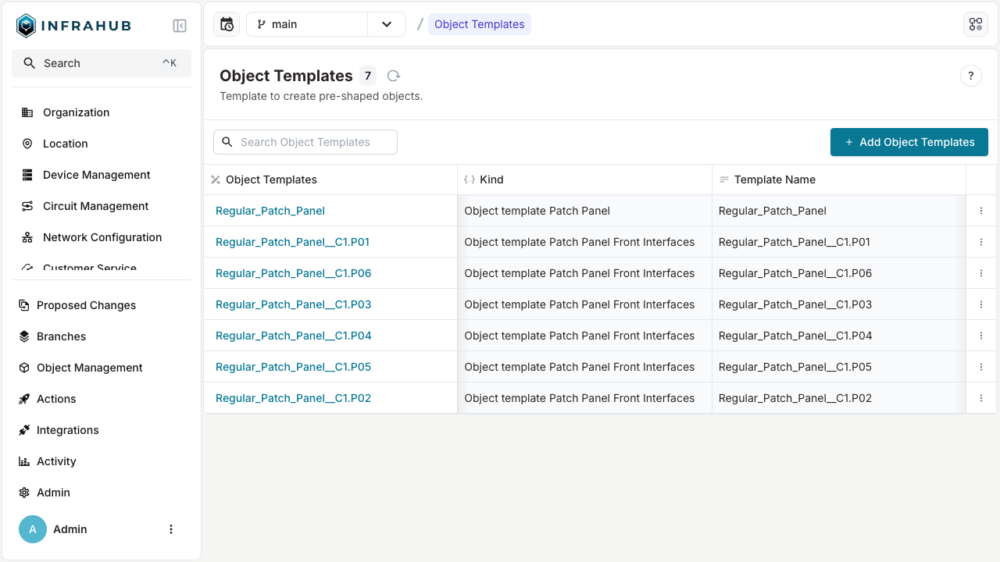
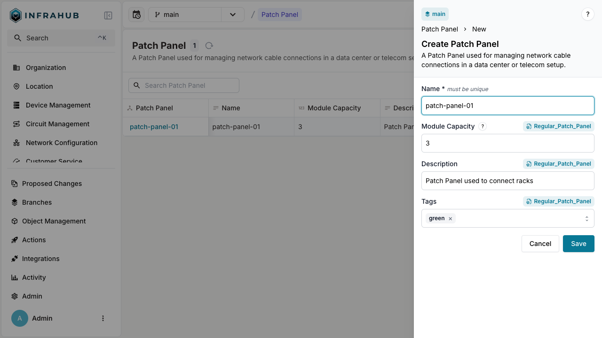
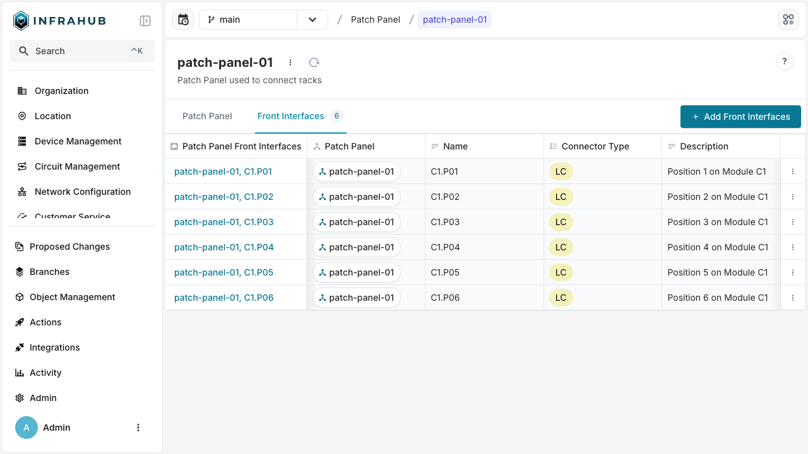

import Tabs from '@theme/Tabs';
import TabItem from '@theme/TabItem';

This guide provides a structured approach to defining an object template and creating object instances based on that template.

At a high level, the process consists of three key steps:

- Enable template support within the schema
- Populate the template with data
- Create object instances using the predefined template

To illustrate this process, we will use a common use case: Creating ports for a device.

For more details, refer to the [Object Template Topic](../topics/object-template.mdx).

## Enable template support within the schema

If you are already familiar with [Schema Development](../guides/create-schema.mdx) in Infrahub, enabling template generation is straightforward.

At the node level, the `generate_template` property allows users to enable template generation for a given node and its associated components.

```yaml
---
# yaml-language-server: $schema=https://schema.infrahub.app/infrahub/schema/latest.json
version: "1.0"

nodes:
  - name: Interface
    namespace: Infra
    label: "Interface"
    include_in_menu: true
    icon: "mdi:ethernet"
    display_label: "{{ name__value }}"
    order_by:
      - name__value
    uniqueness_constraints:
      - ["device", "name__value"]
    human_friendly_id: ["device__name__value", "name__value"]
    attributes:
      - name: name
        kind: Text
      - name: description
        kind: Text
        optional: true
      - name: enable
        kind: Boolean
        optional: false
        default_value: false
    relationships:
      - name: device
        peer: InfraDevice
        optional: false
        cardinality: one
        kind: Parent

  - name: DeviceType
    namespace: Infra
    label: "Device Type"
    icon: "mdi:server"
    human_friendly_id: ["name__value"]
    order_by:
      - name__value
    display_label: "{{ name__value }}"
    attributes:
      - name: name
        kind: Text
        unique: true
      - name: number_of_u
        kind: Number
        default_value: 1
    relationships:
      - name: devices
        peer: InfraDevice
        optional: true
        cardinality: many

  - name: Device
    namespace: Infra
    generate_template: true # This flag enables template for Device and Interfaces
    label: "Device"
    icon: "mdi:server"
    human_friendly_id: ["name__value"]
    order_by:
      - name__value
    display_label: "{{ name__value }}"
    attributes:
      - name: name
        kind: Text
        unique: true
      - name: description
        kind: Text
        optional: true
      - name: serial
        kind: Text
        optional: true
    relationships:
      - name: device_type
        label: device_type
        peer: InfraDeviceType
        optional: false
        cardinality: one
        kind: Attribute
      - name: interfaces # As this relationship's kind is component, it will automatically be covered by the template
        peer: InfraInterface
        optional: true
        cardinality: many
        kind: Component

```

You can now **load this schema into your Infrahub instance**. For more details, refer to the [Import Schema Guide](../guides/import-schema.mdx).

## Populate the template with data

Heading back to Infrahub you will notice new entries in the left-hand menu. Before entering template information we will create a device type, this will be useful for later.

### Create a device type

<Tabs>
  <TabItem value="web" label="Via the Web Interface" default>

  1. Navigate to the left-hand menu and select `Device Type`
  2. Click the `+ Add new Device Type` button
  3. Then fill the form
      - **Name**: SwitchModel123
      - **Number of U**: 2
  4. Hit the save button

  </TabItem>
  <TabItem value="graphql" label="Via the GraphQL Interface">

  ```graphql
  mutation {
    InfraDeviceTypeCreate(
      data: {name: {value: "SwitchModel123"}, number_of_u: {value: 2}}
    ) {
      ok
    }
  }
  ```

  </TabItem>
</Tabs>

Now that the device type is created, we can proceed to work on the template itself.

:::warning

In Infrahub's implementation of object template, **the template doesn't hold any information about the device model** (for example the Number of U). This information is stored in the device type object. Fortunately we can link the template to a device type object, this will be transferred to the object.

:::

### Create a device template

All template-related records can be found in the menu under the dedicated section `Object Management` > `Templates`.

<Tabs>
  <TabItem value="web" label="Via the Web Interface" default>

  1. Go to `Object Management` > `Templates`
  2. Click the `+ Add Object Templates` button
  3. In the drop-down list pick `Device`
  4. Then fill the form
      - **Template Name**: Template-SwitchModel123
      - **Device Type**: SwitchModel123
  5. Hit the save button

  </TabItem>
  <TabItem value="graphql" label="Via the GraphQL Interface">

  ```graphql
  mutation {
    TemplateInfraDeviceCreate(
      data: {template_name: {value: "Template-SwitchModel123"}, device_type: {hfid: ["SwitchModel123"]}}
    ) {
      ok
    }
  }
  ```

  </TabItem>
</Tabs>

:::important

In the device template, you specify the actual device type object. This means that **creating a device using your template will automatically set up a relationship between the new device and the specified device type**.
Some fields can be left empty because the device template doesn't apply to them. Take the serial number, by definition it will be different from one device to another.

:::

### Create an interface template

:::note

Ensure you **reference the device template created in the previous step**. For demonstration purposes, you can create multiple interface templates.

:::

<Tabs>
  <TabItem value="web" label="Via the Web Interface" default>

  1. Click the `+ Add Object Templates` button
  2. In the drop-down list pick `Object template Interface`
  3. Then fill-out the fields
      - **Template Name**: Template-SwitchModel123-Ethernet1; Template-SwitchModel123-Ethernet2; Template-SwitchModel123-Ethernet3
      - **Device**: Template-SwitchModel123
      - **Name**: Ethernet1; Ethernet2; Ethernet3
  4. Hit the save button

  </TabItem>
  <TabItem value="graphql" label="Via the GraphQL Interface">

  ```graphql
  mutation {
    CreateTemplateEthernet1: TemplateInfraInterfaceCreate(
      data: {name: {value: "Ethernet1"}, template_name: {value: "Template-SwitchModel123-Ethernet1"}, device: {hfid: ["Template-SwitchModel123"]}}
    ) {
      ok
    }
    CreateTemplateEthernet2: TemplateInfraInterfaceCreate(
      data: {name: {value: "Ethernet2"}, template_name: {value: "Template-SwitchModel123-Ethernet2"}, device: {hfid: ["Template-SwitchModel123"]}}
    ) {
      ok
    }
    CreateTemplateEthernet3: TemplateInfraInterfaceCreate(
      data: {name: {value: "Ethernet3"}, template_name: {value: "Template-SwitchModel123-Ethernet3"}, device: {hfid: ["Template-SwitchModel123"]}}
    ) {
      ok
    }
  }
  ```

  </TabItem>
</Tabs>



:::success

With the device template and interface templates in place, you're all set to create new instances based on them!

:::

## Create object instances using the predefined template

Heading back to the main menu we will create a device object.

<Tabs>
  <TabItem value="web" label="Via the Web Interface" default>

  1. Click `Device` item in the left hand side menu
  2. Hit `+ Add Device` button
  3. Pick the template option and select the template you created in the previous step

  

  :::important

  At this stage, you can either create your device from scratch, following the standard process, or **start from a predefined template!**

  :::

  4. You can fill the missing information (for instance the `serial` field)

  

  :::note

  Information sourced from the template is indicated by a small chip above the form inputs. You can override this information at any time.

  :::

  5. Hit the save button

  </TabItem>
  <TabItem value="graphql" label="Via the GraphQL Interface">
    ```graphql
    mutation {
      InfraDeviceCreate(
        data: {object_template: {hfid: ["Template-SwitchModel123"]}, serial: {value: "OWI62IUHQ"}, description: {value: "This is a Core Switch"}}
      ) {
        ok
      }
    }
    ```
  </TabItem>
</Tabs>



:::success

When viewing your newly created device object, navigate to the Interfaces tab to see a **list of interfaces pre-populated based on the template you defined**. Keep in mind that **any modifications made to the template will not retroactively apply to objects that have already been created from it**.

:::

## Using profiles with templates

When both `generate_template` and `generate_profile` are configured on a schema node, you can assign profiles to templates to enable bulk configuration updates. Objects created from templates automatically inherit the profiles assigned to those templates, allowing you to update values in bulk by modifying the profile.

:::info Profile and template integration

When a profile is assigned to a template:

- Objects created from the template automatically inherit the template's profiles
- Template values (when explicitly configured) take precedence over profile values
- Profiles provide values for attributes not explicitly set on the template
- Multiple profiles can be assigned to a template with proper priority handling
- This enables consistent configuration management across templated objects

:::

For more information about profiles and templates, see:

- [Creating and assigning profiles](../guides/profiles.mdx) - Guide for working with profiles
- [Understanding profiles in Infrahub](../topics/profiles.mdx) - Deep dive into profile concepts
