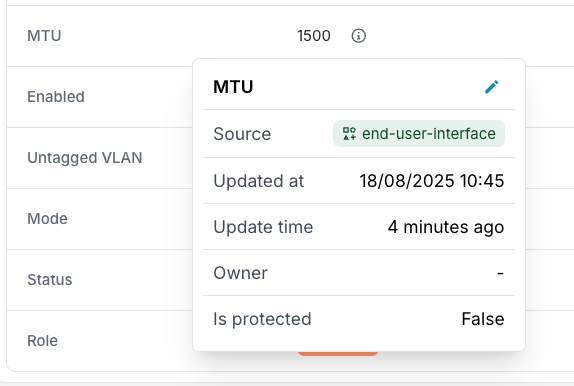
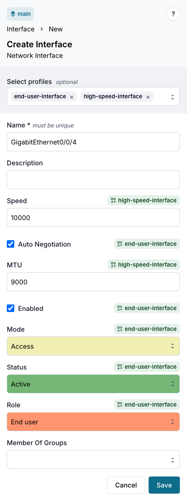

import Tabs from '@theme/Tabs';
import TabItem from '@theme/TabItem';

This guide shows you how to create and apply Profiles to ensure consistent configuration across multiple nodes in Infrahub. Profiles help you maintain standardized configurations and reduce repetitive work when managing similar objects.

## What you'll achieve

By following this guide, you'll:

- Create a Profile that defines standard configuration for network interfaces
- Apply the Profile to multiple interfaces to ensure consistency
- Learn how to override Profile values for specific interfaces
- Understand how Profile inheritance works in Infrahub

## Prerequisites

- Infrahub instance running and accessible
- Schema loaded with nodes that support Profiles
- Basic understanding of GraphQL mutations and queries

## Load the schema

:::warning Schema creation
This step is only necessary if you don't already have a schema with Profile-enabled nodes in your instance.
:::

1. Create a `schema.yml` file in the schemas directory of your repository:

```yaml title="schema.yml" {9}
# yaml-language-server: $schema=https://schema.infrahub.app/infrahub/schema/latest.json
---
version: "1.0"
nodes:
  - name: VLAN
    namespace: Ipam
    description: A VLAN is an isolated layer two domain
    label: VLAN
    icon: mdi:lan-pending
    human_friendly_id:
      - name__value
    order_by:
      - name__value
    display_label: name__value
    attributes:
      - name: name
        kind: Text
      - name: description
        kind: Text
        optional: true
      - name: vlan_id
        kind: Number

  - name: Interface
    namespace: Infra
    description: "Network Interface"
    label: "Interface"
    generate_profile: true # Enable profile generation (default)
    include_in_menu: true
    icon: "mdi:ethernet"
    display_label: "{{ name__value }}"
    order_by:
      - name__value
    attributes:
      - name: name
        kind: Text
        optional: false
        unique: true
      - name: description
        kind: Text
        optional: true
      - name: speed
        kind: Number
        optional: true
      - name: auto_negotiation
        kind: Boolean
        default_value: false
      - name: mtu
        label: MTU
        kind: Number
        default_value: 1500
      - name: enabled
        kind: Boolean
        default_value: false
      - name: mode
        kind: Dropdown
        default_value: access
        choices:
          - name: access
            label: Access
          - name: trunk
            label: Trunk
      - name: status
        kind: Dropdown
        optional: true
        choices:
          - name: active
            label: Active
            description: "Fully operational and currently in service"
            color: "#7fbf7f"
          - name: provisioning
            label: Provisioning
            description: "In the process of being set up and configured"
            color: "#ffff7f"
          - name: maintenance
            label: Maintenance
            description: "Undergoing routine maintenance or repairs"
            color: "#ffd27f"
          - name: drained
            label: Drained
            description: "Temporarily taken out of service"
            color: "#bfbfbf"
      - name: role
        kind: Dropdown
        optional: true
        choices:
          - name: uplink
            label: Uplink
            description: "Interface connected to other network device"
            color: "#9090de"
          - name: end_user
            label: End user
            description: "Interface to connect end-user devices"
            color: "#ffa07a"
          - name: server
            label: Server
            description: "Interfaces to connect to servers"
            color: "#98b2d1"
    relationships:
      - name: untagged_vlan
        label: Untagged VLAN
        peer: IpamVLAN
        optional: true
        cardinality: one
        kind: Generic
```

2. Load the schema with this command:

```shell
infrahubctl schema load schema.yml
```

:::success

You should see: `schema 'schema.yml' loaded successfully`

:::

## Step 1: Creating a Profile

### Create an interface Profile

Let's create a Profile that defines the standard configuration for end-user interfaces. This Profile will set common attributes that should be applied consistently across multiple interfaces.

The Profile will define these standard settings:

- **Speed**: 1000 Mbps
- **Status**: active (interface is operational)
- **Enabled**: true (interface is administratively up)
- **Auto negotiation**: enabled
- **MTU**: 1500 bytes
- **Mode**: access (not trunk)
- **Role**: end_user
- **Untagged VLAN**: 10 (this is the default VLAN for end-user devices)

:::info Relationships in Profiles

From Infrahub 1.7 relationships can also be defined in Profiles. If you are using an earlier version, you can skip the untagged VLAN part. Learn more in the [Understanding Profiles in Infrahub](../topics/profiles#relationships-in-profiles) topic.

:::

<Tabs groupId="method">
<TabItem value="web" label="Web interface">

1. Open the **Infrahub UI** in your browser
2. Navigate to **VLAN**
3. Click on **Add VLAN**
4. Fill in the VLAN details as follows:
    - **Name**: VLAN 10
    - **VLAN ID**: 10
5. Click **Save** to create the VLAN
6. Navigate to **Object Management** → **Profiles**
7. Click on **Add Profile**
8. Select **InfraInterface** as the Profile type
9. Fill in the Profile details as follows:
    - **Profile Name**: end-user-interface
    - **Speed**: 1000
    - **Auto Negotiation**: true
    - **MTU**: 1500
    - **Enabled**: true
    - **Mode**: access
    - **Status**: active
    - **Role**: end_user
    - **Untagged VLAN**: VLAN 10
10. Click **Save** to create the Profile

</TabItem>
<TabItem value="graphql" label="GraphQL">

:::note
Access the GraphQL sandbox by clicking your user icon in the bottom left corner and selecting **GraphQL Sandbox**.
:::

```graphql
mutation {
  IpamVLANCreate(data: {name: {value: "VLAN 10"}, vlan_id: {value: 10}}) {
    ok
    object {
      name {
        value
      }
    }
  }
  ProfileInfraInterfaceCreate(
    data: {
      profile_name: {value: "end-user-interface"}
      status: {value: "active"}
      enabled: {value: true}
      speed: {value: 1000}
      auto_negotiation: {value: true}
      mtu: {value: 1500}
      mode: {value: "access"}
      role: {value: "end_user"}
      untagged_vlan: {hfid: ["VLAN 10"]}
    }
  ) {
    ok
    object {
      id
      profile_name {
        value
      }
    }
  }
}
```

</TabItem>
</Tabs>

### Verify the Profile was created

Query Infrahub to confirm the Profile exists:

<Tabs groupId="method">
<TabItem value="web" label="Web interface">

1. Navigate to **Object Management** → **Profiles**
2. Locate the **end-user-interface** Profile in the list and click on it

</TabItem>
<TabItem value="graphql" label="GraphQL">

```graphql
query {
  ProfileInfraInterface(profile_name__value: "end-user-interface") {
    edges {
      node {
        id
        profile_name {
          value
        }
        status {
          value
        }
        enabled {
          value
        }
        mtu {
          value
        }
        untagged_vlan {
          node {
            name {
              value
            }
          }
        }
      }
    }
  }
}
```

</TabItem>
</Tabs>

:::success
You should see the Profile with all attributes set to your specified values.
:::

## Step 2: Using the Profile

### Create interfaces using the Profile

Now that we have a Profile, let's create multiple interfaces that inherit configuration from it. When using Profiles, you only need to specify the unique attributes (like name) and reference the Profile for all standardized values.

<Tabs groupId="method">
<TabItem value="web" label="Web interface">

1. Navigate to **Interface**
2. Click on **Add Interface**
3. Fill in the interface details as follows:
    - **Profile**: end-user-interface
    - **Interface Name**: GigabitEthernet0/0/0

:::note
You should see interface field values automatically populated when selecting the Profile.
:::

4. Click **Save** to create the interface
5. Repeat the process for additional interfaces:
    - **Profile**: end-user-interface
    - **Interface Name**: GigabitEthernet0/0/1 and GigabitEthernet0/0/2

</TabItem>
<TabItem value="graphql" label="GraphQL">

```graphql
mutation {
  int0: InfraInterfaceCreate(
    data: {
      name: {value: "GigabitEthernet0/0/0"},
      profiles: [{hfid: ["end-user-interface"]}]
    }
  ) {
    ok
    object {
      id
    }
  }
  int1: InfraInterfaceCreate(
    data: {
      name: {value: "GigabitEthernet0/0/1"},
      profiles: [{hfid: ["end-user-interface"]}]
    }
  ) {
    ok
    object {
      id
    }
  }
  int2: InfraInterfaceCreate(
    data: {
      name: {value: "GigabitEthernet0/0/2"},
      profiles: [{hfid: ["end-user-interface"]}]
    }
  ) {
    ok
    object {
      id
    }
  }
}
```

:::success

The query should return the IDs of the created interfaces:

```json
{
  "data": {
    "int0": {
      "ok": true,
      "object": {
        "id": "185cd024-5c9a-2afb-3583-c513b8097987"
      }
    },
    "int1": {
      "ok": true,
      "object": {
        "id": "185cd024-70f4-7fdf-3585-c51087cce195"
      }
    },
    "int2": {
      "ok": true,
      "object": {
        "id": "185cd024-777e-bcb1-358e-c5170daba901"
      }
    }
  }
}
```

:::

</TabItem>
</Tabs>

### Verify Profile inheritance

Now let's verify that the interfaces have properly inherited values from the Profile. Infrahub's metadata shows which values came from Profiles, giving you complete transparency about data origin.

<Tabs groupId="method">
<TabItem value="web" label="Web interface">

1. Navigate to **Interface**
2. Click on **GigabitEthernet0/0/0** to view the details
3. Click the "info" icon next to **MTU** to see the metadata

:::success

You should see that the MTU value is inherited from the Profile.



:::

</TabItem>
<TabItem value="graphql" label="GraphQL">

```graphql
query {
  InfraInterface(name__value: "GigabitEthernet0/0/0") {
    edges {
      node {
        name {
          value
          is_from_profile
        }
        mtu {
          value
          is_from_profile
          source {
            hfid
            display_label
          }
        }
      }
    }
  }
}
```

:::success

You should see that the MTU value is inherited from the Profile.

```json
{
  "data": {
    "InfraInterface": {
      "edges": [
        {
          "node": {
            "name": {
              "value": "GigabitEthernet0/0/0",
              "is_from_profile": false
            },
            "mtu": {
              "value": 1500,
              "is_from_profile": true,
              "source": {
                "hfid": [
                  "end-user-interface"
                ],
                "display_label": "end-user-interface"
              }
            }
          }
        }
      ]
    }
  }
}
```

:::

</TabItem>
</Tabs>

## Step 3: Override Profile values

While Profiles ensure consistency, you sometimes need exceptions for specific devices or interfaces. Infrahub lets you override Profile values when needed.

### Create an interface with custom MTU

Create an interface with a custom MTU value that overrides the Profile default:

<Tabs groupId="method">
<TabItem value="web" label="Web interface">

1. Navigate to **Interface**
2. Click on **Add Interface**
3. Fill in the interface details as follows:
    - **Profile**: end-user-interface
    - **Interface Name**: GigabitEthernet0/0/3
    - **MTU**: 9000 (this overrides the MTU value)
4. Click **Save** to create the interface

</TabItem>
<TabItem value="graphql" label="GraphQL">

```graphql {6}
mutation {
  InfraInterfaceCreate(
    data: {
      name: {value: "GigabitEthernet0/0/3"},
      mtu: {value: 9000},  # Override profile MTU
      profiles: [{hfid: ["end-user-interface"]}]
    }
  ) {
    ok
    object {
      id
    }
  }
}
```

</TabItem>
</Tabs>

### Verify the override

Confirm that the MTU was overridden while other values still come from the Profile:

<Tabs groupId="method">
<TabItem value="web" label="Web interface">

1. Navigate to **Interface**
2. Click on **GigabitEthernet0/0/3** to view the details
3. Click the "info" icon next to **MTU** to see the metadata

:::success

You should see that the MTU value is **not** inherited from the Profile (source is empty).

:::

</TabItem>
<TabItem value="graphql" label="GraphQL">

```graphql
query {
  InfraInterface(name__value: "GigabitEthernet0/0/3") {
    edges {
      node {
        mtu {
          value
          is_from_profile
        }
      }
    }
  }
}
```

:::success

You should see that the MTU value is **not** inherited from the Profile.

```json {9}
{
  "data": {
    "InfraInterface": {
      "edges": [
        {
          "node": {
            "mtu": {
              "value": 9000,
              "is_from_profile": false
            }
          }
        }
      ]
    }
  }
}
```

:::

</TabItem>
</Tabs>

## Step 4: Updating a Profile

One of the key benefits of Profiles is that when you update a Profile, all nodes using it automatically inherit the changes. This provides a powerful way to update configurations across your infrastructure.

### Updating the Profile

We will change the `end-user-interface` Profile to set a new default **MTU** of `9000` instead of `1500`.

<Tabs groupId="method">
<TabItem value="web" label="Web interface">

1. Open the **Infrahub UI** in your browser
2. Navigate to **Object Management** → **Profiles**
3. Locate the **end-user-interface** Profile in the list and click on it
4. Click **Edit Profile Interface**
5. Change the **MTU** value to `9000`
6. Click **Save** to apply the changes

</TabItem>
<TabItem value="graphql" label="GraphQL">

```graphql
mutation {
  ProfileInfraInterfaceUpdate(
    data: {
      hfid: ["end-user-interface"]
      mtu: {value: 9000} # Change the profile's MTU
    }
  ) {
    ok
  }
}
```

</TabItem>
</Tabs>

### Verify the update in interfaces

<Tabs groupId="method">
<TabItem value="web" label="Web interface">

1. Navigate to **Interface**

</TabItem>
<TabItem value="graphql" label="GraphQL">

```graphql
query {
  InfraInterface {
    edges {
      node {
        display_label
        mtu {
          value
          is_from_profile
        }
      }
    }
  }
}
```

</TabItem>
</Tabs>

:::success

You should see that the MTU value is now `9000` for all the interfaces.

:::

## Conclusion

You've successfully set up Profiles for your interfaces in Infrahub. Here's what you've accomplished:

- Created a standardized Profile for end-user interfaces
- Applied the Profile to multiple interfaces to ensure consistent configuration
- Verified how values are inherited from Profiles using metadata
- Overridden specific Profile values for individual interfaces when needed
- Updated a Profile and observed changes propagate automatically
- Worked with multiple Profiles and understood inheritance priority

## Advanced usage

### Using multiple Profiles

Infrahub lets you assign multiple Profiles to a single node, giving you powerful composition capabilities. When multiple Profiles define the same attribute, the `profile_priority` value controls which takes precedence (lower number = higher priority).

Learn more about Profile priorities in the [Understanding Profiles in Infrahub](../topics/profiles.mdx) topic.

#### Step 1: Creating another Profile

<Tabs groupId="method">
<TabItem value="web" label="Web interface">

1. Navigate to **Object Management** → **Profiles**
2. Click on **Add Profile**
3. Select **InfraInterface** as the Profile type
4. Fill in the Profile details as follows:
    - **Profile Name**: high-speed-interface
    - **MTU**: 9000
    - **Speed**: 10000
5. Click **Save** to create the Profile

</TabItem>
<TabItem value="graphql" label="GraphQL">

```graphql
mutation {
  ProfileInfraInterfaceCreate(
    data: {
      profile_name: {value: "high-speed-interface"}
      profile_priority: {value: 500} # Lower number = higher priority
      speed: {value: 10000}
      mtu: {value: 9000}
    }
  ) {
    ok
  }
}
```

</TabItem>
</Tabs>

#### Step 2: Assigning multiple Profiles to an interface

<Tabs groupId="method">
<TabItem value="web" label="Web interface">

1. Navigate to **Interface**
2. Click on **Add Interface**
3. Fill in the interface details as follows:
    - **Profile**: `end-user-interface` and `high-speed-interface`
    - **Interface Name**: GigabitEthernet0/0/4



:::note
You should see interface field values automatically populated when selecting the Profiles.
:::

4. Click **Save** to create the interface

</TabItem>
<TabItem value="graphql" label="GraphQL">

```graphql {5}
mutation {
  InfraInterfaceCreate(
    data: {
      name: {value: "GigabitEthernet0/0/4"},
      profiles: [{hfid: ["end-user-interface"]}, {hfid: ["high-speed-interface"]}]
    }
  ) {
    ok
    object {
      id
    }
  }
}
```

</TabItem>
</Tabs>

#### Step 3: Validating Profile inheritance with multiple Profiles

Let's check which Profile values are being applied when multiple Profiles define the same attribute:

<Tabs groupId="method">
<TabItem value="web" label="Web interface">

1. Navigate to **Interface**
2. Click on **GigabitEthernet0/0/4** to view the details
3. Click the "info" icon next to **Speed** to see the metadata
4. Click the "info" icon next to **Status** to see the metadata

</TabItem>
<TabItem value="graphql" label="GraphQL">

```graphql
query {
  InfraInterface(name__value: "GigabitEthernet0/0/4") {
    edges {
      node {
        name {
          value
        }
        status {
          value
          is_from_profile
          source {
            hfid
            display_label
          }
        }
        speed {
          value
          is_from_profile
          source {
            hfid
            display_label
          }
        }
      }
    }
  }
}
```

:::success

```json
{
  "data": {
    "InfraInterface": {
      "edges": [
        {
          "node": {
            "name": {
              "value": "GigabitEthernet0/0/4"
            },
            "status": {
              "value": "active",
              "is_from_profile": true,
              "source": {
                "hfid": [
                  "end-user-interface"
                ],
                "display_label": "end-user-interface"
              }
            },
            "speed": {
              "value": 10000,
              "is_from_profile": true,
              "source": {
                "hfid": [
                  "high-speed-interface"
                ],
                "display_label": "high-speed-interface"
              }
            }
          }
        }
      ]
    }
  }
}
```

:::

</TabItem>
</Tabs>

:::success

You should see that:

- The **Speed** value (10000) is inherited from the `high-speed-interface` Profile
- The **Status** value (active) is inherited from the `end-user-interface` Profile

:::

## Using Profiles with templates

When both `generate_template` and `generate_profile` are configured on a schema node, you can assign Profiles to templates for powerful configuration management. This allows you to:

- **Define structure with templates**: Templates define which components exist (i.e., which interfaces are present)
- **Configure values with Profiles**: Profiles define the configuration settings for those components
- **Bulk updates**: Modify Profile values to update all objects created from templates using those Profiles

### How template-Profile integration works

When you assign a Profile to a template and then create objects from that template:

1. The object is created based on the template structure
2. The template's Profiles are automatically assigned to the created object
3. Template values (when explicitly configured) take precedence over Profile values
4. Profiles provide values for attributes not explicitly set on the template
5. You can assign multiple Profiles to a template with proper priority handling

This enables you to update configuration values in bulk by modifying the Profile, while the template ensures structural consistency and can override specific values when needed.

For more information, see:

- [Creating an object template guide](../guides/object-template.mdx) - Step-by-step guide for creating templates
- [Object templates topic](../topics/object-template.mdx) - Understanding template and Profile integration

## Related resources

- [Understanding Profiles in Infrahub](../topics/profiles.mdx) - Detailed explanation of Profile concepts, inheritance rules, and design decisions
- [Metadata](../topics/metadata.mdx) - Learn how Infrahub tracks data lineage and attribute sources
- [Creating a schema](../guides/create-schema.mdx) - Learn to create schemas that generate Profile support
- [Creating an object template](../guides/object-template.mdx) - Learn how to combine templates with Profiles for powerful configuration management
- [Object templates topic](../topics/object-template.mdx) - Understanding how Profiles integrate with templates
- [Node schema reference](../reference/schema/node.mdx) - Complete reference for node configuration including the `generate_profile` option
- [Schema validation](../reference/schema-validation.mdx) - Validate your schemas before loading
- [GraphQL API](../topics/graphql.mdx) - Overview of Infrahub's GraphQL API
- [Python SDK documentation]($(base_url)python-sdk/introduction) - Full SDK reference for programmatic Profile operations
