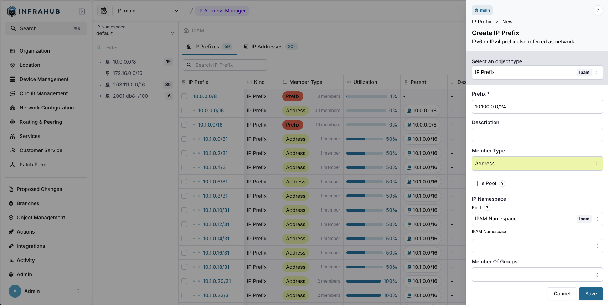
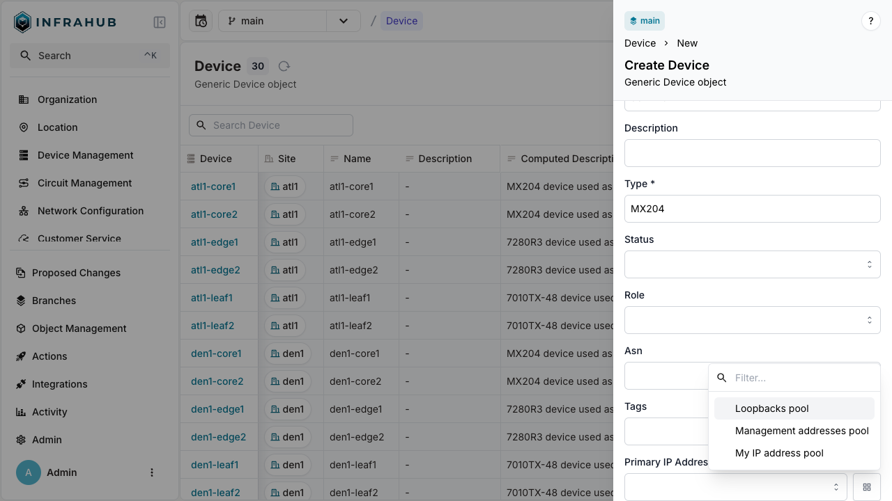
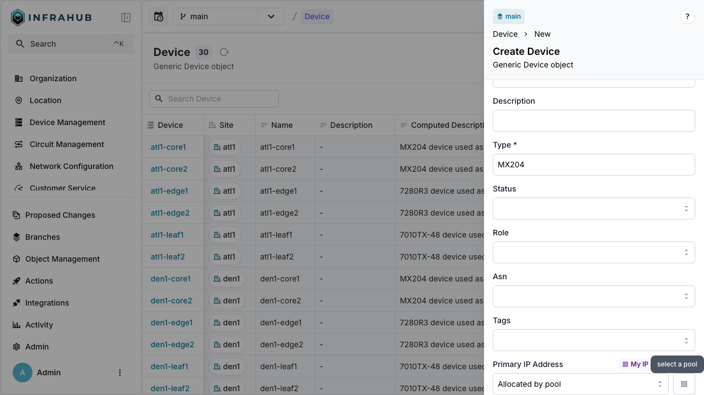
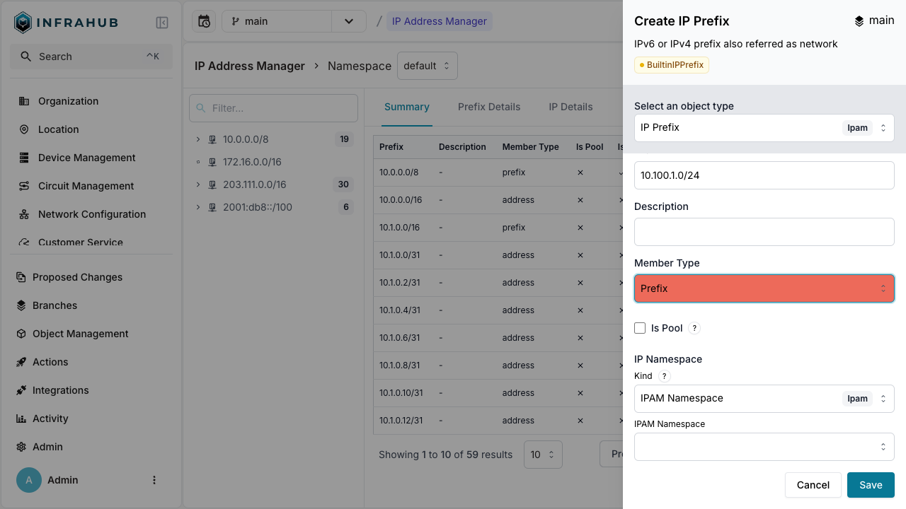
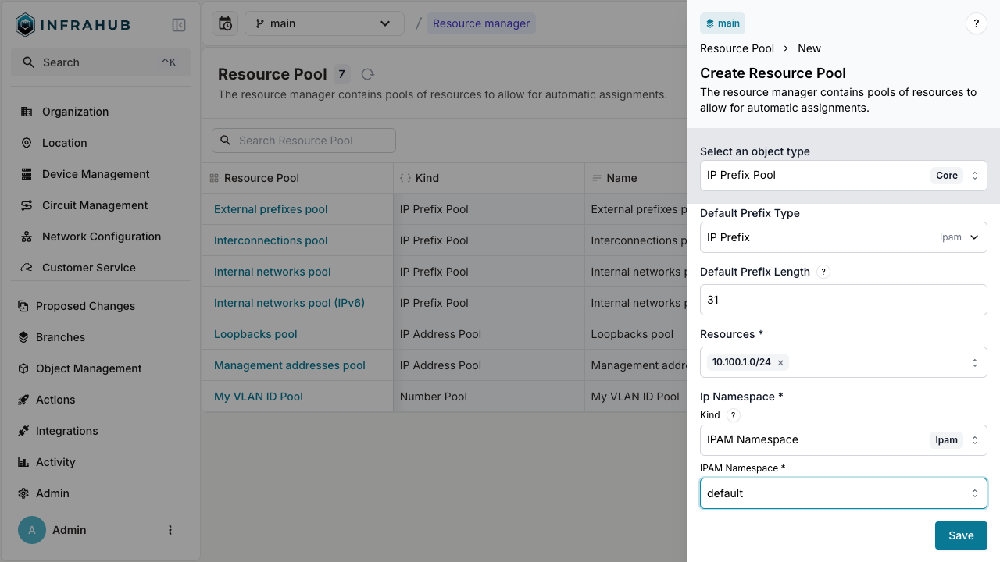
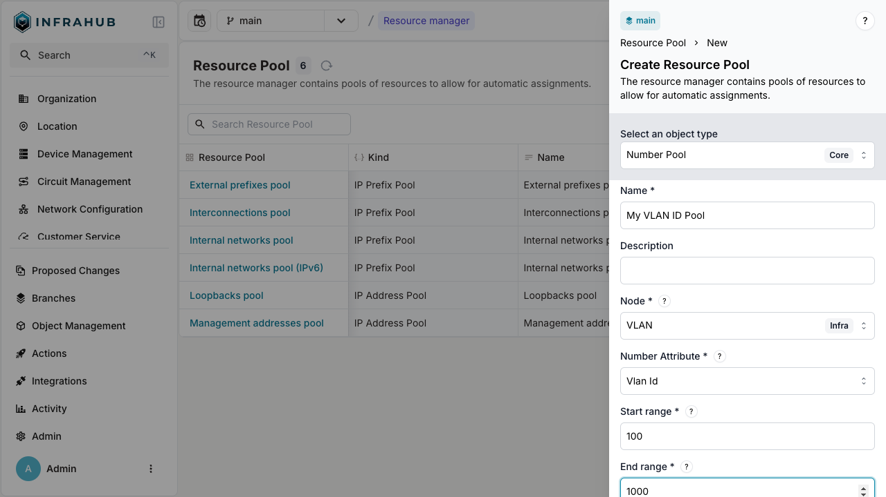
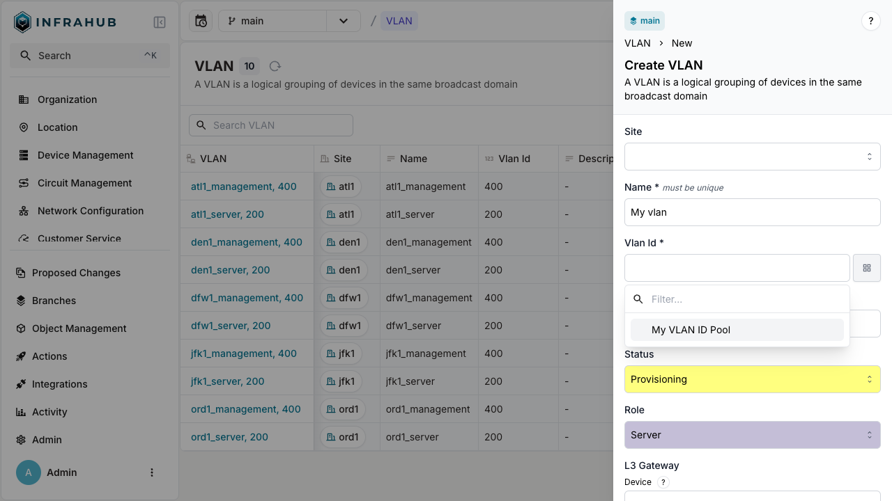

import VideoPlayer from '../../src/components/VideoPlayer';
import Tabs from '@theme/Tabs';
import TabItem from '@theme/TabItem';

This guide shows you how to create resource pools and allocate resources from them automatically. Resource managers eliminate manual IP address and number assignment by providing dynamic allocation from predefined pools.

:::note

This guide uses a simplified schema. If you already have the demo schema loaded, skip the schema loading section and adapt the examples to your existing setup.

:::

<center>
  <VideoPlayer url='https://www.youtube.com/watch?v=sVU4OKi9_9o' light />
</center>

## What you'll build

In this guide, you'll learn how to implement three common resource manager use cases:

1. **IP Address Allocation**: Assign IP addresses to devices from address pools
2. **IP Prefix Allocation**: Allocate customer subnets from larger prefix pools
3. **Number Allocation**: Generate sequential VLAN IDs from number pools

## Prerequisites

- A running Infrahub instance
- Basic understanding of GraphQL
- Understanding of the [Resource Manager concepts](../topics/resource-manager)
- `infrahubctl` CLI installed (for schema loading)

## Load the schema

:::warning Schema Creation

This step is only necessary if you don't already have the schemas affected by the resource manager in your instance.

:::

1. Create a schema.yml file in the schemas directory of your repository:

```yaml title="schema.yml"
# yaml-language-server: $schema=https://schema.infrahub.app/infrahub/schema/latest.json
---
version: "1.0"
generics:
  - name: Service
    namespace: Infra
    description: "Services"
    default_filter: name__value
    include_in_menu: false
    order_by:
      - name__value
    display_labels:
      - name__value
    attributes:
      - name: name
        kind: Text
        label: Name
        optional: false
        order_weight: 1

nodes:
  - name: IPPrefix
    namespace: Ipam
    include_in_menu: false
    inherit_from:
      - "BuiltinIPPrefix"
    description: "IPv4 or IPv6 network"
    label: "IP Prefix"
    relationships:
      - name: vlan
        peer: IpamVLAN
        optional: true
        cardinality: one
        kind: Attribute

  - name: IPAddress
    namespace: Ipam
    include_in_menu: false
    inherit_from:
      - "BuiltinIPAddress"
    description: "IP Address"
    label: "IP Address"

  - name: VLAN
    namespace: Ipam
    description: "A VLAN is isolated layer two domain"
    label: "VLAN"
    icon: "mdi:lan-pending"
    include_in_menu: true
    order_by:
      - name__value
    display_labels:
      - name__value
    attributes:
      - name: name
        kind: Text
        unique: true
        order_weight: 2
      - name: description
        kind: Text
        optional: true
      - name: vlan_id
        kind: Number
        order_weight: 3

  - name: Device
    namespace: Infra
    label: "Device"
    icon: "mdi:server"
    human_friendly_id: ["name__value"]
    order_by:
      - name__value
    display_labels:
      - name__value
    attributes:
      - name: name
        kind: Text
        label: Name
        optional: false
        unique: true
    relationships:
      - name: primary_ip
        label: "Primary IP Address"
        peer: IpamIPAddress
        kind: Attribute
        cardinality: one

  - name: Service
    namespace: Customer
    description: "A Customer service"
    icon: "carbon:ibm-cloud-internet-services"
    label: "Customer Service"
    inherit_from:
      - InfraService
    relationships:
      - name: assigned_prefix
        label: "Assigned prefix"
        peer: IpamIPPrefix
        optional: false
        kind: Attribute
        cardinality: one
```

2. Load the schema with this command:

```shell
infrahubctl schema load schema.yml
```

:::success

You should see: `schema 'schema.yml' loaded successfully`

:::

## Allocate IP address

IP address pools (`CoreIPAddressPool`) dynamically allocate individual IP addresses from source prefixes.

### Step 1: Create an IP prefix object

Create the IP prefix that serves as the allocation source:

<Tabs groupId="method">
  <TabItem value="web" label="Web interface" default>

Navigate to **IPAM** → **IP Prefixes**  and create a new prefix with:

- **Prefix**: `10.100.0.0/24`
- **Member Type**: `address`



</TabItem>

<TabItem value="graphql" label="GraphQL">

```graphql
mutation {
  IpamIPPrefixCreate(data: {
    prefix: {value: "10.100.0.0/24"},
    member_type: {value: "address"}
  })
  {
    ok
    object {
      id
    }
  }
}
```

:::important

Save the prefix ID for the next step!

:::

  </TabItem>
</Tabs>

### Step 2: Create the IP address pool

Create a `CoreIPAddressPool` resource manager:

<Tabs groupId="method">
  <TabItem value="web" label="Web interface" default>

Navigate to **Object Management** → **Resource Managers** and create a new IP Address Pool with:

- **Name**: `My IP address pool`
- **Default Address Type**: `IpamIPAddress`
- **Default Prefix Length**: `24`
- **Resources**: Select the `10.100.0.0/24` prefix
- **IP Namespace**: `default`


</TabItem>

<TabItem value="graphql" label="GraphQL">

```graphql
mutation {
  CoreIPAddressPoolCreate(data: {
    name: {value: "My IP address pool"},
    default_address_type: {value: "IpamIPAddress"},
    default_prefix_length: {value: 24},
    resources: [{id: "<prefix-id>"}],
    ip_namespace: {id: "default"}
  })
  {
    ok
    object {
      id
      hfid
    }
  }
}
```

:::important

Save the pool ID for allocation operations!

:::

  </TabItem>
</Tabs>

### Step 3: Allocate IP addresses

You can allocate IP addresses in two ways: direct allocation or allocation during node creation.

#### Direct allocation

Allocate an IP address directly from the pool:

<Tabs groupId="method">
  <TabItem value="web" label="Web interface" default>

  This method is currently not available in the Web interface. Use the GraphQL method instead.

  </TabItem>
  <TabItem value="graphql" label="GraphQL">

  ```graphql
  mutation {
    IPAddressPoolGetResource(
      data: {
        hfid: ["My IP address pool"]
        data: {description: "my first allocated ip"}
      }
    ) {
      ok
      node {
        id
        display_label
      }
    }
  }
  ```

  :::info Idempotent allocation

  Include an `identifier` field to ensure the same IP address is returned on repeated calls:

  ```graphql
  mutation {
    IPAddressPoolGetResource(
      data: {
        hfid: ["My IP address pool"]
        data: {description: "my first allocated ip"}
        identifier: "my-allocated-ip"
      }
    ) {
      ok
      node {
        id
        display_label
      }
    }
  }
  ```

  This is essential for [generators](../topics/generator.mdx) and automated workflows.

  :::

  </TabItem>
</Tabs>

:::success

You have created an IP address record from the pool!

:::

#### Allocation during node creation

Allocate an IP address when creating a device:

<Tabs groupId="method">
  <TabItem value="web" label="Web interface" default>

  Navigate to **Devices** → **Add Device**. Next to the Primary IP Address field, click the pools button and select your resource pool.

  
  

  </TabItem>

  <TabItem value="graphql" label="GraphQL">

  ```graphql
  mutation {
    InfraDeviceCreate(
      data: {
        name: {value: "dev-123"}
        primary_ip: {from_pool: {id: "<POOL-ID>"}}
      }
    ) {
      ok
      object {
        display_label
        primary_ip {
          node {
            address {
              value
            }
          }
        }
      }
    }
  }
  ```

  </TabItem>
</Tabs>

:::success

The device is created with primary IP address allocated from the pool!

:::

## Allocate IP prefix

IP prefix pools (`CoreIPPrefixPool`) allocate IP subnets from larger prefixes.

### Step 1: Create a source prefix

Create the parent prefix:

<Tabs groupId="method">
  <TabItem value="web" label="Web interface" default>

Navigate to **IPAM** → **IP Prefixes** and create a new prefix with:

- **Prefix**: `10.100.1.0/24`
- **Member Type**: `prefix`



  </TabItem>

  <TabItem value="graphql" label="GraphQL">

  ```graphql
  mutation {
    IpamIPPrefixCreate(
      data: {prefix: {value: "10.100.1.0/24"}
      member_type: {value: "prefix"}}
    ) {
      ok
      object {
        id
      }
    }
  }
  ```

  :::important

  Save the prefix ID for the next step!

  :::

  </TabItem>
</Tabs>

### Step 2: Create the IP prefix pool

Create a `CoreIPPrefixPool` resource manager:

<Tabs groupId="method">
  <TabItem value="web" label="Web interface" default>

Navigate to **Object Management** → **Resource Managers** and create a new IP Prefix Pool with:

- **Name**: `Customer Service Pool`
- **Default Prefix Type**: `IpamIPPrefix`
- **Default Prefix Length**: `31`
- **Resources**: Select the `10.100.1.0/24` prefix
- **IP Namespace**: `default`



  </TabItem>

  <TabItem value="graphql" label="GraphQL">

```graphql
mutation {
  CoreIPPrefixPoolCreate(data: {
    name: {value: "Customer Service Pool"},
    default_prefix_length: {value: 31},
    default_prefix_type: {value: "IpamIPPrefix"},
    resources: [{id: "<prefix-id>"}],
    ip_namespace: {id: "default"}
  })
  {
    ok
    object {
      id
      hfid
    }
  }
}
```

:::important

Save the pool ID for allocation operations!

:::

  </TabItem>
</Tabs>

### Step 3: Allocate IP prefixes

You can allocate IP prefixes in two ways: direct allocation or allocation during node creation.

#### Direct allocation

Allocate an IP prefix directly from the pool:

<Tabs groupId="method">
  <TabItem value="web" label="Web interface" default>

  This method is currently not available in the Web interface. Use the GraphQL method instead.

  </TabItem>
  <TabItem value="graphql" label="GraphQL">

  ```graphql
  mutation {
    IPPrefixPoolGetResource(data: {
      hfid: ["My IP address pool"]
      data: {
        description: "prefix allocated to point to point connection"
      }
    })
    {
      ok
      node {
        id
        display_label
      }
    }
  }
  ```

  </TabItem>
</Tabs>

:::success

You have created an IP prefix record from the pool!

:::

#### Allocation during node creation

Allocate an IP prefix when creating a customer service:

<Tabs groupId="method">
  <TabItem value="web" label="Web interface" default>

  Navigate to **Customer Service** → **Add Customer Service**.

  Next to the Assigned Prefix field, click the pools button and select your resource pool.

  </TabItem>
  <TabItem value="graphql" label="GraphQL">

  ```graphql
  mutation {
    CustomerServiceCreate(
      data: {
        name: {value: "svc-123"}
        assigned_prefix: {from_pool: {id: "<POOL-ID>"}}
      }
    ) {
      ok
      object {
        display_label
        assigned_prefix {
          node {
            prefix {
              value
            }
          }
        }
      }
    }
  }
  ```

  :::info Idempotent allocation

  Include an `identifier` field to ensure the same prefix is returned on repeated calls:

  ```graphql
  mutation {
    CustomerServiceUpsert(
      data: {
        name: {value: "svc-456"}
        assigned_prefix: {
          from_pool: {
            id: "<POOL-ID>"
            identifier: "svc-456"
          }
        }
      }
    ) {
      ok
      object {
        display_label
        assigned_prefix {
          node {
            prefix {
              value
            }
          }
        }
      }
    }
  }
  ```

  This is essential for [generators](../topics/generator.mdx) and automated workflows.

  :::

  </TabItem>
</Tabs>

:::success

The service is created with IP prefix allocated from the pool!

:::

## Allocate number

Number pools (`CoreNumberPool`) automatically assign sequential numbers to numeric attributes.

### Step 1: Create a number pool

Create a pool for VLAN IDs:

<Tabs groupId="method">
  <TabItem value="web" label="Web interface" default>

Navigate to **Object Management** → **Resource Managers** and create a new Number Pool with:

- **Name**: `My VLAN ID Pool`
- **Node**: `IpamVLAN`
- **Node attribute**: `vlan_id`
- **Start range**: `100`
- **End range**: `1000`



  </TabItem>
  <TabItem value="graphql" label="GraphQL">

```graphql
mutation {
  CoreNumberPoolCreate(
    data: {
      name: {value: "My VLAN ID Pool"}
      node: {value: "IpamVLAN"}
      node_attribute: {value: "vlan_id"}
      start_range: {value: 100}
      end_range: {value: 1000}
    }
  ) {
    ok
    object {
      hfid
      id
    }
  }
}
```

:::important

Save the pool ID for allocation operations!

:::

  </TabItem>
</Tabs>

### Step 2: Allocate VLAN ID

<Tabs>
  <TabItem value="web" label="Web interface" default>

  Navigate to **VLAN** → **Add VLAN**. Next to the VLAN ID field, click the pools button and select your number pool.

  
  

  </TabItem>

  <TabItem value="graphql" label="GraphQL">

  ```graphql
  mutation {
    IpamVLANCreate(
      data: {
        name: {value: "My vlan"}
        vlan_id: {from_pool: {id: "<POOL-ID>"}}
      }
    ) {
      ok
      object {
        name {
          value
        }
        vlan_id {
          value
        }
        id
      }
    }
  }
  ```

  </TabItem>
</Tabs>

:::success

The VLAN is created with VLAN ID allocated from the pool!

:::

## Advanced use cases

### Weighted allocation

When multiple resources can be allocated from a pool, you can control the allocation order using weights.

:::warning Schema Update

Adapt these steps to your existing schema.

:::

:::info Prefix pool & Address pool

While this example uses IP address pools, the same principles apply to IP prefix pools.

:::

1. Inherit from `CoreWeightedPoolResource` in your schema

```yaml title="schema.yml" {10}
# yaml-language-server: $schema=https://schema.infrahub.app/infrahub/schema/latest.json
---
version: "1.0"

nodes:
  - name: IPPrefix
    namespace: Ipam
    inherit_from:
      - "BuiltinIPPrefix"
      - "CoreWeightedPoolResource"
```

2. Load the schema with this command:

```shell
infrahubctl schema load schema.yml
```

3. Create two IP prefixes with different weights

<Tabs groupId="method">
  <TabItem value="web" label="Web interface" default>

Navigate to **IPAM** → **IP Prefixes**  and create a new prefix with:

- **Prefix**: `10.100.5.0/24`
- **Member Type**: `address`
- **Weight**: `100`

Then create another prefix with:

- **Prefix**: `10.100.6.0/24`
- **Member Type**: `address`
- **Weight**: `200`

</TabItem>
<TabItem value="graphql" label="GraphQL">

```graphql
mutation {
  IpamIPPrefixCreate(
    data: {
      prefix: {value: "10.100.5.0/24"}
      member_type: {value: "address"}
      allocation_weight: {value: 100}
    }
  ) {
    ok
    object {
      id
    }
  }
}
```

```graphql
mutation {
  IpamIPPrefixCreate(
    data: {
      prefix: {value: "10.100.6.0/24"}
      member_type: {value: "address"}
      allocation_weight: {value: 200}
    }
  ) {
    ok
    object {
      id
    }
  }
}
```

:::important

Save the prefix IDs for the next step!

:::

  </TabItem>
</Tabs>

4. Create a `CoreIPAddressPool` resource manager:

<Tabs groupId="method">
  <TabItem value="web" label="Web interface" default>

Navigate to **Object Management** → **Resource Managers** and create a new IP Address Pool with:

- **Name**: `My Weighted IP address pool`
- **Default Address Type**: `IpamIPAddress`
- **Default Prefix Length**: `24`
- **Resources**: Select the `10.100.5.0/24` and `10.100.6.0/24` prefixes
- **IP Namespace**: `default`

</TabItem>

<TabItem value="graphql" label="GraphQL">

```graphql
mutation {
  CoreIPAddressPoolCreate(
    data: {
      name: {value: "My Weighted IP address pool"}
      default_address_type: {value: "IpamIPAddress"}
      default_prefix_length: {value: 24}
      resources: [
        {id: "<prefix01-id>"},
        {id: "<prefix02-id>"}
      ]
      ip_namespace: {id: "default"}
    }
  ) {
    ok
    object {
      id
      hfid
    }
  }
}
```

  </TabItem>
</Tabs>

5. Allocate an IP address from the pool:

```graphql
mutation {
  IPAddressPoolGetResource(
    data: {
      hfid: ["My Weighted IP address pool"]
      data: {description: "my first allocated ip"}
    }
  ) {
    ok
    node {
      id
      display_label
    }
  }
}
```

:::success Weighted allocation

You should have received an IP address from the `10.100.6.0/24` prefix, as it has a higher weight (200) than `10.100.5.0/24` (100).

:::

### Branch-agnostic allocation

Resource managers allocate resources across all branches to prevent conflicts.

1. Create a test branch

```shell
infrahubctl branch create test
```

2. Allocate an IP address in the test branch

```graphql
mutation {
  IPAddressPoolGetResource(
    data: {
      hfid: ["My IP address pool"]
      data: {description: "my IP allocated on branch test"}
    }
  ) {
    ok
    node {
      id
      display_label
    }
  }
}
```

3. Check allocation status from the main branch

```graphql
query {
  InfrahubResourcePoolAllocated(
    pool_id: "<POOL-ID>"
    resource_id: "<PREFIX-ID>"
  ) {
    edges {
      node {
        display_label
        branch
      }
    }
  }
  IpamIPAddress {
    edges {
      node {
        display_label
      }
    }
  }
}
```

:::success

The query shows the IP address is allocated in the test branch, preventing duplicate allocation in main, even though the IP address object doesn't exist in main yet.

:::

## Related resources

- [Resource Manager topic](../topics/resource-manager.mdx) - Deep dive into resource manager concepts and architecture
- [Resource Manager blog post](https://opsmill.com/blog/infrahub-resource-manager-automate-allocation/) - Alternative learning resource with additional examples
- [Generators topic](../topics/generator) - Learn how to automate resource allocation workflows
- [IPAM topic](../topics/ipam) - Additional information about IP address management
- [Schema topic](./import-schema) - Learn more about creating and managing schemas in Infrahub
- [IPAM topic](../topics/ipam) - Additional information about IP address management
- [Schema topic](./import-schema) - Learn more about creating and managing schemas in Infrahub
