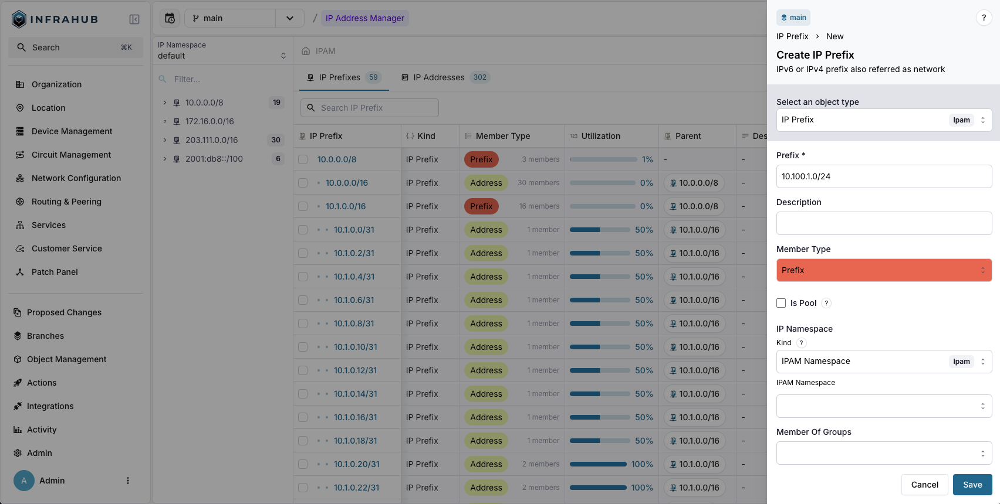
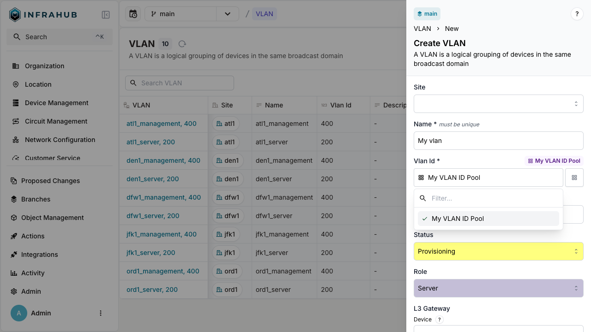

import ReactPlayer from 'react-player/youtube'
import Tabs from '@theme/Tabs';
import TabItem from '@theme/TabItem';

The goal of this guide is to show you how to create a resource pool, and how you can allocated resources using them.

:::note

This guide is using a smaller schema than the demo one provide, but with similar relationship.
We makes the assumption that we start with an Infrahub instance that doesn't have any data or schema loaded.
But if you have load the demo schema skip the section regarding loading schema.

:::

<center>
  <ReactPlayer url='https://www.youtube.com/watch?v=sVU4OKi9_9o' light />
</center>

## Loading a schema

Save the following schema in a file on your local system.
The location or filename are not that important, but in this guide will be using `/tmp/schema.yml`

```yaml
# yaml-language-server: $schema=https://schema.infrahub.app/infrahub/schema/latest.json
---
version: "1.0"
generics:
  - name: Service
    namespace: Infra
    description: "Services"
    default_filter: name__value
    order_by:
      - name__value
    display_labels:
      - name__value
    attributes:
      - name: name
        kind: Text
        label: Name
        optional: false
        order_weight: 1

nodes:
  - name: IPPrefix
    namespace: Ipam
    include_in_menu: false
    inherit_from:
      - "BuiltinIPPrefix"
    description: "IPv4 or IPv6 network"
    label: "IP Prefix"
    relationships:
      - name: vlan
        peer: IpamVLAN
        optional: true
        cardinality: one
        kind: Attribute

  - name: IPAddress
    namespace: Ipam
    include_in_menu: false
    inherit_from:
      - "BuiltinIPAddress"
    description: "IP Address"
    label: "IP Address"

  - name: VLAN
    namespace: Ipam
    description: "A VLAN is isolated layer two domain"
    label: "VLAN"
    icon: "mdi:lan-pending"
    include_in_menu: true
    order_by:
      - name__value
    display_labels:
      - name__value
    attributes:
      - name: name
        kind: Text
        unique: true
        order_weight: 2
      - name: description
        kind: Text
        optional: true
      - name: vlan_id
        kind: Number
        order_weight: 3

  - name: Device
    namespace: Infra
    label: "Device"
    icon: "mdi:server"
    human_friendly_id: ["name__value"]
    order_by:
      - name__value
    display_labels:
      - name__value
    attributes:
      - name: name
        kind: Text
        label: Name
        optional: false
        unique: true
    relationships:
      - name: primary_ip
        label: "Primary IP Address"
        peer: IpamIPAddress
        kind: Attribute
        cardinality: one

  - name: Service
    namespace: Customer
    description: "A Customer service"
    icon: "carbon:ibm-cloud-internet-services"
    label: "Customer Service"
    inherit_from:
      - InfraService
    relationships:
      - name: assigned_prefix
        label: "Assigned prefix"
        peer: IpamIPPrefix
        optional: false
        kind: Attribute
        cardinality: one
```

Load the schema with the `infrahubctl` command.

```shell title="❯ infrahubctl schema load /tmp/schema.yml"
 schema '/tmp/schema.yml' loaded successfully
 1 schema processed in 6.846 seconds.
```

## Using IP address pool

A `CoreIPAddressPool` allows you to dynamically allocate IP addresses from one or multiple source IP prefixes.

### Creating an IP Prefix object

First, create an IP Prefix object that the resource manager will use as a resource.
You can create a prefix (for example, `10.100.0.0/24`) either via the web interface or through the GraphQL interface.

<Tabs>
  <TabItem value="web" label="Via the Web Interface" default>
  
  </TabItem>

  <TabItem value="graphql" label="Via the GraphQL Interface">

  ```graphql
    mutation {
      IpamIPPrefixCreate(data: {
        prefix: {value: "10.100.0.0/24"},
        member_type: {value: "address"},
      })
      {
        ok
        object {
          id
        }
      }
    }
  ```

  Take note of the id of the prefix, we will need id in the next step.

  </TabItem>
</Tabs>

### Creating an IP address resource manager

Next, create a resource manager of kind `CoreIPAddressPool` with the following properties:

* **Name**: My IP address pool
* **Default Address Type**: `IpamIPAddress` (as defined in your schema)
* **Default Prefix Length**: 24
* **Resources**: `10.100.0.0/24`
* **IP Namespace**: `default`

The `CoreIPAddressPool` can be created using the web interface, or by using this GraphQL mutation. Replace the id of the resource with the id of the prefix of the previous step.

<Tabs>
  <TabItem value="web" label="Via the Web Interface" default>
  
  </TabItem>

  <TabItem value="graphql" label="Via the GraphQL Interface">

  ```graphql
    mutation {
      CoreIPAddressPoolCreate(data: {
        name: {value: "My IP address pool"},
        default_address_type: {value: "IpamIPAddress"},
        default_prefix_length: {value: 24},
        resources: [{id: "<id of prefix>"}],
        ip_namespace: {id: "default"}
      })
      {
        ok
        object {
          id
          hfid
        }
      }
    }
  ```

  Take note of the id and hfid of the `CoreIPAddressPool`, we will use it in the next steps.
  </TabItem>
</Tabs>

### Allocating an IP address out of the pool

We can now start allocating IP addresses out of the `CoreIPAddressPool` we created.

We can use the resource manager to allocate resources out of a pool in 2 different ways:

1. Directly allocate a resource out of a pool. This is typically used when you need to allocate a resource that has no relation to other nodes. For example, allocating an IP address out of a pool that will be assigned to something that is not stored in Infrahub.
2. Allocate a resource out of a pool to a relationship of a node. For example, create a device and allocate an IP address out of a pool and assign it to the device

Please refer to the [Resource Manager Topic](../topics/resource-manager) for further details.

#### Direct allocation of an IP address

Execute the following mutation to allocate an IP address out of the pool. Replace the id with the id of the `CoreIPAddressPool` we created previously.

<Tabs>
  <TabItem value="graphql" label="Via the GraphQL Interface">

  ```graphql
    mutation {
      IPAddressPoolGetResource(
        data: {
          id: "<id of resource pool>",
          data: {
            description: "my first allocated ip"
          }
        }
      )
      {
        ok
        node {
          id
          display_label
        }
      }
    }
  ```

  </TabItem>
</Tabs>

In the mutation we passed additional data to the allocated resource, in this case we passed a description attribute. This description attribute will be set on the IP address that was allocated. You can do this for any other attribute and relationship for the destination address type.

:::success Idempotent allocation of an IP address

You can allocate resources in an idempotent way by specifying an identifier in the GraphQL mutation. This identifier links the resource pool with the allocated resource allowing us to create idempotent allocation behavior. This is crucial when you want to allocate resources in an idempotent way using [generators](../topics/generator).

Execute this mutation twice, note the identifier. The resulting IP address should be the same, as well as the id. Replace the id with the id of the `CoreIPAddressPool` we created previously.

<Tabs>
  <TabItem value="graphql" label="Via the GraphQL Interface">

  ```graphql
    mutation {
      IPAddressPoolGetResource(data: {
        id: "<id of resource pool>",
        identifier: "my-allocated-ip",
      })
      {
        ok
        node {
          id
          display_label
        }
      }
    }
  ```

  </TabItem>
</Tabs>

:::

#### Allocating an IP address to a relationship of a node

Another way we can use resource managers is in situations where we create a node that has a relationship and we want to use a resource manager to allocate a new resource for that relationship. For example, we want to create a new device (or server) and assign an IP address to the device out of a pool.

<Tabs>
  <TabItem value="web" label="Via the Web Interface" default>
  Navigate to the Device list view and click on the `Add Device` button.
  Next to the Primary IP Address dropdown menu, you can click on the Pools options button and select the resource pool.

  
  

  </TabItem>

  <TabItem value="graphql" label="Via the GraphQL Interface">

  In this mutation we use the `from_pool` resolver to indicate we want to allocate a `primary_ip` from a resource pool. Replace the id with the id of the `CoreIPAddressPool` we created previously.

  ```graphql
    mutation {
      InfraDeviceCreate(data: {
        name: {value: "dev-123"},
        primary_address: {
          from_pool: {
            id: "<id of resource pool>"
          }
        }
      })
      {
        ok
        object {
          display_label
          primary_address {
            node {
              address {
                value
              }
            }
          }
        }
      }
    }
  ```

  When you use the `from_pool` resolver, the resource allocation happens in an idempotent way, an identifier is automatically assigned to the resource allocation in this case.
  </TabItem>
</Tabs>

## Using IP prefix pool

A `CoreIPPrefixPool` will allow you to dynamically allocate IP prefix from one or multiple source IP prefix.

### Creating an IP Prefix object

First we need to create an IP Prefix object, which the resource manager will use as a resource to allocate resources from.
You can create a prefix `10.100.1.0/24` using the web interface, or by using this GraphQL mutation.

<Tabs>
  <TabItem value="web" label="Via the Web Interface" default>
  
  </TabItem>

  <TabItem value="graphql" label="Via the GraphQL Interface">

  ```graphql
    mutation {
      IpamIPPrefixCreate(data: {
        prefix: {value: "10.100.1.0/24"},
        member_type: {value: "prefix"},
      })
      {
        ok
        object {
          id
        }
      }
    }
  ```

  Take note of the id of the prefix, we will need id in the next step.
  </TabItem>
</Tabs>

### Creating an IP prefix resource manager

We can now create a resource manager of kind `CoreIPPrefixPool`. The kind of the resource manager determines the kind of resource the manager will allocate.

We will create a `CoreIPPrefixPool` with the following properties:

* **Name**: Customer Service Pool
* **Default Prefix Type**: `IpamIPPrefix` (as defined in your schema)
* **Default Prefix Length**: 31
* **Resources**: `10.100.1.0/24`
* **IP Namespace**: `default`

The `CoreIPPrefixPool` can be created using the web interface, or by using this GraphQL mutation. Replace the id of the resource with the id of the prefix of the previous step.

<Tabs>
  <TabItem value="web" label="Via the Web Interface" default>
  
  </TabItem>

  <TabItem value="graphql" label="Via the GraphQL Interface">

  ```graphql
    mutation {
      CoreIPPrefixPoolCreate(data: {
        name: {value: "Customer Service Pool"},
        default_prefix_length: {value: 31},
        default_prefix_type: {value: "IpamIPPrefix"},
        resources: [{id: "<id of prefix>"}],
        ip_namespace: {id: "default"}
      })
      {
        ok
        object {
          id
          hfid
        }
      }
    }
  ```

  Take note of the id and hfid of the `CoreIPPrefixPool`, we will use it in the next steps.
  </TabItem>
</Tabs>

### Allocating an IP prefix out of the pool

We can now start allocating IP prefix out of the `CoreIPPrefixPool` we created.

We can use the resource manager to allocate resources out of a pool in 2 different ways:

1. Directly allocate a resource out of a pool. This is typically used when you need to allocate a resource that has no relation to other nodes. For example, allocating an IP address out of a pool that will be assigned to something that is not stored in Infrahub.
2. Allocate a resource out of a pool to a relationship of a node. For example, create a device and allocate an IP address out of a pool and assign it to the device

Please refer to the [Resource Manager Topic](../topics/resource-manager) for further details.

#### Direct allocation of an IP prefix

Execute the following mutation to allocate an IP prefix out of the pool. Replace the id with the id of the `CoreIPPrefixPool` we created previously.

<Tabs>
  <TabItem value="graphql" label="Via the GraphQL Interface">

  ```graphql
    mutation {
      IPPrefixPoolGetResource(data: {
        id: "<id of resource pool>",
        data: {
          description: "prefix allocated to point to point connection"
        }
      })
      {
        ok
        node {
          id
          display_label
        }
      }
    }
  ```

  </TabItem>
</Tabs>

In the mutation we passed additional data to the allocated resource, in this case we passed a description attribute. This description attribute will be set on the IP prefix that was allocated. You can do this for any other attribute and relationship for the destination address type.

#### Allocating an IP prefix to a relationship of a node

Another way we can use resource managers is in situations where we create a node that has a relationship and we want to use a resource manager to allocate a new resource for that relationship. For example, we want to create a new customer service and assign a prefix of a pool.

This feature is not yet available directly via the Web Interface.

<Tabs>
  <TabItem value="graphql" label="Via the GraphQL Interface" default>
  In this mutation we use the `from_pool` resolver to indicate we want to allocate a `assigned_prefix` from a resource pool. Replace the id with the id of the `CoreIPPrefixPool` we created previously.

  ```graphql
    mutation {
      CustomerServiceCreate(data: {
        name: {value: "svc-123"},
        assigned_prefix: {
          from_pool: {
            id: "<id of resource pool>"
          }
        }
      })
      {
        ok
        object {
          display_label
          assigned_prefix {
            node {
              prefix {
                value
              }
            }
          }
        }
      }
    }
  ```

  When you use the `from_pool` resolver, the resource allocation happens in an idempotent way, an identifier is automatically assigned to the resource allocation in this case.
  </TabItem>
</Tabs>

:::success Idempotent allocation of an IP prefix

You can allocate resources in an idempotent way by specifying an identifier in the GraphQL mutation. This identifier links the resource pool with the allocated resource allowing us to create idempotent allocation behavior. This is crucial when you want to allocate resources in an idempotent way using [generators](../topics/generator).

Execute this mutation twice, note the identifier. The resulting IP prefix should be the same, as well as the id. Replace the id with the id of the `CoreIPPrefixPool` we created previously.

<Tabs>
  <TabItem value="graphql" label="Via the GraphQL Interface">

  ```graphql
    mutation {
      IPPrefixPoolGetResource(data: {
        id: "<id of resource pool>",
        identifier: "my-allocated-prefix",
      })
      {
        ok
        node {
          id
          display_label
        }
      }
    }
  ```

  </TabItem>
</Tabs>

:::

## Using number pool

A `CoreNumberPool` is connected to a node's numeric attribute. It lets you automatically assign numbers from a set range as values for that attribute.

### Creating a number resource manager

First we need to create a resource manager of kind `CoreNumberPool`. This resource manager will be linked to an attribute of type `Number` for a given node.

We will create a `CoreNumberPool` with the following properties:

* **Name**: My VLAN ID Pool
* **Node**: `IpamVLAN`
* **Node attribute**: `vlan_id`
* **Start range**: 100
* **End range**: 1000

The `CoreNumberPool` can be created using the web interface, or by using this GraphQL mutation.

<Tabs>
  <TabItem value="web" label="Via the Web Interface" default>
  
  </TabItem>

  <TabItem value="graphql" label="Via the GraphQL Interface">

  ```graphql
    mutation {
      CoreNumberPoolCreate(data:{
        name: {value: "My VLAN ID Pool"},
        node: {value: "IpamVLAN"},
        node_attribute: {value: "vlan_id"},
        start_range: {value: 100},
        end_range: {value: 1000}
      })
      {
        ok
        object {
          hfid
          id
        }
      }
    }
  ```

  Take note of the id and hfid of the `CoreNumberPool`, we will use it in the next steps.
  </TabItem>
</Tabs>

### Allocating a number out of the pool

<Tabs>
  <TabItem value="web" label="Via the Web Interface" default>
  Navigate to the VLAN list view and click on the `Add VLAN` button.
  Next to the `VLAN ID`, you can click on the Pools options button and select the resource pool.

  
  
  </TabItem>

  <TabItem value="graphql" label="Via the GraphQL Interface">

  In the following mutation we use the `from_pool` resolver to indicate that we want to allocate a `vlan_id` from a resource pool.

  ```graphql
    mutation {
      IpamVLANCreate(data:{
        name: {value: "My vlan"},
        # Using the HFID
        vlan_id: {from_pool: {hfid: ["My VLAN ID Pool"]}}
        # Using the ID
        # vlan_id: {from_pool: {id: <id of resource pool> }}
      })
      {
        ok
        object {
          name {
            value
          }
          vlan_id {
            value
          }
          id
        }
      }
    }
  ```

  </TabItem>
</Tabs>

## Branch agnostic resource allocation

Resource managers have to allocate resources in a branch agnostic way. For example if we allocate a resource in a branch, then that resource should also be allocated in the main branch, even if the resource object does not yet exist in the main branch.

Without this behavior we could allocate the resource multiple times, which should not be possible.

Create a branch named `test`

```shell title="❯ infrahubctl branch create test"
Branch 'test' created successfully (17d28fe4-a2d7-93ec-35a4-c51c5c804f05).
```

Allocate a new IP address in the `test` branch using this mutation. Replace the id with the id of the `CoreIPAddressPool` we created previously.

<Tabs>
  <TabItem value="graphql" label="Via the GraphQL Interface">

  ```graphql
    mutation {
      IPAddressPoolGetResource(
        data: {
          id: "<id of resource pool>",
      })
      {
        ok
        node {
          id
          display_label
        }
      }
    }
  ```

  </TabItem>
</Tabs>

We can now execute this query in the `main` branch. Replace the `pool_id` with the id of the `CoreIPAddressPool` and the `resource_id` with the id of the `IpamIPPrefix` we created previously.

```graphql
query {
  InfrahubResourcePoolAllocated(pool_id: "<id of the pool>", resource_id: "<id of the prefix>") {
    edges {
      node {
        display_label
        branch
      }
    }
  }
  IpamIPAddress {
    edges {
      node {
        display_label
      }
    }
  }
}
```

Notice that we have one IP address allocated by the Resource manager in the test branch. The query in the main branch shows us this allocation, indicating that it has been allocated and the resource cannot be allocated again. However, the IP address does not exist itself within the main branch.
