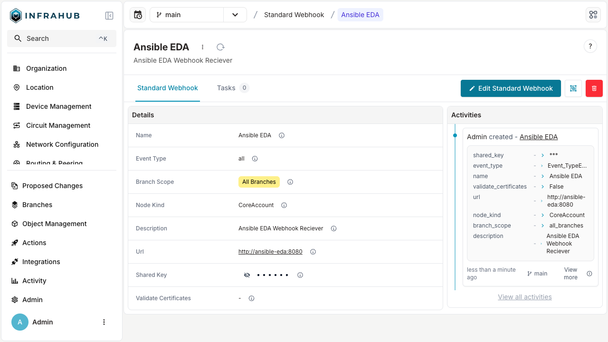

import Tabs from '@theme/Tabs';
import TabItem from '@theme/TabItem';

Infrahub supports two different types of webhooks:

- `Standard Webhook` sends event information to an external endpoint.
- `Custom Webhook` allows the ability to tie events to a [Transformation](../topics/transformation.mdx) to configure the payload being sent to an external endpoint.

# Managing webhooks

<Tabs groupId="method" queryString>
  <TabItem value="web" label="Via the Web Interface" default>

1. Login to Infrahub's web interface as an administrator.
2. Select `Integrations` -> `Webhooks`.

3. Click **+ Add Webhook**.

6. Fill in the details and click **Save**.

  </TabItem>

  <TabItem value="graphql" label="Via the GraphQL Interface">
## Creating a new Webhook

In the GraphQL sandbox, execute the following mutation, edit values to be appropriate for your use case:

```graphql
mutation {
  CoreStandardWebhookCreate(
    data: {
        name: {value: "Ansible EDA"},
        description: {value: "Ansible Webhook Receiver"},
        branch_scope: {value: "all_branches"},
        url: {value: "http://ansible-eda:8080"},
        shared_key: {value: "supersecret"}
    }) {
    object {
      display_label
    }
  }
}
```

  </TabItem>
</Tabs>

# Creating a custom webhook with a Transformation

Custom webhooks allow you to transform event data before sending it to an external endpoint. This is useful when the receiving system expects a specific payload format, such as Slack, Microsoft Teams, GitHub Actions, or other third-party APIs.

For general information about Python Transformations, see the [Python Transformation guide](./python-transform.mdx). For details about webhook events and payloads, see the [webhooks topic](../topics/webhooks.mdx).

:::note

When using a Transformation with a webhook, the Transformation receives the webhook event data directly instead of executing its GraphQL query. The `query` attribute is still required on the Transformation class but is not used. See [GitHub issue #6650](https://github.com/opsmill/infrahub/issues/6650) for updates on this requirement.

:::

## 1. Create the Python Transformation

Create a Python file with a Transformation class that processes webhook event data. The Transformation receives a dictionary containing the event information:

```python title="transforms/slack_webhook.py"
from typing import Any

from infrahub_sdk.transforms import InfrahubTransform


class SlackWebhookTransform(InfrahubTransform):
    query = "placeholder_query"  # Required but not used for webhooks
    timeout = 10

    async def transform(self, data: dict[str, Any]) -> dict[str, Any]:
        event_type = data.get("event", "unknown")
        node_data = data.get("data", {})
        node_kind = node_data.get("kind", "Unknown")
        action = node_data.get("action", "unknown")

        # Format payload for Slack incoming webhook
        return {
            "text": f"Infrahub: {node_kind} {action}",
            "blocks": [
                {
                    "type": "section",
                    "text": {
                        "type": "mrkdwn",
                        "text": f"*Event:* `{event_type}`\n*Kind:* {node_kind}\n*Branch:* {data.get('branch') or 'default'}"
                    }
                }
            ]
        }
```

The `data` parameter contains:

| Field | Description |
|-------|-------------|
| `data` | Original event payload (node changes, changelog, etc.) |
| `id` | Unique event identifier (UUID) |
| `event` | Event type, such as `infrahub.node.updated` |
| `branch` | Branch name or `None` for branch-independent events |
| `account_id` | UUID of the account that triggered the event |
| `occured_at` | ISO 8601 timestamp of when the event occurred |

See the [webhooks topic](../topics/webhooks.mdx) for example event payloads.

## 2. Create a placeholder GraphQL query

Create a GraphQL query file. This query is required but not executed for webhook Transformations:

```graphql title="queries/placeholder.gql"
query PlaceholderQuery {
  InfrahubStatus {
    summary {
      active_schema_hash
    }
  }
}
```

## 3. Configure .infrahub.yml

Add the Transformation and query to your repository configuration:

```yaml title=".infrahub.yml"
# yaml-language-server: $schema=https://schema.infrahub.app/python-sdk/repository-config/latest.json
---
python_transforms:
  - name: slack_webhook_transform
    class_name: SlackWebhookTransform
    file_path: "transforms/slack_webhook.py"

queries:
  - name: placeholder_query
    file_path: "queries/placeholder.gql"
```

## 4. Add the repository to Infrahub

Add your repository containing the Transformation to Infrahub. See the [repository guide](./repository.mdx) for instructions.

## 5. Create the custom webhook

<Tabs groupId="method" queryString>
  <TabItem value="web" label="Via the Web Interface" default>

1. Navigate to **Integrations** > **Webhooks**.
2. Click **+ Add Webhook**.
3. Select **Custom Webhook** as the type.
4. Fill in the webhook details:
   - **Name**: A descriptive name, such as "Slack Notifications"
   - **URL**: The destination endpoint
   - **Event Type**: The event to trigger on, such as `infrahub.node.updated`
   - **Branch Scope**: Which branches should trigger this webhook
5. Select your transformation from the **Transformation** dropdown.
6. Click **Save**.

  </TabItem>

  <TabItem value="graphql" label="Via the GraphQL Interface">

First, get the Transformation ID:

```graphql
query GetTransform {
  CoreTransformPython(name__value: "slack_webhook_transform") {
    edges {
      node {
        id
      }
    }
  }
}
```

Then create the custom webhook:

```graphql
mutation CreateCustomWebhook {
  CoreCustomWebhookCreate(
    data: {
      name: {value: "Slack Notifications"}
      description: {value: "Send node change notifications to Slack"}
      url: {value: "https://hooks.slack.com/services/XXX/YYY/ZZZ"}
      event_type: {value: "infrahub.node.updated"}
      branch_scope: {value: "default_branch"}
      transformation: {id: "<transform-id-from-query>"}
    }
  ) {
    object {
      id
      display_label
    }
  }
}
```

  </TabItem>
</Tabs>

## 6. Verify the webhook

1. Make a change that triggers the configured event. For example, update a node if using `infrahub.node.updated`.
2. Check that your external endpoint received the transformed payload.

For troubleshooting, check the Infrahub logs for webhook delivery status and any Transformation errors.
